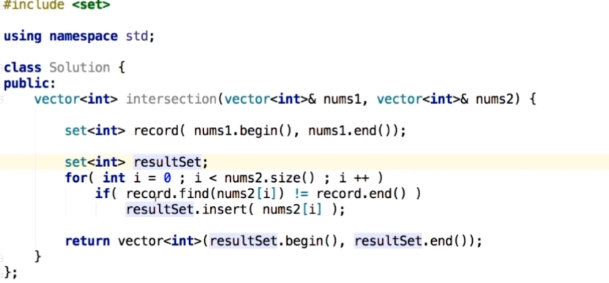
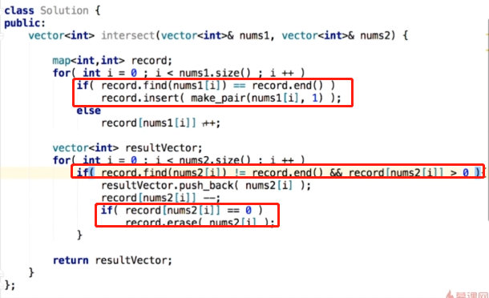
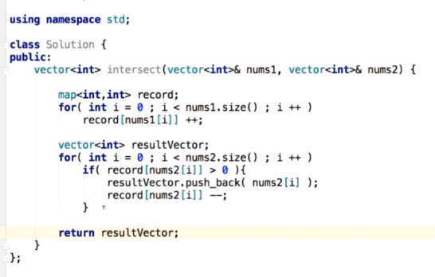
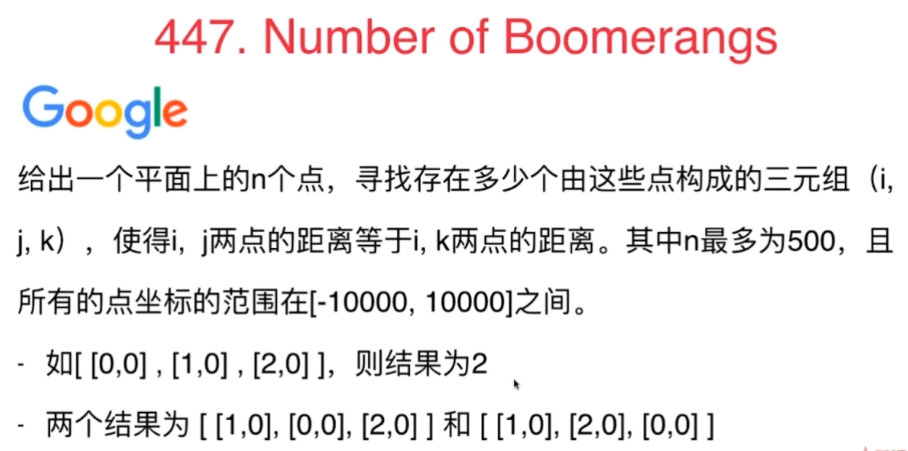
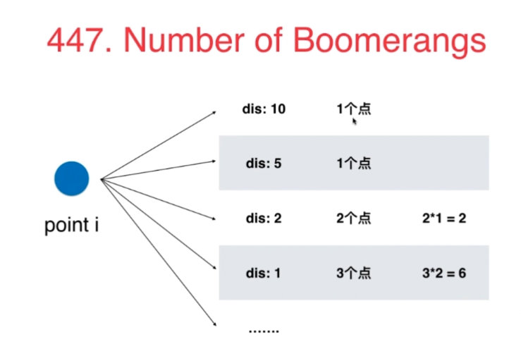
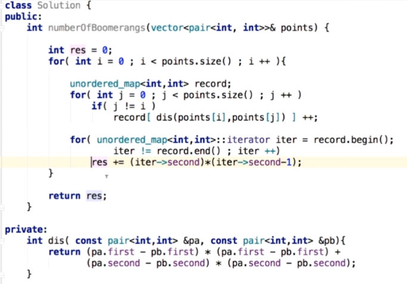
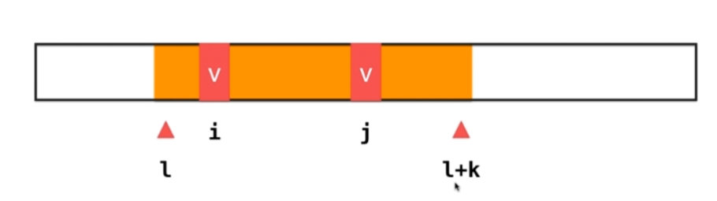
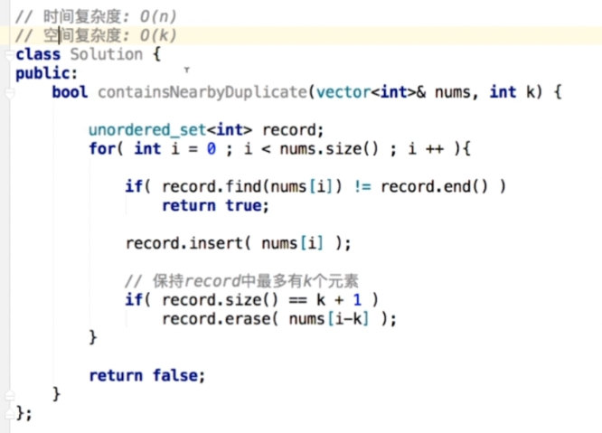
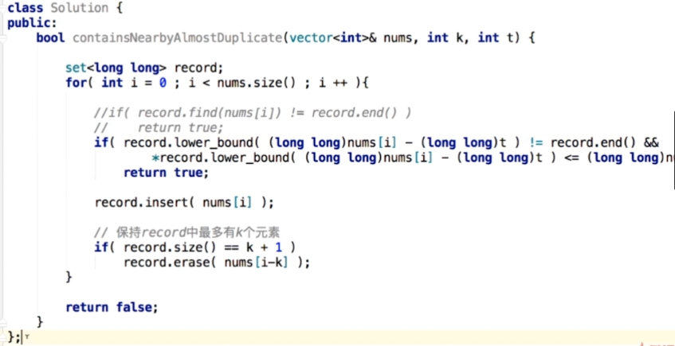

# 4.123 查找问题

- 查找有无： set

- 查找对应关系:  map, hash表

- set,map叫做 容器类

  

常见操作：
- insert
- find
- erase
- change(map)

## Set,Map的基础使用

## 349:intersection of two arrays
求两个数组共有元素，每个元素只能出现一次。  
e.g. nums1=[1,2,2,1],nums2=[2,2]. ans = [2]
### 思路1: 把数组一的元素存入set中，对数组二的每个元素去查找是否在set中，在的话就存在另一个set中。

- 利用语言本身提供的接口，一次性插入

  

## 350:intersection of two arrays
求两个数组交集.此时数据出现次数就要考虑。
e.g. nums1=[1,2,2,1],nums2=[2,2]. ans = [2,2]

1. map默认值问题，c++实现map机制：
- map<int,int> record

- 执行语句 `if(record[a] > 0)`, 如果record中不存在a这个键，record会报错，但此时因为访问过，所以map中就会存在a这个键了，默认其值是0. 即存在<a,0>这个键值对。此时再访问就不会报错

- 只有执行erase操作才能删除掉。


2. 由于上面问题可看出：不同语言实现机制不一样，写code的时候可能会因为具体机制不同导致可读性变差，所以要把语义都明确的写出来：即，先判断是否存在 / 当值为0时删除元素。这样就可以少考虑语言背景。

   

**对上述问题，如果数组有序，可不借助这两个结构**

- hash表的一个特点：失去了数据的顺序性

3. 本题目没有数据顺序要求，所以用hash表也可以


## 查找问题(set,map)题目
- 242：valid anagram
- 202：happy number
如果到后面又回到了68，就陷入循环，即不是Happy 
- 290：word pattern
考虑：字符集？空串符合什么模式？
- 205： isomorphic strings
考虑：字符集？空串？是否一个字母可以映射到自己？
- 451： sort characters by frequency

# 4.4 使用查找表的经典问题

## 1.Two Sum(重点)

要返回数字的索引。此时，数组没有说明是有序的。所以跟上次的不一样

1. 索引从0开始还是1开始？
2. 没有解怎么办？
3. 多个解？

### 思路1：暴力法o(n^2)

### 思路2：排序后，双指针。o(nlogn + n) = o(nlogn)

注意，因为要返回索引，所以不能只是简单地对内容排序

### 思路3：哈希表，双指针。o(n)

查找表：hash表，将所有元素放入后，对每个a，查找target-a及其对应索引。

- 数组元素有可能重复，所以对每个元素v，都在他前面查找target-v,有就成功；没有的话，如果之前元素中有跟v值一样的元素a，就替换值a的位置，因为v也是一个解。

  

## 课后练习

15：3Sum  
什么是不同的三元组？（索引，还是内容）多个解的顺序？无解？  

- 固定每一个位置的值x，则题目转变为求两个元素的和 = -x. 用双指针

```
public List<List<Integer>> threeSum(int[] nums) {
        List<List<Integer>> ans = new ArrayList<>();
        if(nums.length < 3)
            return ans;
       
        Arrays.sort(nums);
        for(int i = 0; i < nums.length - 2; i++){
            if(i > 0 && nums[i] == nums[i-1])
                continue;
            int target = 0 - nums[i];
            int lo = i + 1;
            int hi = nums.length - 1;
            while(lo < hi){
                int sum = nums[lo] + nums[hi];
                if(sum == target){
                    ans.add(Arrays.asList(nums[i], nums[lo], nums[hi]));
                    while(lo < hi && nums[lo] == nums[lo + 1])
                        lo++;
                    while(lo < hi && nums[hi] == nums[hi - 1])
                        hi--;
                    lo++;
                    hi--;
                }
                else if(sum > target)
                    hi--;
                else if(sum < target)
                    lo++;
            }
        }
        return ans;
    }
```

18：4Sum  

- 用三个数和的思路，先固定一个数，再固定一个数，然后用二分
- 注意对边界的处理要多一些

```
public List<List<Integer>> fourSum1(int[] nums, int target) {
        List<List<Integer>> ans = new ArrayList<>();
        if(nums == null || nums.length < 4)
            return ans;

        Arrays.sort(nums);
        if(nums[0] * 4 > target || nums[nums.length-1] * 4 < target)
            return ans;
        int n = nums.length;
        for(int i = 0; i < nums.length - 3; i++){
            if(nums[i] + nums[i + 1] + nums[i + 2] + nums[i + 3] > target) {
                break;
            }
            if(nums[i] + nums[n - 3] + nums[n - 2] + nums[n - 1] < target) {
                continue;
            }
            if(i == 0 || nums[i] != nums[i-1]){
                for(int j = i + 1; j < nums.length - 2; j++){
                    if(nums[i] + nums[j] + nums[j + 1] + nums[j + 2] > target) {
                        break;
                    }
                    if(nums[i] + nums[j] + nums[n - 2] + nums[n - 1] < target) {
                        continue;
                    }
                    if(j == i+ 1 || nums[j] != nums[j-1]){
                        int left = target - nums[i] - nums[j];
                        int lo = j + 1, hi = nums.length - 1;
                        while(lo < hi){
                            int sum = nums[lo] + nums[hi];
                            if(sum == left){
                                ans.add(Arrays.asList(nums[i], nums[j], nums[lo], nums[hi]));
                                while(lo < hi && nums[lo] == nums[lo+1]) lo++;
                                while(lo < hi && nums[hi] == nums[hi-1]) hi--;
                                lo++;
                                hi--;
                            }
                            else if(sum > left)
                                hi--;
                            else
                                lo++;
                        }
                    }
                }
            }
        }
        return ans;
    }
```

- 16：3Sum Closest
  多个解的接近程度一样？无解？（会不会无解？）

```
public int threeSumClosest(int[] nums, int target) {
        if(nums.length == 3)  return nums[0]+nums[1]+nums[2];
        int lo, hi, sum;  //三个辅助变量
        int ans = nums[0] + nums[1] + nums[nums.length-1];
        Arrays.sort(nums);
        for (int i = 0; i < nums.length - 2; i++)
        {
            lo = i + 1;
            hi = nums.length - 1;
            while (lo < hi)
            {
                sum = nums[i] + nums[lo] + nums[hi]; //直接求和算差的绝对值
                if (sum > target)
                    hi--;
                else if (sum < target)
                    lo++;
                else if (sum == target)
                    return target;
                if (Math.abs(sum - target) < Math.abs(ans - target)) //每一个都要比较
                    ans = sum;
            }
        }
        return ans;
    }
```

454 : 4Sum II   

- 加法的结合律。四个数组之和=0，则前两个的和 + 后两个的和 = 0. 先算A的元素 + B的元素的所有结果值和次数，再算C+D的，再匹配。

```
 public int fourSumCount(int[] A, int[] B, int[] C, int[] D) {
        Map<Integer, Integer> sum = new HashMap<>();
        int len = A.length;
        for(int i = 0; i < len; i++)
            for(int j = 0; j < len; j++)
                sum.put(A[i]+B[j],sum.getOrDefault(A[i]+B[j],0) + 1);
        
        int ans = 0;
        for(int i = 0; i < len; i++)
            for(int j = 0; j < len; j++)
                ans += sum.getOrDefault(-C[i]-D[j],0);
        
        return ans;
    }
```

# 4.56 灵活选择键值

使用查找表时，到底要查找什么内容

## 454. 4SumII

因为给出了数据规模，所以能知道用什么算法。用1s的时间跨度去考虑

### 思路1：暴力法，n^4, 500^4 = 6亿多,计算机不行

### 思路2：存一个数在查找表中，n^3 = 1亿，也不是很能承受

### 思路3：n^2可以，25，0000

- 将C+D的每一种可能放入查找表，用Map记录每种和出现的次数。
- 对每个A+B,查找有没有C+D满足。
- 题目给了A,B,C,D大小相等，所以要先判断一下。

根据数据规模推测出，最差可以实现一个n^2的算法。

- 对于查找表问题，到底要查找什么要仔细思考。

  

### 447.Number of Boomerangs



- 因为n最多500，所以可以设计n^2的解法。n^3可能就不行了

- 暴力解：n^3

- n^2思路：

  

1. 观察到求的是i--j, i--k的距离。其中i是枢纽，所以可以对于每个点i，遍历其余点到i的距离。

2. 因为求的是距离，所以用距离作为key，到点i的距离为key的个数为val。

3. 注意到，距离可能会是浮点型，但是精度不好确定，所以不开根号，使用距离^2来做map的key。但有可能会越界Int,所以要确定key的数值类型，因为题目中给了坐标范围是[-10000,10000]. 距离最大是20000^2，不会越界。

4. 最后判断次数的时候是：map\<key> * (map\<key> - 1)。可以写条件if(map\<key> > 2), 也可以不写，因为map\<key> = 1的时候，乘下来就是0

5. 时间=n^2 ; 空间=n，因为对每个数开辟空间完了以后都会释放掉。

   

## 练习

- 49，Group Anagrams  

  字符集，大小写敏感

- 149 . Max Points on a Line
  点坐标的范围，点坐标的表示（整数，浮点数的误差范围）

# 4.7 查找表+滑动窗口

## 219 Contains DuplicateII

题目：整形数组nums，整数k，是否存在索引i,j使得nums[i] == nums[j]，且i，j之差不超过k。

- 滑动窗口思路：因为要求下标相差小于k，i到i+k之间有k+1个数。如果在一个长度为k+1的区间内（l--l+k这个区间）能找到两个元素相等，就符合条件。如果没有就右边界右移一位，左边界左移一位，看l+k+1这个位置的元素是否跟l+1 ---- l+k+1 区间中某个元素相等，所以原题就转换为这个思路。

  

- 因为原窗口没有相等的元素，所以用set即可。

- 保证set中元素不超：在每次循环结束的时候判断set是否满了，如果满了就删除掉最左边的元素

- 时间：o(n) , 空间o(k)

  

滑动窗口长度固定

## 练习

- 217 . Contains Duplicate

# 4.8 二分搜索书底层实现的顺序性

## 220. Contains DuplicateIII

题目：整形数组nums，t, k, 是否存在索引i,j使得nums[i] 与 nums[j]之差不超过t，且i，j之差不超过k。

- 滑动窗口限制角标范围
- 数值范围：在查找表中找v-t和v+t之间的元素。所以在这个区间查找表上

1. ceil: 查找大于v-t的最小元素，如果结果值<v+t
2. floor: 查找小于v+t的最大元素，如果结果值>v-t

- 满足上面两个条件之一即可，c++有个lower_bound函数
- 整形溢出：给定值是32位int的最大值，这个数 + t 会溢出。




