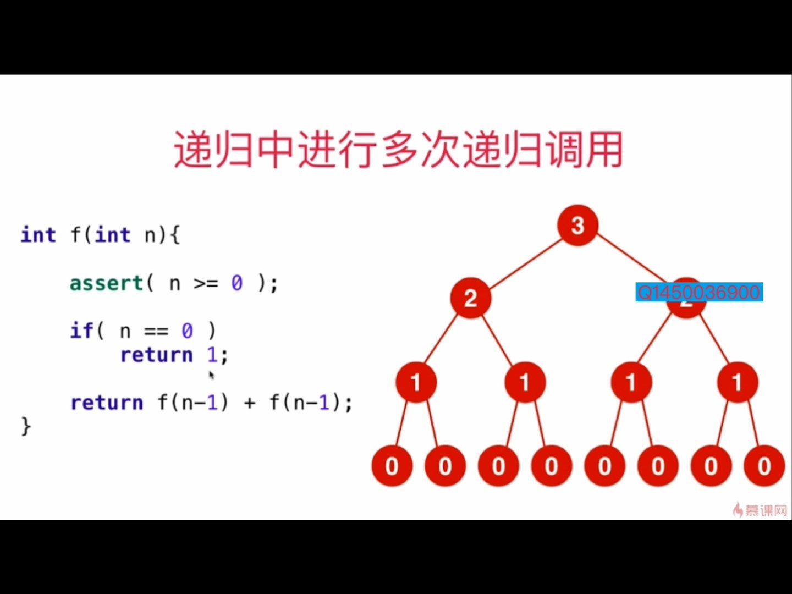
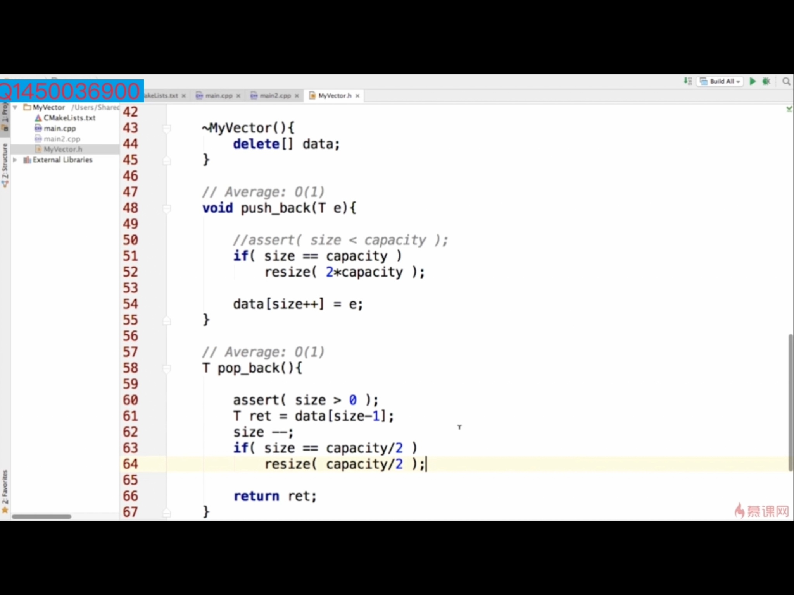

> “🙉🙉🙉 ”

# 2.134 复杂度

## 概念（T(n)=O(f(n))）

- 所有代码的执行时间 T(n) 与每行代码的执行次数 n 成正比。表示算法执行的上界。在业界，用O表示算法执行的最低上界 。
- 对于logaN 和 logbN。logaN = logab * logbN, 可以看出二者相差一个常数系数，所以一般对数级的时间复杂度不考虑底数。
- T(n) 表示代码执行的时间；n 表示数据规模的大小；f(n)表示每行代码执行的次数总和。因为这是一个公式，所以用 f(n) 来表示。公式中的 O，表示代码的执行时间 T(n) 与 f(n) 表达式成正比.
- 大 O 时间复杂度实际上并不具体表示代码真正的执行时间，而是表示代码执行时间随数据规模增长的变化趋势，所以，也叫作渐进时间复杂度（asymptotic time complexity），简称时间复杂度。
- 当 n 很大时，你可以把它想象成 10000、100000。而公式中的低阶、常量、系数三部分并不左右增长趋势，所以都可以忽略。我们只需要记录一个最大量级就可以了，如果用大 O 表示法表示刚讲的那两段代码的时间复杂度，就可以记为：T(n) = O(n)；

## 举例

1. 对图进行遍历，其复杂度是O（V+E），V是点的规模，E是边的规模
2. 有一个字符串数组，将数组中的每一个字符串按照字母序排序；然后将整个字符串数组按照字典序排序。

- 假设最长的字符串长度是s, 数组中有n个字符串。
- 对每一个字符串排序是 O（slogs）
- 对数组中所有字符串排序 O（n*s*logs）
- 再对数组按字典序排序 O（s*n*logn）, 因为字符串的比较次数是字符串的长度，整数的比较次数是1
- 所以整体就是 O（n*s*logs + s*n*logn）

## 时间复杂度分析

1. 只关注循环执行次数最多的一段代码
2. 加法法则：总复杂度等于量级最大的那段代码的复杂度
3. 乘法法则：嵌套代码的复杂度等于嵌套内外代码复杂度的乘积
4. 多个规模求加法：比如方法有两个参数控制两个循环的次数，那么这时就取二者复杂度相加。

## 复杂度分析的4个概念

1. 最坏情况时间复杂度

(worst case time complexity )：代码在最理想情况下执行的时间复杂度。

1. 最好情况时间复杂度

(best case time complexity)：代码在最坏情况下执行的时间复杂度。

1. 平均时间复杂度

(average case time complexity)：用代码在所有情况下执行的次数的**加权平均值表示。(次数 * 概率 的和)**，也就是**期望值**

## 复杂度的说明是和用例相关的
一般取平均情况

## 复杂度试验
Q：自己写出来是nlogn的，但是OJ上超时，说是n^2的。  
A：通过实验，观察趋势，每次将数据规模提高两倍，看时间的变化，来确定算法的时间复杂度
- logn算法: log2n/logn = (log2 + logn)/logn = 1 + log2/logn ，log2/logn是一个很小的数，所以当数据规模变为原来的2倍的时候，复杂度会很小。所以这是一个很好的算法。
- nlogn算法：n变为原来2倍的时候，时间也为原来2倍多一点，所以类似一个O（n）的算法

# 2.2 数据规模

- 要大概知道每个指令运行的时间，知道能在一定时间内做多少事情。

## 已知

cpp大概能在1秒内用以下对应时间复杂度的算法去执行对应次数的加法操作。

| 算法复杂度 | 1s内完成加法的数据规模(即n的规模) |
| ---------- | --------------------------------- |
| O（n^2）   | 10^4                              |
| O（n）     | 10^8                              |
| O（nlogn） | 10^7                              |

但是由于其他的算法执行一次所需要的操作会多一些不仅仅是一个加法，所以可以把算法对应的操作数÷2或者数÷10，这样子能保证我们可以把这个时间用在别的算法上这个时候也成立。

## 相关问题

- 为什么计算机假死？  
  套用上面的时间，用归并排序去处理100,000级别的数据的时候，他所用的时间大概是40秒，并且我们的算法还是串行的，就会造成计算机CPU的资源全部都在跑这个程序，然后造成计算机假死的状态。

- 面试中帮我们确定应该设计一个什么复杂度的算法。根据面试官所给出的数据量来决定我们应该设计出一个什么样复杂度的算法。

1. 面试官给出的数据量是10'8级别的，那我们就要设计出一个nlogn的算法
2. 如果数据量小，设计n2算法即可。

## 空间复杂度

递归调用是有空间代价的，深度是多少，空间复杂度就是多少。

# 2.5 递归算法的复杂度分析

- 递归中进行一次递归调用的复杂度分析，递归深度为depth，每个递归函数中时间复杂度是T，总时间就是O(T*depth).重点在于认清递归深度。
  e.g. 二分查找法，每一次中要不往左边，要不往右边。就是只进行一次调用。深度是logn.  

e.g. 一个logn的算法：计算x^n,通过先求得x^(n/2),x^n = x^(n/2) * x^(n/2). 平时算法是n个数连乘，即o(n)

```
double pow(double x, double n)
{
    //只能对大于0的数计算
    assert(n>0)
    
    if(n == 0)
        return 1.0
    
    double t = pow(x,n/2);
    // 因为n是奇数的话，n/2会舍位，所以如果n是奇数，要再乘一个
    if(n%2)
        return x*t*t;
    
    return t*t
}
```

- 递归中进行多次递归调用的复杂度分析，要知道递归的深度&每次递归调用多少次这个函数，画一个递归树。数一下树上所有的节点个数之和即可。

  


  

  如上所示，这是一个O(2^n)的算法

## MASTER公式

$$T(n) = aT(\frac{n}{b}) + O(n^d)$$

if $$log^a_b < d$$, $$T(n) = O(n^d)$$

if $$log^a_b = d$$, $$T(n) = O(n^{d}log^n)$$

if $$log^a_b > d$$, $$T(n) = O(n^{log_b^a})$$

More about [Master Theorem](http://www.gocalf.com/blog/algorithm-complexity-and-master-theorem.html)

# 2.67均摊复杂度分析（amortized time）

## 均摊时间复杂度

(amoritized time complexity)：

- 在代码执行的所有复杂度情况中绝大部分是低级别的复杂度，个别情况是高级别复杂度；
- 且发生具有时序关系时  
- 使用**摊还分析法**，得到均摊时间复杂度。即:可以将个别高级别复杂度均摊到低级别复杂度上。基本上均摊结果就等于低级别复杂度。

## 举例：

**题目：**
实现一个往数组中插入数据的功能。当数组满了之后，也就是代码中的 count == array.length 时，我们用for循环遍历数组求和，并清空数组，将求和之后的 sum值放到数组的第一个位置，然后再将新的数据插入。但如果数组一开始就有空闲空间，则直接将数据插入数组。

**最好，最坏分析**最理想的情况下，数组中有空闲空间，我们只需要将数据插入到数组下标为count的位置就可以了，所以最好情况时间复杂度为O(1)。最坏的情况下，数组中没有空闲空间了，我们需要先做一次数组的遍历求和，然后再将数据插入，所以最坏情况时间复杂度为O(n)

**平均，均摊分析**假设数组的长度是 n，根据数据插入的位置的不同，我们可以分为n 种情况，每种情况的时间复杂度是 O(1)。除此之外，还有一种“额外”的情况，就是在数组没有空闲空间时插入一个数据，这个时候的时间复杂度是 O(n)。而且，这 n+1 种情况发生的概率一样，都是 1/(n+1)。所以，根据加权平均的计算方法，我们求得的平均时间复杂度就是：$1*\frac{1}{n+1} +1*\frac{1}{n+1} +...+1*\frac{1}{n+1} +1*\frac{n}{n+1}=O(1)$

## 复杂度震荡

有的时候一个算法复杂度较高，但这个算法是为了其他算法进行操作，所以需要将这些算法的复杂度一起分析，就要使用均摊分析。适用于某些函数不是一直每次都全部执行下来。

e.g. 动态数组vector，

- resize是对数组扩容的操作，复杂度是O(N). 

- pushback是先判断容量是否超，没有就直接赋值。  
  前面n次插入，是没有满，当没有超的时候是O(1),第n+1次的时候就满了，超过了是O（n），所以加起来是n+1次pushback共进行了n+n次，平均复杂度是2n/(n+1)=2,几乎就是O（n）的。

  

- popback删除元素，当当前数组大小为容量的1/2时，要减少数组大小。
  分析同上：

  

- 复杂度的震荡：当前数组大小 = 当前容量， 刚添加完，又删除，又添加。这种情况下，复杂度就是O（n）

- 复杂度震荡的解决方案
  在当前大小是容量的1/4时，再改变

  

# 面试注意

- 算法面试：正确合理的思路路径很重要
- 没有思路的时候

1. 给自己简单的几个测试用例试验
2. 不要忽视暴力法，这个可以解决所有问题。

- 优化算法的思路

1. 遍历常见的算法思路，找到合适的
2. 遍历常见的数据结构
3. 空间和时间的交换（哈希表），哈希表适合解决很多问题
4. 对数据预处理
5. 在瓶颈处进行优化

- 实际编写的时候

1. 边界、极端条件的判断
2. 变量名设计

- 对于基本问题：白板编程

# 编写思路：

1. 首先排除无效输入 & 边界条件：null , 0 
2. 确定有效输入的结果
3. 判断有效输入但不能满足要求时如何处理