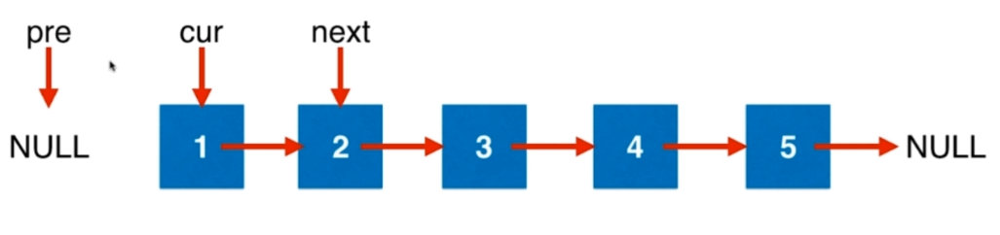
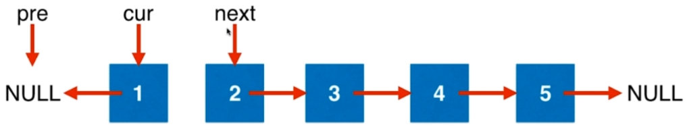
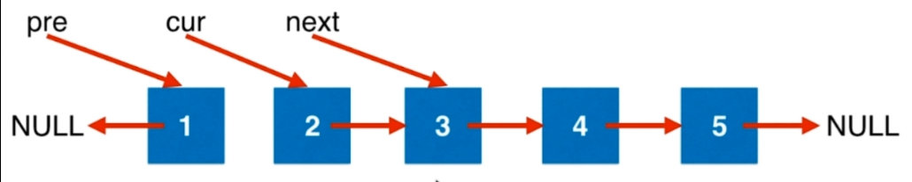
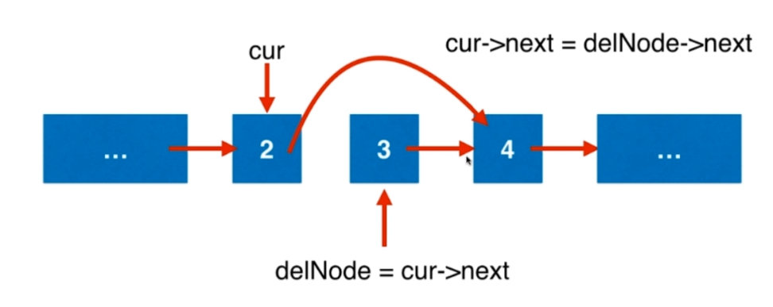
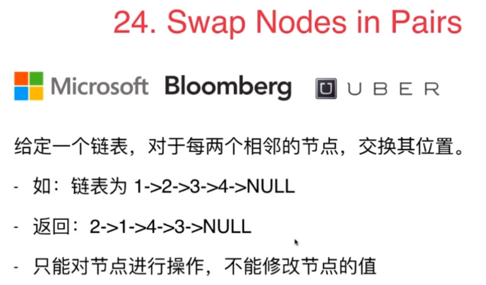
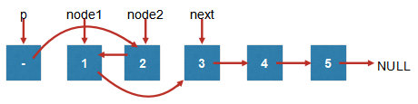
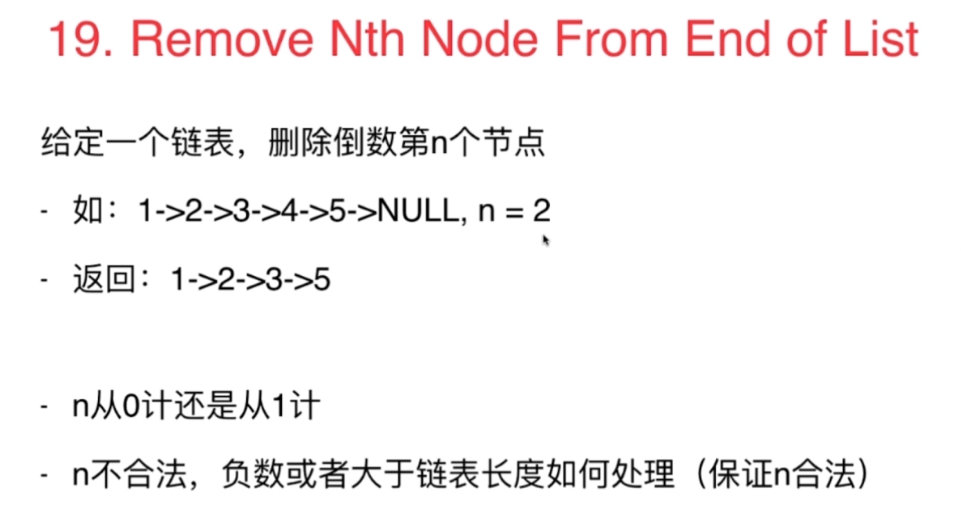
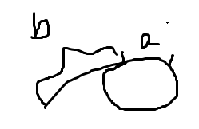
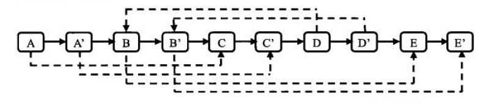
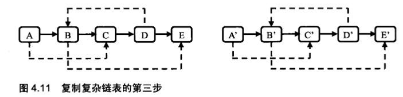

# 5.1 在链表中穿针引线

## 206.Reverse Linked List


### 思路：

- 不能改变节点值，要反转节点的指针

1.需要pre(初始为null),cur,next三个指针，分别指向：前一个元素，当前元素，下一个元素



2.修改cur，使其指向pre



3.三个指针都向后移动一位：修改pre，使其指向cur；修改cur，使其指向next；修改next,使其指向next的下一位




1.访问节点的val域和next域时， 一定要注意节点是否为空  
2.这里`next = head->next`
```
ListNode* reverseList(ListNode* head){
    ListNode* pre = NULL;
    ListNode* cur = head;
    ListNode* next = head->next;
}
```
- 因为访问了head.next,就要防止head为空的情况，可以在函数进来就加一个判断,head为空就直接返回。
```
ListNode* reverseList(ListNode* head){
    if(head == NULL)
        return;
    ListNode* pre = NULL;
    ListNode* cur = head;
    ListNode* next = head->next;
}
```
- 因为next是依赖于cur，所以只有cur存在的时候，才会求得next。所以将cur的声明放在while，这样while就判断了cur不是null
```
ListNode* reverseList(ListNode* head){
    ListNode* pre = NULL;
    ListNode* cur = head;
    while(cur!=NULL){
        // 在下一个循环中处理next
        ListNode* next = cur->next;    
        // 在当前循环中移动了两个指针。
        cur->next = pre;
        pre = cur;
        cur = next;
    }
    return pre;
}
```
## 练习：  

92：Reverse Linked ListII  
反转链表从m到n的元素

- m,n超过链表范围，是负值的时候怎么办？
- m>n怎么办

**思路1**

- 先考虑中间部分的旋转：保存m-1,n+1两个位置的指针，翻转完m-n部分的节点后，m-1节点的next指向n，m的next指向n+1即可。
- 考虑到头结点：添加dummyHead
- 考虑到head不能为空，在前面加上head为空，m>=n的判断
```
 public ListNode reverseBetween(ListNode head, int m, int n) {
        if(head == null || m >= n)
            return head;
        ListNode dummyHead = new ListNode(0);
        dummyHead.next = head;
        
        ListNode lastEnd = dummyHead, nextHead = dummyHead, pre, cur, tmpHead;
        for(int i = 1; i < m; i++)
            lastEnd = lastEnd.next;
        pre = lastEnd.next;
        tmpHead = pre;
        cur = pre.next;
        int nodes = m+1;
        while(nodes <= n){
            nextHead = cur.next;
            
            cur.next = pre;
            pre = cur;
            cur = nextHead;
            nodes++;
        }
        lastEnd.next = pre;
        tmpHead.next = nextHead;
        return dummyHead.next;
    }
```

**思路2**

- 使用头插法，记录第m-1,m，m+1个点为cur,start,second。每次将cur之后的节点插入pre之后。
- 先保留second后面的位置，所以先令start.next = second.next
- 修改cur和second的指针关系，要保存cur.next，所以先修改second.next = cur.next。再修改cur.next = second
- 下一步中second就应该是start的后一位。
```
public ListNode reverseBetween1(ListNode head, int m, int n) { //第m-1个数的位置不变，使用尾插法，每次把后面的数字放在第m-1个数后面
        if(head==null)
            return head;
        ListNode newhead = new ListNode(0);
        newhead.next = head;
        ListNode cur = newhead;

        for (int i=0;i<m-1;i++)   //这里注意一下，结点个数是从1开始算，但1位置是链表开头，每次交换的时候是需要 前 1 2 三个位置的指针
            cur = cur.next;
        ListNode start = cur.next,second = start.next;

        for (int i=m;i<n;i++)  //反转m-n之间的数，一共n-m次
        {
            start.next = second.next;
            second.next = cur.next;
            cur.next = second;
            second = start.next;
        }
        return newhead.next;
    }
```

### 83：删除链表中重复的节点

Remove Duplicates from Sorted List   。有序链表；删除所有重复的元素使得所有元素只出现一次

**思路**

```
public ListNode deleteDuplicates(ListNode head) {
        if(head == null || head.next == null)
            return head;
        
        ListNode dummyHead = new ListNode(0);
        dummyHead.next = head;
        ListNode pre = dummyHead.next, cur = pre.next;
        while(cur != null){
            if(cur.val == pre.val){
                pre.next = cur.next;
                cur = cur.next;
            }
            else{
                pre = cur;
                cur = cur.next;
            }
        }
        return dummyHead.next;
    }
```

86：Partition List   
328：Odd Even Linked List    
*2：Add Two Numbers
数字是否有前置0；负数  

```
public ListNode addTwoNumbers(ListNode l1, ListNode l2) {
        int carry = 0, sum = 0;   //进位、求和
        ListNode end = new ListNode(0), ans = end;
        while (l1!= null || l2!=null || carry!=0)
        {
            sum = ( l1==null?0:l1.val ) + ( l2==null?0:l2.val ) + carry;  //因为可能会有1+9999的情况，所以在这里每次都对两个链表进行判断
            carry = sum/10;
            sum = sum%10;
            ListNode tmp = new ListNode(sum);
            ans.next = tmp;
            ans = tmp;
            l1 = (l1==null?l1:l1.next);
            l2 = (l2==null?l2:l2.next);
        }
        return end.next;
    }
```

445：Add Two NumbersII
使用辅助数据结构

**思路：使用两个栈进行数位的存储，注意循环条件是两个栈不全为空或者进位不为0**

```
public ListNode addTwoNumbers(ListNode l1, ListNode l2) {
        Stack<Integer> s1 = new Stack<>();
        Stack<Integer> s2 = new Stack<>();
        
        while(l1 != null){
            s1.push(l1.val);
            l1 = l1.next;
        }
        while(l2 != null){
            s2.push(l2.val);
            l2 = l2.next;
        }
        
        ListNode end = new ListNode(0);
        int sum = 0, carry = 0;
        while(!s1.isEmpty() || !s2.isEmpty() || carry!=0){
            sum = (s1.isEmpty() ? 0 : s1.pop()) + (s2.isEmpty() ? 0 : s2.pop()) + carry;
            carry = sum/10;
            sum = sum%10;
            end.val = sum;

            ListNode head = new ListNode(0);
            head.next = end;
            end = head;
        }
        return end.val == 0 ? end.next : end;
    }
```

# 5.3 设立链表的虚拟头结点

## 203 Remove Linked List Elements

删除值为val的所有节点


**删除逻辑应该怎么做**

- 对删除中间，最后一个元素都适用：

  


  对于java：不需要释放内存的节点，令其next为null。

```
ListNode* removeElements(ListNode* head,int val){
    ListNode* cur = head;
    while(cur -> next != NUll){
        if(cur->next->val == val){
            //删除cur->next
            ListNode* delNode = cur->next;
            cur->next = delNode->next;
            // c++中要 delete delNode, java中让其没有引用即可。
            delNode->next = NULL;
        }
        else
            cur = cur->next;
    }
    return head;
}
```

1.直接访问了cur->next，要判断cur是不是空，所以要在前面加上head为空的判断
2.对删除第一个元素不适用，所以要特殊处理

```
ListNode* removeElements(ListNode* head,int val){
    if(head == NULL)
        return NULL;
    if(head->val == val{
        ListNode* delNode = head;
        head = delNode->next;
        delete delNode;
    )
    ListNode* cur = head;
    while(cur -> next != NUll){
        if(cur->next->val == val){
            //删除cur->next
            ListNode* delNode = cur->next;
            cur->next = delNode->next;
            delete delNode
            //java中让其没有引用即可。delNode->next = NULL;
        }
        else
            cur = cur->next;
    }
    return head;
}
```

- 以上代码问题：

1. 有可能头部连着好几个元素都等于val，改用while循环
2. 在判断条件中用到了head->val,就需要判断head不是空，第一次进入循环能保证head不是空，但是后面的循环就不一定，所以在while中要加上这个判断

```
ListNode* removeElements(ListNode* head,int val){
    if(head == NULL)
        return NULL;
    while(head != NULL && head->val == val{
        ListNode* delNode = head;
        head = delNode->next;
        delete delNode;
    )
    ListNode* cur = head;
    while(cur -> next != NUll){
        if(cur->next->val == val){
            //删除cur->next
            ListNode* delNode = cur->next;
            cur->next = delNode->next;
            delete delNode
            //java中让其没有引用即可。delNode->next = NULL;
        }
        else
            cur = cur->next;
    }
    return head;
}
```

- 以上代码问题：

1. 在删除完头部的节点后，head就改变了。下面的代码是想删除剩下节点中值相等的节点，但此时有可能已经不剩下节点了，或者head又为空。此时cur已经是空，又访问了cur->next，就会有异常
2. 可以发现，最开始的head!=null的判断此时就有点多余了，可以改为下面这样。

```
ListNode* removeElements(ListNode* head,int val){
    while(head != NULL && head->val == val{
        ListNode* delNode = head;
        head = delNode->next;
        delete delNode;
    )
    if(head == NULL)
        return NULL;
        
    ListNode* cur = head;
    while(cur -> next != NUll){
        if(cur->next->val == val){
            //删除cur->next
            ListNode* delNode = cur->next;
            cur->next = delNode->next;
            delete delNode
            //java中让其没有引用即可。delNode->next = NULL;
        }
        else
            cur = cur->next;
    }
    return head;
}
```

- 以上代码问题：

1. 删除头部的代码和删除中间元素的很像，造成大量冗余，代码不优美。所以应该使用虚拟指针，改善关于头结点的问题。

## 虚拟指针技术

链表最前面添加dummyHead


```
ListNode* removeElements(ListNode* head,int val){
    ListNode* dummyHead = new ListNode(0);
    dummyHead->next = head;
        
    ListNode* cur = dummyHead;
    while(cur -> next != NUll){
        if(cur->next->val == val){
            //删除cur->next
            ListNode* delNode = cur->next;
            cur->next = delNode->next;
            delete delNode
            //java中让其没有引用即可。delNode->next = NULL;
        }
        else
            cur = cur->next;
    }
    //真正要返回的节点是retHead
    ListNode* retHead = dummyHead-next;
    delete dummyHead;
    return retHead;
}
```

## 练习：

82:Remove Duplicates from Sorted List II  

**思路**

- 每一个数字区间即不重复的一块保存当前数字区间cur的前一个节点pre，cur作为当前区间的头，next是下一个区间的头。
- 根据cur,next的位置判断cur区间是否有重复的值。

```
public ListNode deleteDuplicates(ListNode head) {
        if(head == null || head.next == null)
            return head;
        
        ListNode dummyHead = new ListNode(0);
        dummyHead.next = head;
        ListNode pre = dummyHead, cur = pre.next, next = cur.next;
        while(next != null){
            while(next != null && next.val == cur.val){
                next = next.next;
            }
            if(next != cur.next){
                pre.next = next;
                cur = pre.next;
                if(cur != null)
                    next = cur.next;
            }
            else{
                pre = cur;
                cur = next;
                next = next.next;
            }
        }
        return dummyHead.next;
    }
```

- 这个思路简化了上面的next，用cur.next代替next直接比较。

1. 只设立pre节点和cur节点。pre表示当前区间的头，cur和cur.next比较，一直走到当前区间的尾部。
2. 因为内循环访问了cur.next，所以外循环是cur!=null,内循环是cur.next!=null
3. 通过cur的位置判断是否这个区间有重复值。

```
  public ListNode deleteDuplicates1(ListNode head) {
        if(head == null || head.next ==null)
            return head;
        ListNode newhead = new ListNode(0), pre=newhead,cur=head;
        newhead.next = head;
        while (cur!=null)
        {
            while (cur.next != null && cur.val == cur.next.val)  //重点在这里，当cur往前走的时候，pre并没有往前走，所以pre一直保留着上一个位置
                cur = cur.next;
            if (pre.next == cur)
                pre = pre.next;
            else
                pre.next = cur.next;
            cur = cur.next;
        }
        return newhead.next;
    }
```

21:Merge Two Sorted Lists  

**思路：还是需要跟归并一样做一次判断，谁小谁右移**

```
public ListNode mergeTwoLists(ListNode l1, ListNode l2) {
        if(l1 == null || l2 == null)
            return l1 == null ? l2 : l1;
        
        ListNode newHead = new ListNode(0), tmp = newHead;
        while(l1 != null && l2 != null){
            if(l1.val <= l2.val){
                tmp.next = l1;
                l1 = l1.next;
            }
            else{
                tmp.next = l2;
                l2 = l2.next;
            }
            tmp = tmp.next;
        }
        if(l1 != null) tmp.next = l1;
        if(l2 != null) tmp.next = l2;
        return newHead.next;
    }
```

# 5.4 链表的复杂操作

## 24. Swap Nodes in Pairs




1. 设立四个指针，分别是：pre,node1,node2,next。node1和node2是要进行交换的两个节点。需要让node1的前一个节点pre指向2,2指向1,1指向2的后一个节点

2. node2 指向node1, node1指向next，p指向node2. 给p重新赋值为node1

   

3. p移动到next，根据重新找到node1,node2,next，开始下一轮交换
   **核心在于创建几个指针预先保留相应位置**

```
ListNode* swapPairs(ListNode* head) {         
    ListNode* dummyHead = new ListNode(0);         
    dummyHead->next = head;         
    ListNode* p = dummyHead;        
    while( p->next && p->next->next ){             
        ListNode* node1 = p->next;             
        ListNode* node2 = node1->next;             
        ListNode* next = node2->next;      
        
        node2->next = node1;             
        node1->next = next;             
        p->next = node2;             
        p = node1;         
    }         
    ListNode* retHead = dummyHead->next;         
    delete dummyHead;        
    return retHead;     
    }
}; 

```

## 练习

25：Reverse Nodes in k-Group  
给定一个链表，每k个节点为一组，反转每一组的k个节点。k为正整数且小于等于链表长度。如果链表长度不是k的整数倍，剩余部分不需要进行反转。如： 1->2->3->4->5->NULL
若 k = 2，则结果为：2->1->4->3->5->NULL
若 k = 3，则结果为：3->2->1->4->5->NULL  

147：Insertion Sort List  
为一个链表进行插入排序  

148：Sort List  

# 5.5 不仅仅是穿针引线，特殊情况改变节点的值来实现我们需要的功能。

## 237. Delete Node in a Linked List


- 之前的题目都不能修改节点的值，那现在只能通过修改值实现：将下一节点的值赋给自己，将下一节点删除


```c++
void deleteNode(ListNode* node) {              
    node->val = node->next->val;                
    ListNode* delNode = node->next;             
    node->next = delNode->next;  
	delete delNode;        
	return;     
} 
```

- 注意代码中访问了node.val, node.next.val。所以node,node.next都不能是空。node.next是空就证明Node是最后一个节点，此时node的前一个节点就应该指向空，并删除node自己即可

```
void deleteNode(ListNode* node) {
    if(node == NULL)
        return;
    if(node.next == NULL){
        delete node;
        node = NULL;
        return;
    }
        
    node->val = node->next->val;            ListNode* delNode = node->next;         node->next = delNode->next;  

        delete delNode;        
        return;     
    } 
```

# 5.6 链表与双指针

链表也是线性结构，可以套用数组的思路

## 19. Remove Nth Node From End of List




### 解法1：先遍历一遍计算链表长度；再遍历一遍删除倒数第n个节点

遍历两遍链表。能否只遍历一遍链表？

### 解法2：只遍历一次链表

- 要删除一个节点，必须知道该节点的前一个节点，对于头结点就应该创建一个虚拟节点

- 根据给定的n，声明两个索引，确定n节点的前面节点p。假设最后一个节点就是尾节点q，p和q的距离是确定的：n

- 防止用户输入的n不应该太小，也不应该大于链表长度

```
ListNode* removeNthFromEnd(ListNode* head, int n) {         
    assert(n>=0)
    ListNode* dummyHead = new ListNode(0);         
    dummyHead->next = head;         
    ListNode* p = dummyHead;         
    ListNode* q = dummyHead;        
    
    for( int i = 0 ; i < n + 1 ; i ++ ){             
        assert(q);             
        q = q->next;         
    }       
    
    while( q ){             
        p = p->next;             
        q = q->next;         
    }    
    
    ListNode* delNode = p->next;        
    p->next = delNode->next;        
    delete delNode;         
    ListNode* retNode = dummyHead->next;   
    
    delete dummyHead;        
    return retNode;     
}
```

## 练习：

1. Rotate List  
   给定一个链表，让这个链表向右旋转k位。其中k为非负数。  
   如：1->2->3->4->5->NULL, k = 2  
   第一次旋转：5->1->2->3->4->NULL  
   第二次旋转：4->5->1->2->3->NULL  
2. Reorder List  
   给定一个链表 L(0) -> L(1) -> L(2) -> … -> L(n-1) -> L(n)  
   将其变为 L(0) -> L(n) -> L(1) -> L(n-1) -> L(2) -> L(n-2)…的形式
   链表无法随机访问数据，如何获得中间的元素？  
   两次遍历？一次遍历？  
3. Palindrome Linked List  
   给一个链表，判断这个链表是否为回文（正看反看）链表。  
   想想数组中怎么做，可以将链表存在数组中，然后判断。  
   能否使用O(1)的空间复杂度解决问题？  

# 链表习题（LRU缓存淘汰）

单链表、双向链表和循环链表。

- 双向链表可以支持 O(1) 时间复杂度的情况下找到前驱结点，该特点使双向链表在某些情况下的插入、删除等操作都要比单链表简单、高效。

比如：

- 删除结点中“值等于某个给定值”的结点；
- 删除给定指针指向的结点。

1. 对于第一种情况，不管是单链表还是双向链表，为了查找到值等于给定值的结点，都需要从头结点开始依次遍历对比，直到找到值等于给定值的结点，然后删除。

   单纯的删除操作时间复杂度是 O(1)，遍历查找的时间是主要的耗时点，对应的时间复杂度为O(n)。根据时间复杂度分析中的加法法则，删除值等于给定值的结点对应的链表操作的总时间复杂度为 O(n)。

2. 对于第二种情况，已知要删除结点的指针，但是还需要其前驱结点。单链表要从头结点开始遍历找到前驱节点，直到 p->next=q，复杂度为 O(n)；

   但双向链表中的结点已经保存了前驱结点的指针，不需要遍历。复杂度为 O(1)

    **LinkedHashMap 的实现原理，就会发现其 中就用到了双向链表这种数据结构。**

# 反转：

## 单链表反转

```java
public ListNode ReverseList(ListNode head) {
    if (head == null || head.next == null) {
        return head;
    }

    ListNode next = null, cur = head, pre = null;
    //最后一个节点也要做翻转
    while (cur != null) {
        next = cur.next;
        cur.next = pre;
        pre = cur;
        cur = next;
    }
    //此时cur=null,要返回前面一个数
    return pre;
}
```

## 反转中间一部分

## 倒数第k个节点

- 思路：快慢指针，快指针走k-1步（正好到第k个节点），慢指针再开始走，这样快慢指针之间总是相差k。快指针到头，慢指针就是倒数第k个。
- **注意** 
  1. k=0, k-1会是负数，造成无限循环。因为k的计数从1开始，所以约定是0的话返回Null
  2. 给定的链表头部是空，应该返回空
  3. 链表长度小于k，应该返回空

```java
public ListNode FindKthToTail(ListNode head,int k) {
        if ( head == null || k == 0) {
            return null;
        }
        ListNode slow = head;
        ListNode fast = head;
        
        for(int i = 0; i < k - 1; i++) {
            if (fast.next != null) {
                fast = fast.next;
            } else { //链表节点数 < k的情况
                return null;
            }
        }
        
        while (fast.next != null) {
            fast = fast.next;
            slow = slow.next;
        }
        return slow;
    }
```

## 链表中环的检测&环的入口节点

- 思路：快慢指针。慢指针每次走1步，快指针一次走2步。相遇的点在A。设此时快指针走了2x，慢指针走了x。则x=环的长度。从链表开头到A的距离为慢指针走的长度 x=a+b, 环的长度为x. 所以A到环的入口的距离为x-a=b。所以要求链表入口到环的入口的距离，则此时让快指针回到链表头部，两个指针再次相遇则为环的入口。

  

```java
public ListNode EntryNodeOfLoop(ListNode pHead)
{
    if (pHead == null || pHead.next == null) {
        return null;
    }
    ListNode slow = pHead, fast = pHead;
    while (fast.next != null && fast.next.next != null) {
        fast = fast.next.next;
        slow = slow.next;
        // 注意调整完后再检查，不然一开始slow和fast都在head位置会返回相等。
        if (fast == slow) {
            break;
        }
    }
    //检测环
    if (fast.next == null || fast.next.next == null) {
        return null;
    }
    fast = pHead;
    while (fast != slow){
        fast = fast.next;
        slow = slow.next;
    }
    // 返回入口
    return fast;
}

// 另一种写法
public static Node getLoopNode(Node head) {
  	// return the circle entry if there is one
    if (head == null || head.next == null || head.next.next == null) {
      	return null;
    }
    Node n1 = head.next; // n1 -> slow
    Node n2 = head.next.next; // n2 -> fast
    while (n1 != n2) {
        if (n2.next == null || n2.next.next == null) {
          	return null;
        }
        n2 = n2.next.next;
        n1 = n1.next;
    }
    n2 = head; // n2 -> walk again from head
    while (n1 != n2) {
        n1 = n1.next;
        n2 = n2.next;
    }
    return n1;
}
```

## 两个链表的公共节点

给两个单链表（有可能有环），找出两个链表的第一个交点，否则返回null。

1. 判断两个链表是否有环，有环，找到入口节点
   - 用哈希表去记录节点判断是否有环以及入口
   - 快慢指针
2. 如果两个链表都没环：
   1. 两个链表相交：看上去像“Y”, 两个链表的从交点往后的节点都是一样的。
   2. 两个链表不相交：看上去“| |”.
3. 有一个有环，另一个没环，不会相交：看上去像 “6 |”。
4. 两个都有环：

```
 Y         \   /        |   |
 |    OR    \ /    OR   |   | 
 O           O          O   O
(1)         (2)          (3)
(1)：两个链表环的起点一样
(2)：从第一个链表的环起点开始找第二个链表的环的起点，能找到就是这种情况。
(3)：（2）的情况中没找到。
```

```java
    public ListNode getIntersectionNode3(ListNode head1, ListNode head2) {
        if (head1 == null || head2 == null) {
            return null;
        }
        
        ListNode loop1 = getLoopNode(head1);
        ListNode loop2 = getLoopNode(head2);
        if (loop1 == null && loop2 == null) {
            return noLoop(head1, head2, null);
        }
        if (loop1 != null && loop2 != null) {
            return bothLoop(head1, loop1, head2, loop2);
        }
        return null;
    }

    private ListNode bothLoop(ListNode head1, ListNode loop1, ListNode head2, ListNode loop2) {
        if (loop1 == loop2) {
            return noLoop(head1,head2,loop1);
        } else {
            ListNode cur1 = loop1.next;
            while (cur1 != loop1) {
                if (cur1 == loop2) {
                    return loop1;
                }
                cur1 = cur1.next;
            }
            return null;
        }
    }

    private ListNode noLoop(ListNode head1, ListNode head2, ListNode end) {
        if (head1 == null || head2 == null) {
            return null;
        }
        ListNode cur1 = head1, cur2 = head2;
        int n = 0;
        // 记录两个链表的长度
        while (cur1 != end) {
            n++;
            cur1 = cur1.next;
        }
        while (cur2 != end) {
            n--;
            cur2 = cur2.next;
        }
        if (cur1 != cur2) {
            return null;
        }
        // cur1是长的，cur2是短的
        cur1 = n > 0 ? head1 : head2;
        cur2 = (cur1 == head1 ? head2 : head1);
        n = Math.abs(n);
        while (n != 0) {
            cur1 = cur1.next;
            n--;
        }
        while (cur1 != cur2) {
            cur1 = cur1.next;
            cur2 = cur2.next;
        }
        return cur1;
    }

    private ListNode getLoopNode(ListNode head) {
        if (head == null || head.next == null || head.next.next == null) {
            return null;
        }
        ListNode slow = head, fast = head;
        while (fast.next != null && fast.next.next != null) {
            fast = fast.next.next;
            slow = slow.next;
            if (fast == slow) {
                break;
            }
        }
        if (fast.next == null || fast.next.next == null) {
            return null;
        }
        fast = head;
        while (fast != slow) {
            fast = fast.next;
            slow = slow.next;
        }
        return fast;
    }
```

## 复制复杂链表

1. 用哈希表，存储(node, node.clone())。再遍历一次，将map.get( node.rand ) 赋给 map.get (node).

   ```
   Node cur = head;
   while(cur != null) {
     	map.put(cur, new Node(cur.value));
     	cur = cur.next;
   }
   cur = head;
   while(cur != null) {
     	map.get(cur).next = map.get(cur.next);
     	map.get(cur).rand = map.get(cur.rand);
     	cur = cur.next;
   }
   return map.get(head);
   ```

2. 三步走：

   1. 将原链表复制为：1->2->3 ==> 1->1'->2->2'->3->3'

      

   2. 遍历链表，此时node.next.rand = node.rand.next

      

   3. 将两个链表拆开，把奇数位置的结点用Next链接起来就是原始链表，偶数数值的则是复制链表。

       

```java
public class Solution {
    public RandomListNode Clone(RandomListNode pHead)
    {
        if (pHead == null) {
            return null;
        }
        if (pHead.next == null) {
            return new RandomListNode(pHead.label);
        }
        clone(pHead);
        connectSib(pHead);
        return reconnect(pHead);
    }
 
    public void clone(RandomListNode pHead) {
        RandomListNode node = pHead;
        while (node != null) {
            RandomListNode tmp = new RandomListNode(node.label);
            tmp.next = node.next;
            node.next = tmp;
            node = tmp.next;
        }
    }
 
    public void connectSib(RandomListNode pHead) {
        RandomListNode node = pHead;
        while (node != null) {
            if (node.random != null) {
                node.next.random = node.random.next;
            }
            node = node.next.next;
        }
    }
 
    public RandomListNode reconnect(RandomListNode pHead){
        RandomListNode cloneHead = pHead.next;
        RandomListNode cloneNode = pHead.next;
        RandomListNode node = pHead;
        node.next = cloneNode.next;
        node = node.next;
         
        while (node != null) {
            cloneNode.next = node.next;
            cloneNode = cloneNode.next;
            node.next = cloneNode.next;
            node = node.next;
        }
        return cloneHead;
    }
}
```

## 两个有序的链表合并

```java
public class Solution {
    public ListNode Merge(ListNode list1,ListNode list2) {
        if (list1 == null) {
            return list2;
        }
        if (list2 == null) {
            return list1;
        }

        ListNode head = new ListNode(0), ret = head;
        while (list1 != null && list2 != null) {
            if (list1.val <= list2.val) {
                head.next = list1;
                list1 = list1.next;
            } else {
                head.next = list2;
                list2 = list2.next;
            }
            head = head.next;
        }
        head.next = list1 == null ? list2 : list1;
        return ret.next;
    }
}
```

# 删除：

## 82. Remove Duplicates from Sorted List II
有序链表；只要元素重复出现就都删掉；1->2->3->3->4->4->5, return 1->2->5.

```
线性扫描 O(n)O(n)
为了方便处理边界情况，我们定义一个虚拟元素 dummydummy 指向链表头节点。
然后从前往后扫描整个链表，每次扫描元素相同的一段，如果这段中的元素个数多于1个，则将整段元素直接删除。

时间复杂度分析：整个链表只扫描一遍，所以时间复杂度是 O(n)O(n)。
```


```
   public ListNode deleteDuplication(ListNode pHead)
    {
        ListNode dummyHead = new ListNode(0);
        dummyHead.next = pHead;
        ListNode p = dummyHead;
        while (p.next != null) {
            ListNode q = p.next;
            while (q != null && q.val == p.next.val) {
                q = q.next;
            }
            if (p.next.next == q) {
                p = p.next;
            } else {
                p.next = q;
            }
        }
        return dummyHead.next;
    }
```

## 203. Remove Linked List Elements
删除链表中所有指定的元素

```
 public ListNode removeElements2(ListNode head, int val) {  //也是从后往前判断
        if(head==null)  return head;
        head.next = removeElements2(head.next,val);
        return head.val==val?head.next:head;

    }
```

## 19. Remove Nth Node From End of List
给定单链表和k；从后往前删除第k个元素


```
public ListNode removeNthFromEnd(ListNode head, int n) {  //通过快慢指针确定要删除的元素，因为没法从后往前数
        if(head.next == null || head == null)
            return null;
        ListNode fast = head, slow = head;
        for (int i = 1; i <= n; i++)
        {
            fast = fast.next;
        }
        while (fast!=null && fast.next!=null)
        {
            fast = fast.next;
            slow = slow.next;
        }
        if(fast==null)
            return head.next;
        else
            slow.next = slow.next.next;
        return head;
    }
```

## 237. Delete Node in a Linked List
- 首先要确保该节点在链表上。
- 要删除的节点不是尾节点，在链表上。不需要知道节点前面的节点指针：将node.next赋给当前node。再将node.next删除

```
public void deleteNode(ListNode node) {
        node.val = node.next.val;
        node.next = node.next.next;
    }
```

- 如果要删除的是尾节点：只能顺序便利到该节点前进行删除
- 如果链表中只有一个节点：删除后要把链表的头设为null

## 删除链表倒数第 n 个结点

思路：设置dummyhead, 快指针先走n步，慢指针再开始走，此时慢指针与快指针之间相差k，快指针走到末尾，慢指针所指节点之后的节点就是要删除的那个

1. 防止n大于链表长度，所以当tmp走k步之后先判断是否到末尾

```java
class Solution {
    public ListNode removeNthFromEnd(ListNode head, int n){
        if (head == null) {
            return null;
        }
        int i = 1;
        ListNode dummyHead = new ListNode(0), tmp = dummyHead;
        dummyHead.next = head;
        while (tmp != null && i <= n) {
            tmp = tmp.next;
            i++;
        }
        if (tmp == null) {
            return head;
        }

        ListNode slow = dummyHead;
        while (tmp.next != null) {
            tmp = tmp.next;
            slow = slow.next;
        }
        slow.next = slow.next.next;
        return dummyHead.next;
    }
}
```

## 求链表的中间结点

## 约瑟夫环问题

0,1，... n-1 这n个数字组成一个圆圈，从数字0开始每次删除第m个数字，求出最后剩下的数字。

1. 用环形链表模拟圆圈

   时间复杂度为O(mn) 

2. 分析被删除的数字规律

   - f(n,m)表示在n个数字0--(n-1)中删除第m个数字最后剩下的数字。
   - 第一个被删除的数为 (m - 1) % n，记为k。那么删除k后剩下的n-1个数字为0,1...k-1,k+1,...n-1
   - 第二个被删除的数从k+1开始记录，形成与f不一样的函数，记为f`(n-1,m)
   - 此时：f(n,m) = f`(n-1,m) 

   ```
   定义映射关系p：
         k+1    ------> 0 
         k+2    ------> 1
         ...
         n-1     ------> n - k - 2
         0         ------> n - k - 1
         1         ------> n - k 
         ...  
         k-2    ------>  n-2
   p(x) = (x - k - 1) % n . 逆映射为 ：p`(x) = (x + k + 1) % n
   ```

   - 映射后的序列也是从0开始，所以可以用 f 描述，记为f(n-1,m)

   - 综上：映射前最后剩下的数字 f\`(n-1,m) = p\`[f(n-1,m)] = [f(n-1,m) + k + 1] % n. 把 k = (m - 1) % n 带入得到： f(n,m) = f`(n-1,m) = [f(n-1,m) + m] % n.

   - 综上：

     ```
     f(n,m) = 0                 n=1 
     f(n,m) = [f[n-1,m]+m]%n;   n>1 
     ```

```java
public int LastRemaining_Solution(int n, int m) {
        if (n < 1 || m < 1) {
            return -1;
        }
        int last = 0;
        for (int i = 2; i <= n; i++) {
            last = (last + m)%i;
        }
        return last;
    }
```

## LRU缓存实现

