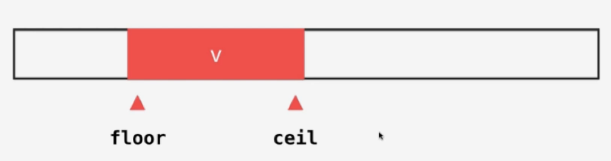
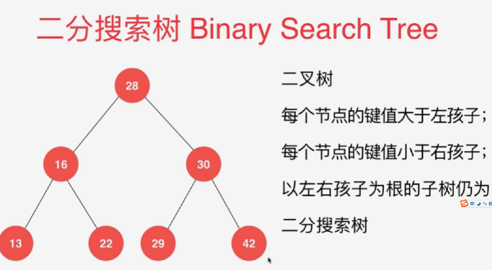
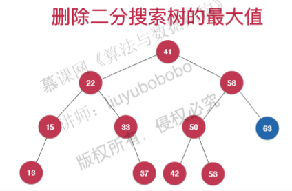
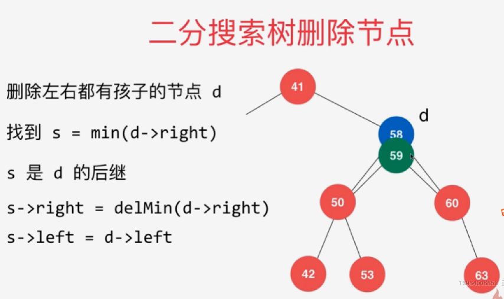
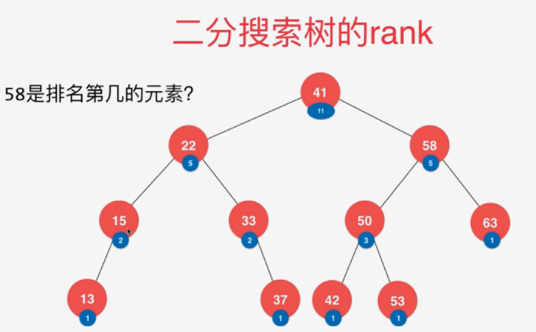
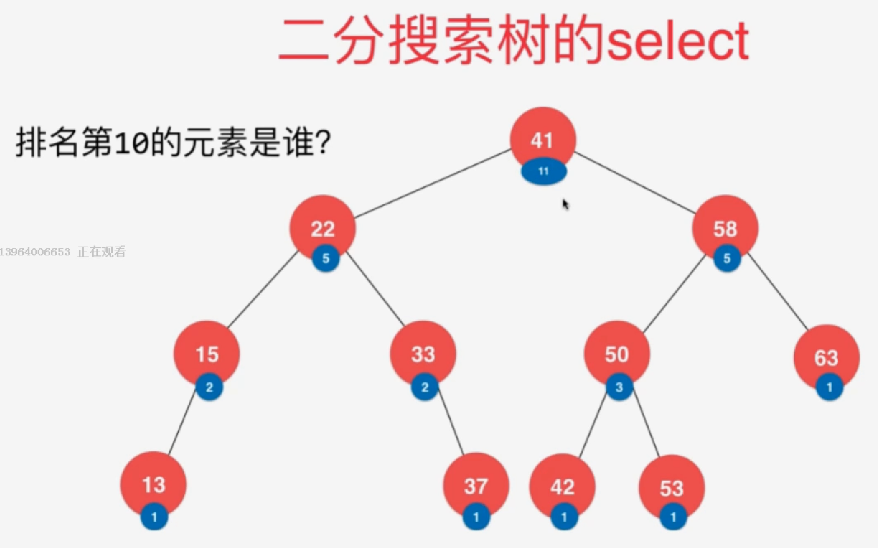
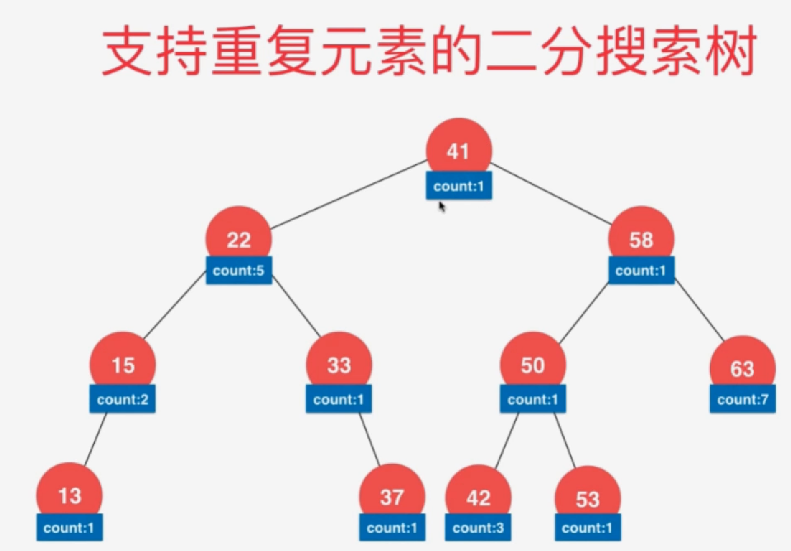

# 二分搜索树

# 一：二分搜索树-查找问题(二分查找)

二分查找及变种（floor, ceil）




# 三：二分搜索树-查找表，字典的实现

动态维护数据：高效查找、插入、删除

数据之间的关系问题：min, max, floor, ceil, rank , select

## 二分搜索树的定义：




非完全二叉树，不方便用数组存储。

- 用node节点表示(key,value)
- 指针和引用表示节点间的联系

构建：构造函数、判断是否为空、返回节点个数

```java 
public class BST<Key extends Comparable<Key>, Value> {
    private class Node {
        private Key key;
        private Value value;
        private Node left, right;

        public Node(Key key, Value value) {
            this.key = key;
            this.value = value;
            left = right = null;
        }

        public Node(Node node){
            this.key = node.key;
            this.value = node.value;
            this.left = node.left;
            this.right = node.right;
        }
    }
    
    private Node root;  // 根节点
    private int count;  // 树种的节点个数

    // 构造函数, 默认构造一棵空二分搜索树
    public BST() {
        root = null;
        count = 0;
    }

    // 返回二分搜索树的节点个数
    public int size() {
        return count;
    }

    // 返回二分搜索树是否为空
    public boolean isEmpty() {
        return count == 0;
    }
}
```

## 插入

当要插入的元素已经在树中，要更新该元素对应的数据。

体会天然递归结构，函数定义：**“ 向以node为根的二分搜索树中, 插入节点(key, value), 使用递归算法。返回插入新节点后的二分搜索树的根”**

```java
// 向二分搜索树中插入一个新的(key, value)数据对
public void insert(Key key, Value value){
    root = insert(root, key, value);
}

// 向以node为根的二分搜索树中, 插入节点(key, value), 使用递归算法
// 返回插入新节点后的二分搜索树的根
private Node insert(Node node, Key key, Value value){
    if( node == null ){
        count ++;
        return new Node(key, value);
    }
	
    // 等于就更新value
    if( key.compareTo(node.key) == 0 )
        node.value = value;
    else if( key.compareTo(node.key) < 0 )
        // 返回的是插入后的根，这里就是node.left
        node.left = insert( node.left , key, value);
    else    // key > node->key
        node.right = insert( node.right, key, value);

    return node;
}
```

## 查找是否存在

```java
public boolean contain(Key key){
    return contain(root, key);
}

private boolean contain(Node node, Key key) {
    if (node == null)
        return false;
    
    if(key.compareTo(node.key) == 0)  {
    	return true;
    } else if (key.compareTp(node.key) < 0) {
        return contain(node.left, key);
    } else {
        return contain(node.right, key);
    }
}
```

## 查找key对应的value

```java
// 在二分搜索树中搜索键key所对应的值。如果这个值不存在, 则返回null
public Value search(Key key){
    return search( root , key );
}

private Value sarch(Node node, Key key) {
    if (node == null) {
        return false;
    }
    
    if(key.compareTo(node.key) == 0)  {
    	return node.value;
    } else if (key.compareTp(node.key) < 0) {
        return search(node.left, key);
    } else {
        return search(node.right, key);
    }
}
```

## 遍历

[参考](7.二叉树的遍历)

## 层次遍历

```java
public void levelOrder(){
    LinkedList<Node> queue = new LinkedList<>();
    queue.add(root);
    
    while(queue.isEmpty()) {
        Node node = queue.remove();
        System.out.println(node.key);
        if(node.left != null) {
            queue.add(node.left);
        }
         if(node.right != null) {
            queue.add(node.right);
        }
    }
}
```

## 寻找最大，最小

```java
// 返回以node为根的二分搜索树的最小键值所在的节点
private Node minimum(Node node){
    if( node.left == null )
        return node;

    return minimum(node.left);
}

// 返回以node为根的二分搜索树的最大键值所在的节点
private Node maximum(Node node){
    if( node.right == null )
        return node;

    return maximum(node.right);
}
```

## 删除最大，最小

- 删除最大：找到最大值 -- 删除 -- 调整.

  最大值可能有两种情况：最大值没有左子树或最大值有左子树（不会有右子树）

  没有左子树：返回null，父节点的新的右子树就是null.

  

  有左子树：**该左子树要代替现在的node节点，成为新的子树的根；成为node节点的父亲节点的右孩子.如果没有左子树，返回空即是删除Node节点。**

```java
// 从二分搜索树中删除最大值所在节点,将新的根返回来
public void removeMax(){
    if( root != null )
        root = removeMax( root );
}

private Node removeMax(Node node) {
    if (node.right == null) {
        Node leftnode = node.left;
        node.left = null;
        count--;
        return leftNode;
    }
    node.right = removeMax(node.right);
    return node;
}
```

- 删除最小

  同上，有可能最小值有右子树

```java
public void removeMin(){
    if (root != null)
        root = removeMin(root);
}
// 删除掉以node为根的二分搜索树中的最小节点
// 返回删除节点后新的二分搜索树的根
private Node removeMin(Node node) {
    if (node.left == null) {
        Node rightnode = node.right;
        // 删除node
        node.right = null;
        count--;
        return rightnode;
    }
    node.left = removeMin(node.left);
    return node;
}
```

## 删除任意节点❤❤❤

- 节点只有一个孩子：最大值和最小值节点如果有孩子节点的话，只能有一个孩子节点。所以要删除的节点只有一个孩子的时候，就可以套用。

- 孩子有两个节点：Hubbard Deletion算法

  此时需要

  1. **删除节点d的右子树的最小节点s（称为d的后继节点），返回删除后的根节点（也可以用d的左子树的最大节点，即d的前驱节点）**

  2. 将s的右子树指向d的右子树。

  3. 将s的左子树指向d的左子树。

     

```java
// 删除掉以node为根的二分搜索树中键值为key的节点, 递归算法
// 返回删除节点后新的二分搜索树的根
// 寻找，删除
private Node remove(Node node, Key key) {
    if(node == null) {
        return null;
    }
    
    if (key.compareTo(node.key) < 0) {
        node.left = remove(node.left, key);
        reurn node;
    } else if(key.compareTo(node.key) > 0) {
        node.right = remove(node.right, key);
        reurn node;
    } else {// key == node->key
        // 待删除节点左子树为空的情况
        if (node.left == null) {
            Node rightNode = node.right;
            node.right = null;
            count--;
            return rightNode;
        }
         // 待删除节点右子树为空的情况
        if( node.right == null ){
            Node leftNode = node.left;
            node.left = null;
            count--;
            return leftNode;
        }
        
        // 待删除节点左右子树均不为空的情况
        // 找到比待删除节点大的最小节点, 即待删除节点右子树的最小节点
        // 用这个节点顶替待删除节点的位置
        
        // 这里删除右子树最小值后原来的successor指向就失效了。所以要new Node,所以在类中要新加一个构造函数,并且count要++。因为在removeMin中count--了，所以相当于没变。
        // Node successor = minimum(node.right);
        Node successor = new Node(minimum(node.right));
        count++;
        
        successor.right = removeMin(node.right)
        successor.left = node.left;
        
        // 删除原节点，将count--
        node.left = node.right = null;
        count--;
        
        return successor;
    }
}
```

删除操作的复杂度：$O(logn)$ , 主要问题在于查找

# 四：其他和顺序相关的问题

## 1.floor和ceil

存在这个数就返回他的索引，否则：

floor：比x小的最后一个。如果x小于最小的就返回-1

ceil：比x大的第一个。如果x大于最大的就返回-1


- floor：最后一个小于等于key的节点

```java
// 寻找key的floor值, 递归算法
// 如果不存在key的floor值(key比BST中的最小值还小), 返回NULL
public Key floor(Key key) {
    if (count == 0 || key.compareTo(minimum()) < 0) {
        return null;
    }
    Node floorNode = floor(root, key);
    return floorNode;
}

// 在以node为根的二叉搜索树中, 寻找key的floor值所处的节点, 递归算法
private Node floor(Node node, Key key) {
    if( node == null )
        return null;

    // 如果node的key值和要寻找的key值相等
    // 则node本身就是key的floor节点
    if (node.key.compareTo(key) == 0) {
        return node;
    }
    // 如果node的key值比要寻找的key值大
    // 则要寻找的key的floor节点一定在node的左子树中
    if (node.key.compareTo(key) > 0) {
        return floor(node.left, key);
    }

    // 如果node->key < key
    // 则node有可能是key的floor节点, 也有可能不是(存在比node->key大但是小于key的其余节点)
    // 需要尝试向node的右子树寻找一下
    Node tempNode = floor( node.right , key );
    if( tempNode != null )
        return tempNode;

    return node;
}
```

- ceil：第一个大于等于key的节点

```java
// 寻找key的ceil值, 递归算法
// 如果不存在key的ceil值(key比BST中的最大值还大), 返回NULL
public Key ceil(Key key){

    if( count == 0 || key.compareTo(maximum()) > 0 )
        return null;

    Node ceilNode = ceil(root, key);
    return ceilNode.key;
}

// 在以node为根的二叉搜索树中, 寻找key的ceil值所处的节点, 递归算法
private Node ceil(Node node, Key key) {
    if( node == null )
        return null;

    // 如果node的key值和要寻找的key值相等
    // 则node本身就是key的ceil节点
    if( node.key.compareTo(key) == 0 )
        return node;

    // 如果node的key值比要寻找的key值小
    // 则要寻找的key的ceil节点一定在node的右子树中
    if( node.key.compareTo(key) < 0 )
        return ceil( node.right , key );

    // 如果node->key > key
    // 则node有可能是key的ceil节点, 也有可能不是(存在比node->key小但是大于key的其余节点)
    // 需要尝试向node的左子树寻找一下
    Node tempNode = ceil( node.left , key );
    if( tempNode != null )
        return tempNode;

    return node;
}
```

## 2.前驱和后继（一定要存在）

- 前驱

```java
// 查找key的前驱
// 如果不存在key的前驱(key不存在, 或者key是整棵二叉树中的最小值), 则返回NULL
public Key predecessor(Key key) {
    Node node = search(root,key);
    // 如果key所在的节点不存在, 则key没有前驱, 返回NULL
    if(node == null) {
        return null;
    }
    // 如果key所在的节点左子树不为空,则其左子树的最大值为key的前驱
    if(node.left != null) {
        return maximun(node.left).key;
    }

    // 否则, key的前驱在从根节点到key的路径上, 在这个路径上寻找到比key小的最大值, 即为key的前驱
    Node preNode = predecessorFromAncestor(root, key);
    return preNode == null ? null : preNode.key;
}

// 在以node为根的二叉搜索树中, 寻找key的祖先中,比key小的最大值所在节点, 递归算法
// 算法调用前已保证key存在在以node为根的二叉树中
Node predecessorFromAncestor(Node node, Key key){
    if (node.key.compareTo(key) == 0) {
        return null;
    }

    if (node.key.compareTo(key) > 0) {
        // 如果当前节点大于key, 则当前节点不可能是比key小的最大值
        // 向下搜索到的结果直接返回
        return predecessorFromAncestor(node.left, key);
    } else {
        assert node.key.compareTo(key) < 0;
        // 如果当前节点小于key, 则当前节点有可能是比key小的最大值
        // 向右继续搜索, 将结果存储到temp中
        Node tmp = predecessorFromAncestor(node.right, key);
        if (tmp != null) {
            return tmp;
        } else { 
		// 如果tempNode为空, 则当前节点即为结果
            return node;
        }
    }
}
```

- 后继

```java
// 查找key的后继, 递归算法
// 如果不存在key的后继(key不存在, 或者key是整棵二叉树中的最大值), 则返回NULL
public Key successor(Key key){

    Node node = search(root, key);
    // 如果key所在的节点不存在, 则key没有前驱, 返回NULL
    if(node == null)
        return null;

    // 如果key所在的节点右子树不为空,则其右子树的最小值为key的后继
    if(node.right != null)
        return minimum(node.right).key;

    // 否则, key的后继在从根节点到key的路径上, 在这个路径上寻找到比key大的最小值, 即为key的后继
    Node sucNode = successorFromAncestor(root, key);
    return sucNode == null ? null : sucNode.key;
}

// 在以node为根的二叉搜索树中, 寻找key的祖先中,比key大的最小值所在节点, 递归算法
// 算法调用前已保证key存在在以node为根的二叉树中
Node successorFromAncestor(Node node, Key key){
    if (node.key.compareTo(key) == 0) {
        return null;
    }
    if (node.key.compare(key) < 0) {
        // 如果当前节点小于key, 则当前节点不可能是比key大的最小值
        // 向下搜索到的结果直接返回
        return successorFromAncestor(node.right, key);
    } else {
        assert (node.key.compareTo(key) > 0);
        // 如果当前节点大于key, 则当前节点有可能是比key大的最小值
        // 向左继续搜索, 将结果存储到tempNode中
        Node tempNode = successorFromAncestor(node.left, key);
        if(tempNode != null)
            return tempNode;
        else
            // 如果tempNode为空, 则当前节点即为结果
            return node;
    }
}
```

## 3.rank排名




每个节点存储：以该节点为父节点的树一共有几个节点。

## 4.select




## 5.支持重复元素的二分搜索树

- 让左节点 <= 根节点

- 每个node记录该节点有多少个

  

- 相应的insert/remove/rank/select都要发生改变

# 五：二分搜索树的局限性

- 可能退化成链表：同样的数据，可以对应不同的二分搜索树。挨个插入BST就退化成了链表
  

- BST还是用递归实现、每次要判断左孩子。所以即便是退化成了链表，效率还是比SST（顺序查找表）慢。

## 平衡二叉树：红黑树

## trie

词频统计

# 六：练习

## 二叉搜索树的第k个节点

230.kth smallest element in a bst

```java
public class Solution {
    TreeNode ret = null;
    int count = 0;
    TreeNode kthNode(TreeNode root, int k)
    {
        if (root == null || k == 0) {
            return null;
        }
        count = k;
        find(root);
        return ret;
    }
     
    public void find(TreeNode root){
        if (root.left != null) {
            find(root.left);
        }
        count--;
        if (count == 0) {
            ret = root;
            return;
        }
        if (root.right != null) {
            find(root.right);
        }
    }
}
```

## 二分搜索树转换为双向链表

在中序遍历中实现链表的链接

```java
public class Solution {
    private TreeNode head = null, last = null;
    public TreeNode Convert(TreeNode pRootOfTree) {
        visit(pRootOfTree);
        return head;
    }
     
    public void visit(TreeNode root) {
        if (root == null) {
            return;
        }
        visit(root.left);
        createList(root);
        visit(root.right);
    }
     
    public void createList(TreeNode node) {
        node.left = last;
        if (last != null) {
            last.right = node;
        } else {
            head = node;
        }
        last = node;
    }
}
```

二叉搜索树的后序遍历序列

给一个整数数组，判断该数组是不是某二叉搜索树的后序遍历的结果

- 后序遍历中：最后一个是根节点的值，前面的一部分比根节点小--左子树，后面一部分比根节点大--右子树。
- 找到分界点挨个去递归判断是否都是BST，注意在根节点右边的树中所有节点的值都要大于根，若不满足直接返回false

```
public class Solution {
    public boolean VerifySquenceOfBST(int [] sequence) {
        if (sequence == null || sequence.length == 0) {
            return false;
        }
        return verify(sequence, 0, sequence.length - 1);
    }
     
    public boolean verify(int[] nums, int start, int end) {
        if (start >= end) {
            return true;
        }
        int root = nums[end];
        int i = start;
        for (;i<end;i++) {
            if (nums[i] > root) {
                break;
            }
        }
 
        int j = i;
        for (;j<end;j++) {
            if (nums[j] < root) {
                return false;
            }
        }
        return verify(nums, start, i-1) && verify(nums, i, end - 1);
    }
}
```

## 235.Lowest Common Ancestor of a Binary Search Tree

一共分三种情况

- 如果p,q都在node左边：都小于node,公共祖先在node左边
- 如果p,q都在Node右边：都大于node,公共祖先在node右边
- 如果p,q不在Node的同一边：

1. 一个小于node,一个大于node，node就是公共祖先
2. p是node，p是公共祖先
3. q是node，q是公共祖先

**思路**

- 首先要求p,q不能为空
- root也不能为空

```java
public TreeNode lowestCommonAncestor(TreeNode root, TreeNode p, TreeNode q) {
    if(p == null || q == null)
        throw new IllegalArgumentException("p or q can not be null.");

    if(root == null)
        return null;

    if(p.val < root.val && q.val < root.val)
        return lowestCommonAncestor(root.left, p, q);
    if(p.val > root.val && q.val > root.val)
        return lowestCommonAncestor(root.right, p, q);

    assert p.val == root.val || q.val == root.val
        || (root.val - p.val) * (root.val - q.val) < 0;

    return root;
}
```

## 练习

1. validate binary search tree
2. delete node in a bst
   删除的节点不存在，多个相同的值都删除，删除的节点要返回吗？

108.convert sorted array to binart search tree

