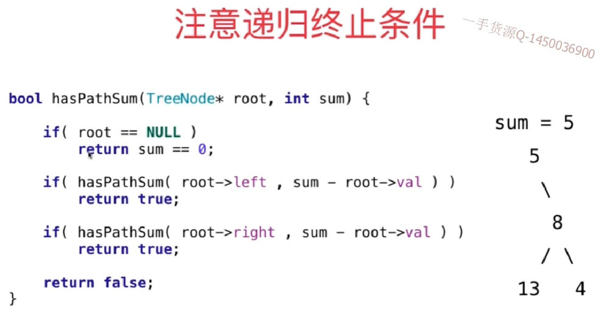
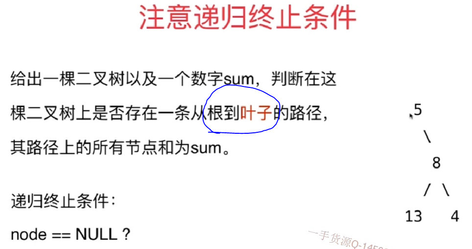
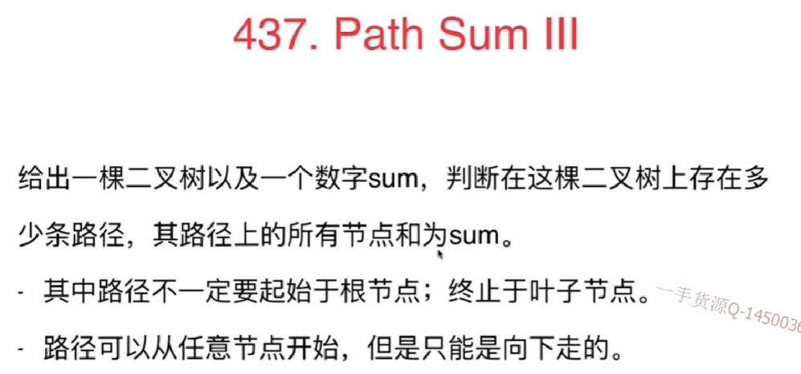
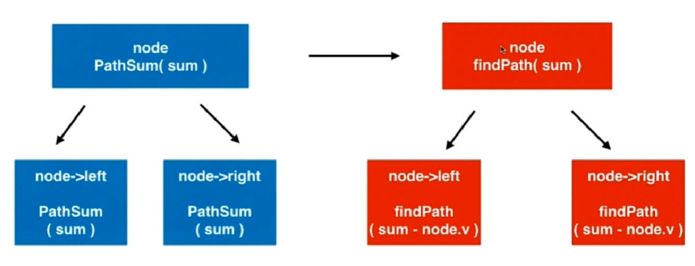

# 7.1 二叉树天然的具有递归结构

- 定义清楚函数的语义并一直遵循

  


## 104.Maximum Depth of Binary Tree
1.函数定义为计算以root为根节点的树的最大深度
2.所以left,right就是以左节点和右节点为根节点的子树的最大深度

```
// 时间复杂度: O(n), n是树中的节点个数
// 空间复杂度: O(h), h是树的高度
class Solution {
    public int maxDepth(TreeNode root) {
        if(root == null)
            return 0;

        return 1 + Math.max(maxDepth(root.left), maxDepth(root.right));
    }
```

## 练习
1. 复习二叉树相关的所有操作，考虑清楚每个函数的语义
111. Minimum Depth of Binary Tree
在思考递归的终止条件时，会遇到的陷阱

# 7.2 homebrew开发者不会的问题(226.Invert Binary Tree(google))

反转一棵二叉树

```
/// 时间复杂度: O(n), n为树中节点个数
/// 空间复杂度: O(h), h为树的高度
public class Solution {
    public TreeNode invertTree(TreeNode root) {
        if(root == null)
            return null;

        TreeNode left = invertTree(root.left);
        TreeNode right = invertTree(root.right);

        root.left = right;
        root.right = left;

        return root;
    }
}
```

## 练习：

1. same tree
2. symmetric tree
3. count complete tree nodes
4. balanced binary tree

# 7.3 注意递归的终止条件

## 112.path sum

**思路一：**




- 会报错，因为5的左边也是null，满足代码。
- 但是5的左孩子不满足题目条件

**思路二：**




- 题目要求从跟到叶子，但是node==null 不一定代表 node的父亲就是叶子节点，有可能上一层节点是只有一个孩子节点的也有可能
- 正确的叶子节点是：左子树和右子树都是空的节点。
  `if(root.left == null && root.right == null)`
- 又因为上面那句话直接访问了节点的左右指针，所以要确保root不为空，即如果题目给的就是一个空的树，就需要进行root是否为空的判断`if(root == null)`

```
/// 时间复杂度: O(n), n为树的节点个数
/// 空间复杂度: O(h), h为树的高度
class Solution {
    public boolean hasPathSum(TreeNode root, int sum) {

        if(root == null)
            return false;

        if(root.left == null && root.right == null)
            return sum == root.val;

        return hasPathSum(root.left, sum - root.val)
                || hasPathSum(root.right, sum - root.val);
    }
}
```

## 练习：

111.对最低深度的定义:也是从根节点到叶子节点

1. sum of left leaves

# 7.4 定义递归问题

递归函数返回数组

## 257. Binary Tree Paths

- 注意判断终止条件是遇到孩子节点：`if(root.left == null && root.right == null)`
- 因为访问了root,为了防止传入空树访问到Null，对于一开始就要判断` if(root == null)`
- 递归调用函数的语义：获取从跟到叶子的所有路径

```java
/// 时间复杂度: O(n), n为树中的节点个数
/// 空间复杂度: O(h), h为树的高度
public class Solution {
    public List<String> binaryTreePaths(TreeNode root) {
        ArrayList<String> res = new ArrayList<String>();

        if(root == null)
            return res;

        if(root.left == null && root.right == null){
            res.add(Integer.toString(root.val));
            return res;
        }

        List<String> leftPaths = binaryTreePaths(root.left);
        for(String s: leftPaths){
            StringBuilder sb = new StringBuilder(Integer.toString(root.val));
            sb.append("->");
            sb.append(s);
            res.add(sb.toString());
        }

        List<String> rightPaths = binaryTreePaths(root.right);
        for(String s: rightPaths) {
            StringBuilder sb = new StringBuilder(Integer.toString(root.val));
            sb.append("->");
            sb.append(s);
            res.add(sb.toString());
        }

        return res;
    }
}
```

## 练习

1. path sunII
2. sum root to leaf numbers

# 7.5 稍复杂的递归逻辑

## 437.Path Sum III




## 思路

- 原来使用findpath函数：就是默认包含头节点，再往后计算其他节点的和

1. 此时不要求根节点一定是叶子，所以用Node==null做判断
2. 因为有负数，所以当node.val=num的时候不能直接返回1.因为后面也有可能会有=num的情况

```
 // 在以node为根节点的二叉树中,寻找包含node的路径,和为sum
    // 返回这样的路径个数
    private int findPath(TreeNode node, int num){
        if(node == null)
            return 0;

        int res = 0;
        if(node.val == num)
            res += 1;

        res += findPath(node.left , num - node.val);
        res += findPath(node.right , num - node.val);

        return res;
    }
```

- 现在应该考虑两种情况:包含头节点,使用findpath函数；不包含头节点，使用pathsum函数，即对左右孩子使用pathsum递归`pathSum(root.left , sum)+ pathSum(root.right , sum);`

- pathsum的语义：在以root为根节点的二叉树中,寻找和为sum的路径,返回这样的路径个数

- 所以对头节点调用两个函数:

  


```
/// 时间复杂度: O(n), n为树的节点个数
/// 空间复杂度: O(h), h为树的高度
class Solution {
    // 在以root为根节点的二叉树中,寻找和为sum的路径,返回这样的路径个数
    public int pathSum(TreeNode root, int sum) {

        if(root == null)
            return 0;

        return findPath(root, sum)
                + pathSum(root.left , sum)
                + pathSum(root.right , sum);
    }

    // 在以node为根节点的二叉树中,寻找包含node的路径,和为sum
    // 返回这样的路径个数
    private int findPath(TreeNode node, int num){
        if(node == null)
            return 0;

        int res = 0;
        if(node.val == num)
            res += 1;

        res += findPath(node.left , num - node.val);
        res += findPath(node.right , num - node.val);

        return res;
    }
}
```

# 练习

## 1.平衡二叉树的判断

**思路：**用后序遍历，每个节点的位置判断当前节点是否满足左右两个子树高度差《1.

```java
class Solution {
    public boolean isBalanced(TreeNode root) {
        if (root == null) {
            return true;
        }
        return balance(root) != -1;
    }
    
    public int balance(TreeNode root) {
        if (root == null) {
            return 0;
        }
        int left = balance(root.left);
        if (left == -1) {
            return -1;
        }
        int right = balance(root.right);
        if (right == -1) {
            return -1;
        }
        if (Math.abs(left - right) > 1) {
            return -1;
        }
        return Math.max(left,right) + 1;
    }
}
```

## 236.Lowest Common Ancestor of a Binary Tree

```java
class Solution {
    public TreeNode lowestCommonAncestor(TreeNode root, TreeNode p, TreeNode q) {
        // 走到底或者找到了其中一个就返回当前的节点
        if(root == null || root == p || root == q)
            return root;

        // 没到底，也没找到p,q就继续在左边和右边找
        TreeNode left = lowestCommonAncestor(root.left, p, q);
        TreeNode right = lowestCommonAncestor(root.right, p, q);
        // 左边没有找到的话返回右边，左边找到了在看右边找到没，右边没找到就返回左边，右边也找到了就返回root
        return left == null ? right : right == null ?  left : root;
    }
}
```

## 235.Lowest Common Ancestor of a Binary Search Tree

**思路：**通过排除法找到一个节点大于其中一个值，小于另一个。

```java
class Solution {
    public TreeNode lowestCommonAncestor(TreeNode root, TreeNode p, TreeNode q) {
        
        int parentVal = root.val;
        int pVal = p.val;
        int qVal = q.val;
        
        if(pVal > parentVal && qVal > parentVal) 
            return lowestCommonAncestor(root.right, p, q);
        if(pVal < parentVal && qVal < parentVal) 
            return lowestCommonAncestor(root.left, p, q);
        else return root;
    }
}
```


