# 树

# 二叉树的遍历

# 一：树的遍历相关定义

## 三种遍历顺序

先序遍历顺序：根、L、R；

中序遍历顺序：L、根、R；

后序遍历顺序：L、R、根 ;

## 递归遍历的本质

递归过程就是三次回到一个节点的过程

## 树节点的结构

```
public static class Node {
		public int value;
		public Node left;
		public Node right;

		public Node(int data) {
			this.value = data;
		}
	} 
```

# 二：普通的递归遍历

## 先序遍历，所以先打印

```
public static void preOrderRecur(Node head) {
		if (head == null) {
			return;
		}
		System.out.print(head.value + " ");  //先打印
		preOrderRecur(head.left);
		preOrderRecur(head.right);
	}
```

## 中序遍历，左边完了再打印

```
public static void inOrderRecur(Node head) {
		if (head == null) {
			return;
		}
		inOrderRecur(head.left);
		System.out.print(head.value + " ");  //回来再打印
		inOrderRecur(head.right);
	}
```

## 后序遍历，左右都完了再打印

```
public static void posOrderRecur(Node head) {
		if (head == null) {
			return;
		}
		posOrderRecur(head.left);
		posOrderRecur(head.right);
		System.out.print(head.value + " ");  //最后打印
	}
```

# 三：普通的非递归遍历

## 先序：

用栈实现。先放根节点，弹出一个再放入弹出节点的右孩子、左孩子。

```
public static void preOrderUnRecur(Node head) { //先序非递归
		System.out.print("pre-order: ");
		if (head != null) {
			Stack<Node> stack = new Stack<Node>();
			stack.add(head);  //先放根节点
			while (!stack.isEmpty()) {
				head = stack.pop();  //弹出一个节点后，先放入弹出节点的右边，左边
				System.out.print(head.value + " ");
				if (head.right != null) {
					stack.push(head.right);
				}
				if (head.left != null) {
					stack.push(head.left);
				}
			}
		}
		System.out.println();
	}
```

## 中序：

先放头结点，左孩子不为空就一直放左孩子。到底以后，弹出一个节点打印并放入弹出节点的右孩子。

```
public static void inOrderUnRecur(Node head) {  //中序非递归
		System.out.print("in-order: ");
		if (head != null) {
			Stack<Node> stack = new Stack<Node>();
			while (!stack.isEmpty() || head != null) {  //第一次满足条件
				if (head != null) {
					stack.push(head);  //只要左边有东西，就一直压栈
					head = head.left;
				} else {    //左边压到底了，弹出就打印，再往右边
					head = stack.pop();
					System.out.print(head.value + " ");
					head = head.right;
				}
			}
		}
		System.out.println();
	}
```

## 后序：

### 用两个栈实现：

后序： L R root

先序：root L R

所以先把先序转换成 root R L（通过改变放入栈的顺序，原本右-左，改成左-右） , 再逆序打印（s1弹出什么s2就压栈什么）就是后序。

```java
public static void posOrderUnRecur1(Node head) { //两个栈的后序
    System.out.print("pos-order: ");
    if (head != null) {
        Stack<Node> s1 = new Stack<Node>();
        Stack<Node> s2 = new Stack<Node>();
        s1.push(head);
        while (!s1.isEmpty()) {
            head = s1.pop();
            s2.push(head); 
            if (head.left != null){ //先放左，再放右
                s1.push(head.left);
            }
            if (head.right != null) {
                s1.push(head.right);
            }
        }
        while (!s2.isEmpty()) {
            System.out.print(s2.pop().value + " ");
        }
    }
    System.out.println();
}
```

### 用一个栈实现：

后序遍历的难点在于：需要判断上次访问的节点是位于左子树，还是右子树。 

- 若是位于左子树，则需跳过根节点，先进入右子树，再回头访问根节点； 
- 若是位于右子树，则直接访问根节点

所以要保存两个变量：当前访问节点，上次访问节点。

```java
public static void postorderTraversal(TreeNode root) {
    if(root == null)
        return;

    Stack<TreeNode> stack = new Stack<>();

    TreeNode curVisited = root, lastVisited = null;
    while (curVisited != null)
    {
        stack.push(curVisited);
        curVisited = curVisited.left;
    }
    while (!stack.empty())
    {
        curVisited = stack.pop();
        //一个根节点被访问的前提是：无右子树或右子树已被访问过  
        if(curVisited.right == null || curVisited.right == lastVisited)
        {
            System.out.println(curVisited.val);
            //修改最近被访问的节点 
            lastVisited = curVisited;
        }
        else
        {
            //根节点再次入栈  
            stack.push(curVisited);
            //进入右子树，且可肯定右子树一定不为空  
            curVisited = curVisited.right;
            while (curVisited != null)
            {
                //再走到右子树的最左边
                stack.push(curVisited);
                curVisited = curVisited.left;
            }
        }
    }
}
```

# 四：Morries遍历

## morries的优点

如果二叉树的节点数为N，要求时间复杂度为O(N)，额外空间复杂度为O(1)。morries利用的是叶节点的空闲指针.

## morries的本质

1：对于任何一个有左子树的节点，两次回到自己；对于没有左子树的节点，只会遍历一次。

2：整体顺序：先当前节点、左子树、右子树

3：流程实现：通过左子树最右节点的右孩子是否指向自己来判断第几次来到自己；如果通过递归函数实现，是函数栈本身帮你记录了行号等信息。

4：往右遍历的前提是：当前节点和其左子树全部遍历完。

5：为什么标记是左子树的最右节点

后继结点：中序遍历中，一个节点的下一个节点，叫做当前节点的后继节点

e.g. 5的后继是1


所以，当前节点一定是左子树最右节点的后继 。

### 思路：

以下先不考虑前 中 后序遍历的问题，只考虑Morris遍历本身这个过程，前中后序只是打印位置不一样而已。

### 规则：

1：morris遍历利用叶节点的空节点实现时间复杂度为O(N)，额外空间复杂度为O(1)的遍历。

2：morris遍历的规则：

--- 当前节点node，若无左子树，则node --> node.right

--- 当前节点node，若有左子树，找到左子树上的最右节点mostright，

若mostright的右孩子为null：1.右孩子指向 node，2.node向左移动，node --> node.left ; （证明是第一次来这里，所以往左走）

若mostright的右孩子已经指向node：1.右孩子指向 null，3. node向右移动node --> node.right . （第二次来到自己，左边已经走完了，现在往右走）

**补充Q**：如何求一棵树的最右节点?

**A:**一直node = node.right到空

### 举例：  

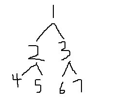

-- node在节点1处，1有左子树，左子树最右节点是5，最右节点5的右指针是空，令5的右指针指向1，node向左，node --> 2.   当前遍历结果：1 2 

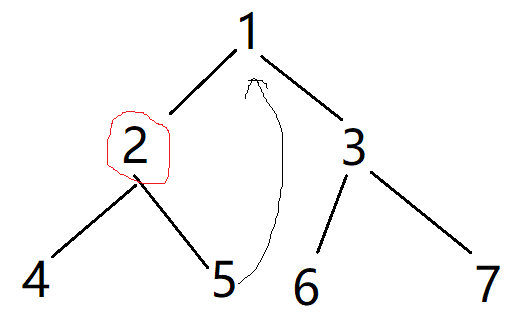

-- node在节点2处，2有左子树，左子树最右节点是4，最右节点4的右指针是空，令4右指针指向2，node向左，node --> 4.   当前遍历结果：1 2 4 

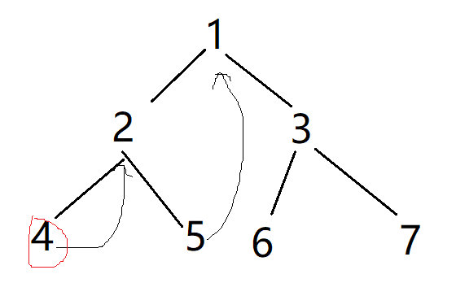

-- node在节点4处，4无左子树，node向右，node --> 2（4的右边是2）   当前遍历结果：1 2 4 2

-- node在节点2处，2有左子树，左子树最右节点是4，最右节点4的右指针是2，令4的右孩子指向null，node向右，node --> 5.   当前遍历结果：1 2 4 2 5

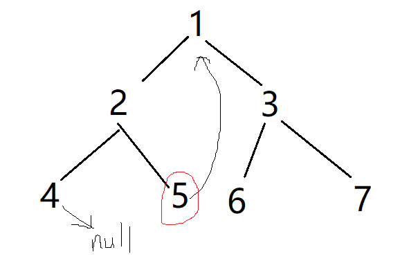

-- node在节点5处，5无左子树，node向右，node --> 1（5的右边是1）  当前遍历结果：1 2 4 2 5 1

-- node在节点1处，1有左子树，左子树最右节点是5，最右节点5的右指针是1，令5的右孩子指向null，node向右，node --> 3   当前遍历结果：1 2 4 2 5 1 3

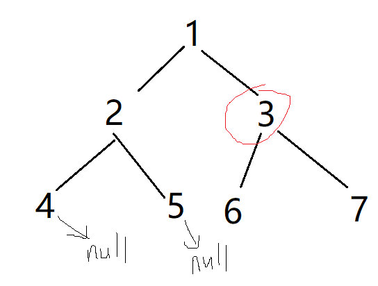

-- node在节点3处，3有左子树，左子树最右节点是6，最右节点6的右指针是空，令6的右孩子指向3(6的右指针指向3)，node向左，node --> 6   当前遍历结果：1 2 4 2 5 1 3 6 

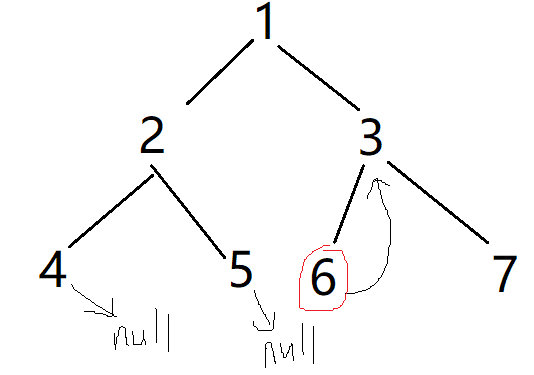

-- node在节点6处，6无左子树，node向右，node --> 3  当前遍历结果：1 2 4 2 5 1 3 6 3 

-- node在节点3处，3有左子树，左子树最右节点是6，最右节点6的右指针指向3，令6的右孩子指向null，node向右，node --> 7  当前遍历结果：1 2 4 2 5 1 3 6 3 7

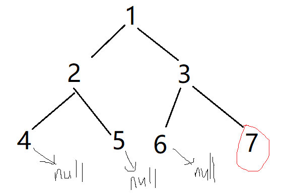

-- node在节点7处，7无左子树，node向右，此时node==null.则遍历结束。 

### 与正常遍历联系

正常遍历如下所示，三个位置打印输出代表前 中 后序遍历 

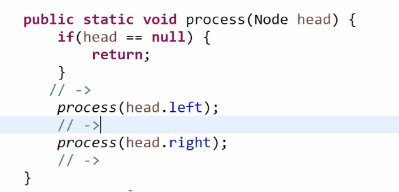

同理，morris遍历也是一样：

**对于无左子树的节点，node停1次**

**对于有的，node停2次**

**因此，在第一次就打印是先序，第二次打印是中序，后序要构造。**

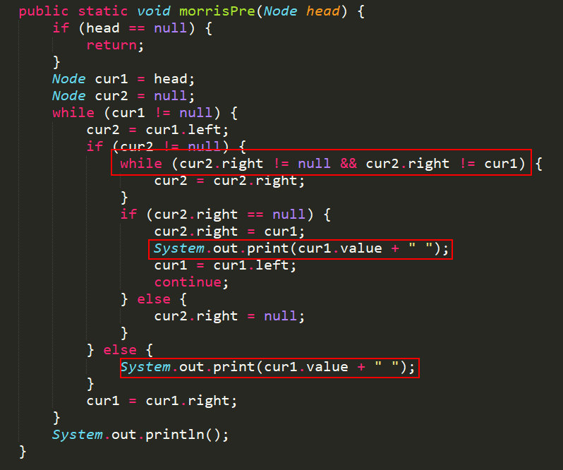

### morries先序（上图）：

第一行while循环代表：找到了满足条件的最右节点（因为最右节点 == null或者 ==cur1，所以当二者都不等的时候就继续循环，找到后就跳出）

第二行的System.out，若节点有左子树（即cur2不等于null时），则第一次到达（第一次到达即右指针为null）时打印。

第三行的System.out，是在节点没有左子树的时候，那么直接打印自己即可。

### morries后序：

正常时候第三次回到本节点打印，morries没有第三次回来，所以：

对于能够两次回到自己的节点，当第二次回到本节点时，逆序打印左子树的右边界，要结束的时候，单独逆序打印整棵树的右边界。

e.g.  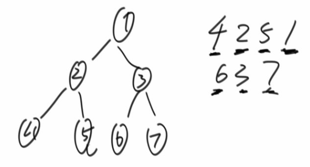

1：第二次回到2:  4

2：第二次回到1:  5  2

3：第二次回到3:  6

4：整棵树结束：7  3  1

-- 如何逆序，使用单链表的逆序反转。

-- 空间复杂度变了吗？  没有，因为就算逆序，也最多遍历数组4次，还是O（N） 

### 时间复杂度证明 

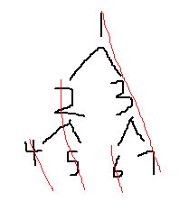

如上图示，整棵树可以看作是被右边界分开的。每个节点是自己的右边界。又因为整个遍历找到最右节点最多走两次，所以全部节点是N个，最多遍历2N次。但没有额外的空间复杂度。

每条右边界都是因为该子树上的父节点引发淌过的。每次都整条边界淌过去， 淌有限次。所以复杂度是O(N)

### 用morries实现前、中、后遍历

```java
public class Problem_01_MorrisTraversal {

    public static class Node {
        public int value;
        Node left;
        Node right;

        public Node(int data) {
            this.value = data;
        }
    }

    public static void morrisPre(Node head) {
        if (head == null) {
            return;
        }
        Node cur1 = head;
        Node cur2 = null;
        while (cur1 != null) {
            cur2 = cur1.left;
            if (cur2 != null) {
                while (cur2.right != null && cur2.right != cur1) {
                    cur2 = cur2.right;
                }
                if (cur2.right == null) {
                    cur2.right = cur1;
                    System.out.print(cur1.value + " ");
                    cur1 = cur1.left;
                    continue;
                } else {
                    cur2.right = null;
                }
            } else {
                System.out.print(cur1.value + " ");
            }
            cur1 = cur1.right;
        }
        System.out.println();
    }

    public static void morrisIn(Node head) {
        if (head == null) {
            return;
        }
        Node cur1 = head;
        Node cur2 = null;
        while (cur1 != null) {
            cur2 = cur1.left;
            if (cur2 != null) {
                while (cur2.right != null && cur2.right != cur1) {
                    cur2 = cur2.right;
                }
                if (cur2.right == null) {
                    cur2.right = cur1;
                    cur1 = cur1.left;
                    continue;
                } else {
                    cur2.right = null;
                }
            }
            System.out.print(cur1.value + " ");
            cur1 = cur1.right;
        }
        System.out.println();
    }

    public static void morrisPos(Node head) {
        if (head == null) {
            return;
        }
        Node cur1 = head;
        Node cur2 = null;
        while (cur1 != null) {
            cur2 = cur1.left;
            if (cur2 != null) {
                while (cur2.right != null && cur2.right != cur1) {
                    cur2 = cur2.right;
                }
                if (cur2.right == null) {
                    cur2.right = cur1;
                    cur1 = cur1.left;
                    continue;
                } else {
                    cur2.right = null;
                    printEdge(cur1.left);
                }
            }
            cur1 = cur1.right;
        }
        printEdge(head);
        System.out.println();
    }

    public static void printEdge(Node head) {
        Node tail = reverseEdge(head);
        Node cur = tail;
        while (cur != null) {
            System.out.print(cur.value + " ");
            cur = cur.right;
        }
        reverseEdge(tail);
    }

    public static Node reverseEdge(Node from) {
        Node pre = null;
        Node next = null;
        while (from != null) {
            next = from.right;
            from.right = pre;
            pre = from;
            from = next;
        }
        return pre;
    }

    // for test -- print tree
    public static void printTree(Node head) {
        System.out.println("Binary Tree:");
        printInOrder(head, 0, "H", 17);
        System.out.println();
    }

    public static void printInOrder(Node head, int height, String to, int len) {
        if (head == null) {
            return;
        }
        printInOrder(head.right, height + 1, "v", len);
        String val = to + head.value + to;
        int lenM = val.length();
        int lenL = (len - lenM) / 2;
        int lenR = len - lenM - lenL;
        val = getSpace(lenL) + val + getSpace(lenR);
        System.out.println(getSpace(height * len) + val);
        printInOrder(head.left, height + 1, "^", len);
    }

    public static String getSpace(int num) {
        String space = " ";
        StringBuffer buf = new StringBuffer("");
        for (int i = 0; i < num; i++) {
            buf.append(space);
        }
        return buf.toString();
    }

    public static void main(String[] args) {
        Node head = new Node(4);
        head.left = new Node(2);
        head.right = new Node(6);
        head.left.left = new Node(1);
        head.left.right = new Node(3);
        head.right.left = new Node(5);
        head.right.right = new Node(7);
        printTree(head);
        morrisPre(head);
        morrisIn(head);
        morrisPos(head);
        printTree(head);
    }
}
```

# 五：模拟栈实现遍历

```java
/// 非递归二叉树的前序遍历
/// 时间复杂度: O(n), n为树的节点个数
/// 空间复杂度: O(h), h为树的高度
public class Solution144 {
    // Definition for a binary tree node.
    public class TreeNode {
        int val;
        TreeNode left;
        TreeNode right;
        TreeNode(int x) { val = x; }
    }
    // 自定义指令
    private class Command{
        String s;   // go, print
        TreeNode node;
        Command(String s, TreeNode node){
            this.s = s;
            this.node = node;
        }
    };

    public List<Integer> preorderTraversal(TreeNode root) {
        ArrayList<Integer> res = new ArrayList<Integer>();
        if(root == null)
            return res;

        Stack<Command> stack = new Stack<Command>();
        stack.push(new Command("go", root));
        while(!stack.empty()){
            Command command = stack.pop();

            if(command.s.equals("print"))
                res.add(command.node.val);
            else{
                //先序遍历，最后插入print
                assert command.s.equals("go");
                if(command.node.right != null)
                    stack.push(new Command("go",command.node.right));
                if(command.node.left != null)
                    stack.push(new Command("go",command.node.left));
                stack.push(new Command("print", command.node));
            }
        }
        return res;
    }
}
```

# 六：Trie

[参考](11.字符串.md)

# 七：其他题目

## **操作给定的二叉树，将其变换为源二叉树的镜像。** 

```java
public void Mirror(TreeNode root) {
    if (root == null) {
        return;
    }
    if (root.left == null || root.right == null) {
        return;
    }
    TreeNode tmp = root.left;
    root.left = root.right;
    root.right = tmp;
    
    if (root.left != null) {
    	Mirror(root.left);
    }
    if (root.right != null) {
    	Mirror(root.right);
    }
}
```

## 二叉树的下一个节点

给出二叉树和其中一个节点，找出中序遍历下的下一个节点。每个节点都包含：左右子节点的指针，父节点的指针

- 有右子树：下一个节点就是右子树上的最左节点

- 没右子树：该节点是父亲节点的左节点，下一个就是父亲节点

  ​		    该节点是父亲的右节点：沿着父亲节点一直向上，直到一个节点x，x是x的父亲的左节点。下一个就是x的父亲节点。

```java
public TreeLinkNode GetNext(TreeLinkNode node)
{
    if (node.right != null) {
        TreeLinkNode tmp = node.right;
        while (tmp.left != null) {
            tmp = tmp.left;
        }
        return tmp;
    } else if(node.next != null) {
        TreeLinkNode current = node;
        TreeLinkNode parent = node.next;
        while (parent != null && current == parent.right) {
            current = parent;
            parent = parent.next;
        }
        return parent;
    }
    return null;
}
```

## 对称的二叉树

二叉树和二叉树的镜像是同样的，就是对称

```java
public class Solution {
    boolean isSymmetrical(TreeNode pRoot)
    {
        if(pRoot == null || ( pRoot.left == null && pRoot.right == null )) {
            return true;
        }

        return isSym(pRoot.left, pRoot.right);
    }

    boolean isSym(TreeNode root1, TreeNode root2){
        if(root1 == null && root2 == null) {
            return true;
        } else if (root1 == null || root2 == null) {
            return false;
        } else if (root1.val == root2.val ){
            return (isSym(root1.left, root2.right) && isSym(root1.right, root2.left));
        } else {
            return false;
        }
    }
}
```

## 是否为平衡二叉树

```java
public class Solution {
    public boolean IsBalanced_Solution(TreeNode root) {
        if (root == null) {
            return true;
        }
        return balance(root) != -1;
    }
     
    public int balance(TreeNode root) {
        if (root == null) {
            return 0;
        }
        int left = balance(root.left);
        if (left == -1) {
            return -1;
        }
        int right = balance(root.right);
        if (right == -1) {
            return -1;
        }
        if (Math.abs(left - right) > 1) {
            return -1;
        }
        return Math.max(left,right) + 1;
    }
}
```

## 完全二叉树


## 二叉树的深度

非递归：层次遍历，记录当前这一层的最后一个节点 & 下一层的最后一个节点。初始值：当前最后 = root, 下一层最后 = null。不断更新下一层最后

```java
public int getDepth(TreeNode node) {
    if (node == null || (node.left == null && node.right == null)) {
        return node == null ? 0 : 1;
    }

    Queue<TreeNode> queue = new LinkedList<>();
    int depth = 0;
    TreeNode nextEnd = null, nowEnd = node;
    queue.offer(node);
    while (!queue.isEmpty()) {
        TreeNode tmp = queue.poll();
        if (tmp.left != null) {
            queue.offer(tmp.left);
            nextEnd = tmp.left;
        }
        if (tmp.right != null) {
            queue.offer(tmp.right);
            nextEnd = tmp.right;
        }
        if (tmp == nowEnd) {
            depth++;
            nowEnd = nextEnd;
        }
    }

    return depth;
}
```

- 通过直接记录一层的个数来遍历

```java
public int getDepth1(TreeNode node) {
    if (node == null || (node.left == null && node.right == null)) {
        return node == null ? 0 : 1;
    }

    Queue<TreeNode> q = new LinkedList<>();
    q.add(node);
    int depth = 0;

    while (!q.isEmpty()) {
        depth++;
        int size = q.size();
        for (int i = 0; i < size; ++i) {
            TreeNode tmp = q.poll();
            if (tmp.left != null) {
                q.add(tmp.left);
            }

            if (tmp.right != null) {
                q.add(tmp.right);
            }
        }
    }

    return depth;
}
```

## 树的宽度

在层次遍历的基础上，记录访问每层的节点数，留下max。

```java
public int getWidth(TreeNode node) {
    if (node == null || (node.left == null && node.right == null)) {
        return node == null ? 0 : 1;
    }

    Queue<TreeNode> queue = new LinkedList<>();
    int width = 0;
    TreeNode nextEnd = null, nowEnd = node;
    queue.offer(node);
    while (!queue.isEmpty()) {
        width = Math.max(width, queue.size());
        TreeNode tmp = queue.poll();
        if (tmp.left != null) {
            queue.offer(tmp.left);
            nextEnd = tmp.left;
        }
        if (tmp.right != null) {
            queue.offer(tmp.right);
            nextEnd = tmp.right;
        }
        if (tmp == nowEnd) {
            nowEnd = nextEnd;
        }
    }

    return width;
}
```

## 二叉树中和为某一值的路径

从根节点向下一直到叶子节点算一条路径

```java
public class Solution {
    ArrayList<ArrayList<Integer>> ans;
    public ArrayList<ArrayList<Integer>> FindPath(TreeNode root,int target) {
        ans = new ArrayList<>();
        if (root == null) {
            return ans;
        }
        ArrayList<Integer> tmp = new ArrayList<>();
        find(root, target, tmp);
        return ans;
    }

    public void find(TreeNode root, int target, ArrayList<Integer> tmp) {
        target -= root.val;
        tmp.add(root.val);

        if (root.left == null && root.right == null) {
            if (target == 0) {
                ans.add(new ArrayList<>(tmp));
            }
        }
        if (root.left != null) {
            find(root.left, target, tmp);
        }
        if (root.right != null) {
            find(root.right, target, tmp);
        }
        tmp.remove(tmp.size()-1);
    }
}
```

## 二叉树的镜像

将给定的二叉树转换为其镜像

```
//递归
public class Solution {
    public void Mirror(TreeNode root) {
        if (root == null) {
            return;
        }
        TreeNode tmp = root.left;
        root.left = root.right;
        root.right = tmp;
        Mirror(root.left);
        Mirror(root.right);
    }
}
```

```java
//非递归
public class Solution {
    public void Mirror(TreeNode root) {
        if(root == null){
            return;
        }
        Stack<TreeNode> stack = new Stack<TreeNode>();
        stack.push(root);
        while(!stack.isEmpty()){
            TreeNode node = stack.pop();
            if(node.left != null||node.right != null){
                TreeNode temp = node.left;
                node.left = node.right;
                node.right = temp;
            }
            if(node.left!=null){
                stack.push(node.left);
            }
            if(node.right!=null){
                stack.push(node.right);
            }
        }
    }
}
```

## 根据先序，中序遍历重建二叉树

不含重复数字

```java
public class Solution {
    public TreeNode reConstructBinaryTree(int [] pre,int [] in) {
         if ( pre == null || pre.length == 0 || in == null || in.length == 0)
            return null;
        return construct(in, 0, in.length - 1, pre, 0, pre.length - 1);
    }
     
    public TreeNode construct(int[] in, int inStart, int inEnd, int[] pre, int preStart, int preEnd) {
        if (inStart > inEnd) {
            return null;
        }
        TreeNode root = new TreeNode(pre[preStart]);
        for (int i = inStart; i <= inEnd; i++) {
            if (in[i] == pre[preStart]) {
                root.left = construct(in,inStart,i-1,pre,preStart + 1,preStart+i-inStart);
                root.right = construct(in,i+1,inEnd,pre,preStart + i - inStart + 1,preEnd);
            }
        }
        return root;
    }
}
```

## 折纸问题

将一张纸折n次，打印出所有的折痕方向

```
折3次，d - down, u - up
1.    d
2.  d   u
3. d u d u
   ddudduu
```

```java
void printAllFolds(int N) {
    printProcess(1, N, true);
}

void printProcess(int i, int N, boolean down) {
    if (i > N) return;
    printProcess(i + 1, N, true);
    System.out.println(down ? "down " : "up ");
    printProcess(i + 1, N, false);
}
```

## 重建二叉树

输入某二叉树的前序遍历和中序遍历的结果，请重建出该二叉树。假设输入的前序遍历和中序遍历的结果中都不含重复的数字。 

```java
public TreeNode reConstructBinaryTree(int [] pre,int [] in) {
    if ( pre == null || pre.length == 0 || in == null || in.length == 0)
        return null;
    return construct(in, 0, in.length - 1, pre, 0, pre.length - 1);
}

public TreeNode construct(int[] in, int inStart, int inEnd, int[] pre, int preStart, int preEnd) {
    if (inStart > inEnd) {
        return null;
    }
    TreeNode root = new TreeNode(pre[preStart]);
    for (int i = inStart; i <= inEnd; i++) {
        if (in[i] == pre[preStart]) {
            root.left = construct(in,inStart,i-1,pre,preStart + 1,preStart+i-inStart);
            root.right = construct(in,i+1,inEnd,pre,preStart + i - inStart + 1,preEnd);
        }
    }
    return root;
}
```

