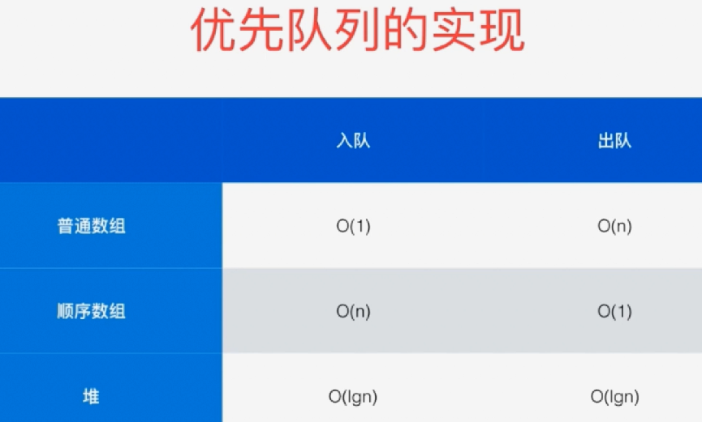
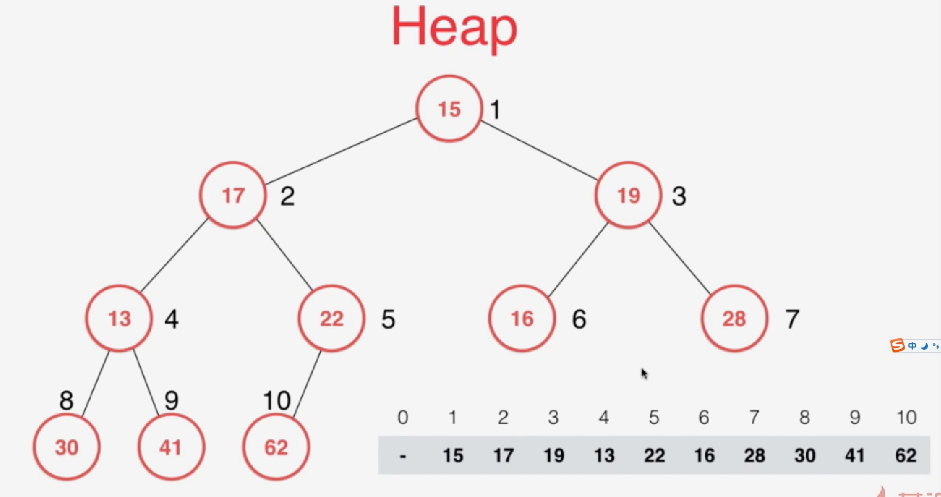
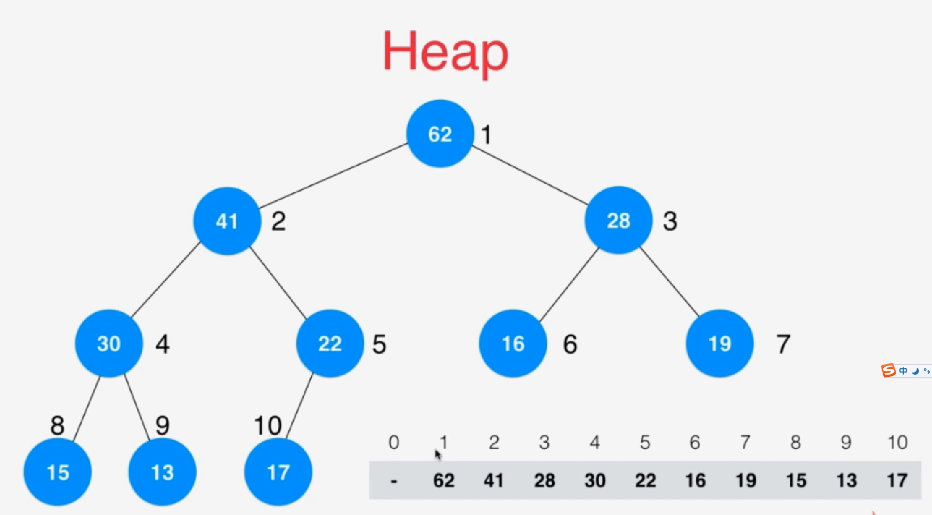
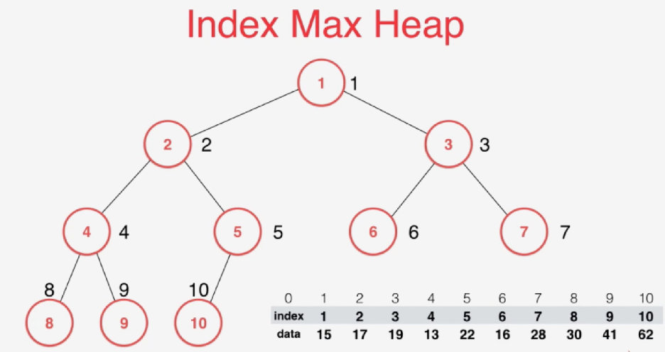
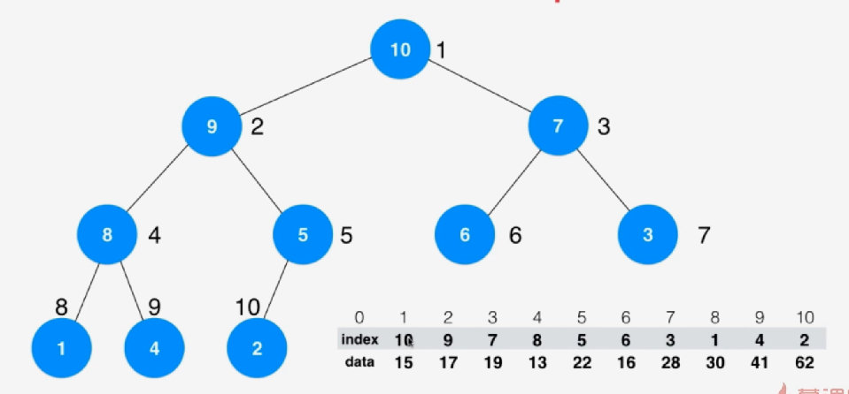
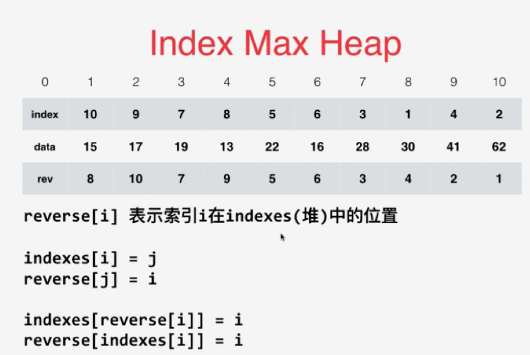
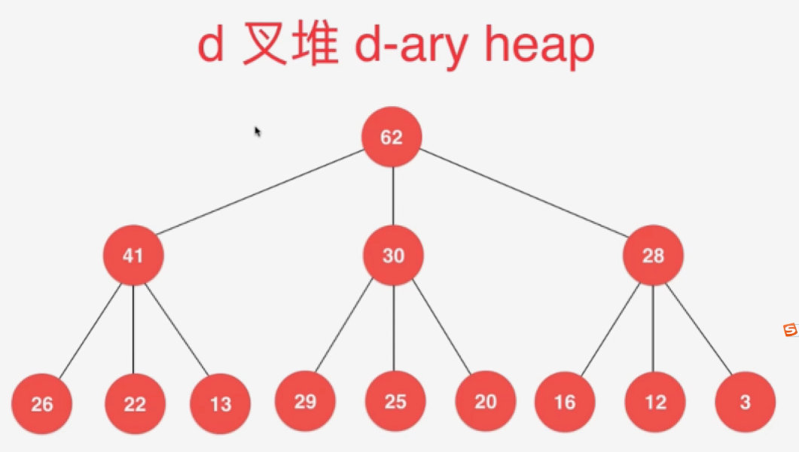
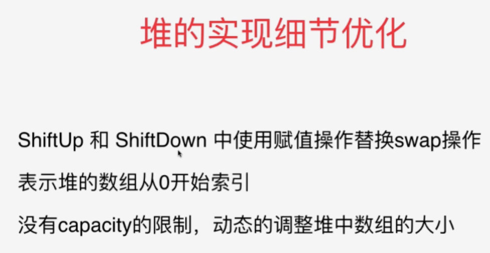

# 一：堆和优先队列

堆的应用：排序、优先队列

# 优先队列基础

普通队列：FIFO

优先队列：出队顺序和入队顺序无关，和优先级相关。

应用：操作系统中**动态地**执行任务、人工智能中角色选择敌人攻击、在N个元素中选出前M个(NlogM>NlogN)--维持一个大小为100的最小堆




普通数组实现最差复杂度为$O(n^2)$, 堆实现为$O(nlogn)$

# 堆的基本实现

## 二叉堆：

1. 是一颗完全二叉树：1-(n-1)层都是满的，第n层集中在左边
2. 对于大顶堆来说：每个结点的值都大于或等于其左右孩子结点的值

## 数组存储：

- 能用数组存储是因为堆是一个完全二叉树，能够充分使用空间。
- 根节点标记为1，
  - 左孩子: 2 * i 
  - 右孩子: 2 * i + 1
  - 父亲节点: i / 2

```java
// 在堆的有关操作中，需要比较堆中元素的大小，所以Item需要extends Comparable
public static MaxHeap<E extends Comparable> {
    // 使用数组表示堆,角标从1开始
    private E[] data;
    // 堆中现有总量
    private int size;
    private int capacity;
    
    //构造函数，
    public Stack(int capacity) {
        data = (E[])new Object[capacity+1];
        size = 0;
        this.capacity = capacity;
    }
    
    public swap(int i, int j){
        E t = data[i];
        data[i] = data[j];
        data[j] = t;
    }
}
```

## 添加元素 与 shift up

添加元素：相当于在数组最后(size+1)添加元素，然后上移(**不考虑数组扩容**)

```java
public static MaxHeap<E extends Comparable> {
    public void add(E e) {
        assert size + 1 <= capacity;
        data[size+1] = e;
        size++;
        shiftUp(size);
    }
    
    private void shiftUp(int k) {
        // k最多到2，到2后和k=1的节点进行最后一次比较。k=1已经是根节点就不需要比较了
        while (k > 1 && data[k/2] < data[k]) {
            swap(k/2,k);
            k = k/2;
        }
    }
}
```

## 取出最大元素 与 shift down

取出元素：只能取出根节点的元素。相当于数组中取出第一个元素，将堆中最后一个元素放在第一个位置(size-1)（这样仍能保证堆是一个完全二叉树），然后下移。

```java
public static MaxHeap<E extends Comparable> {
    public E extractMax() {
        assert size > 0;
        E ret = data[1];
        swap(1,size);
        size--;
        shiftDown(1);
        return ret;
    }
    
    //传入k，表示尝试将k索引的位置下移
    private void shiftDown(int k) {
        // 跟孩子中较大的换
        // 在什么情况下需要尝试：k有孩子的时候进行尝试，在完全二叉树中只要有左孩子就一定有孩子，即可用进行尝试，因为完全二叉树中不可能只有右孩子没有左孩子。但可能没有右孩子。
        while (k*2<=count) {
            // 在此轮循环中,data[k]和data[j]交换位置
            // 因为一定有左孩子，所以初始化为左孩子
            int j = 2*k;
            // 看有没有右孩子,并且右孩子比左孩子大
            if (j + 1 <= count && data[j+1] > data[j]) {
                j = j + 1;
            }
            // 判断是否需要交换：父节点是不是大于孩子
            if (data[k] > data[j]) {
                break;
            }
            swap(k,j);
            k = j;
        }
    }
}
```

## shiftup 与 shiftdown的优化：不直接跟孩子swap,而是找到该放的位置后再swap

```java
package bobo.algo;

import java.util.*;
import java.lang.*;

// 将 ShiftUp 和 ShiftDown 函数使用类似插入排序算法的方式进行优化的最大堆
public class MaxHeapO<Item extends Comparable> {
    protected Item[] data;
    protected int count;
    protected int capacity;

    // 构造函数, 构造一个空堆, 可容纳capacity个元素
    public MaxHeapO(int capacity){
        data = (Item[])new Comparable[capacity+1];
        count = 0;
        this.capacity = capacity;
    }

    // 构造函数, 通过一个给定数组创建一个最大堆
    // 该构造堆的过程, 时间复杂度为O(n)
    public MaxHeapO(Item arr[]){
        int n = arr.length;

        data = (Item[])new Comparable[n+1];
        capacity = n;

        for( int i = 0 ; i < n ; i ++ )
            data[i+1] = arr[i];
        count = n;

        for( int i = count/2 ; i >= 1 ; i -- )
            shiftDown(i);
    }

    // 返回堆中的元素个数
    public int size(){
        return count;
    }

    // 返回一个布尔值, 表示堆中是否为空
    public boolean isEmpty(){
        return count == 0;
    }

    // 像最大堆中插入一个新的元素 item
    public void insert(Item item){

        assert count + 1 <= capacity;
        data[count+1] = item;
        count ++;
        shiftUp(count);
    }

    // 从最大堆中取出堆顶元素, 即堆中所存储的最大数据
    public Item extractMax(){
        assert count > 0;
        Item ret = data[1];

        swap( 1 , count );
        count --;
        shiftDown(1);

        return ret;
    }

    // 获取最大堆中的堆顶元素
    public Item getMax(){
        assert( count > 0 );
        return data[1];
    }


    // 交换堆中索引为i和j的两个元素
    private void swap(int i, int j){
        Item t = data[i];
        data[i] = data[j];
        data[j] = t;
    }

    //********************
    //* 最大堆核心辅助函数
    //********************
    private void shiftUp(int k){
        Item e = data[k];
        while( k > 1 && data[k/2].compareTo(e) < 0 ){
            //swap(k, k/2);
            data[k] = data[k/2];
            k /= 2;
        }
        data[k] = e;
    }

    private void shiftDown(int k){
        Item e = data[k];
        while( 2*k <= count ){
            int j = 2*k; // 在此轮循环中,data[k]和data[j]交换位置
            if( j+1 <= count && data[j+1].compareTo(data[j]) > 0 )
                j ++;
            // data[j] 是 data[2*k]和data[2*k+1]中的最大值

            if( e.compareTo(data[j]) >= 0 ) break;
            //swap(k, j);
            data[k] = data[j];
            k = j;
        }
        data[k] = e;
    }

    // 测试 MaxHeapO
    public static void main(String[] args) {
        MaxHeapO<Integer> maxHeap = new MaxHeapO<Integer>(100);
        int N = 100; // 堆中元素个数
        int M = 100; // 堆中元素取值范围[0, M)
        for( int i = 0 ; i < N ; i ++ )
            maxHeap.insert( new Integer((int)(Math.random() * M)) );

        Integer[] arr = new Integer[N];
        // 将maxheap中的数据逐渐使用extractMax取出来
        // 取出来的顺序应该是按照从大到小的顺序取出来的
        for( int i = 0 ; i < N ; i ++ ){
            arr[i] = maxHeap.extractMax();
            System.out.print(arr[i] + " ");
        }
        System.out.println();

        // 确保arr数组是从大到小排列的
        for( int i = 1 ; i < N ; i ++ )
            assert arr[i-1] >= arr[i];
    }
}
```

# 二：堆排序和heapify

堆排序的堆构造过程：

1. 使用最大堆的插入函数，不断地向堆中add数据，就能完成堆排序。

```java
public class HeapSort1 {
	private HeapSort1(){}
    
    public static void sort(Comparable[] arr) {
        int n = arr.length;
        MaxHeap<Comparable> maxHeap = new MaxHeap<Comparable>(n);
        for (int i = 0; i < n; i++) {
            maxHeap.add(arr[i]);
        } 
        for (int i = n - 1; i >= 0; i--) {
            arr[i] = maxHeap.extractMax();
        }
    }
}
```

2. heapify：给定一个数组，不断对数组元素进行shiftdown构建一个大根堆，从而实现排序，这个过程叫做heapify。

- 对于所有的叶子节点，他们本身就是一个最大堆。所以可以忽略。
- 从后往前数，第一个非叶子节点的节点下标是size/2（头结点是1，元素个数/2）.
- 从后向前依次考虑不是叶子节点的节点，依次执行shiftdown即可。

```java
public class MaxHeap<Item extends Comparable> {
    protected Item[] data;
    protected int count;
    protected int capacity;

    // 构造函数, 构造一个空堆, 可容纳capacity个元素
    public MaxHeap(int capacity){
        data = (Item[])new Comparable[capacity+1];
        count = 0;
        this.capacity = capacity;
    }

    // 构造函数, 通过一个给定数组使用heapify创建一个最大堆
    // 该构造堆的过程, 时间复杂度为O(n)
    public MaxHeap(Item arr[]){
        int n = arr.length;
        data = (Item[])new Comparable[n+1];
        capacity = n;

        for( int i = 0 ; i < n ; i ++ )
            data[i+1] = arr[i];
        count = n;
		//开始从倒数第一个非叶子节点的节点开始调整
        for( int i = count/2 ; i >= 1 ; i -- )
            shiftDown(i);
    }
```

将n个元素逐个插入到一个空堆的复杂度是$O(nlogn)$，heapify的复杂度是$O(n)$。

## 原地堆排序(效率更高)

原来：需要先把数组中元素放入堆中，再进行排序。需要额外空间

原地排序：

1. 一个数组可以看成一个堆，所以可以通过heapify过程构建为最大堆。

2. 那么第一个位置的值v就是最大值，应该放在数组末尾(数组末尾是w)，所以将v和w互换。

3. 此时除了v外，数组前面部分不是一个最大堆。所以对w位置进行shiftdown过程，将橙色部分阻止为一个最大堆。

   

4. 不断进行2-3过程，直到整个数组排序从小到大完成。

**TIPS：这里在数组上进行操作。角标从0开始**

parent（i）= （i-1）/2

left child（i） =  2*i + 1

right child（i） =  2*i + 2

最后一个非叶子节点的索引：（size - 1）/2

```java
package bobo.algo;

import java.util.*;

// 不使用一个额外的最大堆, 直接在原数组上进行原地的堆排序.下标从0开始
public class HeapSort {
    // 我们的算法类不允许产生任何实例
    private HeapSort(){}

    public static void sort(Comparable[] arr){
        int n = arr.length;

        // 注意，此时我们的堆是从0开始索引的
        // 从(最后一个元素的索引-1)/2开始
        // 最后一个元素的索引 = n-1
        for( int i = (n-1-1)/2 ; i >= 0 ; i -- )
            shiftDown2(arr, n, i);

        for( int i = n-1; i > 0 ; i-- ){
            //把当前堆中最大的元素放到最后
            swap( arr, 0, i);
            //每次循环，堆中元素都少1，所以参数中用i
            shiftDown2(arr, i, 0);
        }
    }

    // 交换堆中索引为i和j的两个元素
    private static void swap(Object[] arr, int i, int j){
        Object t = arr[i];
        arr[i] = arr[j];
        arr[j] = t;
    }

    // 原始的shiftDown过程
    private static void shiftDown(Comparable[] arr, int n, int k){
        while( 2*k+1 < n ){
            int j = 2*k+1;
            if( j+1 < n && arr[j+1].compareTo(arr[j]) > 0 )
                j += 1;

            if( arr[k].compareTo(arr[j]) >= 0 )break;

            swap( arr, k, j);
            k = j;
        }
    }

    // 优化的shiftDown过程, 使用赋值的方式取代不断的swap,
    // 该优化思想和我们之前对插入排序进行优化的思路是一致的
    private static void shiftDown2(Comparable[] arr, int n, int k){
        Comparable e = arr[k];
        // 左孩子不越界
        while( 2*k+1 < n ){
            int j = 2*k+1;
            if( j+1 < n && arr[j+1].compareTo(arr[j]) > 0 )
                j += 1;

            if( e.compareTo(arr[j]) >= 0 )
                break;

            arr[k] = arr[j];
            k = j;
        }

        arr[k] = e;
    }

    // 测试 HeapSort
    public static void main(String[] args) {

        int N = 1000000;
        Integer[] arr = SortTestHelper.generateRandomArray(N, 0, 100000);
        SortTestHelper.testSort("bobo.algo.HeapSort", arr);

        return;
    }
}
```

# 三：索引堆 Index Heap

## 原地堆排序

原来：



堆排序后：




原来堆的问题：在数组上构建堆改变了元素的位置。

1. 当数组元素复杂，交换元素会产生性能消耗
2. 元素位置改变后，就难以索引。

## 索引堆

最大索引堆：将索引和数据分开存储。对索引数组进行堆排序






1. 只需要对int形索引进行比较
2. 可根据索引数组找到元素

```java
package bobo.algo;

import java.util.*;
import java.lang.*;

// 最大索引堆
public class IndexMaxHeap<Item extends Comparable> {
    protected Item[] data;      // 最大索引堆中的数据
    protected int[] indexes;    // 最大索引堆中的索引
    protected int count;
    protected int capacity;

    // 构造函数, 构造一个空堆, 可容纳capacity个元素
    public IndexMaxHeap(int capacity){
        data = (Item[])new Comparable[capacity+1];
        indexes = new int[capacity+1];
        count = 0;
        this.capacity = capacity;
    }

    // 返回索引堆中的元素个数
    public int size(){
        return count;
    }

    // 返回一个布尔值, 表示索引堆中是否为空
    public boolean isEmpty(){
        return count == 0;
    }

    // 向最大索引堆中插入一个新的元素, 新元素的索引为i, 元素为item
    // 传入的i对用户而言,是从0索引的
    public void insert(int i, Item item){
        assert count + 1 <= capacity;
        assert i + 1 >= 1 && i + 1 <= capacity;
		
        // 内部存储item的data、index数组都是从1开始
        i++;
        // 插入元素到元素数组、索引数组。用户指定将item放在i位置
        data[i] = item;
        
        count++;
        indexes[count+1] = i;

        shiftUp(count);
    }

    // 从最大索引堆中取出堆顶元素, 即索引堆中所存储的最大数据
    public Item extractMax(){
        assert count > 0;

        Item ret = data[indexes[1]];
        swapIndexes( 1 , count );
        count --;
        shiftDown(1);

        return ret;
    }

    // 从最大索引堆中取出堆顶元素的索引
    public int extractMaxIndex(){
        assert count > 0;

        int ret = indexes[1] - 1;
        swapIndexes( 1 , count );
        count --;
        shiftDown(1);

        return ret;
    }

    // 获取最大索引堆中的堆顶元素
    public Item getMax(){
        assert count > 0;
        return data[indexes[1]];
    }

    // 获取最大索引堆中的堆顶元素的索引
    public int getMaxIndex(){
        assert count > 0;
        return indexes[1]-1;
    }

    // 获取最大索引堆中索引为i的元素
    public Item getItem( int i ){
        assert i + 1 >= 1 && i + 1 <= capacity;
        return data[i+1];
    }

    // 将最大索引堆中索引为i的元素修改为newItem
    public void change( int i , Item newItem ){
        i += 1;
        data[i] = newItem;

        // 找到indexes[j] = i, j表示data[i]在堆中的位置
        // 之后shiftUp(j), 再shiftDown(j)（试试能不能上移，下移）
        for( int j = 1 ; j <= count ; j ++ )
            if( indexes[j] == i ){
                shiftUp(j);
                shiftDown(j);
                return;
            }
    }

    // 交换索引堆中的索引i和j
    private void swapIndexes(int i, int j){
        int t = indexes[i];
        indexes[i] = indexes[j];
        indexes[j] = t;
    }

    //********************
    //* 最大索引堆核心辅助函数
    //********************

    // 索引堆中, 数据之间的比较根据data的大小进行比较, 但实际操作的是索引
    private void shiftUp(int k){
        while( k > 1 && data[indexes[k/2]].compareTo(data[indexes[k]]) < 0 ){
            //真正交换的是索引
            swapIndexes(k, k/2);
            k /= 2;
        }
    }

    // 索引堆中, 数据之间的比较根据data的大小进行比较, 但实际操作的是索引
    private void shiftDown(int k){
        while( 2*k <= count ){
            int j = 2*k;
            if( j+1 <= count && data[indexes[j+1]].compareTo(data[indexes[j]]) > 0 )
                j ++;

            if( data[indexes[k]].compareTo(data[indexes[j]]) >= 0 )
                break;

            swapIndexes(k, j);
            k = j;
        }
    }

    // 测试索引堆中的索引数组index
    // 注意:这个测试在向堆中插入元素以后, 不进行extract操作有效
    public boolean testIndexes(){
        int[] copyIndexes = new int[count+1];

        for( int i = 0 ; i <= count ; i ++ )
            copyIndexes[i] = indexes[i];

        copyIndexes[0] = 0;
        Arrays.sort(copyIndexes);

        // 在对索引堆中的索引进行排序后, 应该正好是1...count这count个索引
        boolean res = true;
        for( int i = 1 ; i <= count ; i ++ )
            if( copyIndexes[i-1] + 1 != copyIndexes[i] ){
                res = false;
                break;
            }

        if( !res ){
            System.out.println("Error!");
            return false;
        }

        return true;
    }

}
```

创新点：

1. 获取最大索引堆中的堆顶元素的索引：getMaxIndex
2. 获取最大索引堆中索引为i的元素：getItem
3. 将最大索引堆中索引为i的元素修改为newItem：change 。复杂度为：$(n+logn),即O(n)$。如果修改n个数，**复杂度为$O(n^2)$，不能忍！！**

## 索引堆的优化(优化change函数)

算法常用思路：加入反向索引数组、将数组元素和索引分开

**优化思路：反向查找**

rev[i]：表示索引i在index堆中的位置




```java
package bobo.algo;

import java.lang.reflect.Array;
import java.util.*;
import java.lang.*;

// 最大索引堆
public class IndexMaxHeap<Item extends Comparable> {
    protected Item[] data;      // 最大索引堆中的数据
    protected int[] indexes;    // 最大索引堆中的索引, indexes[x] = i 表示索引i在x的位置
    protected int[] reverse;    // 最大索引堆中的反向索引, reverse[i] = x 表示索引i在x的位置
    protected int count;
    protected int capacity;

    // 构造函数, 构造一个空堆, 可容纳capacity个元素
    public IndexMaxHeap(int capacity){
        data = (Item[])new Comparable[capacity+1];
        indexes = new int[capacity+1];
        reverse = new int[capacity+1];
        // 如果i不存在，应该记为0.因为索引是从1开始奇数，0就表示不存在。
        for( int i = 0 ; i <= capacity ; i ++ )
            reverse[i] = 0;

        count = 0;
        this.capacity = capacity;
    }

    // 返回索引堆中的元素个数
    public int size(){
        return count;
    }

    // 返回一个布尔值, 表示索引堆中是否为空
    public boolean isEmpty(){
        return count == 0;
    }

    // 向最大索引堆中插入一个新的元素, 新元素的索引为i, 元素为item
    // 传入的i对用户而言,是从0索引的
    public void insert(int i, Item item){
        assert count + 1 <= capacity;
        assert i + 1 >= 1 && i + 1 <= capacity;

        // 再插入一个新元素前,还需要保证索引i所在的位置是没有元素的。
        assert !contain(i);

        i += 1;
        data[i] = item;
        indexes[count+1] = i;
        reverse[i] = count + 1;
        count ++;

        shiftUp(count);
    }

    // 从最大索引堆中取出堆顶元素, 即索引堆中所存储的最大数据
    public Item extractMax(){
        assert count > 0;

        Item ret = data[indexes[1]];
        swapIndexes( 1 , count );
        // 删除了count元素，所以置为0
        reverse[indexes[count]] = 0;
        count --;
        shiftDown(1);

        return ret;
    }

    // 从最大索引堆中取出堆顶元素的索引
    public int extractMaxIndex(){
        assert count > 0;

        int ret = indexes[1] - 1;
        swapIndexes( 1 , count );
        reverse[indexes[count]] = 0;
        count --;
        shiftDown(1);

        return ret;
    }

    // 获取最大索引堆中的堆顶元素
    public Item getMax(){
        assert count > 0;
        return data[indexes[1]];
    }

    // 获取最大索引堆中的堆顶元素的索引
    public int getMaxIndex(){
        assert count > 0;
        return indexes[1]-1;
    }

    // 看索引i所在的位置是否存在元素
    boolean contain( int i ){
        assert  i + 1 >= 1 && i + 1 <= capacity;
        return reverse[i+1] != 0;
    }

    // 获取最大索引堆中索引为i的元素
    public Item getItem( int i ){
        // 先确保i是堆中的元素
        assert contain(i);
        return data[i+1];
    }

    // 将最大索引堆中索引为i的元素修改为newItem
    public void change( int i , Item newItem ){
        //先确保i在索引堆中
        assert contain(i);

        i += 1;
        data[i] = newItem;

        // 找到indexes[j] = i, j表示data[i]在堆中的位置
        // 之后shiftUp(j), 再shiftDown(j)
        //        for( int j = 1 ; j <= count ; j ++ )
        //            if( indexes[j] == i ){
        //                shiftUp(j);
        //                shiftDown(j);
        //                return;
        //            }

        // 有了 reverse 之后,
        // 我们可以非常简单的通过reverse直接定位索引i在indexes中的位置
        shiftUp( reverse[i] );
        shiftDown( reverse[i] );
    }

    // 交换索引堆中的索引i和j
    // 由于有了反向索引reverse数组，
    // indexes数组发生改变以后， 相应的就需要维护reverse数组
    private void swapIndexes(int i, int j){
        int t = indexes[i];
        indexes[i] = indexes[j];
        indexes[j] = t;
		
        // 同时进行索引的更新
        reverse[indexes[i]] = i;
        reverse[indexes[j]] = j;
    }

    //********************
    //* 最大索引堆核心辅助函数
    //********************

    // 索引堆中, 数据之间的比较根据data的大小进行比较, 但实际操作的是索引
    private void shiftUp(int k){
        while( k > 1 && data[indexes[k/2]].compareTo(data[indexes[k]]) < 0 ){
            swapIndexes(k, k/2);
            k /= 2;
        }
    }

    // 索引堆中, 数据之间的比较根据data的大小进行比较, 但实际操作的是索引
    private void shiftDown(int k){
        while( 2*k <= count ){
            int j = 2*k;
            if( j+1 <= count && data[indexes[j+1]].compareTo(data[indexes[j]]) > 0 )
                j ++;

            if( data[indexes[k]].compareTo(data[indexes[j]]) >= 0 )
                break;

            swapIndexes(k, j);
            k = j;
        }
    }

    // 测试索引堆中的索引数组index和反向数组reverse
    // 注意:这个测试在向堆中插入元素以后, 不进行extract操作有效
    public boolean testIndexes(){
        int[] copyIndexes = new int[count+1];
        int[] copyReverseIndexes = new int[count+1];

        for( int i = 0 ; i <= count ; i ++ ) {
            copyIndexes[i] = indexes[i];
            copyReverseIndexes[i] = reverse[i];
        }

        copyIndexes[0] = 0;
        copyReverseIndexes[0] = 0;
        Arrays.sort(copyIndexes);
        Arrays.sort(copyReverseIndexes);

        // 在对索引堆中的索引和反向索引进行排序后,
        // 两个数组都应该正好是1...count这count个索引
        boolean res = true;
        for( int i = 1 ; i <= count ; i ++ )
            if( copyIndexes[i-1] + 1 != copyIndexes[i] ||
               copyReverseIndexes[i-1] + 1 != copyReverseIndexes[i] ){
                res = false;
                break;
            }

        if( !res ){
            System.out.println("Error!");
            return false;
        }

        return true;
    }

    // 测试 IndexMaxHeap
    public static void main(String[] args) {
        int N = 1000000;
        IndexMaxHeap<Integer> indexMaxHeap = new IndexMaxHeap<Integer>(N);
        for( int i = 0 ; i < N ; i ++ )
            indexMaxHeap.insert( i , (int)(Math.random()*N) );
        assert indexMaxHeap.testIndexes();
    }
}
```

# 四：堆的其他问题

- 操作系统中**动态地**执行任务、

- 人工智能中角色选择敌人攻击、

- 在N个元素中选出前M个(NlogM>NlogN)--维持一个大小为100的最小堆、

- 多路归并排序，每次比较4个元素的大小关系，将4个元素放入最小堆中。n路归并在n取什么值时效率最高？

- 二叉堆---n叉堆，n的选择也是性能平衡。

  

- 细节优化。

  

- 最大最小队列：既能找到最大，也能找到最小。（同时维护两个堆：最大堆、最小堆）

- 二项堆、斐波那契堆


