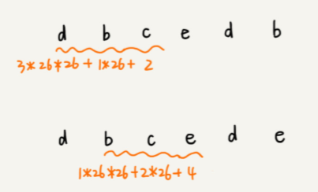
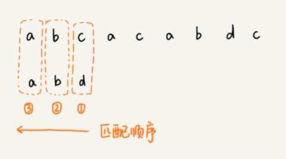
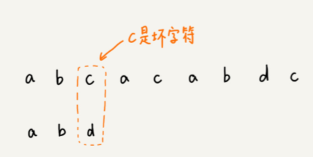
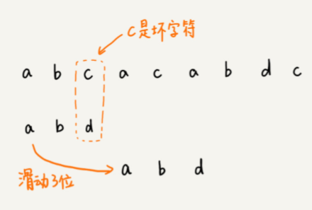
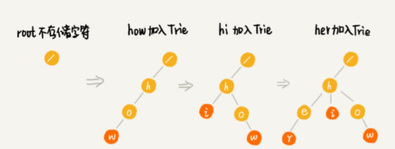

# 字符串

# 单模式串匹配：一个串跟一个串进行匹配

## 1.hash实现字符串匹配：BF,RK算法

### BF：时间复杂度$O(mn)$

暴力法。在A中查找B。n>m

主串：A，长度为n

模式串：B，长度为m

```java
int contains(String s, String m) {
    if (s == null || m == null || s.length() < 1 || s.length() < m.length()) 		return -1;	
    char[] str1 = s.toCharArray(), str2 = m.toCharArray();
    int i = 0, j = 0;
    while (i < str1.length && j < str2.length) {
        if (str[i] == str2[j]) {
            i++;
            j++;
        } else j = 0;
    }
    return j == str2.length ? i - j : -1;
}
```

**复杂度分析：**

如果模式串长度为 m，主串长度为 n，那在主串中，就会有 n-m+1 个长度为 m 的子串，我们只需要暴力地对比这 n-m+1 个子串与模式串，就可以找出主串 与模式串匹配的子串。

**实际开发中，是一个比较常用的字符串匹配算法**

1. 实际上，大部分模式串和主串都不会太长；一般不需要比较m个字符
2. 思想简单，代码简单不会出错

### RK

- 通过哈希算法对主串中的 n-m+1 个子串分别求哈希值，然后逐 个与模式串的哈希值比较大小。如果某个子串的哈希值与模式串相等，那就说明对应的子串和模式串匹配了
- 哈希值是一个数字，数字之间比较是否相等是非常快速的，所以模式串和子串比较的效率就提高了

**问题1：**

求hash值需要遍历子串中的每个字符，如何提高hash计算效率

**解决：**

- 假设要匹配的字符串的字符集中只包含 K 个字 符，用一个 K 进制数来表示一个子串，这个 K 进制数转化成十进制数，作为子串的哈希值

**举例：**

要处理的字符串只包含 a～z 这 26 个小写字母，用二十六进制来表示一个字符串。把 a～z 这 26 个字符映射到 0～25 这 26 个数字，a 就表示 0，b 就表示 1，以此类推，z 表示 25

cba = 'c' * 26 \* 26 + 'b' * 26 + 'a' * 1 = 2*26\*26 + 1\* 26 + 0 * 1 = 1353

相邻两个子串的hash值计算公式有规律：




相邻两个子串 s[i-1] 和 s[i]\(i 表示子串在主串中的起始位置，子串的长度都为 m). 

```
h[i] = 26*(h[i-1]-26^(m-1)*(s[i-1]-'a')) + (s[i+m-1]-'a'); 
其中, h[i]、h[i-1] 分别对应 s[i] 和 s[i-1] 两个子串的哈希值
```

-  26^(m-1) 可以通过查表的方法来提高效率，节省时间。

**复杂度分析：**

RK算法包含两部分：计算子串Hash值，hash值之间的比较

计算：一遍扫描，O（n）

比较：单次比较O（1），共比较n-m+1次，O（n)

整体：O(n)

**问题2：**

模式串很长，主串中子串很长，hash值过大超过Int范围。

- 刚刚的算法是没有散列冲突的。
- 允许冲突：冲突时再去比较字符串
- 此时的复杂度：最坏情况下O(m*n)

## 2.BM(KMP性能的3-4倍)

### 坏字符规则（bad character rule）

1. 从模式串的末尾往前倒着匹配，当某个字符没法匹配的时候。这个没有匹配的字符叫作坏字符（主串中的字符）。

   

   


2. 拿坏字符 c 在模式串中查找，发现模式串中并不存在这个字符，即字符 c 与模式 串中的任何字符都不可能匹配。此时，将模式串直接往后滑动三位，将模式串滑动 到 c 后面的位置，再从模式串的末尾字符开始比较。

   

3. 模式串中后一个字符 d，还是无法跟主串中的 a 匹配。**但是：**坏字符 a 在模式串中是存在的，模式串中下标是 0 的位置也是字符 a。此时，将模式串往后滑动两位，让两个 a 上下对齐，然后再从模式串的末尾字符开始，重新匹配。

**总结：**

- **当发生不匹配的时候，坏字符对应的模式串中的字符下标记作 si。如果坏字符在模式串中存在，我们把这个坏字符在模式串中的下标记作 xi。如果不存在，我们把 xi 记作 -1。那模式串 往后移动的位数就等于 si-xi。（注意，这里的下标，都是字符在模式串的下标）。**

- **如果坏字符在模式串里多处出现，那我们在计算 xi 的时候，选择靠后的那个，因为这样不会让模式串滑动过多，导致本来可能匹配的情况被滑动略过**

  

**复杂度分析：**

- 在好情况下的时间复杂度非常低，是 O(n/m)。

  比如，主串是 aaabaaabaaabaaab，模式串是 aaaa。每次比对，模式串都可以直接后移四位，所以，匹配具 有类似特点的模式串和主串的时候，BM 算法非常高效。

- 不过，单纯使用坏字符规则还是不够的。因为根据 si-xi 计算出来的移动位数，有可能是负数， 比如主串是 aaaaaaaaaaaaaaaa，模式串是 baaa。不但不会向后滑动模式串，还有可能倒退。 所以，BM 算法还需要用到“好后缀规则”。

**如何求xi：**


### 好后缀规则（good suffix shift）

当模式串滑动到图中的位置的时候，模式串和主串有 2 个字符是匹配的，倒数第 3 个字符发生了不匹配的情况。


**好后缀规则流程：**

- 把已经匹配的 bc 叫作好后缀，记作{u}。我们拿它在模式串中查找，如果找到了另一个跟 {u}相匹配的子串{u\*}，那我们就将模式串滑动到子串{u*}与主串中{u}对齐的位置。

  

- 如果好后缀在模式串中不存在可匹配的子串，那一步一步往后滑动模式串的过程中，只要 主串中的{u}与模式串有重合，那肯定就无法完全匹配。但是当模式串滑动到前缀与主串中{u}的 后缀有部分重合的时候，并且重合的部分相等的时候，就有可能会存在完全匹配的情况。

  

  

- 所以，针对这种情况，我们不仅要看好后缀在模式串中，是否有另一个匹配的子串，我们还要考 察好后缀的后缀子串，是否存在跟模式串的前缀子串匹配的。

- 某个字符串 s 的后缀子串，就是后一个字符跟 s 对齐的子串，比如 abc 的后缀子串就包 括 c, bc。所谓前缀子串，就是起始字符跟 s 对齐的子串，比如 abc 的前缀子串有 a，ab。我们 从好后缀的后缀子串中，找一个长的并且能跟模式串的前缀子串匹配的，假设是{v}，然后将 模式串滑动到如图所示的位置。

  

### 用哪个：

- 分别计算好后缀和坏字符往后滑动的位数，然后取两个数中大的，作为模式串往后滑动的位数。
- 这种处理方法还可以避免我们前面提到的，根据坏字符规则，计算得到的往后滑动的 位数，有可能是负数的情况。

## 3.KMP

KMP 算法就是在试图寻找一种规律：在模式串和主串匹配的过程中，当遇到坏字符后，对于已 经比对过的好前缀，能否找到一种规律，将模式串一次性滑动很多位？

- 只需要拿好前缀本身，在它的后缀子串中，查找最长的那个可以跟好前缀的前缀子串匹配 的。假设最长的可匹配的那部分前缀子串是{v}，长度是 k。我们把模式串一次性往后滑动 j-k 位，相当于，每次遇到坏字符的时候，我们就把 j 更新为 k，i 不变，然后继续比较。

  

## 4.Manacher：找到字符串A的最长回文子串


# 多模式串匹配

## Trie树:搜索引擎的关键词提示

- 专门处理字符串匹配的数据结构，用来解决在一组字符串集合中快速查找某个字符串的问题。
- 本质就是利用字符串之间的公共前缀，将重复的前缀合并在一起

**构造过程：**

1. root节点不包含任何信息，每个节点表示一个字符串中的字符，从根节点到子节点的路径表示一个字符串

2. 每一步都向树中插入一个字符串，当所有的字符串都插入完成后，Trie树就构造好了

   


**实现：**

Trie树主要有两个操作

1. 将字符串集合构造成Tris树
2. 在树中查询一个字符串

```java
class TrieNode {
    int path; // how many strings are using this node
    int end; // how many strings are ended with this node
    TrieNode[] map; // default size 26, point to chars
    TrieNode() {
        path = 0;
        end = 0;
        map = new TrieNode[26];
    }
}

class Trie {
    TrieNode root;

    Trie() {
        root = new TrieNode();
    }

    void insert(String word) {
        if (word == null) return;
        char[] chs = word.toCharArray();
        TrieNode node = root;
        int index = 0;
        for (int i = 0; i < chs.length; i++) {
            index = chs[i] - 'a';
            if (node.map[index] == null) {
            	node.map[index] = new TrieNode();
            }
            node = node.map[index];
            node.path++;
        }
        node.end++;
    }

    void delete(String word) {
        if (!search(word)) return;
        char[] chs = word.toCharArray();
        TrieNode node = root;
        int index = 0;
        for (int i = 0; i < chs.length; i++) {
            index = chs[i] - 'a';
            if (--node.map[index].path == 0) {
                node.map[index] = null;
                return;
            }
            node = node.map[index];
        }
        node.end--;
    }

    boolean search(String word) {
        if (word == null) return false;
        char[] chs = word.toCharArray();
        TrieNode node = root;
        int index = 0;
        for (int i = 0; i < chs.length; i++) {
            index = chs[i] - 'a';
            if (node.map[index] == null) return false;
            node = node.map[index];
        }
        return node.end > 0;
    }

    int prefixNumber(String pre) {
        if (pre == null) return 0;
        char[] chs = pre.toCharArray();
        int index = 0;
        for (int i = 0; i < chs.length; i++) {
            index = chs[i] - 'a';
            if (node.map[index] == null) return 0;
            node = node.map[index];
        }
        return node.path;
    }
}
```

时间复杂度：O（n)

场景要求：

1. 字符集不能太大，否则：查询，插入效率低
2. 重合前缀较多，否则：空间消耗大

应用：

1. 动态数据高效操作，精确匹配：hash 红黑树
2. 适合查找前缀匹配：比如自动输入补全（比如输入法、IDE、浏览器网址）
3. 最接近的匹配查找

## AC自动机

# 练习题：

## 1.字符串拼接（贪心策略）

（coding主要考察1：算法的优化 2：代码写的怎么样 3：贪心算法证伪简单，证明正确难，所以面试一般不考）

**【题目】**

给定数组中，每个元素都是字符串。找出一种拼接形式，使得拼出的字符串字典序最小。

**思路：**

**1：不能用先对字符串排序再拼接的方式做。**

e.g.  b  ba 是数组中的元素，其中b的字典序比ba小。但使得字典序最小的拼接方式应该是bab而不是bba。

**2：定义一个 * 这样的拼接运算符，**

把字符串看成是数字。a*b = a·move(b) + b.  move（）函数就相当于把a左移b的长度然后再连接上b。

e.g. 234*789 = 234 ·1000 + 789

**3：根据上述定义，证明一个传递性：**

①： a*b < b*a  ==》 a·m(b) + b < b·m(a) + a

②： b*c < c*b  ==》 b·m(c) + c < c·m(b) + b

则推出

③： a*c < c*a  ==》 a·m(c) + c < c·m(a) + a

则推出

证明：( ① - b )·c ==》 a·m(b)·c < (b·m(a) + a - b)·c      ④

   ( ② - b )·a ==》 (b·m(c) + c - b)·a < c·m(b)·a       ⑤

由④、⑤式发现④式的左边和⑤式的右边表达式一样，所以结合④、⑤式可得到

(b·m(c) + c - b)·a < (b·m(a) + a - b)·c 化简后可得③式。

4：.png)


Comparator类是指：若a<b就返回-1则按升序排列，否则按降序排列。

(a + b).compareTo(b + a)是指，当 a+b < b+a 时返回-1，否则返回1，相等返回0.

所以上述代码会按照升序排列。

假设按照上述规律排列好然后将排列好的数组直接连接起来的结果是：LM1M2M3.....MkR.若假设任意交换两个元素得到的字典序都比此时的字典

序大。则能够证明一开始的排序策略是正确的。

**证明：**

此时LM1<M1L 。所以

.png)


LM1M2M3.....MkR 《 M1LM2M3.....MkR 《 M1M2.....MkLR 《 M1M2M3.....MkRL，此时R再往回移动。因为MkR 《 RMk，所以最后 《 RM1……MkL

## 2.翻转字符串

### 2.1 翻转函数

```java
public static void reverse(char[] s, int begin, int end) {
    if (s == null || s.length <= 1 || end - begin == 0) {
        return;
    }
    while (begin < end) {
        char tmp = s[begin];
        s[begin] = s[end];
        s[end] = tmp;
        begin++;
        end--;
    }
}    
```

- 去除首尾空格，并缩减单次之间为只有一个空格

```java
public static String removeDupEmpty(String s) {
    s = s.trim();
    if (s == null || s.length() <= 0) {
        return s;
    }
    StringBuilder ret = new StringBuilder();
    int start = 0, end = 0, len = s.length();
    while (start < len) {
        char c = s.charAt(end);
        if (c != ' ') {
            ret.append(c);
            end++;
            start = end;
        } else {
            if(end - start == 0) {
                ret.append(" ");
            }
            end++;
        }
    }
    return ret.toString();
}
```

### 2.2 翻转字符串中的单词顺序："hello world."  --> "world. hello"

1. 翻转两次就会得到原来的样子。
2. 所以先翻转整个字符串，导致顺序相反。再对每个单词进行内部翻转，使得单词顺序与原来一致。
3. 这里注意：找到单词边界的写法：begin, end用来维护一个单词的边界（因为前后可能有多个空格）。头是空格就首尾都++，否则如果尾是空格或者字符串末尾就翻转，否则尾++。

```java
public static String reverseWords(String str) {
    if (str == null || str.length() <= 0) {
        return str;
    }
    char[] chr = str.toCharArray();
    int len = chr.length;
    reverse(chr,0, len - 1);
    int begin = 0, end = 0;
    while (begin <= len) {
        if (begin == len || chr[begin] == ' ') {
            begin++;
            end++;
        } else if(end == len || chr[end] == ' ') {
            reverse(chr, begin, end - 1);
            begin = ++end;
        } else {
            end++;
        }
    }
    return String.valueOf(chr);
}

public static void reverse(char[] s, int begin, int end) {
    if (s == null || s.length <= 1 || end - begin == 0) {
        return;
    }
    while (begin < end) {
        char tmp = s[begin];
        s[begin] = s[end];
        s[end] = tmp;
        begin++;
        end--;
    }
}
```

### 2.3 左旋转字符串：将字符串左边n位移至右边

一样的思路：翻转两次回到原位。所以分别翻转左边的n位，右边的len-n位。然后翻转整体。

注意：n的取值：=0，<0，>len(字符串长度)

```java
public String LeftRotateString(String str,int n) {
    if (str == null || str.length() <= 0 || n == 0) {
        return str;
    }
    char[] s = str.toCharArray();
    int len = s.length;
    n %= len;
    if (n > 0) {
        reverse(s, 0, n - 1);
        reverse(s, n, len - 1);
    } else {
        reverse(s, 0, len - n - 1);
        reverse(s, len - n, len - 1);
    }
    reverse(s, 0, s.length - 1);
    return String.valueOf(s);
}
```

## 3.字符串转换为整数

- 因为整数范围有限，在遍历过程中匹配，有不匹配的直接返回0即可.
- 其中，给定字符串包括数字、字母、符号、可以为空

```
public static int StrToInt(String str) {
        if (str == null || str.length() <= 0) {
            return 0;
        }
        char[] a = str.toCharArray();
        int sign = 1;
        int beginPos = 0, ans = 0;
        if (a[0] == '-' || a[0] == '+') {
            sign = (a[0] == '-' ? -1 : 1);
            beginPos++;
        }
        for (int i = beginPos; i < a.length; i++) {
            if (a[i] < 48 || a[i] > 57) {
                return 0;
            }
            if (ans > Integer.MAX_VALUE/10 || (ans == Integer.MIN_VALUE/10 && a[i] - '0' > 7)) {
                return 0;
            }
            ans = ans * 10 + a[i] - '0';
        }
        return sign * ans;
    }
```

- 给定字符串包含各种输入：前面有空格、字符串中包含其他字母符号。
- 如果空格之后的字符不是数字返回0，否则只解析是数字的这部分。例如：“436 hello” --> "436"
- 如果字符串超过整形返回，返回相应的最大整形

```java
public static int myAtoi(String str) {
    if (str == null || str.length() <= 0) {
        return 0;
    }
    char[] a = str.toCharArray();
    int sign = 1, i = 0, ans = 0;
    while (i < a.length && a[i] == ' ') {
        i++;
    }
    if (i < a.length && (a[i] == '-' || a[i] == '+')) {
        sign = (a[i] == '-' ? -1 : 1);
        i++;
    }
    while (i < a.length && a[i] >= '0' && a[i] <= '9') {
        if (ans > Integer.MAX_VALUE / 10 || (ans == Integer.MAX_VALUE / 10 && a[i] - '0' > 7)) {
            if (sign == 1) {
                return Integer.MAX_VALUE;
            } else {
                return Integer.MIN_VALUE;
            }
        }
        ans = ans * 10 + a[i] - '0';
        i++;
    }
    return sign * ans;
}
```

## 4.判断A是否是B的子树

- DFS

```java
boolean isSameTree(Node t1, Node t2) {
    return t1 == null && t2 == null
      || t1 != null && t2 != null && t1.value == t2.value && isSameTree(t1.left, t2.left) && isSameTree(t1.right, t2.right);
}

boolean isSubtree(Node t1, Node t2) { // t2 is a subtree of t1?
    return isSameTree(t1, t2) 
      || isSameTree(t1.left, t2) 
      || isSameTree(t1.right, t2);
}
```

- 用先序遍历将A,B序列化为字符串，用KMP去匹配子串

```java
boolean isSubtree(Node t1, Node t2) {// t2 is a subtree of t1?
    String t1Str = serialByPre(t1);
    String t2Str = serialByPre(t2);
    return contains(t1Str, t2Str) != -1;
}

String serialByPre(Node node) {
    if (node == null) return "#";
    return node.value + "!" + serialByPre(node.left) + serialByPre(node.right);
}
```

## 5.添加最少的字符让它变回文

用Manacher得到到末尾的R，和C，逆序复制0-L放到末尾就是结果

```java
String shortestEnd(String str) {
    //same as maxLcpsLength()
    for (int i = 0; i < charArr.length; i++) {
    	//same as maxLcpsLength()
        if (R == charArr.length) {
            maxContainsEnd = r[i];
          	break;
        }
    }
    char[] res = new char[str.length() - maxContainsEnd + 1];
    for (int i = 0; i < res.length; i++) {
      res[res.length - 1 - i] = charArr[i * 2 + 1];
    }
    return String.valueOf(res);
}
```

## 6.表示数字的字符串

请实现一个函数用来判断字符串是否表示数值（包括整数和小数）。

例如，字符串`"+100"`,`"5e2"`,`"-123"`,`"3.1416"`和`"-1E-16"`都表示数值。

但是`"12e"`,`"1a3.14"`,`"1.2.3"`,`"+-5"`和`"12e+4.3"`都不是。

**注意**:

1. 小数可以没有整数部分，例如.123等于0.123；
2. 小数点后面可以没有数字，例如233.等于233.0；
3. 小数点前面和后面可以有数字，例如233.666;
4. 当e或E前面没有数字时，整个字符串不能表示数字，例如.e1、e1；
5. 当e或E后面没有整数时，整个字符串不能表示数字，例如12e、12e+5.4;

#### 样例：

```
输入: "0"

输出: true
```

```
public class Solution {
    int idx = 0;
    public boolean isNumeric(char[] str) {
        if(str == null || str.length < 1) {
            return false;
        }
        boolean numeric = scanInteger(str);
        
        if(idx < str.length && str[idx] == '.') {
            idx++;
            numeric = scanUnsignedInteger(str) || numeric;
        }
        if(idx < str.length && (str[idx] == 'E' || str[idx] == 'e')){
            idx++;
            numeric = numeric && scanInteger(str);
        }
        return numeric && (idx == str.length);
    }
    
    private boolean scanUnsignedInteger(char[] str){
        int start = idx;
        while (idx < str.length && str[idx] >= '0' && str[idx] <= '9') {
            idx++;
        }
        return start < idx;
    }
    
    private boolean scanInteger(char[] str){
        if(idx < str.length && (str[idx] == '+' || str[idx] == '-')) {
            idx++;
        }
        return scanUnsignedInteger(str);
    }
}
```

