# Hash表，跳表

# 一：散列表(word中单词拼写检查)

散列表用的是数组支持按照下标随机访问数据的特性，是数组的一种扩展。如果没有数组，就没有散列表。

## 散列函数

三点散列函数设计的基本要求：

1. 散列函数计算得到的散列值是一个非负整数；
2. 如果 key1 = key2，那 hash(key1) == hash(key2)；
3. 如果 key1 ≠ key2，那 hash(key1) ≠ hash(key2)。

## 散列冲突

散列冲突的解决方法有两类，开放寻址法（open addressing）和链表法（chaining）。

### 1. 开放寻址法

开放寻址法的核心思想是，如果出现了散列冲突，我们就重新探测一个空闲位置，将其插入。

#### 1.1 线性探测

**插入：**

插入数据时，如果某个数据经过散列函数散列之后，存储位置已经被占用了， 我们就从当前位置开始，依次往后查找，看是否有空闲位置，直到找到为止。

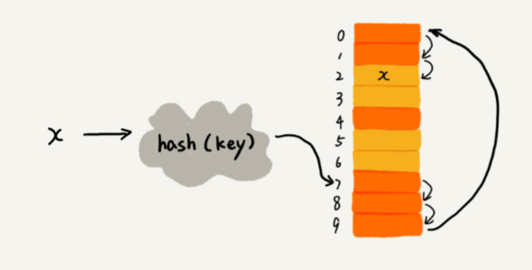


**查找：**

通过散列函数求出要查找元素的键值对应的散列值，然后比较数组中下标为散列值的元素和要查找的元素。如果相等，则说明就是我们要找的元素；否则就顺序往后依次查找。如果**遍历到数组中的空闲位置**，还没有找到，就说明要查找的元素并没有在散列表中。

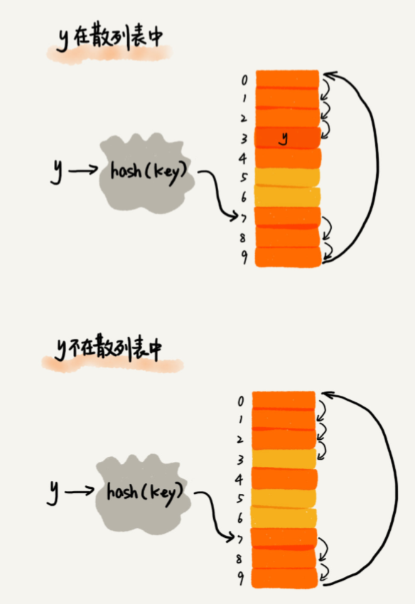


#### 1.2 二次探测

跟线性探测很像:

线性探测每次探测的步长是 1，那它探测的下标序列就是 hash(key)+0，hash(key)+1，hash(key)+2……

二次探测探测的步长就变成了原来的“二次 方”，也就是说，它探测的下标序列就是 hash(key)+0，hash(key)+$1^2$ ，hash(key)+$2^2​$ 

#### 1.3 双重散列

不仅要使用一个散列函数。我们使用一组散列函数 hash1(key)， hash2(key)，hash3(key)……

我们先用第一个散列函数，如果计算得到的存储位置已经被占用， 再用第二个散列函数，依次类推，直到找到空闲的存储位置。

### 2.链表法

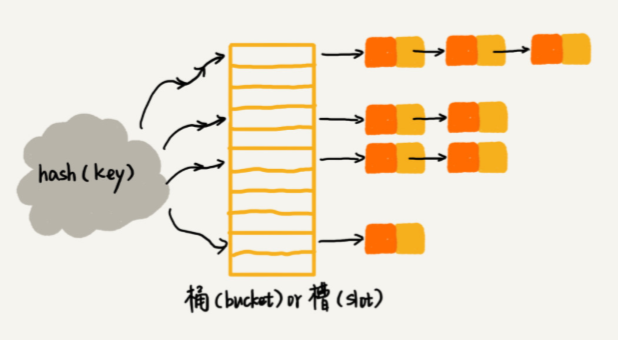


- 插入的时候，我们只需要通过散列函数计算出对应的散列槽位，将其插入到对应链表中即可， 所以插入的时间复杂度是 O(1)。

- 查找、删除一个元素时，我们同样通过散列函数计算出对应的槽，然后遍历链表查找或者删除

  操作的时间复杂度跟链表的长度 k 成正比，也就是 O(k)。

## Word 文档中单词拼写检查功能是如何实现的？

常用的英文单词有 20 万个左右，假设单词的平均长度是 10 个字母，平均一个单词占用 10 个 字节的内存空间，那 20 万英文单词大约占 2MB 的存储空间，就算放大 10 倍也就是 20MB。
对于现在的计算机来说，这个大小完全可以放在内存里面。所以我们可以用散列表来存储整个英 文单词词典。
当用户输入某个英文单词时，我们拿用户输入的单词去散列表中查找。如果查到，则说明拼写正 确；如果没有查到，则说明拼写可能有误，给予提示。借助散列表这种数据结构，我们就可以轻 松实现快速判断是否存在拼写错误。

## 散列表练习题

1. 假设我们有 10 万条 URL 访问日志，如何按照访问次数给 URL 排序？ 
   遍历 10 万条数据，以 URL 为 key，访问次数为 value，存入散列表，同时记录下访问次数的 最大值 K，时间复杂度 O(N)。 
     如果 K 不是很大，可以使用桶排序，时间复杂度 O(N)。如果 K 非常大（比如大于 10 万）， 就使用快速排序，复杂度 O(NlogN)。 
2. 有两个字符串数组，每个数组大约有 10 万条字符串，如何快速找出两个数组中相同的字符 串？ 
   以第一个字符串数组构建散列表，key 为字符串，value 为出现次数。再遍历第二个字符串数 组，以字符串为 key 在散列表中查找，如果 value 大于零，说明存在相同字符串。时间复杂度 O(N)。 

## 如何打造一个工业级水平的散列表？

散列表的查询效率与：散列函数、装载因子、散列冲突有关。

设计不好的散列函数会导致攻击者据此设计攻击数据，造成DDOS

**装载因子：**散列表中需要有一定比例的空闲槽位。用装载因子（load factor）来表示空位的多少。

` 散列表的装载因子 = 填入表中的元素个数 / 散列表的长度`

### 1. 设计要求

1. 散列函数的设计不能太复杂
2. 散列值要 随机 且 均匀分布
3. 其他：关键字的长度、特点、分布、散列表大小

### 2. 常见方法

直接寻址法、平方取中法、折叠法、随机数法

### 3. 装载因子过大了怎么办？

装载因子越大，散列表中元素越多，空闲位置越少，散列冲突的概率就越大

- 动态扩容：均摊复杂度O（1）。
- **装载因子阈值**的设置要权衡时间、空间复杂度。如果内存空间不紧张，对执行效率要求很高，可以降低负载因子的阈值；相反，如果内存空间紧张，对执行效率要求又不高，可以增加负载因子的值，甚至可以大于 1。

### 4. 如何避免低效地扩容？

即避免装载因子在阈值边上动荡地增减，导致动荡地扩容与缩容。这样**“一次性的扩容”**很慢

- 将扩容操作穿插在插入操作的过程中，分批完成。当装载因子触达阈值之后，我们只申请新空间，但并不将老的数据搬移到新散列表中。

- 当有新数据要插入时，我们将新数据插入新散列表中，并且从老的散列表中拿出一个数据放入到 新散列表。每次插入一个数据到散列表，我们都重复上面的过程。经过多次插入操作之后，老的 散列表中的数据就一点一点全部搬移到新散列表中了。这样没有了集中的一次性数据搬移，插入 操作就都变得很快了。

  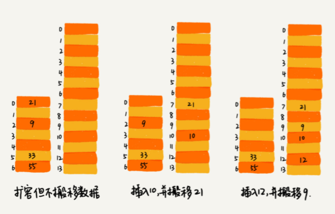

- 对于查询操作，为了兼容了新、老散列表中的数据，我们先从新 散列表中查找，如果没有找到，再去老的散列表中查找。

### 5. 如何选择冲突解决方法？

1. 开放寻址法
   **优点：**
2. 散列表中的数据都存储在数组中，可以有效地利用 CPU 缓存加快查询速度。
3. 这种方法实现的散列表，序列化起来比较简单。链表法包含指针，序列化起来就没那么容易。

  **缺点：**

1. 删除数据的时候比较麻烦，需要特殊标记已经删除掉的数据。
2. 所有数据都存储在一个数组中，冲突的代价更高。所以装载因子的上限不能太大。导致这种方法比链表法更浪费内存空间。

  **总结：**

  当**数据量比较小、装载因子小**的时候，适合采用开放寻址法。这也是 Java 中的ThreadLocalMap使用开放寻址法解决散列冲突的原因。

1. 链表法 

  **优点：**

1. 链表法对内存的利用率比开放寻址法要高。

   因为链表结点可以在需要的时候再创建，并不需要像开放寻址法那样事先申请好。实际上，这一点也是我们前面讲过的链表优于数组的地方。

2. 对大装载因子的容忍度更高。

   开放寻址法只能适用装载因子小于 1 的 情况。接近 1 时，就可能会有大量的散列冲突，导致大量的探测、再散列等，性能会下降很多。

   但是对于链表法来说，只要散列函数的值随机均匀，即便装载因子变成 10，也就是链表的长度变长了而已，虽然查找效率有所下降，但是比起顺序查找还是快很多。

3. 动态改变

   对链表法稍加改造，可以实现一个更加高效的散列表。

   即将链表法中的链表改造为其他高效的动态数据结构，比如跳表、红黑树。这样，即便出现散列冲突，极端情况 下，所有的数据都散列到同一个桶内，那最终退化成的散列表的查找时间也只不过是 O(logn)。 这样也就有效避免了前面讲到的散列碰撞攻击。

  **缺点：**

1. 耗内存

   链表因为要存储指针，所以对于比较小的对象的存储，比较消耗内存。

   如果存储大对象，即要存储的对象的大小远远大于一个指针的大小（4 个 字节或者 8 个字节），那链表中指针的内存消耗在大对象面前就可以忽略了。

2. 不能更好利用缓存

   因为链表中的结点是零散分布在内存中 的，不是连续的，所以对 CPU 缓存是不友好的，这方面对于执行效率也有一定的影响。

  **总结：**

  基于链表的散列冲突处理方法比较适合**存储大对象、大数据量**的散列表，而 且，比起开放寻址法，它更加灵活，支持更多的优化策略，比如用红黑树代替链表。Java 中 LinkedHashMap 就采用了链表法解决冲突， 

### 6.工业级散列表举例分析

1. 初始大小 

   HashMap 默认的初始大小是 16，当然这个默认值是可以设置的，如果事先知道大概的数据量 有多大，可以通过修改默认初始大小，减少动态扩容的次数，这样会大大提高 HashMap 的性 能。

2. 装载因子和动态扩容

   最大装载因子默认是 0.75，当 HashMap 中元素个数超过 0.75*capacity（capacity 表示散列 表的容量）的时候，就会启动扩容，每次扩容都会扩容为原来的两倍大小。

3. 散列冲突解决方法

  HashMap 底层采用链表法来解决冲突。即使负载因子和散列函数设计得再合理，也免不了会出 现拉链过长的情况，一旦出现拉链过长，则会严重影响 HashMap 的性能。
  于是，在 JDK1.8 版本中，为了对 HashMap 做进一步优化，我们引入了红黑树。而当链表长度 太长（默认超过 8）时，链表就转换为红黑树。我们可以利用红黑树快速增删改查的特点，提高 HashMap 的性能。当红黑树结点个数少于 8 个的时候，又会将红黑树转化为链表。因为在数据 量较小的情况下，红黑树要维护平衡，比起链表来，性能上的优势并不明显。

4. 散列函数

散列函数的设计并不复杂，追求的是简单高效、分布均匀。

```java
int hash(Object key) {    
    int h = key.hashCode()；   
    return (h ^ (h >>> 16)) & (capitity -1); //capicity 表示散列表的大小 
}
```

其中，hashCode() 返回的是 Java 对象的 hash code。比如 String 类型的对象的 hashCode() 就是下面这样：

### 7.何为一个工业级的散列表？工业级的散列表应该具有哪些特性？

要求：

1. 支持快速的查询、插入、删除操作；
2. 内存占用合理，不能浪费过多的内存空间；
3. 性能稳定，极端情况下，散列表的性能也不会退化到无法接受的情况。

如何实现:

1. 设计一个合适的散列函数；
2. 定义装载因子阈值，并且设计动态扩容策略；
3. 选择合适的散列冲突解决方法

## 为什么散列表和链表经常一起用

### 1. LRU 缓存淘汰算法

链表实现：时间复杂度 O(n)。散列表：O(1)。

**链表实现：**

1. 维护一个按照访问时间距离现在从大到小有序排列的链表。即：尾部是最近访问过的

2. 淘汰：缓存大小有限，缓存空间不够时要淘汰，此时直接将链表头部的结点删除。

3. 缓存：先在链表中查找。如果没有找到，则直接将数据放到链表的尾部；如果找到了，把它移动到链表的尾部。

   共有：添加，删除，查找三种操作。且都需要查找。单链表中查找数据需要遍历，时间复杂是 O(n)。

**散列表 + 链表：**

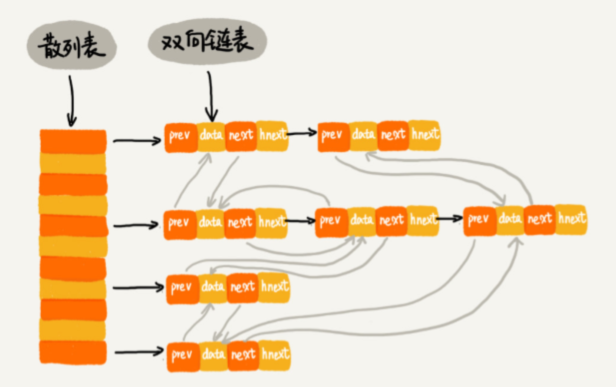


1. 每个结点会在两条链中。一个链是LRU的双向链表，另一个是散列表的拉链。前驱和后继指针为了LRU链表操作方便中，hnext 指针是为了将结点串在散列表的拉链中。保存两个指针：LRU双向链表的头和尾
2. **查找缓存：**散列表中查找数据的时间复杂度接近 O(1)，找到数据之后，还需要将它移动到双向链表的尾部。
3. **删除：**O(1)时间找到数据所在的结点，双向链表中通过前驱指针 O(1) 时间复杂度获取前驱结点，删除只需要 O(1) 的时间复杂度。
4. **添加：** 先看这个数据是否已经在缓存中。如果已经在其中，需要将其移动到双向链表的尾部；如果不在其中，还要看缓存有没有满。如果满了，则将双向链表头部的结点删除，然后再将数据放到链表的尾部；如果没有满，就直接将数据放到链表的尾部。

### 代码实现

- 使用LinkedList

```java
class LRUCache {
    int capacity;
    LinkedHashMap<Integer, Integer> lru;

    public LRUCache(int capacity) {
        this.capacity = capacity;
        lru = new LinkedHashMap<Integer, Integer>(this.capacity, 0.75F, true)		{
            @Override
            protected boolean removeEldestEntry(Map.Entry eldest) {
                return size() > capacity;
            }
        };
    }

    public int get(int key) {
        Integer val = lru.get(key);
        if (val == null) {
            return -1;
        }
        return val;
    }

    public void put(int key, int value) {
        lru.put(key,value);
    }
}
```

- 使用HashMap + 双向链表

```java
/**
 * @Author liu Ruiqing
 * @Description  自定义节点类型 + hashmap实现。设定head,tail都是空，为dummyhead,head指针之后的指针是最老的，tail之前的节点是最新的。容量不够时删除head之后的（与linkedhashmap一致）
 * @Date 2018/12/19
 * @Param
 * @return
 **/
class LRUCacheRaw {
    private class Node{
        Integer key, value;
        Node before, after;

        Node(int key, int value) {
            this.key = key;
            this.value = value;
        }

        Node() {
        }
    }

    private static final int INITIAL_CAPACITY = ( 1 << 4);
    private int capacity, count;
    private Node head, tail;
    private HashMap<Integer, Node> map;

    public LRUCacheRaw() {
        this.capacity = INITIAL_CAPACITY;
        this.init(this.capacity);
    }

    public LRUCacheRaw(int capacity) {
        this.capacity = capacity;
        this.init(this.capacity);
    }

    private void init (int capacity) {
        this.count = 0;
        map = new HashMap<>(this.capacity);

        this.head = new Node();
        this.tail = new Node();
        head.before = null;
        head.after = tail;
        tail.before = head;
        tail.after = null;
    }

    public int get(int key) {
        Node node = map.get(key);
        if (node == null) {
            return -1;
        }
        afterGet(node);
        return node.value;
    }

    public void put(int key, int value) {
        Node node = map.get(key);
        //map中没有这一对
        if (node == null) {
            Node newNode = new Node(key,value);

            map.put(key, newNode);
            this.addToTail(newNode);

            count++;

            // 超过初始容量，则删除尾节点
            if (this.count > this.capacity) {
                Node del = removeHead();
                this.map.remove(del.key);
                count--;
            }
        } else {
            // map中有，修改这个值并移至链表末尾
            node.value = value;
            afterGet(node);
        }
    }

    //实现节点移动到末尾：先删除，再加入
    private void afterGet(Node e) {
        if (e != tail) {
            removeNode(e);
            addToTail(e);
        }
    }

    //删除节点的时候，将其引用置为null，便于前后节点被删除后GC
    private void removeNode(Node e) {
        Node b = e.before, a = e.after;
        b.after = a;
        a.before = b;
        e.before = null;
        e.after = null;
    }

    //将该节点加入链表尾部
    private void addToTail(Node e) {
        e.before = tail.before;
        e.after = tail;

        tail.before.after = e;
        tail.before = e;
    }

    //容量不够时删除最老的节点，并返回Key,便于在hashmap中将该节点删除。
    private Node removeHead() {
        Node res = head.after;
        this.removeNode(head.after);
        return res;
    }
}
```

### Redis中LRU实现


### 2. Redis 有序集合:跳表

Redis 的有序集合是使用跳表来实现的，跳表可以看作一种改进版的链表。Redis 有序集合不仅使用了跳表，还用到了散列表。

在有序集合中，每个成员对象有两个重要的属性，key（键值）和score（分值）。不仅会通过 score 来查找数据， 还会通过 key 来查找数据。

Redis 有序集合的操作就是下面这样：

1. 添加一个成员对象；
2. 按照键值来删除一个成员对象；
3. 按照键值来查找一个成员对象；
4. 按照分值区间查找数据，比如查找积分在 [100, 356] 之间的成员对象；
5. 按照分值从小到大排序成员变量；

如果**按照分值**将成员对象组织成跳表的结构，那**按照键值**来删除、查询成员对象就会很 慢，解决方法与 LRU 缓存淘汰算法的解决方法类似。我们可以再按照键值构建一个散列表，这 样按照 key 来删除、查找一个成员对象的时间复杂度就变成了 O(1)。

### 3. Java中LinkedHashMap

用到了散列表和链表两种数据结构。可以：按照插入顺序、访问打印结果

[参考](../../java/集合类/MAP.md)

## 如何防止数据库中的用户信息被脱库？

在实际的开发中，该如何用哈希算法解决问题。

### **1.一个优秀的哈希算法需要满足的几点要求：**

- 从哈希值不能反向推导出原始数据（所以哈希算法也叫单向哈希算法）；
- 对输入数据非常敏感，哪怕原始数据只修改了一个 Bit，最后得到的哈希值也大不相同；
- 散列冲突的概率要很小，对于不同的原始数据，哈希值相同的概率非常小；
- 哈希算法的执行效率要尽量高效，针对较长的文本，也能快速地计算出哈希值。

### **2.hash应用：**

安全加密、唯一标识、数据校验、散列函数、负载均衡、数据分片、分布式存储

### 应用一：安全加密 

MD5：消息摘要算法

SHA：安全散列算法

### 应用二：唯一标识

存储图片时存储图片的hash值---进一步提高效率：存储 “ 路径+hash值”

### 应用三：数据校验 

BT下载：对 100 个文件块分别取哈希值，并且保存在种子文件中。当文件块下载完之后，通过相同的哈希算法，对下载好的文件块逐一求哈希值，然后跟种子文件中保存的哈希值比对。如果不同，说明这个文件块不完整或者被篡改了，需要再重新从其他宿主机器上下载这个文件块。

### 应用四：散列函数

相对哈希算法的其他应用，散列函数对于散列算法：

- 对冲突，能否反向解密要求低
- 对散列后的值是否能平均分布，散列函数执行的快慢要求高

所以：散列函数用的算法**简单，高效**

### 如何防止脱库

脱库原因：有些人密码太简单，容易被猜中

防止：维护一个常用密码的字典表，把字典中的每个密码用哈希算法计算哈希值，然后拿哈希值跟脱库后的密文比对。如果相同，**基本上就可以认为**，这个加密之后的密码对应的明文就是字典中的这个密码。（基本：因为根据我们前面的学， 哈希算法存在散列冲突，也有可能出现，尽管密文一样，但是明文并不一样的情况。）
​	针对字典攻击，我们可以引入一个盐（salt），跟用户的密码组合在一起，增加密码的复杂度。 我们拿组合之后的字符串来做哈希算法加密，将它存储到数据库中，进一步增加破解的难度。

## 哈希算法在分布式系统中有哪些应用？

### 应用五：负载均衡 

负载均衡算法：轮询、最少链接、源地址散列 

会话粘滞 （session sticky）的负载均衡算法：在同一个客户端上，在一次会话中的所有请求都路由到同一个服务器上。

```
public class IpMap
{
    // 待路由的Ip列表，Key代表Ip，Value代表该Ip的权重
    public static HashMap<String, Integer> serverWeightMap = 
            new HashMap<String, Integer>();
    
    static
    {
        serverWeightMap.put("192.168.1.101", 1);
        serverWeightMap.put("192.168.1.102", 2);
        serverWeightMap.put("192.168.1.103", 3);
        serverWeightMap.put("192.168.1.114", 4);
    }
}
```

#### **1. 轮询（Round Robin）**

1. 按顺序轮询

   将请求按照顺序轮流的分配到服务器上,均衡的对待每一台后端的服务器,不关心服务器的的连接数和负载情况.**适合服务器硬件配置相同的场景。**  

   - 优点：每台服务器的请求数目相同；
   - 缺点：服务器压力不一样，不适合服务器配置不同的情况；为了保证pos变量修改的互斥性，需要引入重量级的悲观锁synchronized，这将会导致该段轮询代码的并发吞吐量发生明显的下降

   ```java
   public class RoundRobin
   {
       private static Integer pos = 0;
       public static String getServer()
       {
           // 重建一个Map，避免服务器的上下线导致的并发问题
           Map<String, Integer> serverMap = 
                   new HashMap<String, Integer>();
           serverMap.putAll(IpMap.serverWeightMap);
           
           // 取得Ip地址List
           Set<String> keySet = serverMap.keySet();
           ArrayList<String> keyList = new ArrayList<String>();
           keyList.addAll(keySet);
           
           String server = null;
           synchronized (pos)
           {
               if (pos > keySet.size())
                   pos = 0;
               server = keyList.get(pos);
               pos ++;
           }
           return server;
       }
   }
   ```

   1. 由于serverWeightMap中的地址列表是动态的，随时可能有机器**上线、下线或者宕机**，因此为了避免可能出现的并发问题，方法内部新建局部变量serverMap，先将serverMap中的内容复制到线程本地，以避免被多个线程修改。
   2. 引入新的问题：复制以后serverWeightMap的修改无法反映给serverMap，也就是说这一轮选择服务器的过程中，新增服务器或者下线服务器，负载均衡算法将无法获知。新增无所谓，如果有服务器下线或者宕机，那么可能会访问到不存在的地址。因此，**服务调用端需要有相应的容错处理，比如重新发起一次server选择并调用**。
   3. 对于当前轮询的位置变量pos，为了保证服务器选择的顺序性，需要在操作时对其加锁，**使得同一时刻只能有一个线程可以修改pos的值**，否则当pos变量被并发修改，则无法保证服务器选择的顺序性，甚至有可能导致keyList数组越界。

2. 随机轮询

   使用系统随机函数，根据后端服务器列表的大小值来随机选择其中一台进行访问。由概率统计理论可以得知：**随着调用量的增大，其实际效果越来越接近于平均分配流量到每一台后端服务器，也就是轮询的效果。** 

   ```java
   public class Random
   {
       public static String getServer()
       {
           // 重建一个Map，避免服务器的上下线导致的并发问题
           Map<String, Integer> serverMap = 
               new HashMap<String, Integer>();
           serverMap.putAll(IpMap.serverWeightMap);
   
           // 取得Ip地址List
           Set<String> keySet = serverMap.keySet();
           ArrayList<String> keyList = new ArrayList<String>();
           keyList.addAll(keySet);
   
           java.util.Random random = new java.util.Random();
           int randomPos = random.nextInt(keyList.size());
   
           return keyList.get(randomPos);
       }
   }
   ```

#### **2. 最少连接数（Least Connections ）**

即每次选择连接数最小的`Server`，当最小的`Server`有多个时则使用加权轮询选择其中一个 

#### **3. 源地址哈希（Hash）法** 

轮询算法中，一个客户端的多次请求，每次落到的`Server`很大可能是不同的，如果这是一台缓存服务器，当系统繁忙时，主从延迟带来的同步缓慢，可能就造成了同一客户端两次访问得到不同的结果。解决方案是利用hash算法定位到对应的服务器。

1. **普通的Hash**：当客户端请求到达是则使用 hash(client) % N,其中N是服务器数量，利用这个表达式计算出该客户端对应的Server处理，因为客户端总是同一个那么对应的Server也总是同一个。

   问题：增减服务器，也就是`N +/- 1`,该操作会导致取余的结果变化，重新分配所有的Client

2. **一致性Hash**：一致性Hash是把服务器分布变成一个环形，每一个hash(clinet)的结果会在该环上顺时针寻找第一个与其邻的`Server`节点，具体可以参考 [负载均衡–一致性hash算法](https://link.juejin.im/?target=https%3A%2F%2Fzhuanlan.zhihu.com%2Fp%2F34969168)

   ```
   type Consistent struct {
   	numOfVirtualNode int
   	hashSortedNodes  []uint32
   	circle           map[uint32]string
   	nodes            map[string]bool
   }
   ```

#### 4. 以上方法皆可加权

1. 加权轮询

   根据权重的大小，将地址重复地增加到服务器地址列表中，权重越大，该服务器每轮所获得的请求数量越多。 

```java
public class WeightRoundRobin
{
    private static Integer pos;

    public static String getServer()
    {
        // 重建一个Map，避免服务器的上下线导致的并发问题
        Map<String, Integer> serverMap = 
            new HashMap<String, Integer>();
        serverMap.putAll(IpMap.serverWeightMap);

        // 取得Ip地址List
        Set<String> keySet = serverMap.keySet();
        Iterator<String> iterator = keySet.iterator();

        List<String> serverList = new ArrayList<String>();
        while (iterator.hasNext())
        {
            String server = iterator.next();
            int weight = serverMap.get(server);
            // 添加weight次
            for (int i = 0; i < weight; i++)
                serverList.add(server);
        }

        String server = null;
        synchronized (pos)
        {
            if (pos > keySet.size())
                pos = 0;
            server = serverList.get(pos);
            pos ++;
        }

        return server;
    }
}
```

1. 加权随机

   根据权重的大小，将地址重复地增加到服务器地址列表中

```java
public class WeightRandom
{
    public static String getServer()
    {
        // 重建一个Map，避免服务器的上下线导致的并发问题
        Map<String, Integer> serverMap = 
            new HashMap<String, Integer>();
        serverMap.putAll(IpMap.serverWeightMap);

        // 取得Ip地址List
        Set<String> keySet = serverMap.keySet();
        Iterator<String> iterator = keySet.iterator();

        List<String> serverList = new ArrayList<String>();
        while (iterator.hasNext())
        {
            String server = iterator.next();
            int weight = serverMap.get(server);
            for (int i = 0; i < weight; i++)
                serverList.add(server);
        }

        java.util.Random random = new java.util.Random();
        int randomPos = random.nextInt(serverList.size());

        return serverList.get(randomPos);
    }
}
```

### 应用六：数据分片 

#### 1. 如何统计“搜索关键词”出现的次数？

**假设：**1T 的日志文件记录了用户的搜索关键词，如何快速统计出每个关键词被搜索的次数？

**两个难点：**

1. 搜索日志很大，没办法放到一台机器的内存中。
2. 如果只用一台机器来处理这么巨大的数据，处理时间会很长。

针对这两个难点，可以先对数据进行分片，然后采用多台机器处理的方法，来提高处理速度。

**思路：**用 n 台机器并行处理。从搜索记录 的日志文件中，依次读出每个搜索关键词，并且通过哈希函数计算哈希值，然后再跟 n 取模， 终得到的值，就是应该被分配到的机器编号。
这样，哈希值相同的搜索关键词就被分配到了同一个机器上。也就是说，同一个搜索关键词会被 分配到同一个机器上。每个机器会分别计算关键词出现的次数，后合并起来就是终的结果。
这里的处理过程也是 MapReduce 的基本设计思想。

#### 2. 如何快速判断图片是否在图库中？ 

**假设：**图库中有 1 亿张图片，很显然，1 亿张图片构建散列表显然远远超过了单台机器的内存上限。

**思路：**对数据进行分片，采用多机处理。

1. 我们准备 n 台机器，让每台机器只维护某 一部分图片对应的散列表。我们每次从图库中读取一个图片，计算唯一标识，然后与机器个数 n 求余取模，得到的值就对应要分配的机器编号，然后将这个图片的唯一标识和图片路径发往对应的机器构建散列表。
2. 要判断一个图片是否在图库中的时候，用同样的哈希算法计算图片的唯一标识，与机器个数 n 求余取模。假设得到的值是 k，那就去编号 k 的机器构建的散列表中查找。

**估算一下，给这 1 亿张图片构建散列表大约需要多少台机器。**

1. 散列表中每个数据单元包含两个信息：哈希值 + 图片文件的路径。
2. 假设用MD5计算哈希值，那长度就是 128 比特，也就是 16 字节。文件路径长度的上限是 256 字节，我们可以假设平均长度是 128 字节。如果我们用链表法来解决冲突，那还需要存储指针，指针只占用8字节。所以，散列表中每个数据单元就占用 152 字节
3. 假设一台机器的内存大小为 2GB，散列表的装载因子为 0.75，那一台机器可以给大约 1000 万 （2GB*0.75/152）张图片构建散列表。所以，如果要对 1 亿张图片构建索引，需要大约十几台机器。

**总结：** **针对这种海量数据的处理问题，我们都可以采用多机分布式处理。借助这种分片的思路，可以突破单机内存、CPU 等资源的限制。**

### 应用七：分布式存储

#### 一致性hash算法：

应用：redis、memcache等实现集群负载均衡原理

**普通哈希的问题：**

1. 一个缓存服务器宕机了，这样所有映射到这台服务器的对象都会失效，我们需要把属于该服务器中的缓存移除，这时候缓存服务器是 N-1 台，映射公式变成了 hash(object)%(N-1) ；
2. 由于QPS升高，我们需要添加多一台服务器，这时候服务器是 N+1 台，映射公式变成了 hash(object)%(N+1) 。

1 和 2 的改变都会出现所有服务器需要进行数据迁移。

**一致性哈希算法：**

1. 将整个哈希值空间组织成一个虚拟的圆环，如假设某空间哈希函数H的值空间是0-2^32-1（即哈希值是一个32位无符号整形），Redis中则是把缓存key分配到16384个**slot**。 

   整个哈希空间如下：

   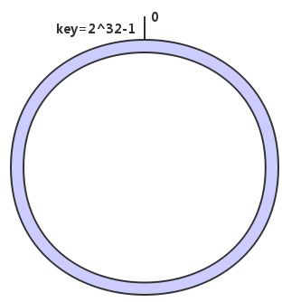

1. 将各个服务器使用哈希算法计算出每台机器的位置，(可以用服务器的IP地址或者主机名作为关键字)，按照顺时针排列：

   假设三台节点memcache经计算后位置如下：

   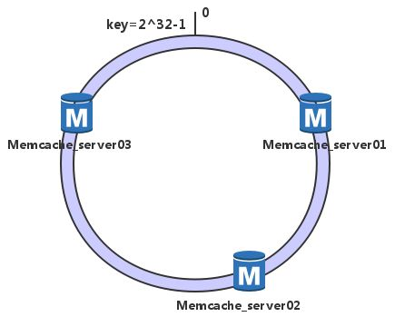

1. 使用相同算法计算出数据的哈希值,并由此确定数据在此哈希环上的位置，每一个key的顺时针方向最近节点，就是key所归属的存储节点。 

   假如我们有数据A、B、C和D，经过哈希计算后位置如下：

   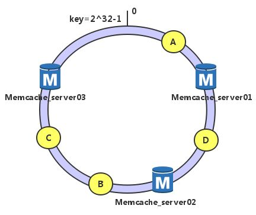


   	根据一致性哈希算法（顺时针找最近服务节点方法），数据A就被绑定到了server01上，D被绑定到了server02上，B、C在server03上

4. 假设server03宕机，查询时去顺时针找后继节点，缓存未命中时刷新缓存

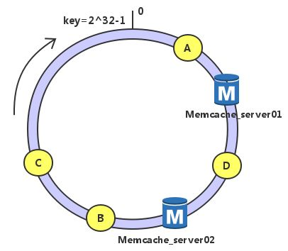


   ```
   可以看到此时A、D不会受到影响，只是将B、C节点被重定位到Server 1。
   
   即：如果一台服务器不可用，则受影响的数据仅仅是此服务器到其环空间中前一台服务器（即顺着逆时针方向行走遇到的第一台服务器）之间数据，其它不会受到影响。
   ```

5. 假设增加一台服务器Memcached Server 04：

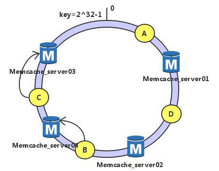


   ```
   此时A、D、C不受影响，只有B需要重定位到新的Server 4。
   
   即：如果增加一台服务器，则受影响的数据仅仅是新服务器到其环空间中前一台服务器（即顺着逆时针方向行走遇到的第一台服务器）之间数据，其它不会受到影响。
   ```

综上所述，一致性哈希算法对于节点的增减都只需重定位环空间中的一小部分数据，具有较好的容错性和可扩展性。

### 布隆过滤器

**原理：**

建立32个二进制常量，即4字节的向量，然后将这32个二进制位全部设置为0，对于这条URL，用8个不同的随机数产生8个信息指纹，再用一个随机数产生器把这8个信息指纹映射到1到32的8个自然数，并把这些位置置为1。

**检测时：**检测某条URL是否在这个Bloom Filter中，用上述8个随机数产生8个信息指纹，并将这8个指纹对应到布隆过滤器的8个二进制位，如果8位都为1，则说明这条URL在这个Bloom Filter中，否则只要有一位不为1，就说明不在。

Bloom Filter绝不会漏掉任何一个重复的URL，但可能会有误报情况，因为有可能某个好的邮件地址正巧对应个八个都被设置成一的二进制位。虽然这种可能性很小，上述说的误报概率只有千万分之一，可以通过建立一个小的名单，存储可能误判的URL，并进行比较。

Bloom Filter 误报率表：

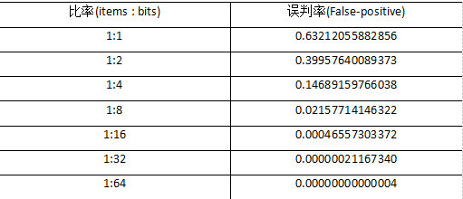


**举例：**

给定数据集A（包含10亿条url, 每条64B），B（包含一些测试集）。返回B中某条数据是否在A中。A太大，不能一次加载到内存中（需要640G）去创建HashMap。使用bloom filter，能够显著减少需要的内存（只需20G）。但会有误报率

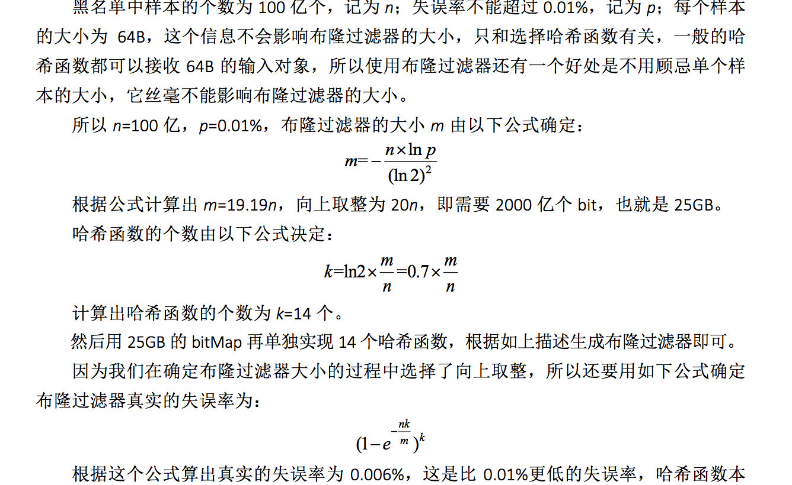


# 二：跳表（ Redis 为什么会选择用跳表来实现有序集合？ 而不用红黑树呢？）

- 对链表稍加改造，就可以支持类似“二分”的查找算法。我们把改造之后的数据结构叫作跳表（Skip list）
- 它是一种各方面性能都比较优秀的动态数据结构，可以支持快速的插入、删除、查 找操作，写起来也不复杂，甚至可以替代红黑树（Red-black tree）。

## 跳表

对链表建立一级“索引”，查找起来会更快一些。每两个结点提取一个结点到上一级，我们把抽出来的那一级叫作索引或索引层。图中的 down 表示 down 指针，指向下一级结点。

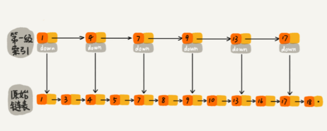

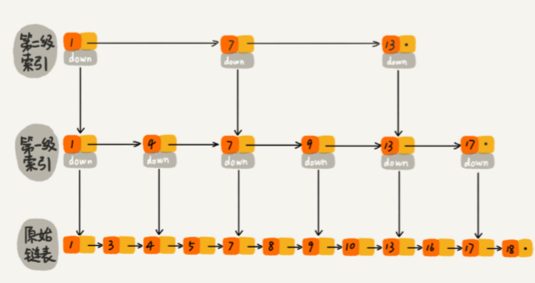


- 一个包含 64 个结点的链表，按照前面讲的这种思路，建立了五级索引。查找只需要遍历 11 个结点


## 跳表的效率

- 在一个 单链表中查询某个数据的时间复杂度是 O(n)。

- 第 k级索引 结点的个数就是  $n/(2^k )$。

- 假设索引有 h 级，最高级的索引有 2 个结点。则 $n/(2^k )$=2，从而 h=log n-1。如果包含原始链表这一层，整个跳表的高度就是 log n。我们在跳表中查询某个数据的时候，如果每一层都要遍历 m 个结点，那在跳表中查询一个数据的时间复杂度就是 O(m*logn)。

- m=3。每一级索引都多只需要遍历 3 个结点

- 假设我们要查找的数据是 x，在第 k 级索引中，我们遍历到 y 结点之后，发现 x 大于 y，小于后 面的结点 z，所以我们通过 y 的 down 指针，从第 k 级索引下降到第 k-1 级索引。在第 k-1 级 索引中，y 和 z 之间只有 3 个结点（包含 y 和 z），所以，我们在 K-1 级索引中多只需要遍 历 3 个结点，依次类推，每一级索引都多只需要遍历 3 个结点。

  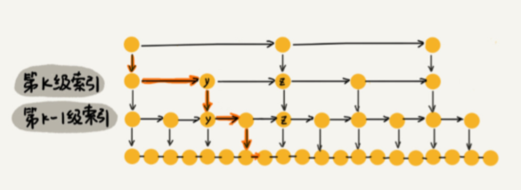

- m=3，所以在跳表中查询任意数据的时间复杂度就是 O(logn)

## 跳表是否浪费内存

- 假设原始链表大小为 n，那第一级索引大约有 n/2 个结点，第二级索引大约有 n/4 个结点，以此类推，每上升一级就减少一半，直到剩下 2 个结点。
- 这几级索引的结点总和就是 $n/2+n/4+n/8…+8+4+2=n-2$。所以，跳表的空间复杂度是 O(n)。也就是说，如果将包含 n 个结点的单链表构造成跳表，我们需要额外再用接近 n 个结点的存储空间。

## 降低索引占的内存

- 前面都是每两个结点抽一个结点到上级索引，如果我们每三个结点或五个结点，抽一个结点到上级索引，就不用那么多索引结点
- 若每3个结点向上抽取，总的索引结点大约就是 $n/3+n/9+n/27+…+9+3+1=n/2$。尽管空间复杂度还是 O(n)，但少了很多
- 在软件开发中，我们不必太在意索引占用的额外空间

## 高效的动态插入和删除（ O(logn) ）

- 插入需要先查找，找到后直接插入。

  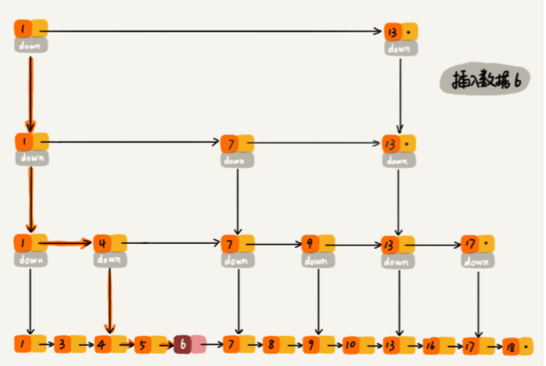

- 除了要删除原始链表的节点，还要删除索引中的。采用双线链表

## 跳表索引动态更新

当我们不停地往跳表中插入数据时，如果我们不更新索引，就有可能出现某 2 个索引结点之间数据非常多的情况。极端情况下，跳表还会退化成单链表。

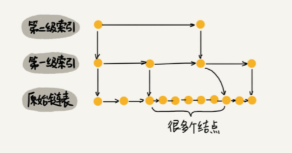


- 跳表是通过随机函数来维护“平衡性”。

当我们往跳表中插入数据的时候，我们可以选择同时将这个数据插入到部分索引层中。

- 我们通过一个随机函数，来决定将这个结点插入到哪几级索引中，比如随机函数生成了值 K，那 我们就将这个结点添加到第一级到第 K 级这 K 级索引中。随机函数的选择很有讲究，从概率上来讲，能够保证跳表的索引大小和数据大小平衡性，不至于 性能过度退化。

  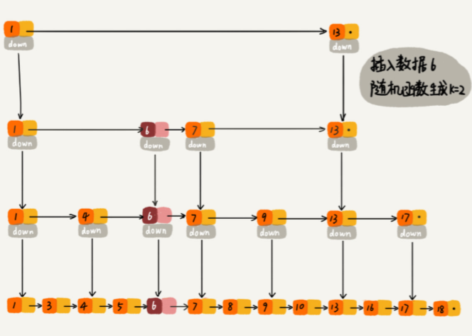

## 为什么 Redis 要用跳表来实现 有序集合，而不是红黑树？

Redis 中的有序集合是通过跳表来实现的，严格点讲，其实还用到了散列表。

Redis 中的有序集合支持的核心操作主要有下面这几个：

- 插入一个数据；
- 删除一个数据；
- 查找一个数据；
- 按照区间查找数据（比如查找值在 [100, 356] 之间的数据）；
- 迭代输出有序序列。

1. 其中，插入、删除、查找以及迭代输出有序序列这几个操作，红黑树也可以完成，时间复杂度跟跳表是一样的。

2. 但是，按照区间来查找数据这个操作，红黑树的效率没有跳表高。

   按照区间查找数据操作：跳表可以做到 O(logn) 的时间复杂度定位区间的起点，然后在原始链表中顺序往后遍历就可以了。这样做非常高效。

3. 跳表更容易代码实现。虽然跳表的实现也不简单，但比起红黑树来说还是好懂、好写多了，而简单就意味着可读性好，不容易出错。

4. 跳表更加灵活，它可以通过改变索引构建策略，有效平衡执行效率和内存消耗。

不过，跳表也不能完全替代红黑树。

1. 因为红黑树比跳表的出现要早一些，很多编程语言中的 Map 类型都是通过红黑树来实现的。我们做业务开发的时候，直接拿来用就可以了，不用费劲 自己去实现一个红黑树，但是跳表并没有一个现成的实现，所以在开发中，如果你想使用跳表， 必须要自己实现。

## 跳表实现


