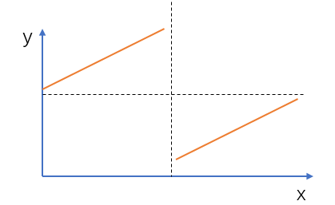

# 二分查找（针对有序数据集合的查找算法）

二分查找--hash表--跳表

## 1. 不存在重复元素，查找给定值

### 递归实现

```java
public int bsearch(int[] a, int n, int val) {
    return bsearchInternally(a, 0, n - 1, val); 
}

private int bsearchInternally(int[] a, int low, int high, int value) {  
    if (low > high) return -1;

    int mid =  low + ((high - low) >> 1);
    if (a[mid] == value) {
        return mid;
    } else if (a[mid] < value) {
        return bsearchInternally(a, mid+1, high, value);  
    } else {
        return bsearchInternally(a, low, mid-1, value);  
    }
}
```

### 非递归实现

```java
public int bsearch(int[] a, int n, int value) {
    int low = 0;  
    int high = n - 1;
 	while (low <= high) {
        int mid = (low + high) / 2;
        if (a[mid] == value) {
            return mid;
        } else if (a[mid] < value) {
            low = mid + 1;
        } else {
            high = mid - 1;
        }  
    } 
    return -1; 
}
```

### 注意：

1. 循环退出条件

  注意是 low<=high，而不是 low<high。

2. mid 的取值

   - mid=(low+high)/2不好，如果 low 和 high 比较大的话，两者之和可能会溢出。
   - 应该：mid = low+(high-low)/2。
   - 更进一步，采用位运算提高速度mid = low+((highlow)>>1)。因为相比除法运算来说，计算机处理位运算要快得多。

3. low 和 high 的更新

   low=mid+1，high=mid-1。注意这里的 +1 和 -1，如果直接写成 low=mid 或者 high=mid，就可能会发生死循环。比如，当 high=3，low=3 时，如果 a[3] 不等于 value，就会导致一直循环不退出。

## 2. 有重复数据，查找第一个值等于给定值的元素 

```java
public int bsearch(int[] a, int n, int value) {
    int low = 0;
    int high = n - 1;
    while (low <= high) {
        int mid =  low + ((high - low) >> 1);
        if (a[mid] > value) {
            high = mid - 1;
        } else if (a[mid] < value) {
            low = mid + 1;
        } else { 
11          if ((mid == 0) || (a[mid - 1] != value)) {
                return mid;
            } else { 
                high = mid - 1; 
            }  
        }
    }
    return -1;
}
```

- a[mid] 跟要查找的 value 的大小关系有三种情况：大于、小于、 等于。

1. 对于 a[mid]>value，我们需要更新 high= mid-1；
2. 对于 a[mid]<value 的情况， 我们需要更新 low=mid+1。
3. 那当 a[mid]=value 的时候。需要确认一下 a[mid] 是不是第一个值等于给定值的元素。

​    我们重点看第 11 行代码。

1. 如果mid == 0

   那这个元素已经是数组的第一个元素，那它肯定是我们要找的；

2. 如果 mid != 0，但 a[mid] 的前一个元素 a[mid-1] 不等于 value

   那也说明 a[mid] 就是我们要找的第一个值等于给定值的元素。

3. a[mid-1] == value，说明此时的 a[mid] 肯定不是我们要查找的第一个值等于给定值的元素。

   更新 high=mid-1，要找的元素肯定出现在 [low, mid-1] 之间。

## 3. 有重复数据，查找最后一个值等于给定值的元素

```java
public int bsearch(int[] a, int n, int value) {
    int low = 0;
    int high = n - 1;
    while (low <= high) {
        int mid =  low + ((high - low) >> 1);
        if (a[mid] > value) {
            high = mid - 1;
        } else if (a[mid] < value) {
            low = mid + 1;
        } else { 
11          if ((mid == n-1) || (a[mid + 1] != value)) {
                return mid;
            } else { 
                low = mid + 1; 
            }  
        }
    }
    return -1;
}
```

重点在第十一行：

1. min == n-1

   a[mid] 这个元素已经是数组中的最后一个元素了，那它肯定是我们要找的；

2.  a[mid+1] != value

   那也说明 a[mid] 就是我们要找的最后一个值等于给定值的元素。

3. a[min+1] == value

   那说明当前的 这个 a[mid] 并不是最后一个值等于给定值的元素。我们就更新 low=mid+1，因为要找的元素肯定出现在 [mid+1, high] 之间。

## 4. 有重复数据，查找第一个大于等于给定值的元素(ceil) 

```java
public int bsearch(int[] a, int n, int value) {
    int low = 0;
    int high = n - 1;
    while (low <= high) {
        int mid =  low + ((high - low) >> 1);
        if (a[mid] >= value) {
            if ((mid == 0) || (a[mid - 1] < value)) {
                return mid;
            } else {
                high = mid - 1;
            }
        } else { //小于
            low = mid + 1;
        } 
    }
    return -1;
}
```

1. a[mid] < value

   那要查找的值肯定在 [mid+1, high] 之间，所以，我们更新 low=mid+1。

2. a[mid] >= value 

   先看a[mid] 是不是我们要找的第一个值大于等于给定值的元素。

   1. 如果 a[mid] 前面已经没有元素，或者前面一个元素小于要查找的值 value，那 a[mid] 就是我们要找的元素。这段逻辑对应的代码是第 7 行。
   2. 如果 a[mid-1] 也大于等于要查找的值 value，那说明要查找的元素在 [low, mid-1] 之间，所以，我们将 high 更新为 mid-1。

## 5. 有重复数据，查找最后一个小于等于给定值的元素(floor) 

```java
public int bsearch(int[] a, int n, int value) {
    int low = 0;
    int high = n - 1;
    while (low <= high) {
        int mid =  low + ((high - low) >> 1);
        if (a[mid] <= value) {
            if ((mid == n-1) || (a[mid + 1] > value)) {
                return mid;
            } else {
                low = mid + 1;
            }
        } else { //大于
            high = mid - 1;
        } 
    }
    return -1;
}
```

## 6.有重复元素，第一个大于target的元素(upper_bound)

```java
// 大于target的第一个元素
static int upper(Comparable[] arr, Comparable target) {
    if (target.compareTo(arr[arr.length - 1]) > 0) {
        return -1;
    }

    int l = 0, r = arr.length - 1;
    while (l <= r) {
        int mid = l + (r - l)/2;
        if (arr[mid].compareTo(target) > 0) {
            if (mid == 0 || arr[mid-1].compareTo(target) <= 0) 			  {
                return mid;
            } else {
                r = mid - 1;
            }
        } else {
            l = mid + 1;
        }
    }
    return -1;
}
```

## 7.有重复元素，最后一个小于target的元素（lower_bound）

```java
static int upper(Comparable[] arr, Comparable target) {
    if (target.compareTo(arr[0]) < 0) {
        return -1;
    }
    int l = 0, r = arr.length - 1;
    while (l <= r) {
        int mid = l + (r - l)/2;
        if (arr[mid].compareTo(target) < 0) {
            if (mid == arr.length-1 || arr[mid+1].compareTo(target) >= 0) 			  {
                return mid;
            } else {
                l = mid + 1;
            }
        } else {
            r = mid - 1;
        }
    }
    return -1;
}
```

# 练习题

## 1.有序数组翻转后找最小值

数组元素不重复。比如 4，5，6，1，2，3。找出最小值1.

**思路：**

1. 数组中最小值前面的数nums[i] 都满足：nums[i]≥nums[0]，其中 nums[n−1]是数组最后一个元素；而数组中最小值后面的数（包括最小值）都不满足这个条件。所以我们可以二分出最小值的位置。
2. 另外，不要忘记处理数组完全单调的特殊情况。

**时间复杂度分析：**二分查找，所以时间复杂度是 O(logn)O(logn)。




```java
public int findMin(int[] nums) {
    int lo = 0, hi = nums.length - 1, mid;
    if (nums[0] < nums[hi]) {
        return nums[0];
    }
    while(lo < hi) {
        mid = lo + (hi - lo)/2;
        if (nums[mid] >= nums[0]) {
            lo = mid + 1;
        } else {
            hi = mid;
        }
    }
    return nums[lo];
}
```

## 2.题目1基础上+数组元素会重复

思路：除了最后水平的一段（黑色水平那段）之外，其余部分满足二分性质：竖直虚线左边的数满足 nums[i]≥nums[0]并且 nums[i]>nums[n−1]，其中 nums[n−1]是数组最后一个元素；而竖直虚线右边的数不满足这个条件。分界点就是整个数组的最小值。

1. 所以我们先将最后水平的一段删除即可。
2. 不要忘记处理数组完全单调的特殊情况。

**时间复杂度分析：**二分的时间复杂度是 O(logn)，删除最后水平一段的时间复杂度最坏是 O(n)，所以总时间复杂度是 O(n)。


```java
public int findMin(int[] nums) {
    int lo = 0, hi = nums.length-1, mid = 0;
    while (lo < hi && nums[lo] == nums[hi]) {
        hi--;
    }
    if (nums[0] <= nums[hi]) {
        return nums[0];
    } else {
        while (lo < hi) {
            mid = lo + (hi - lo) / 2;
            if (nums[mid] >= nums[0]) {
                lo = mid + 1;
            } else {
                hi = mid;
            }
        }
    }
    return nums[lo];
}
```

## 9.应用场景的局限性 （更适合用 在“近似”查找问题）

1. 依赖的是顺序表结构，简单点说就是**数组（省内存）**.

2. 针对的是有序数据

3. 只能用在插入、删除操作不频繁，一次排序多次查找的场景中。

4. 数据量太小不适合二分查找。遍历即可。

   但是如果数据之间的比较操作非常耗时，不管数据量大小，都推荐使用二分查找（减少比较次数）

5. 数据量太大也不适合二分查找。

   要求内存空间连续，对内存的要求比较苛刻。如果是零散的空间就不行

## 10. 如何在 1000 万个整数中快速查找某个整数？

- 内存限制是 100MB，每个数据大小是 8 字节

1. 最简单的办法就是将数据存储在数组中，内存占用差不多是 80MB，符合内存的限制。- 

   - 先对这 1000 万数据从小到大排序，然后再利用二分查找算法，就可以快速地查找想要的数据。

2. **散列表和二叉树不能解决这个问题**

   虽然大部分情况下，用二分查找可以解决的问题，用散列表、二叉树都可以解决。

   但是，不管是散列表还是二叉树，都会需要比较多的额外的内存空间。如果用散列表或者二叉 树来存储这 1000 万的数据，用 100MB 的内存肯定是存不下的。

   而二分查找底层依赖的是数组，除了数据本身之外，不需要额外存储其他信息，是最省内存空间的存储方式，所以刚好能在限定的内存大小下解决这个问题。
