# 6.1 栈的基础应用 Valid Parentheses

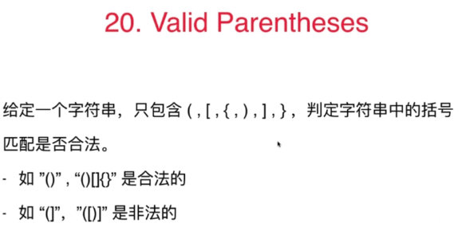


## 思路
1. 只要遇到左方向的括号，就放进栈里
2. 只要遇到右方向的括号，就将栈顶元素拿出看是否跟他匹配。匹配就将栈顶元素弹出，否则即不匹配。
3. 直到遍历结束，返回匹配；或在遍历过程中就发现不匹配直接返回不匹配。

**使用栈的原因：在一种嵌套关系中，通过栈顶元素获得最近的需要处理的元素**  

## 注意：
1. 在碰到右括号要去拿左括号，此时就要拿栈顶元素，就要先判断栈是否为空。为空就直接返回false
2. 在所有元素取完之后也不能直接返回true，当此时栈也为空的时候才能返回true
3. 在最后一个判断中assert，因为此时右括号只能是},若都不是证明输入有问题
```    java
public boolean isValid(String s) {
  Stack<Character> stack = new Stack<Character>();
  for( int i = 0 ; i < s.length() ; i ++ )
    if( s.charAt(i) == '(' || s.charAt(i) == '{' || s.charAt(i) == '[')
      stack.push(s.charAt(i));
  else{

    if( stack.size() == 0 )
      return false;

    Character c = stack.pop();

    Character match;
    if( s.charAt(i) == ')' )
      match = '(';
    else if( s.charAt(i) == ']' )
      match = '[';
    else{
      assert s.charAt(i) == '}';
      match = '{';
    }

    if(c != match)
      return false;
  }

  if( stack.size() != 0 )
    return false;

  return true;
}
```

## 练习
150. Evaluate Reverse Polish Notation
71. simpllify path
路径是否一定合法？不能回退（/../）? 多余的/ ?(home// -- home/)

# 6.2 栈和递归的紧密关系

## 栈的基本应用

二叉树中的算法，因为二叉树本来就是递归定义的，所以二叉树中有很多关于递归的算法。

1. Binary Tree Preorder Traversal
2. Binary Tree Inorder Traversal
3. Binary Tree Postorder Traversal

## 二叉树递归遍历时的系统栈情况

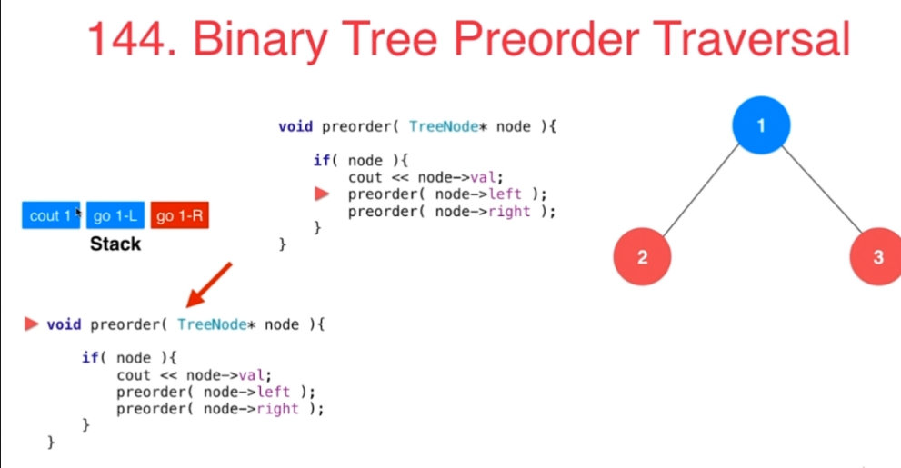

**如上图所示：**

1. 在函数递归执行的时候，执行完对1节点的访问，就会去执行2节点的访问，相当于对1节点的访问就停在了那里

2. 此时系统中会有一个Stack记录下上一层函数执行到了哪里，看图中左边的Stack，其中有三个内容分别代表了在遍历1节点的时候需要做的事情：打印1，遍历1的左边，遍历1的右边。蓝色代表已经做了，红色代表还没做

3. 这样遍历1完了后，从栈顶取出相应保存的信息，就能知道下一步要干什么：访问1的右孩子。

   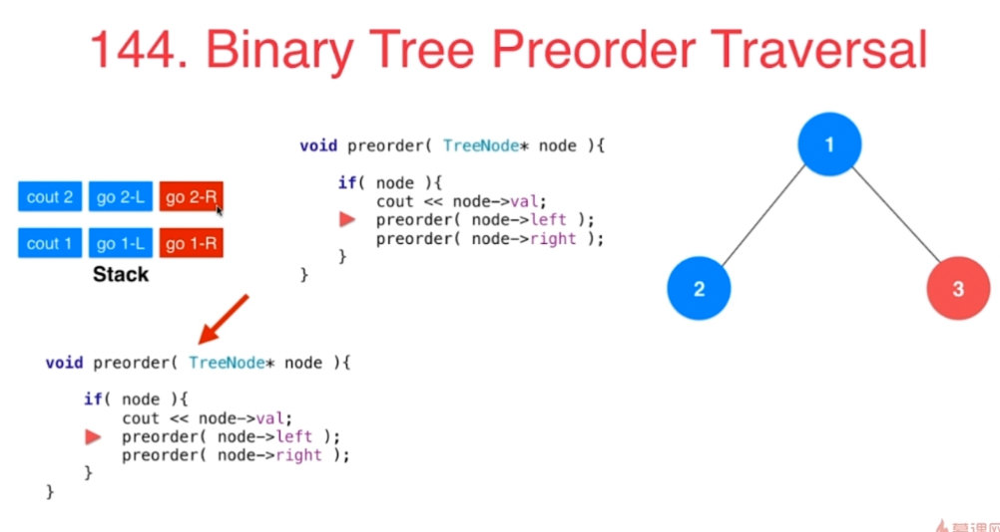

4. 同理，在遍历2节点的时候，又进入了访问2节点的左孩子的递归

5. 所以此时需要在栈顶添加访问2节点的情况：打印2，遍历2的左边，遍历2的右边

# 6.3 使用栈模拟系统栈

- 系统栈要保存递归调用前，函数的执行情况：这三个就是按照执行顺序从左往右填好的。

  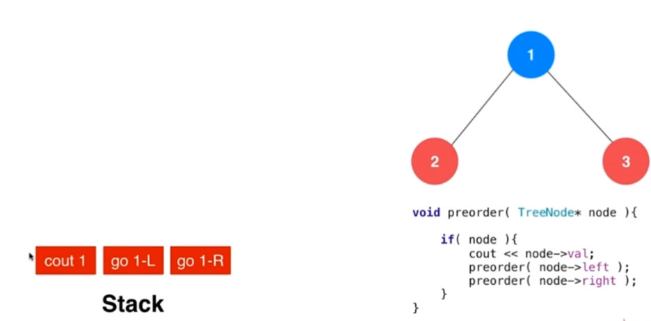

- 模拟使用栈结构存储，就等价于向栈中推入下面这样的命令，先推入“访问右孩子”，然后是“访问左孩子”，最后是“打印”。因为先推入的最后做。这样就可以按照原本的顺序去执行

  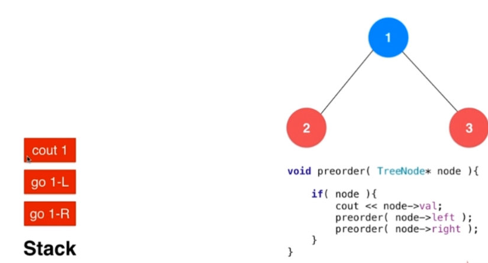

## 模拟


- 一开始系统栈中推入要执行访问1的命令

  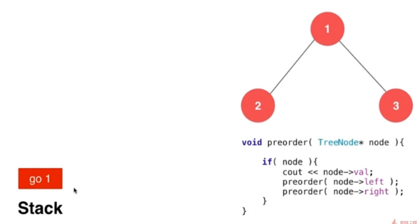

- 可以看到，在访问节点1的时候，需要执行三个命令，按逆序放进去，挨个执行。

  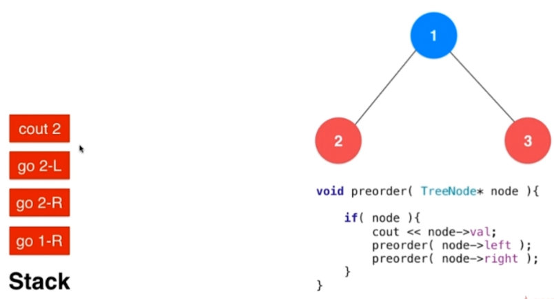

- 在访问节点2的时候，要把2中要执行的命令也逆序放进栈中

## 模拟系统栈执行先序遍历，自己定义指令结构，存入stack中

```java
/// 非递归二叉树的前序遍历
/// 时间复杂度: O(n), n为树的节点个数
/// 空间复杂度: O(h), h为树的高度
public class Solution144 {

    // Definition for a binary tree node.
    public class TreeNode {
        int val;
        TreeNode left;
        TreeNode right;
        TreeNode(int x) { val = x; }
    }
    // 自定义指令
    private class Command{
        String s;   // go, print
        TreeNode node;
        Command(String s, TreeNode node){
            this.s = s;
            this.node = node;
        }
    };

    public List<Integer> preorderTraversal(TreeNode root) {
        ArrayList<Integer> res = new ArrayList<Integer>();
        if(root == null)
            return res;

        Stack<Command> stack = new Stack<Command>();
        stack.push(new Command("go", root));
        while(!stack.empty()){
            Command command = stack.pop();

            if(command.s.equals("print"))
                res.add(command.node.val);
            else{
                //先序遍历，最后插入print
                assert command.s.equals("go");
                if(command.node.right != null)
                    stack.push(new Command("go",command.node.right));
                if(command.node.left != null)
                    stack.push(new Command("go",command.node.left));
                stack.push(new Command("print", command.node));
            }
        }
        return res;
    }
}
```

- 这个代码很容易修改成：中序和后序遍历。也很容易修改为其他递归函数。跟教科书上的非递归代码不一样。

## 练习

1. Flatten Nested List Iterator

# 6.4 队列的典型应用（102. Binary Tree Level Order Traversal）

## 队列的基本应用-广度优先遍历

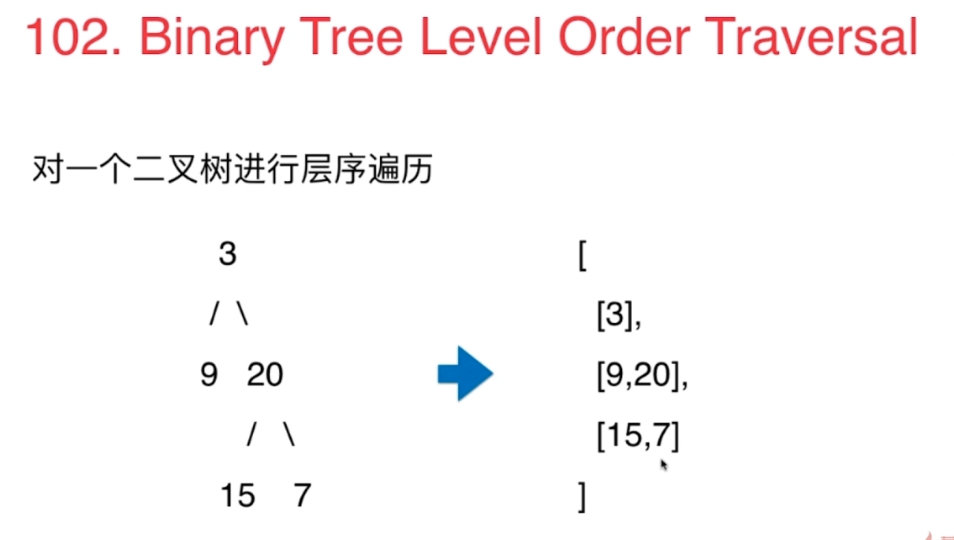

- 树：层序遍历

- 图：无权图的最短路径

- 树是图的特殊形式

- 用二维list表示这个数，则res中有多少个list就表示有几层

- 将节点包装成pair，将节点所在的层数也包含进去

- 每次从队列中拿出一个节点，根据其level和当前res中已有的层次判断他是不是已有的层中的节点

```java
/// 二叉树的层序遍历
/// 时间复杂度: O(n), n为树的节点个数
/// 空间复杂度: O(n)
class Solution {

    // Definition for a binary tree node.
    public class TreeNode {
        int val;
        TreeNode left;
        TreeNode right;
        TreeNode(int x) { val = x; }
    }

    public List<List<Integer>> levelOrder(TreeNode root) {

        ArrayList<List<Integer>> res = new ArrayList<List<Integer>>();
        if(root == null)
            return res;

        // 我们使用LinkedList来做为我们的先入先出的队列
        LinkedList<Pair<TreeNode, Integer>> queue = new LinkedList<Pair<TreeNode, Integer>>();
        queue.addLast(new Pair<TreeNode, Integer>(root, 0));

        while(!queue.isEmpty()){

            Pair<TreeNode, Integer> front = queue.removeFirst();
            TreeNode node = front.getKey();
            int level = front.getValue();
            // 根据其level和当前res中已有的层次判断他是不是已有的层中的节点
            //level和res.size都是从0开始算，level=res.size表示level = res.size + 1。即要开始新的一层
            if(level == res.size())
                res.add(new ArrayList<Integer>());
            assert level < res.size();
            //否则在已有层，添加进去该节点
            res.get(level).add(node.val);
            if(node.left != null)
                queue.addLast(new Pair<TreeNode, Integer>(node.left, level + 1));
            if(node.right != null)
                queue.addLast(new Pair<TreeNode, Integer>(node.right, level + 1));
        }

        return res;
    }
}
```

## 练习

1. Binary Tree Level Order TraversalII
2. Binary Tree ZigZag Level Order Traversal
3. Binary Tree Right Side View

广度优先适用于无权图

# 6.5 BFS和图的最短路径（279. Perfect Squares）

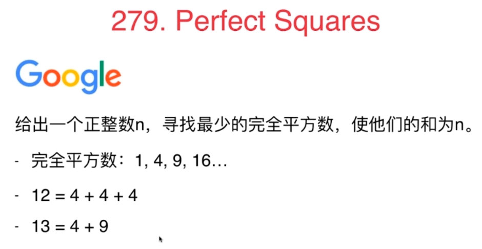


很多题目都可以使用图的最短路径这一思路解决，但是题目一看上去却是跟图没关系的，就需要对问题进行深入分析后进行建模。

- 没有解怎么办？
- 是否可能没有解？不可能--因为1是一个完全平方数，最差都会有解。

## **思路1：直觉解法--贪心？不对，看下面例子**

12 = 9 + 1 + 1 + 1
12 = 4 + 4 + 4

## **思路2：转换到图**

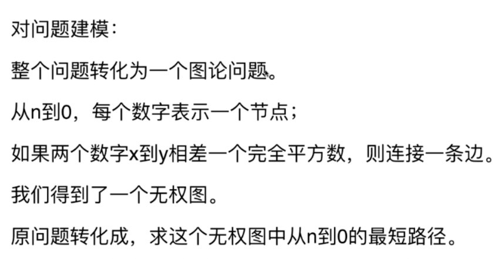
有向图，大的数指向小的数

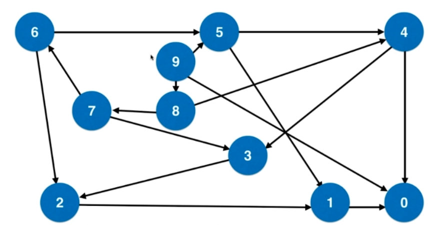


**思路1：超时**

```java
// 该方法会导致 Time Limit Exceeded 或者 Memory Limit Exceeded
//
// 时间复杂度: O(2^n)
// 空间复杂度: O(2^n)
public class Solution1 {

    public int numSquares(int n) {

        LinkedList<Pair<Integer, Integer>> queue = new LinkedList<Pair<Integer, Integer>>();
        queue.addLast(new Pair<Integer, Integer>(n, 0));

        while(!queue.isEmpty()){
            Pair<Integer, Integer> front = queue.removeFirst();
            int num = front.getKey();
            int step = front.getValue();

            if(num == 0)
                return step;
            //这里就是构建图的过程，所有Num-i*i的点到num的距离是1。所以直接new pair
            for(int i = 1 ; num - i*i >= 0 ; i ++)
                queue.addLast(new Pair(num - i * i, step + 1));
        }

        throw new IllegalStateException("No Solution.");
    }

```

- 在上面这个算法有性能问题，性能问题源于：每次都将num-一个完全平方数的可能结点推入队列中，就会重复推入很多节点，因为每个数字都能从多种渠道获得
- 之所以会有这个问题，是因为当前的结构是图，而不是树，对于图，每一个节点会有多个节点能到达他。而树就只有一个节点能到达。

**思路2：访问数组**

- 设置一个visited数组，记录已经访问过的节点
- 这样才是一个标准的在图中进行广度优先遍历的程序

```java
// 使用visited数组,记录每一个入队元素
//
// 时间复杂度: O(n)
// 空间复杂度: O(n)
public int numSquares(int n) {

    LinkedList<Pair<Integer, Integer>> queue = new LinkedList<Pair<Integer, Integer>>();
    queue.addLast(new Pair<Integer, Integer>(n, 0));

    boolean[] visited = new boolean[n+1];
    visited[n] = true;

    while(!queue.isEmpty()){
        Pair<Integer, Integer> front = queue.removeFirst();
        int num = front.getKey();
        int step = front.getValue();

        if(num == 0)
            return step;

        for(int i = 1 ; num - i*i >= 0 ; i ++)
            if(!visited[num - i * i]){
                queue.addLast(new Pair(num - i * i, step + 1));
                visited[num - i * i] = true;
            }
    }

    throw new IllegalStateException("No Solution.");
}
```

**思路3：对小的地方进一步优化**

- 在for循环中也进行是否==0的判断

```java
public int numSquares(int n) {

    if(n == 0)
        return 0;

    LinkedList<Pair<Integer, Integer>> queue = new LinkedList<Pair<Integer, Integer>>();
    queue.addLast(new Pair<Integer, Integer>(n, 0));

    boolean[] visited = new boolean[n+1];
    visited[n] = true;

    while(!queue.isEmpty()){
        Pair<Integer, Integer> front = queue.removeFirst();
        int num = front.getKey();
        int step = front.getValue();

        if(num == 0)
            return step;

        for(int i = 1 ; num - i*i >= 0 ; i ++){
            int a = num - i*i;
            if(!visited[a]){
                if(a == 0) 
                    return step + 1;
                queue.addLast(new Pair(num - i * i, step + 1));
                visited[num - i * i] = true;
            }
        }
    }

    throw new IllegalStateException("No Solution.");
}
```

## 练习

1. Word Ladder
2. Word Ladder II

# 6.67 优先队列相关（347. Top K Frequent Elements）

优先队列也是队列，只是跟普通队列取出，放入思路不同。

堆的底层实现：白板编程

## 思路1：排序

统计字符和出现次数，排序 (nlogn)后取前k个，瓶颈在于排序

## 思路2：长度为k的优先队列

维护一个长度为k的优先队列，(nlogk),因为是在长度为k的队列中操作，所以复杂度是logk

```java
// 时间复杂度: O(nlogk)
// 空间复杂度: O(n + k)
private class PairComparator implements Comparator<Pair<Integer, Integer>>{

    @Override
    public int compare(Pair<Integer, Integer> p1, Pair<Integer, Integer> p2){
        if(p1.getKey() != p2.getKey())
            return p1.getKey() - p2.getKey();
        return p1.getValue() - p2.getValue();
    }
}

public List<Integer> topKFrequent(int[] nums, int k) {

    if(k <= 0)
        throw new IllegalArgumentException("k should be greater than 0");

    // 统计每个元素出现的频率
    HashMap<Integer, Integer> freq = new HashMap<Integer, Integer>();
    for(int i = 0 ; i < nums.length ; i ++)
        if(freq.containsKey(nums[i]))
            freq.put(nums[i], freq.get(nums[i]) + 1);
    else
        freq.put(nums[i], 1);

    //统计出不重复的字符数应该大于k
    if(k > freq.size())
        throw new IllegalArgumentException("k should be less than the number of unique numbers in nums");

    // 扫描freq,维护当前出现频率最高的k个元素
    // 在优先队列中,按照频率排序,所以数据对是 (频率,元素) 的形式
    PriorityQueue<Pair<Integer, Integer>> pq = new PriorityQueue<Pair<Integer, Integer>>(new PairComparator());
    for(Integer num: freq.keySet()){
        int numFreq = freq.get(num);
        if(pq.size() == k){
            if(numFreq > pq.peek().getKey()){
                pq.poll();
                pq.add(new Pair(numFreq, num));
            }
        }
        else
            pq.add(new Pair(numFreq, num));
    }

    ArrayList<Integer> res = new ArrayList<Integer>();
    while(!pq.isEmpty())
        res.add(pq.poll().getValue());

    return res;
}

private static void printList(List<Integer> nums){
    for(Integer num: nums)
        System.out.print(num + " ");
    System.out.println();
}
```

如果k和n差不多，维护一个(nlog(n-k))的元素，即维护一个长度n-k的优先队列能大幅提高效率。

## 练习

1. Merge K sorted Lists（重要）  
   k分归并排序，k取多少的时候性能最好？

# 堆的底层实现

```java
class MaxHeap<T extends Comparable>{

    private T[] data;
    private int count;
    private int capacity;

    //两个初始化函数
    public MaxHeap(int capacity){
        // 接口类型变量
        data = (T[]) new Comparable[capacity+1];
        this.capacity = capacity;
        count = 0;
    }

    public MaxHeap(T arr[]){
        capacity = arr.length;
        data = (T[])new Comparable[capacity+1];

        for (int i = 0; i < capacity; i++)
            data[i+1] = arr[i];
        count = arr.length;

        for (int i = count/2 ; i >= 1; i--) {
            ShiftDown(i);
        }
    }

    // 交换堆中索引为i和j的两个元素
    private void swap(int i, int j){
        T t = data[i];
        data[i] = data[j];
        data[j] = t;
    }

    public int getCount(){
        return count;
    }

    public boolean isEmpty(){
        return count==0;
    }

    public void insert(T item){
        assert count+1 <= capacity;
        data[count+1] = item;
        count++;
        ShiftUp(count);
    }

    public T getMax(){
        assert count>0;
        T ret = data[1];
        swap(1,count);
        ShiftDown(1);
        return ret;
    }
    //辅助函数
    private void ShiftUp(int i){
        while (i > 1 && data[i/2].compareTo(data[i]) < 0){
            swap(i,i/2);
            i /= 2;
        }
    }

    private void ShiftDown(int i){
        while (i*2 <= count) {
            int j = i*2;
            if(j + 1 <= count && data[j+1].compareTo(data[j]) > 0)
                j++;
            if(data[i].compareTo(data[j]) >= 0)
                break;
            swap(i,j);
            i = j;
        }
    }
}
```

