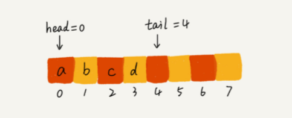
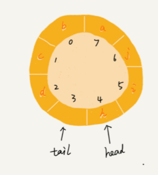
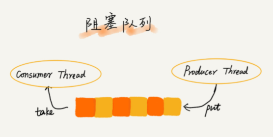

# 队列（在线程池等有限资源池中的应用）

- 先进先出：循环队列、阻塞队列、并发队列
- 应用：高性能队列 Disruptor、 Linux 环形缓存，都用到了循环并发队列；Java concurrent 并发包利用 ArrayBlockingQueue 来实现公平锁等。

## 顺序队列和链式队列 

- 用数组实现的队列叫作顺序队列，用链表实现的队列叫作链式队列。

### 顺序队列

- 队满的判断条件是 tail == n，队空的判断条件是 head == tail。

> 队列需要一个head 指针，指向队头；一个tail 指针，指向队尾。随着不停地进行入队、出队操作，head 和 tail 都会持续往后移动。当 tail 移动到最右边，即使数组中还有空闲空间，也无法继续往队列中添加数据。




**解决：**在出队时可以不用搬移数据。如果没有空闲空间了，只需要在入队时，再集中触发一次数据的搬移操作

```
 // 入队操作，将 item 放入队尾  
 public boolean enqueue(String item) {
    // tail == n 表示队列末尾没有空间了    
    if (tail == n) {
    	// tail ==n && head==0，表示整个队列都占满了  
        if (head == 0) { 
        	return false;      
        }
        // 数据搬移
		for (int i = head; i < tail; ++i) {
    		items[i-head] = items[i];
     	}      
     	// 搬移完之后重新更新 head 和 tail
     	tail -= head;
     	head = 0;
        }
        
        items[tail] = item;
        ++tail;
        return true;  
}
```

## 循环队列

用数组来实现队列的时候，在 tail==n 时，会有数据搬移操作，这样入队操作性能就会受到影响。**使用循环队列避免数据搬移**

**确定好队空和队满的判定条件**

判空条件：head == tail；队满时，(tail+1)%n=head（当队满时，tail指向的位置没有存储数据的。所以，循环队列会浪费一个数组的存储空间。）




## 阻塞队列

- 队列为空，从队头取数据会被阻塞。因为此时无数据可取，直到队列有数据才能返回；

- 队列已满，插入数据就会被阻塞，直到队列中有空闲位置后再插入数据，然后再返回。

  

### 生产者消费者模型

- 可以使用阻塞队列，实现一个“生产者 - 消费者模型”

  1. 这种基于阻塞队列实现的“生产者 - 消费者模型”，可以**有效地协调生产和消费的速度。**当“生产者”生产数据的速度过快，“消费者”来不及消费时，存储数据的队列很快就会满了。这个时候，生产者就阻塞等待，直到“消费者”消费了数据，“生产者”才会被唤醒继续“生产”。

     

  2. 基于阻塞队列，我们**还可以通过协调“生产者”和“消费者”的个数**，提高数据的处理效率。比如前面的例子，我们可以多配置几个“消费者”，来应对一个“生产者”。

## 并发队列（线程安全的队列）

- 在多线程情况下，会有多个线程同时操作队列，这个时候就会存在线程安全问题，线程安全的队列我们叫作并发队列。
- 最简单直接的实现方式是直接在 enqueue()、dequeue() 方法上加锁，但是锁粒度大并发度会比较低，同一时刻仅允许一个存或者取操作。
- 基于数组的循环队列，利用 CAS 原子操作，可以实现非常高效的并发队列。**这也是循环队列比链式队列应用更加广泛的原因。**

## 应用

对于大部分资源有限的场景，当没有空闲资源时，基本上都可以通过“队列”这种数据结构来实现请求排队。

e.g. 线程池没有空闲线程时，新的任务请求线程资源时，线程池该如何处理？各种处理策略又是如何实现的呢？

| 处理策略                                                 | 实现方式 | 特点                                                         | 场景                       |
| -------------------------------------------------------- | -------- | ------------------------------------------------------------ | -------------------------- |
| 非阻塞：直接拒绝                                         |          |                                                              |                            |
|                                                          |          |                                                              |                            |
| 阻塞：请求排队，到有空闲线程时，取出排队的请求继续处理。 | 顺序队列 | 队列大小有限，但设置有难度（大-等待请求过多；小-无法充分利用资源） | 对响应时间敏感的系统       |
|                                                          | 链式队列 | 可实现无界队列；等待处理时间长。                             | 不适合对响应时间敏感的系统 |

## 滑动窗口中的最大值

用一个双端队列保存每个窗口的最大值，队列首部就是当前窗口的最大值。为了将窗口头部的位置弹出，在队列中记录每个值的下标，而不是数值

- 每次加入一个元素：将队尾比当前元素小的元素都弹出，然后加入当前元素
- 判断队首元素是否超过窗口，将超过窗口的都弹出
- 本窗口的最大值就是队首元素。

```
i  [4, 3, 5, 4, 3, 3, 6, 7], w = 3
0: [0(4)]
1: [0(4), 1(3)]
2: [2(5)], poll 0(4), 1(3), record 5(0-2)
3: [2(5), 3(4)], record 5(1-3)
4: [2(5), 3(4), 4(3)], record 5(2-4) 
5: [3(4), 5(3)], poll 2(5), 4(3), record 4(3-5)
6: [6(6)], poll 3(4), 5(3), record 6(4-6)
7: [7(7)], poll 6(6), record 7(5-7)
```

```java
public int[] maxSlidingWindow(int[] nums, int k) {
    if (nums == null || nums.length <= 0 || k < 1 || nums.length < k) {
        return null;
    }
    LinkedList<Integer> max = new LinkedList<>();
    int[] ans = new int[nums.length - k + 1];
    int index = 0;
    for (int i = 0; i < nums.length; i++) {
        while (!max.isEmpty() && nums[max.peekLast()] < nums[i]) {
            max.pollLast();
        }
        max.offerLast(nums[i]);
        if (max.peekLast() == i - k) {
            max.pollFirst();
        }
        if (i >= k -1) {
            ans[index] = nums[max.peekFirst()];
        }
    }
    return ans;
}
```

## 返回队列的最大值

- 两个队列，一个保存入队的数据，一个保存队列的当前最大值。数据队列出队时要判断是否和最大值队列首部的索引相同，相同则最大值队列头部出队

```java
public class MaxQueue {
    class InternalData{
        int key;
        int index;
        public InternalData(int key, int index){
            this.key = key;
            this.index = index;
        }
    }

    private Deque<InternalData> queue = new LinkedList<>();
    private Deque<InternalData> maxQueue = new LinkedList<>();
    private int currentIndex = 0;

    public void offer(int key) {
        while (!maxQueue.isEmpty() && maxQueue.peekLast().key <= key) {
            maxQueue.pollLast();
        }
        InternalData data = new InternalData(key,currentIndex);
        maxQueue.offerLast(data);
        queue.offerLast(data);
        currentIndex++;
    }

    // 保存队列最大值的这个队列一直保存的都是当前数字往后中的可能的最大值，所以第一个数字保存的就是截止目前的最大值
    // 当前面的元素要弹出时：如果包含在最大队列中，那最大队列也要弹出这个值
    public Integer poll() {
        if (maxQueue.isEmpty()) {
            return null;
        }
        if (maxQueue.peekFirst().index == queue.peekFirst().index) {
            maxQueue.pollFirst();
        }
        return queue.pollFirst().key;
    }

    public Integer max(){
        if (maxQueue.isEmpty()) {
            return -1;
        } else {
            return maxQueue.peekFirst().key;
        }
    }
}
```

# 栈（浏览器的前进和后退功能）

- 用数组实现的栈叫作顺序栈，用链表实现的栈叫作链式栈

## 表达式求值

## 函数调用

## 单调栈

[参考](单调栈.md)

## 括号匹配

## 有效的栈序列

给定输入序列，输出序列。判断输出是否合法。

`stack.push(a);` 要放在最开始保证所有元素都加进去后还能进行判断，如果放在后面那加完元素后就不能进行下一轮判断。

```java
public class Solution {
    public boolean IsPopOrder(int [] pushA,int [] popA) {
        if (pushA == null && popA == null) {
            return true;
        } else if (pushA == null || popA == null || pushA.length != popA.length) {
            return false;
        }
        Stack<Integer> stack = new Stack<>();
        int idx = 0;
        for (int a:pushA) {
            stack.push(a);
            while(!stack.isEmpty() && stack.peek() == popA[idx]){
                stack.pop();
                idx++;
            }
        }
        return stack.isEmpty();
    }
}
```

## 栈的最小值

- 栈是按顺序压入，新压入的元素受已压入元素最小值的影响，但已压入元素的最小值不受影响。所以使用另一个栈维护当前最小值，最小值只需要跟栈顶元素比较即可

```java
public class Solution {
    Stack<Integer> stack = new Stack<>();
    Stack<Integer> minStack = new Stack<>();
    public void push(int node) {
        stack.push(node);
        if (minStack.isEmpty()) {
            minStack.push(node);
        } else {
            int min = Math.min(node, minStack.peek());
            minStack.push(min);
        }
    }
     
    public void pop() {
        if (!stack.isEmpty()) {
            minStack.pop();
            stack.pop();
        }
    }
     
    public int top() {
        return stack.peek();
    }
     
    public int min() {
        return minStack.peek();
    }
}
```

