# 8.12 树形问题&什么是回溯(17.电话号码组合)

递归算法的经典思想：回溯法。

解决问题的思路本质是一棵树的形状，即**树形问题**


- 合法性

  是否包含*，#。可看出表中的数字应该没有1，因为1没有代表的字母

- 解决问题的思路隐藏在一颗树中，就可以用递归去解决

  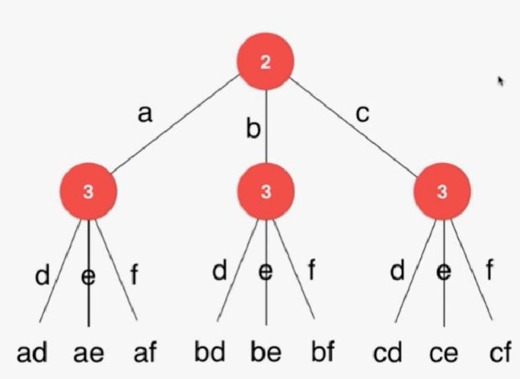

  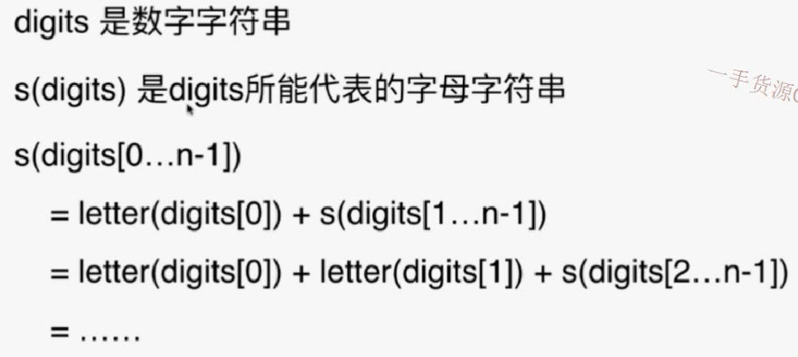

- 代码

// 用这样的方式进行调试，输出第几位和当前的字符串
​        System.out.println(index + " : " + s);

```java
import java.util.List;
import java.util.ArrayList;

/// 17. Letter Combinations of a Phone Number
/// https://leetcode.com/problems/letter-combinations-of-a-phone-number/description/
/// 时间复杂度: O(2^len(s))
/// 空间复杂度: O(len(s))
class Solution {
    private String letterMap[] = {
                " ",    //0
                "",     //1
                "abc",  //2
                "def",  //3
                "ghi",  //4
                "jkl",  //5
                "mno",  //6
                "pqrs", //7
                "tuv",  //8
                "wxyz"  //9
    };

    private ArrayList<String> res;

    public List<String> letterCombinations(String digits) {

        res = new ArrayList<String>();
        if(digits.equals(""))
            return res;

        findCombination(digits, 0, "");
        return res;
    }

    // s中保存了此时从digits[0...index-1]翻译得到的一个字母字符串
    // 寻找和digits[index]匹配的字母, 获得digits[0...index]翻译得到的解
    private void findCombination(String digits, int index, String s){
	   // 用这样的方式进行调试，输出第几位和当前的字符串
        System.out.println(index + " : " + s);
        if(index == digits.length()){
            res.add(s);
            System.out.println("get " + s + " , return");
            return;
        }

        Character c = digits.charAt(index);
        assert  c.compareTo('0') >= 0 &&
                c.compareTo('9') <= 0 &&
                c.compareTo('1') != 0;
        String letters = letterMap[c - '0'];
        for(int i = 0 ; i < letters.length() ; i ++){
            System.out.println("digits[" + index + "] = " + c +
                    " , use " + letters.charAt(i));
            findCombination(digits, index+1, s + letters.charAt(i));
        }

        System.out.println("digits[" + index + "] = " + c + " complete, return");

        return;
    }

    private static void printList(List<String> list){
        for(String s: list)
            System.out.println(s);
    }

    public static void main(String[] args) {

        printList((new Solution()).letterCombinations("234"));
    }
}
```

递归调用的一个重要特征：要返回，回溯。


多重循环、回溯法是暴力解法的一个主要实现手段。动态规划是基于回溯法的。

- 93.restore ip addresses
- 131.palindrome partitioning

## 回溯算法的应用

排列、组合问题

# 8.3 排列问题Permuations


## 思路

元素有冲突，需要采用辅助数组used

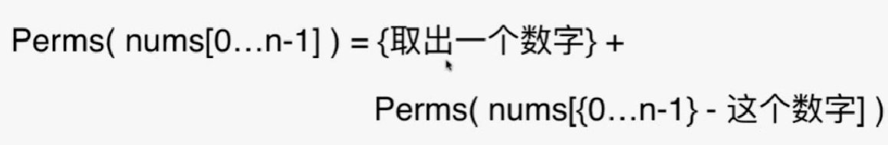

这里在一开始取出一个数字后，后面的排列中就不能有这个取出的数字了。

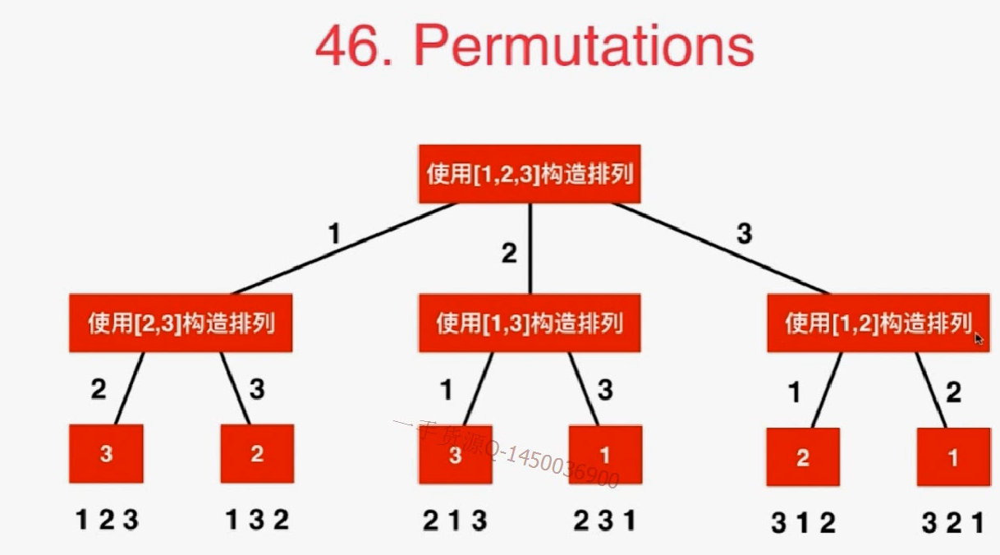


```java
// p中保存了一个有index-1个元素的排列。
// 向这个排列的末尾添加第index+1个元素, 获得一个有index+1个元素的排列
// 需要nums数组来组成这个排列，index表示正在处理第几个元素，p是在递归的过程中找到的一个拥有index个元素的排列
    private void generatePermutation(int[] nums, int index, LinkedList<Integer> p){
```

```java
import java.util.List;
import java.util.ArrayList;
import java.util.LinkedList;

public class Solution {
    private ArrayList<List<Integer>> res;
    //辅助数组来判断nums[i]是否在p中
    private boolean[] used;

    public List<List<Integer>> permute(int[] nums) {
        res = new ArrayList<List<Integer>>();
        if(nums == null || nums.length == 0)
            return res;

        used = new boolean[nums.length];
        LinkedList<Integer> p = new LinkedList<Integer>();
        generatePermutation(nums, 0, p);

        return res;
    }

    // p中保存了一个有index-1个元素的排列。
    // 向这个排列的末尾添加第index个元素, 获得一个有index个元素的排列
    private void generatePermutation(int[] nums, int index, LinkedList<Integer> p){
        if(index == nums.length){
            res.add((LinkedList<Integer>)p.clone());
            return;
        }

        for(int i = 0 ; i < nums.length ; i ++)
            if(!used[i]){
                used[i] = true;
                p.addLast(nums[i]);
                generatePermutation(nums, index + 1, p );
                // 回溯：尝试其他元素，要把最后的这个i元素删除
                p.removeLast();
                used[i] = false;
            }

        return;
    }

    private static void printList(List<Integer> list){
        for(Integer e: list)
            System.out.print(e + " ");
        System.out.println();
    }

    public static void main(String[] args) {
        int[] nums = {1, 2, 3};
        List<List<Integer>> res = (new Solution()).permute(nums);
        for(List<Integer> list: res)
            printList(list);
    }
}
```

## 练习

1  permutationsII

有重复字母，重复的字符串不要。

```java
public class Solution {
    ArrayList<String> res;
    boolean[] used;
    public ArrayList<String> Permutation(String str) {
        res = new ArrayList<>();
        if (str == null || str.length() == 0) {
            return res;
        }
        char[] chr = str.toCharArray();
        Arrays.sort(chr);
        used = new boolean[chr.length];
        String tmp = "";
        perm(chr, tmp);
        return res;
    }
    
    public void perm(char[] chr, String tmp) {
        if (tmp.length() == chr.length) {
            res.add(new String(tmp));
            return;
        }
        for (int i = 0; i < chr.length; i++) {
            if(used[i] == true || i>0 && chr[i] == chr[i-1] && used[i-1] == true) {
                    continue;
            }    
            tmp += chr[i];
            used[i] = true;
            perm(chr, tmp);
            used[i] = false;
            tmp = tmp.substring(0,tmp.length() - 1);
        }
    }
}
```

# 8.45 组合问题&优化(77.Combinations)

给出两个整数n,k;求在1...n这n个数字中选出k个数字的所有组合。

取数就变为一个递归关系，因为都是在集合中取出数

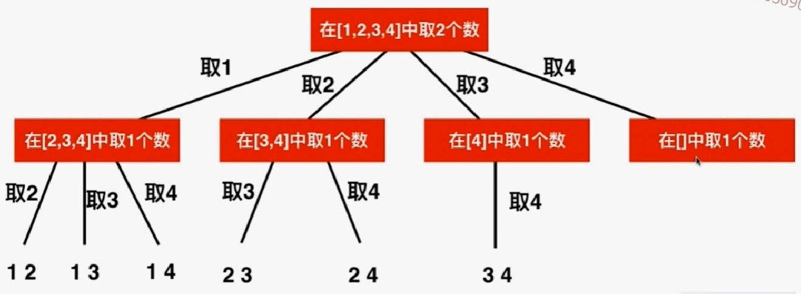


- 可以看出这棵树有几个孩子是不确定的。
- 因为不能有重复，所以后面取数的时候子集合中就要排除掉前面取过的数

```java
import java.util.List;
import java.util.ArrayList;
import java.util.LinkedList;

/// 77. Combinations
/// https://leetcode.com/problems/combinations/description/
/// 时间复杂度: O(n^k)
/// 空间复杂度: O(k)
public class Solution {
    private ArrayList<List<Integer>> res;

    public List<List<Integer>> combine(int n, int k) {
		// 异常条件直接返回
        res = new ArrayList<List<Integer>>();
        if(n <= 0 || k <= 0 || k > n)
            return res;

        LinkedList<Integer> c = new LinkedList<Integer>();
        generateCombinations(n, k, 1, c);

        return res;
    }

    // 求解C(n,k), 当前已经找到的组合存储在c中, 需要从start开始搜索新的元素。前面的数已经考虑过了
    private void generateCombinations(int n, int k, int start, LinkedList<Integer> c){
		//终止条件，c的个数为要求的时候退出
        if(c.size() == k){
            res.add((List<Integer>)c.clone());
            return;
        }

        for(int i = start ; i <= n ; i ++){
            c.addLast(i);
            generateCombinations(n, k, i + 1, c);
            c.removeLast();
        }

        return;
    }

    private static void printList(List<Integer> list){
        for(Integer e: list)
            System.out.print(e + " ");
        System.out.println();
    }

    public static void main(String[] args) {

        List<List<Integer>> res = (new Solution()).combine(4, 2);
        for(List<Integer> list: res)
            printList(list);
    }
}
```

## 优化：剪枝

在这个问题中，最后的4这条分支是没必要走的。因为取不到别的数了。

```java
// 不应该遍历到n，修改循环界限
for(int i = start ; i <= n ; i ++){
    c.addLast(i);
    generateCombinations(n, k, i + 1, c);
    c.removeLast();
}
```

- 修改后

```java
import java.util.List;
import java.util.ArrayList;
import java.util.LinkedList;

/// 77. Combinations
/// https://leetcode.com/problems/combinations/description/
/// 时间复杂度: O(n^k)
/// 空间复杂度: O(k)
public class Solution {
    private ArrayList<List<Integer>> res;

    public List<List<Integer>> combine(int n, int k) {

        res = new ArrayList<List<Integer>>();
        if(n <= 0 || k <= 0 || k > n)
            return res;

        LinkedList<Integer> c = new LinkedList<Integer>();
        generateCombinations(n, k, 1, c);

        return res;
    }

    // 求解C(n,k), 当前已经找到的组合存储在c中, 需要从start开始搜索新的元素
    private void generateCombinations(int n, int k, int start, LinkedList<Integer> c){
        if(c.size() == k){
            res.add((List<Integer>)c.clone());
            return;
        }
	    // 剪枝
        // 还有k - c.size()个空位, 所以, [i...n] 中至少要有 k - c.size() 个元素
        // i最多为 n - (k - c.size()) + 1
        for(int i = start ; i <= n - (k - c.size()) + 1 ; i ++){
            c.addLast(i);
            generateCombinations(n, k, i + 1, c);
            c.removeLast();
        }

        return;
    }

    private static void printList(List<Integer> list){
        for(Integer e: list)
            System.out.print(e + " ");
        System.out.println();
    }

    public static void main(String[] args) {

        List<List<Integer>> res = (new Solution()).combine(4, 2);
        for(List<Integer> list: res)
            printList(list);
    }
}
```

## 练习：

1. combination sum （元素不同）
2. combination sumII (元素可能相同，只能取一次)

216 combination sumIII

78  subsets

90  subsets(元素可能相同)

401 binary  watch

# 8.6 二维平面上的回溯

前面是在一维数组上使用回溯法

## 79 word search


举例：


按照顺时针顺序进行查找：上--右--下--左


- 上：越界
- 右：


- 技巧：向四个方向寻找。使用 数组+循环

```java
/// 79. Word Search
/// Source : https://leetcode.com/problems/word-search/description/
///
/// 回溯法
/// 时间复杂度: O(m*n*m*n)
/// 空间复杂度: O(m*n)
public class Solution {
	// 循环技巧，这个差值就是x,y坐标要变的差量。
    
    private int d[][] = {{-1, 0}, {0, 1}, {1, 0}, {0, -1}};
    
    private int m, n;
    private boolean[][] visited;

    public boolean exist(char[][] board, String word) {
        if(board == null || word == null)
            throw new IllegalArgumentException("board or word can not be null!");

        m = board.length;
        if(m == 0)
            throw new IllegalArgumentException("board can not be empty.");
        n = board[0].length;
        if(n == 0)
            throw new IllegalArgumentException("board can not be empty.");

        visited = new boolean[m][n];
        for(int i = 0 ; i < m ; i ++)
            for(int j = 0 ; j < n ; j ++)
                if(searchWord(board, word, 0, i, j))
                    return true;

        return false;
    }

    private boolean inArea( int x , int y ){
        return x >= 0 && x < m && y >= 0 && y < n;
    }

    // 从board[startx][starty]开始, 寻找word[index...word.size())
    private boolean searchWord(char[][] board, String word, int index,
                               int startx, int starty){

        //assert(inArea(startx,starty));
        // 要找的是最后一个字符
        if(index == word.length() - 1)
            return board[startx][starty] == word.charAt(index);
		
        //相等的话再向四周寻找 
        if(board[startx][starty] == word.charAt(index)){
            visited[startx][starty] = true;
            // 从startx, starty出发,向四个方向寻找
            for(int i = 0 ; i < 4 ; i ++){
                int newx = startx + d[i][0];
                int newy = starty + d[i][1];
                // 新的坐标不能越界 & 没访问过，才能进行是否符合条件的判断
                if(inArea(newx, newy) && !visited[newx][newy] &&
                        searchWord(board, word, index + 1, newx, newy))
                    //如果search(newx,newy)找到了就证明这一次的也成功了。
                    return true;
            }
            visited[startx][starty] = false;
        }
        return false;
    }

    public static void main(String args[]){
        char[][] b1 = { {'A','B','C','E'},
                        {'S','F','C','S'},
                        {'A','D','E','E'}};

        String words[] = {"ABCCED", "SEE", "ABCB" };
        for(int i = 0 ; i < words.length ; i ++)
            if((new Solution()).exist(b1, words[i]))
                System.out.println("found " + words[i]);
            else
                System.out.println("can not found " + words[i]);

        char[][] b2 = {{'A'}};
        if((new Solution()).exist(b2,"AB"))
            System.out.println("found AB");
        else
            System.out.println("can not found AB");
    }
}
```

# 8.7 floodfill算法，一类经典问题

## 200. Number of Islands


将一个岛屿内的所有位置都标识为岛屿，在后面的遍历过程中就不能再找标为岛屿的位置了。

- 从第一个点开始标记，一直向右。标记后结果为：

  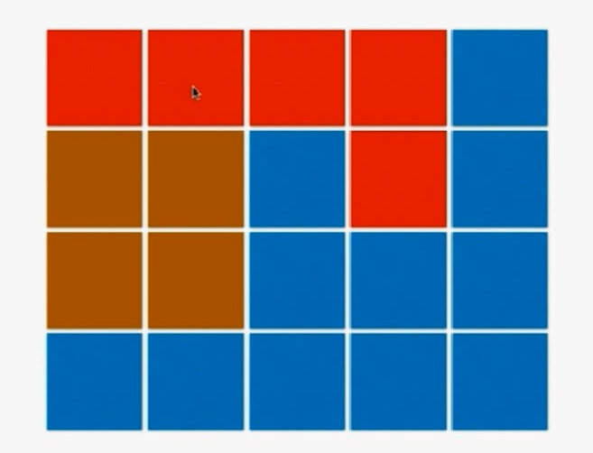

- 到最后一个点5没法标记，不断回溯到4,3。到了6,7,8,9

  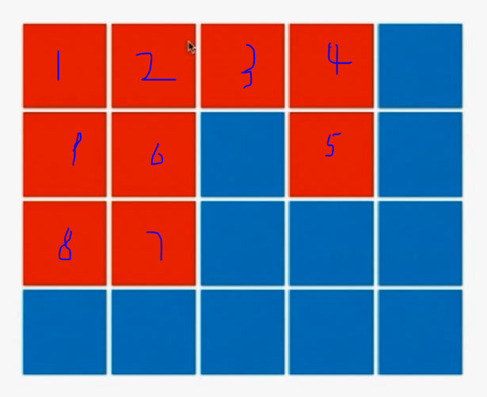

- 再不断回溯，发现所有都标记完了

- 再从(0,2)坐标开始找新的岛屿位置，不断遍历。

- 注意标记过的就不用设置visited为false了，表示用过。这是单次的，不需要穷举的回溯。

```java
/// 200. Number of Islands
/// https://leetcode.com/problems/number-of-islands/description/
/// 时间复杂度: O(n*m)
/// 空间复杂度: O(n*m)
class Solution {
    //位移数组，不是按照顺时针方向的（因为方向不重要，都考虑到了就行）。注意别的题可能有顺序要求
    
    private int d[][] = {{0, 1}, {1, 0}, {0, -1}, {-1, 0}};
    
    private int m, n;
    private boolean visited[][];

    public int numIslands(char[][] grid) {
        if(grid == null || grid.length == 0 || grid[0].length == 0)
            return 0;

        m = grid.length;
        n = grid[0].length;

        visited = new boolean[m][n];

        int res = 0;
        for(int i = 0 ; i < m ; i ++)
            for(int j = 0 ; j < n ; j ++)
                if(grid[i][j] == '1' && !visited[i][j]){
                    //找到岛屿后采用floodfill算法进行标记
                    dfs(grid, i, j);
                    res ++;
                }

        return res;
    }

    // 从grid[x][y]的位置开始,进行floodfill
    // 保证(x,y)合法,且grid[x][y]是没有被访问过的陆地
    private void dfs(char[][] grid, int x, int y){
        //assert(inArea(x,y));
        visited[x][y] = true;
        for(int i = 0; i < 4; i ++){
            int newx = x + d[i][0];
            int newy = y + d[i][1];
            //这个语句已经保证了下一次递归一定是合法的，所以这个循环没有终止条件
            //如果有不合理的条件，四个位置遍历完后就return了。
            if(inArea(newx, newy) && !visited[newx][newy] && grid[newx][newy] == '1')
                dfs(grid, newx, newy);
        }
        //这里不用没有将原标识设为flase
        return;
    }

    private boolean inArea(int x, int y){
        return x >= 0 && x < m && y >= 0 && y < n;
    }

    public static void main(String[] args) {
        char grid1[][] = {
            {'1','1','1','1','0'},
            {'1','1','0','1','0'},
            {'1','1','0','0','0'},
            {'0','0','0','0','0'}
        };
        System.out.println((new Solution()).numIslands(grid1));

        char grid2[][] = {
            {'1','1','0','0','0'},
            {'1','1','0','0','0'},
            {'0','0','1','0','0'},
            {'0','0','0','1','1'}
        };
        System.out.println((new Solution()).numIslands(grid2));
    }
}
```

## 练习：

130 surrounded regions

417  pacific atlantic water

# 8.8 回溯法是经典人工智能的基础

## 51.N-Queens

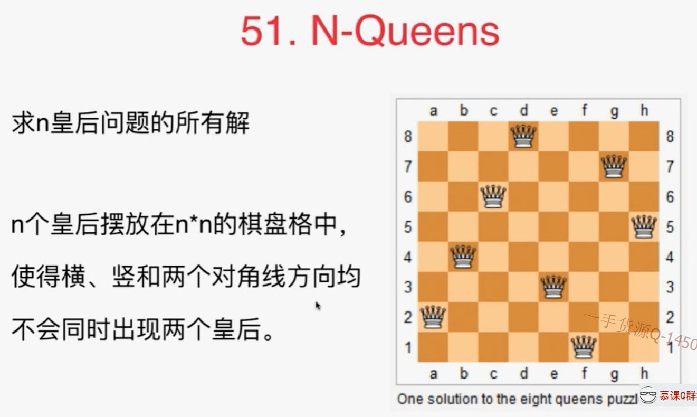


标准的是8皇后问题，以4皇后为例。

- 首先每一行都要有一个皇后，不然就会一行有两个皇后，不符合题意。

- 确定第一行在第一列位置，第二行的皇后不能在第一，二列，先放在第三列，然后依次往后找。不行再回溯，放在第四列。

  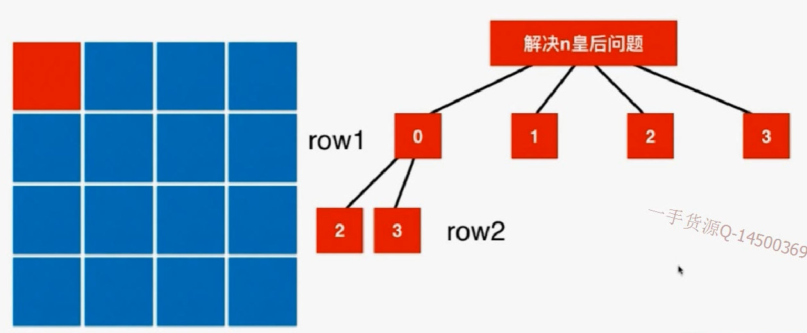

剩下的问题：如何判断不合法的情况


右上--左下：每个对角线节点上横纵坐标之和是定值。

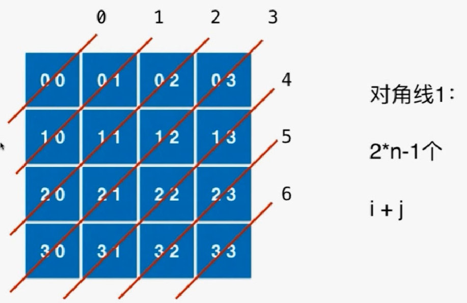

左上--右下：每个对角线节点上横纵坐标之差是定值。同时希望这个差保存在数组中，就是一个正数，所以要加上n-1.

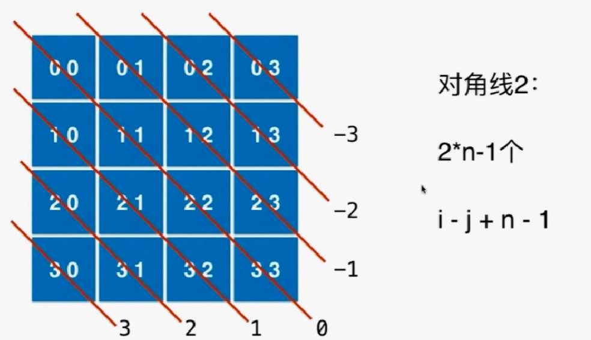


- 代码实现

从index=0（第0行）开始，每次进入第index行都已经拥有了index-1行的结果，所以当index进入n（相当于拥有了n-1行的结果）的时候就已经排好一个皇后，直接记录并返回即可。

```java
import java.util.Arrays;
import java.util.LinkedList;
import java.util.List;
import java.util.ArrayList;

/// 51. N-Queens
/// https://leetcode.com/problems/n-queens/description/
/// 时间复杂度: O(n^n)
/// 空间复杂度: O(n)
public class Solution {
    private boolean[] col;
    private boolean[] dia1;
    private boolean[] dia2;
    private ArrayList<List<String>> res;

    public List<List<String>> solveNQueens(int n) {
        res = new ArrayList<List<String>>();
        col = new boolean[n];
        dia1 = new boolean[2 * n - 1];
        dia2 = new boolean[2 * n - 1];

        LinkedList<Integer> row = new LinkedList<Integer>();
        putQueen(n, 0, row);

        return res;
    }

    // 尝试在一个n皇后问题中, 摆放第index行的皇后位置.row存储每一行的皇后摆放在第几列的位置
    private void putQueen(int n, int index, LinkedList<Integer> row){
        // 全部遍历完，生成解
        if(index == n){
            res.add(generateBoard(n, row));
            return;
        }

        for(int i = 0 ; i < n ; i ++)
            // 尝试将第index行的皇后摆放在第i列
            // 纵方向和两个对角线方向都不冲突
            if(!col[i] && !dia1[index + i] && !dia2[index - i + n - 1]){
                row.addLast(i);
                col[i] = true;
                dia1[index + i] = true;
                dia2[index - i + n - 1] = true;
                putQueen(n, index + 1, row);
                col[i] = false;
                dia1[index + i] = false;
                dia2[index - i + n - 1] = false;
                row.removeLast();
            }

        return;
    }

    // 将int数组转为string
    private List<String> generateBoard(int n, LinkedList<Integer> row){
        assert row.size() == n;

        ArrayList<String> board = new ArrayList<String>();
        for(int i = 0 ; i < n ; i ++){
            char[] charArray = new char[n];
            Arrays.fill(charArray, '.');
            charArray[row.get(i)] = 'Q';
            board.add(new String(charArray));
        }
        return board;
    }

    private static void printBoard(List<String> board){
        for(String s: board)
            System.out.println(s);
        System.out.println();
    }

    public static void main(String[] args) {
        int n = 4;
        List<List<String>> res = (new Solution()).solveNQueens(n);
        for(List<String> board: res)
            printBoard(board);
    }
}
```

## N皇后有很多优化思路：如何进行有效的剪枝

练习：

52 N-QUEENSII

37 sudoku solver 数独问题--优化


