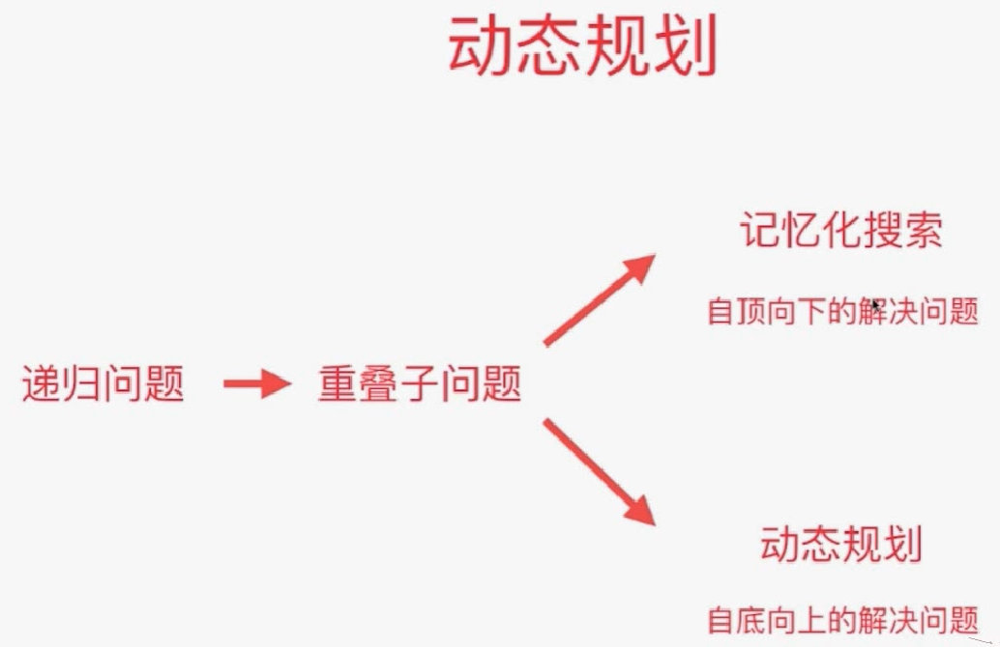
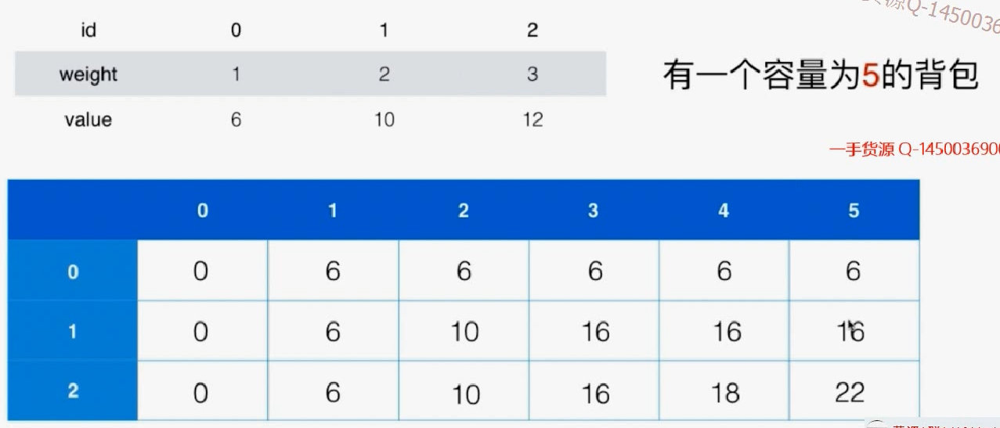

# 9.12 什么是动态规划

## 斐波那契数列

时间复杂度：2^n，时间是指数级增长。递归树如下：有多次重复计算。即：**重叠子结构问题**


对于n=20，执行了2w次fib函数。n=40，执行了300w

- 递归求斐波那契数列

```java
// 递归求斐波那契数列
public class Solution1 {
    private int num = 0;

    public int fib( int n ){
        num ++;
        if( n == 0 )
            return 0;
        if( n == 1 )
            return 1;

        return fib(n-1) + fib(n-2);
    }

    public int getNum(){
        return num;
    }

    public static void main(String[] args) {
        int n = 42;

        Solution1 solution = new Solution1();
        long startTime = System.currentTimeMillis();
        int res = solution.fib(n);
        long endTime = System.currentTimeMillis();

        System.out.println("fib(" + n + ") = " + res);
        System.out.println("time : " + (endTime - startTime) + " ms");
        System.out.println("run function fib() " + solution.getNum() + " times.");
    }
}
```

- 记忆化搜索

记忆化搜索--自上而下的解决问题。更容易

```java
import java.util.Arrays;

// 记忆化搜索
public class Solution2 {
    private int num = 0;

    public int fib(int n){
        int[] memo = new int[n + 1];
        Arrays.fill(memo, -1);
        return fib(n, memo);
    }

    private int fib(int n, int[] memo){
        num ++;
        if(n == 0)
            return 0;
        if(n == 1)
            return 1;
        
        if(memo[n] == -1)
            memo[n] = fib(n - 1, memo) + fib(n - 2, memo);
        return memo[n];
    }

    public int getNum(){
        return num;
    }

    public static void main(String[] args) {
        //int n = 42;
        int n = 1000; // 注意: 我们使用n = 1000只是为了测试性能, 实际上会溢出.斐波那契额数列是以指数速度上涨的.所以这个结果是错误的
        Solution2 solution = new Solution2();
        long startTime = System.currentTimeMillis();
        int res = solution.fib(n);
        long endTime = System.currentTimeMillis();

        System.out.println("fib(" + n + ") = " + res);
        System.out.println("time : " + (endTime - startTime) + " ms");
        System.out.println("run function fib() " + solution.getNum() + " times.");
    }
}
```

- 动态规划

自下而上的解决问题。先解决小数据量问题的结果，再解决大数据情况下的结果。

性能比记忆化搜素更好：

1.没有递归调用，省时间、空间。

2.memo只访问了一次

```java
import java.util.Arrays;

// 动态规划
public class Solution3 {
    public int fib(int n){
        int[] memo = new int[n + 1];
        Arrays.fill(memo, -1);

        memo[0] = 0;
        memo[1] = 1;
        for(int i = 2 ; i <= n ; i ++)
            memo[i] = memo[i - 1] + memo[i - 2];

        return memo[n];
    }

    public static void main(String[] args) {
        //int n = 42;
        int n = 1000; // 注意: 我们使用n = 1000只是为了测试性能, 实际上会溢出
        // 斐波那契额数列是以指数速度上涨的

        Solution3 solution = new Solution3();
        long startTime = System.currentTimeMillis();
        int res = solution.fib(n);
        long endTime = System.currentTimeMillis();

        System.out.println("fib(" + n + ") = " + res);
        System.out.println("time : " + (endTime - startTime) + " ms");
    }
}
```

## 什么是动态规划

将原问题拆解成若干个子问题，同时保留子问题答案，使得每个子问题只求解一次，就能得到原问题的解。

动态规划的本质和记忆化搜索是一样的。一般记忆化搜索的答案是能够满足的。有时候记忆搜索的答案也会是一个动态规划的答案。有一类递归问题有重叠子结构问题,转化为动态规划



## 70.climbing  stairs


### 递归：自顶向下


### 普通递归

```java
import java.util.Arrays;

public class Solution1 {
    private int calcWays(int n){
        if(n == 1)
            return 1;
        if(n == 2)
            return 2;

        return calcWays(n - 1) + calcWays(n - 2);
    }

    public static void main(String[] args) {

        System.out.println((new Solution1()).calcWays(10));
    }
}
```

递归终止的条件也可以是如下：这样n=2传进去后会自动算出来。

```java
private int calcWays(int n){
    // 没有台阶可以走，就一种方式
    if(n == 0)
        return 1;
    if(n == 1)
        return 2;

    return calcWays(n - 1) + calcWays(n - 2);
}
```

### 记忆化搜索

```java
import java.util.Arrays;

public class Solution1 {
    private int[] memo;

    public int climbStairs(int n) {
        memo = new int[n+1];
        Arrays.fill(memo, -1);
        return calcWays(n);
    }

    private int calcWays(int n){
        if(n == 0 || n == 1)
            return 1;
		//没有计算过
        if(memo[n] == -1)
            memo[n] = calcWays(n - 1) + calcWays(n - 2);

        return memo[n];
    }

    public static void main(String[] args) {
        System.out.println((new Solution1()).climbStairs(10));
    }
}
```

### 动态规划

```java
/// 70. Climbing Stairs
/// https://leetcode.com/problems/climbing-stairs/description/
/// 动态规划
/// 时间复杂度: O(n)
/// 空间复杂度: O(n)
public class Solution2 {

    public int climbStairs(int n) {
        int[] memo = new int[n + 1];
        memo[0] = 1;
        memo[1] = 1;
        for(int i = 2 ; i <= n ; i ++)
            memo[i] = memo[i - 1] + memo[i - 2];
        return memo[n];
    }

    public static void main(String[] args) {
        System.out.println((new Solution2()).climbStairs(10));
    }
}
```

## 练习

120 reiangle

64 minimum path sum

题目中限定每个格子包含一个非负整数，每一步只能左移或下移。这两个问题是对题目能够使用动态规划求解有限定的。

# 9.3 发现重叠子问题

## 343 Integer Break


### 暴力解决

由于将n分成几份不知道，所以不知道要分几重循环。所以用回溯遍历找出一个数做分割的所有可能性。（O(2^n)）。

比如分割4：蓝色的是重叠子问题，可以用记忆化搜索


分割n：res(n) = x * res(n-x)


### 最优子结构

之所以可以用这样的递归结构去解决问题，就是因为**通过求得子问题的最优解，能够求得原问题的最优解。即：最优子结构**（针对优化问题）

即：一个递归问题同时有重叠子问题结构 & 最优子结构 就能采用动态规划。


- 暴力答案（breakInteger是至少将n-i分割两部分，所以还要考虑不分割n-i）

```java
/// 343. Integer Break
/// https://leetcode.com/problems/integer-break/description/
/// 暴力搜索
/// 在Leetcode中提交这个版本的代码会超时! (Time Limit Exceeded)
/// 时间复杂度: O(n^n)
/// 空间复杂度: O(n)
public class Solution1 {
    public int integerBreak(int n) {
        if(n < 1)
            throw new IllegalArgumentException("n should be greater than zero");
        return breakInteger(n);
    }

    // 将n进行分割(至少分割两部分), 可以获得的最大乘积
    private int breakInteger(int n){
        if(n == 1)
            return 1;

        int res = -1;
        for(int i = 1 ; i <= n - 1 ; i ++)
            //breakInteger分为至少两部分，但还有一种情况就是i*(n-i)
            res = max3(res, i * (n - i), i * breakInteger(n - i));
        return res;
    }

    private int max3(int a, int b, int c){
        return Math.max(a, Math.max(b, c));
    }

    public static void main(String[] args) {
        System.out.println((new Solution1()).integerBreak(2));
        System.out.println((new Solution1()).integerBreak(10));
    }
}
```

- 记忆化搜索，自顶向下

```java
import java.util.Arrays;

/// 343. Integer Break
/// https://leetcode.com/problems/integer-break/description/
/// 记忆化搜索
/// 时间复杂度: O(n^2)
/// 空间复杂度: O(n)
public class Solution2 {
    private int[] memo;

    public int integerBreak(int n) {
        if(n < 1)
            throw new IllegalArgumentException("n should be greater than zero");

        memo = new int[n+1];
        Arrays.fill(memo, -1);

        return breakInteger(n);
    }

    // 将n进行分割(至少分割两部分), 可以获得的最大乘积
    private int breakInteger(int n){
        if(n == 1)
            return 1;

        if(memo[n] != -1)
            return memo[n];

        int res = -1;
        for(int i = 1 ; i <= n - 1 ; i ++)
            res = max3(res, i * (n - i) , i * breakInteger(n - i));
        // 记录结果
        memo[n] = res;
        return res;
    }

    private int max3(int a, int b, int c){
        return Math.max(a, Math.max(b, c));
    }

    public static void main(String[] args) {
        System.out.println((new Solution2()).integerBreak(2));
        System.out.println((new Solution2()).integerBreak(10));
    }
}
```

- 动态规划，自底向上

```java
/// 343. Integer Break
/// https://leetcode.com/problems/integer-break/description/
/// 动态规划
/// 时间复杂度: O(n^2)
/// 空间复杂度: O(n)
public class Solution3 {
    public int integerBreak(int n) {
        if(n < 1)
            throw new IllegalArgumentException("n should be greater than zero");

        int[] memo = new int[n+1];
        memo[1] = 1;
        for(int i = 2 ; i <= n ; i ++)
            // 求解memo[i]
            for(int j = 1 ; j <= i - 1 ; j ++)
                memo[i] = max3(memo[i], j * (i - j), j * memo[i - j]);

        return memo[n];
    }

    private int max3(int a, int b, int c){
        return Math.max(a, Math.max(b, c));
    }

    public static void main(String[] args) {
        System.out.println((new Solution3()).integerBreak(2));
        System.out.println((new Solution3()).integerBreak(10));
    }
}
```

## 练习

279  perfect squares

91 decode ways

62 unique paths

63 unique pathsII

# 9.4 状态的定义和状态转移

## 198 House Robber


### 暴力法


最优化问题-可能有最优子结构。

- 首先：考虑偷0；不偷0，偷1；不偷0,1,偷2.。。


紧接着：发现该问题有最优子结构，重叠子问题


**f函数的定义**只是：**考虑**，而不是一定。所以不一定会在该范围内偷。

v就表示要偷取这个编号的房子。

状态：定义了函数要做什么

状态转移方程：函数怎么做

```java
import java.util.Arrays;

/// 198. House Robber
/// https://leetcode.com/problems/house-robber/description/
/// 暴力
/// 时间复杂度: O(n^2)
/// 空间复杂度: O(n)
public class Solution1 {
    public int rob(int[] nums) {
        return tryRob(nums, 0);
    }

    // 考虑抢劫nums[index...nums.size())这个范围的所有房子
    private int tryRob(int[] nums, int index){
        if(index >= nums.length)
            return 0;

        int res = 0;
        for(int i = index ; i < nums.length ; i ++)
            res = Math.max(res, nums[i] + tryRob(nums, i + 2));
        return res;
    }

    public static void main(String[] args) {
        int nums[] = {2, 1};
        System.out.println((new Solution1()).rob(nums));
    }
}
```

### 记忆化搜索

```java
import java.util.Arrays;

/// 198. House Robber
/// https://leetcode.com/problems/house-robber/description/
/// 记忆化搜索
/// 时间复杂度: O(n^2)
/// 空间复杂度: O(n)
public class Solution1 {
    // memo[i] 表示考虑抢劫 nums[i...n) 所能获得的最大收益
    private int[] memo;

    public int rob(int[] nums) {
        memo = new int[nums.length];
        Arrays.fill(memo, -1);
        return tryRob(nums, 0);
    }

    // 考虑抢劫nums[index...nums.size())这个范围的所有房子
    private int tryRob(int[] nums, int index){
        if(index >= nums.length)
            return 0;

        if(memo[index] != -1)
            return memo[index];

        int res = 0;
        for(int i = index ; i < nums.length ; i ++)
            res = Math.max(res, nums[i] + tryRob(nums, i + 2));
        memo[index] = res;
        return res;
    }

    public static void main(String[] args) {
        int nums[] = {2, 1};
        System.out.println((new Solution1()).rob(nums));
    }
}
```

### 动态规划:自底向上

```java
import java.util.Arrays;

/// 198. House Robber
/// https://leetcode.com/problems/house-robber/description/
/// 动态规划
/// 时间复杂度: O(n^2)
/// 空间复杂度: O(n)
public class Solution2 {
    public int rob(int[] nums) {
        int n = nums.length;
        if(n == 0)
            return 0;

        // memo[i] 表示考虑抢劫 nums[i...n) 即 nums[i...n-1] 所能获得的最大收益
        int[] memo = new int[nums.length];
        // i=n-1是最基础的情况，要考虑数组越界，所以n >= 1,前面要判断n=0时的情况
        memo[n - 1] = nums[n - 1];
        for(int i = n - 2 ; i >= 0 ; i --)
            // memo[i]
            for (int j = i; j < n; j++)
                memo[i] = Math.max( memo[i],nums[j] + (j + 2 < n ? memo[j + 2] : 0));
		
        // 最大的情况
        return memo[0];
    }

    public static void main(String[] args) {
        int nums[] = {2, 1};
        System.out.println((new Solution2()).rob(nums));
    }
}
```

### 改变状态


## 练习

213  house robberII

337  house robberIII

309 best time to buy and sell stock with cooldown

# 9.56 0-1背包问题

## 0-1背包问题


### 暴力解法

还是一个最优解问题，解空间是组合。组合问题都可以用递归去解，看能不能找到重叠子问题和最优子结构去解。

暴力法：每一件物品都可以放进背包，也可以不放进背包。O((2^n)*n)

状态：递归函数的参数，递归函数要做什么。参数的个数意味着解决问题要满足的约束条件。本题目有两个约束条件，n个物品，放入容量为C的背包。


### 记忆化搜索

**// 因为这个问题有两个约束条件，每个状态由两个变量决定。所以memo是一个二维数组**

```java
/// 背包问题
/// 记忆化搜索
/// 时间复杂度: O(n * C) 其中n为物品个数; C为背包容积
/// 空间复杂度: O(n * C)
public class Solution1 {
    // 因为这个问题有两个约束条件，每个状态由两个变量决定。
    private int[][] memo;

    public int knapsack01(int[] w, int[] v, int C){
        if(w == null || v == null || w.length != v.length)
            throw new IllegalArgumentException("Invalid w or v");

        if(C < 0)
            throw new IllegalArgumentException("C must be greater or equal to zero.");

        int n = w.length;
        if(n == 0 || C == 0)
            return 0;

        memo = new int[n][C + 1];
        return bestValue(w, v, n - 1, C);
    }

    // 用 [0...index]的物品,填充容积为c的背包的最大价值
    private int bestValue(int[] w, int[] v, int index, int c){
		// 容量不够或者Index不对，就返回
        if(c <= 0 || index < 0)
            return 0;
		// 计算过
        if(memo[index][c] != -1)
            return memo[index][c];
		// 不放最后一个
        int res = bestValue(w, v, index-1, c);
        // 放最后一个，放的话要考虑容量够不够，容量够再放。
        if(c >= w[index])
            res = Math.max(res, v[index] + bestValue(w, v, index - 1, c - w[index]));

        return memo[index][c] = res;
    }

    public static void main(String[] args) {
    }
}
```

模拟填充过程：

1. 三行表示3个物品，六列表示容量。最后的答案就是arr\[2][5].

   


1. 根据递推公式依次去填表

   

2. 最后得到结果

   

### 贪心解法


如上所示，先放0,1.就没有地方放3了，所以这个是局部最优解，但本题求的是全局最优解。

### 动态规划

```java
/// 背包问题
/// 动态规划
/// 时间复杂度: O(n * C) 其中n为物品个数; C为背包容积
/// 空间复杂度: O(n * C)
public class Solution2 {
    public int knapsack01(int[] w, int[] v, int C){
        if(w == null || v == null || w.length != v.length)
            throw new IllegalArgumentException("Invalid w or v");

        if(C < 0)
            throw new IllegalArgumentException("C must be greater or equal to zero.");
		
        //排除不正确的情况
        int n = w.length;
        if(n == 0 || C == 0)
            return 0;

        int[][] memo = new int[n][C + 1];
		// 初始化，先填充第一行，考虑第一个物品能否放进去。j是当前背包容量。这里因为确保了有一个物品，所以前面要先判断一下有几个物品
        for(int j = 0 ; j <= C ; j ++)
            memo[0][j] = (j >= w[0] ? v[0] : 0 );
		
        // 
        for(int i = 1 ; i < n ; i ++)
            for(int j = 0 ; j <= C ; j ++){
                memo[i][j] = memo[i-1][j];
                if(j >= w[i])
                    memo[i][j] = Math.max(memo[i][j], v[i] + memo[i - 1][j - w[i]]);
            }

        return memo[n - 1][C];
    }

    public static void main(String[] args) {

    }
}
```

时间：O(N\*C)  空间：O(N*C)  


## 0-1背包优化

### 使用2行完成

第i行依赖于i-1行元素值。空间：O(C)


可以开辟两行i,i+1，在计算下一行i+2的时候就占用i即可。所以可以发现这两行中有一行总是在处理物品编号为奇数时的情况，另一行总是在处理物品编号为偶数时的情况。所以所有行都要%2。

极大的扩展了能处理的问题规模n

```java
/// 背包问题
/// 动态规划改进: 滚动数组
/// 时间复杂度: O(n * C) 其中n为物品个数; C为背包容积
/// 空间复杂度: O(C), 实际使用了2*C的额外空间
public class Solution1 {
    public int knapsack01(int[] w, int[] v, int C){

        if(w == null || v == null || w.length != v.length)
            throw new IllegalArgumentException("Invalid w or v");

        if(C < 0)
            throw new IllegalArgumentException("C must be greater or equal to zero.");

        int n = w.length;
        if(n == 0 || C == 0)
            return 0;

        int[][] memo = new int[2][C + 1];

        for(int j = 0 ; j <= C ; j ++)
            memo[0][j] = (j >= w[0] ? v[0] : 0);

        for(int i = 1 ; i < n ; i ++)
            for(int j = 0 ; j <= C ; j ++){
                memo[i % 2][j] = memo[(i-1) % 2][j];
                if(j >= w[i])
                    memo[i % 2][j] = Math.max(memo[i % 2][j], v[i] + memo[(i-1) % 2][j - w[i]]);
            }

        return memo[(n-1) % 2][C];
    }

    public static void main(String[] args) {
    }
}
```

### 使用一行完成

对于每一行的更新，其实只用了原来一行对应位置和该位置左边的数据。所以可以从右向左更新这一行。

i=0这一行

除了[0]位置是0，其他是6.

更新i=1这一行。已经更新了c=5,现在更新c=4.


使用这个方法，还能使得算法提前终止，所以不仅节省了空间，也节省了时间。

```java
/// 背包问题
/// 动态规划改进
/// 时间复杂度: O(n * C) 其中n为物品个数; C为背包容积
/// 空间复杂度: O(C), 只使用了C的额外空间
public class Solution2 {
    public int knapsack01(int[] w, int[] v, int C){

        if(w == null || v == null || w.length != v.length)
            throw new IllegalArgumentException("Invalid w or v");

        if(C < 0)
            throw new IllegalArgumentException("C must be greater or equal to zero.");

        int n = w.length;
        if(n == 0 || C == 0)
            return 0;

        int[] memo = new int[C+1];
		// 初始化
        for(int j = 0 ; j <= C ; j ++)
            memo[j] = (j >= w[0] ? v[0] : 0);
		//对于列，是从后往前
        for(int i = 1 ; i < n ; i ++)
            // j<w[i]的时候就不能放了，就是左边没修改的部分
            for(int j = C ; j >= w[i] ; j --)
                memo[j] = Math.max(memo[j], v[i] + memo[j - w[i]]);

        return memo[C];
    }

    public static void main(String[] args) {
    }
}
```

## 可能的变种问题

完全背包问题：每个物品可以无限使用。（背包容量有限，所以每个物品能放的数量是有限的，转换为有限数量问题；对任意一个数字而言，都可以用一个二进制码来表示，可以用1,2,4,8代表1,1,1）

多重背包问题：每个物品不止1个，有num(i)个

多维费用背包问题：考虑物品的体积、重量两个维度。

物品间加入更多约束：互相排斥或者互相依赖。

# 9.7 面试中的0-1背包问题

## 416 Partition Equal Subset Sum


其实这是一个典型的背包问题：注意要完全填满


根据题目中的约束条件计算出，复杂度为100万。是能够在1s内算出来的，所以思路正确。


### 记忆化搜索

```java
import java.util.Arrays;

/// 416. Partition Equal Subset Sum
/// https://leetcode.com/problems/partition-equal-subset-sum/description/
/// 记忆化搜索
/// 时间复杂度: O(len(nums) * O(sum(nums)))
/// 空间复杂度: O(len(nums) * O(sum(nums)))
public class Solution {
    // memo[i][c] 表示使用索引为[0...i]的这些元素,是否可以完全填充一个容量为c的背包
    // -1 表示为未计算; 0 表示不可以填充; 1 表示可以填充
    private int[][] memo;

    public boolean canPartition(int[] nums) {
        int sum = 0;
        for(int i = 0 ; i < nums.length ; i ++){
            if(nums[i] <= 0)
                throw new IllegalArgumentException("numbers in nums must be greater than zero.");
            sum += nums[i];
        }

        if(sum % 2 == 1)
            return false;
	   // 初始化
        memo = new int[nums.length][sum / 2 + 1];
        for(int i = 0 ; i < nums.length ; i ++)
            Arrays.fill(memo[i], -1);
        return tryPartition(nums, nums.length - 1, sum / 2);
    }

    // 使用nums[0...index], 是否可以完全填充一个容量为sum的背包
    private boolean tryPartition(int[] nums, int index, int sum){
        if(sum == 0)
            return true;

        if(sum < 0 || index < 0)
            return false;

        if(memo[index][sum] != -1)
            return memo[index][sum] == 1;
	   //这两种情况有一个正确就行
        memo[index][sum] = (tryPartition(nums, index - 1, sum) ||
                tryPartition(nums, index - 1, sum - nums[index])) ? 1 : 0;

        return memo[index][sum] == 1;
    }

    private static void printBool(boolean res){
        System.out.println(res ? "True" : "False");
    }

    public static void main(String[] args) {
        int[] nums1 = {1, 5, 11, 5};
        printBool((new Solution1()).canPartition(nums1));

        int[] nums2 = {1, 2, 3, 5};
        printBool((new Solution1()).canPartition(nums2));
    }
}
```

### 动态规划

```java
import java.util.Arrays;

/// 416. Partition Equal Subset Sum
/// https://leetcode.com/problems/partition-equal-subset-sum/description/
/// 动态规划
/// 时间复杂度: O(len(nums) * O(sum(nums)))
/// 空间复杂度: O(len(nums) * O(sum(nums)))
public class Solution {
    public boolean canPartition(int[] nums) {
        int sum = 0;
        for(int i = 0 ; i < nums.length ; i ++){
            if(nums[i] <= 0)
                throw new IllegalArgumentException("numbers in nums must be greater than zero.");
            sum += nums[i];
        }

        if(sum % 2 == 1)
            return false;

        int n = nums.length;
        int C = sum / 2;
		// 因为动态规划是从小到大，所以肯定是未计算过的。所以要先初始化为false。然后计算第一行。
        //这里的动态规划采用最优的方法，只用一个一维数组进行更新。
        boolean[] memo = new boolean[C + 1];
        for(int i = 0 ; i <= C ; i ++)
            memo[i] = (nums[0] == i); 
		
        // 因为复用了数组，所以注意不能覆盖掉当前数组未被改变的值，所以要从后往前考虑第i个物品，每次多考虑一个物品。即：dp[i,c] = dp[i-1,c] || dp[i-1,c-wi]. 现在是dp[c] = dp[c] || dp[c-wi]。当前数组还是i-1时候的值，所以从后往前修改
        for(int i = 1 ; i < n ; i ++)
            for(int j = C; j >= nums[i] ; j --)
                memo[j] = memo[j] || memo[j - nums[i]];

        return memo[C];
    }

    private static void printBool(boolean res){
        System.out.println(res ? "True" : "False");
    }

    public static void main(String[] args) {
        int[] nums1 = {1, 5, 11, 5};
        printBool((new Solution2()).canPartition(nums1));

        int[] nums2 = {1, 2, 3, 5};
        printBool((new Solution2()).canPartition(nums2));
    }
}
```

## 练习

322  coin change

377 combination sum IV

474 ones and zeroes


<figure>
<a></a>
</figure>
139 word break ❤

494 target sum（本质是一个2^n的解空间问题）

# 9.8 LIS问题

## 300.LIS最长递增子序列


暴力解：解空间是给定元素的组合。所以可以用递归做。

关注当选择一个数字后能发生什么，但选择后位置不固定不好。所以给这个数字一个特殊位置。即：


## 动态规划

```java
import java.util.Arrays;

/// 300. Longest Increasing Subsequence
/// https://leetcode.com/problems/longest-increasing-subsequence/description/
/// 记忆化搜索
/// 时间复杂度: O(n^2)
/// 空间复杂度: O(n)
public class Solution2 {
    public int lengthOfLIS(int[] nums) {
        if(nums.length == 0)
            return 0;

        // memo[i] 表示以 nums[i] 为结尾的最长上升子序列的长度
        int memo[] = new int[nums.length];
        Arrays.fill(memo, 1);
        for(int i = 1 ; i < nums.length ; i ++)
            for(int j = 0 ; j < i ; j ++)
                if(nums[i] > nums[j])
                    memo[i] = Math.max(memo[i], 1 + memo[j]);

        int res = memo[0];
        for(int i = 1 ; i < nums.length ; i ++)
            res = Math.max(res, memo[i]);

        return res;
    }

    public static void main(String[] args) {
        int nums4[] = {1, 3, 6, 7, 9, 4, 10, 5, 6};
        System.out.println((new Solution2()).lengthOfLIS(nums4));
    }
}
```

## 记忆化搜索

```java
import java.util.Arrays;

/// 300. Longest Increasing Subsequence
/// https://leetcode.com/problems/longest-increasing-subsequence/description/
/// 记忆化搜索
/// 时间复杂度: O(n^2)
/// 空间复杂度: O(n)
public class Solution1 {
    private int[] memo;
    
    public int lengthOfLIS(int[] nums) {
        if(nums.length == 0)
            return 0;

        memo = new int[nums.length];
        Arrays.fill(memo, -1);
        int res = 1;
        for(int i = 0 ; i < nums.length ; i ++)
            res = Math.max(res, getMaxLength(nums, i));

        return res;
    }

    // 以 nums[index] 为结尾的最长上升子序列的长度
    private int getMaxLength(int[] nums, int index){
        if(memo[index] != -1)
            return memo[index];

        int res = 1;
        for(int i = 0 ; i <= index-1 ; i ++)
            if(nums[index] > nums[i])
                res = Math.max(res, 1 + getMaxLength(nums, i));

        return memo[index] = res;
    }

    public static void main(String[] args) {
        int nums4[] = {1, 3, 6, 7, 9, 4, 10, 5, 6};
        System.out.println((new Solution1()).lengthOfLIS(nums4));
    }
}
```

## 练习

376 wiggle subsequence

# 9.9 LCS，最短路，求DP的具体解以及更多

## LCS最长公共子序列

典型的从两个维度进行动态规划的问题，因为要在两个字符串中进行扫描。


dijkstra单源最短路径算法也是动态规划算法


溯源：

0-1背包的溯源就不能只用一维数组了，因为要一步步往回推。

# 一：背包九讲

## **第一讲 01背包问题**

- 题目 

  1. 有N件物品和一个容量为V的背包。

  2. 第i件物品的容量是c[i]，价值是w[i]。
  3. 每种物品仅有一件 

  求解将哪些物品装入背包可使这些物品的费用总和不超过背包容量，且价值总和最大。 

- 基本思路 
  这是最基础的背包问题，特点是：每种物品仅有一件，可以选择放或不放。 

- 状态与转移方程：

  f\[i][v]：表示前i件物品恰放入一个容量为v的背包可以获得的最大价值。

  则其状态转移方程便是：

  `f[i][v]=max{f[i-1][v],f[i-1][v-c[i]]+w[i]}`

### 1.二维数组解法

```java
public class Main {
    public static void main(String[] args) {
        int N = 1010;
        int n, v;
        int[][] f = new int[N][N];
        int[] V = new int[N];
        int[] W = new int[N];
        
        Scanner scanner = new Scanner(System.in);
        n = scanner.nextInt();
        v = scanner.nextInt();
        for (int i = 1; i <= n; i++) {
            V[i] = scanner.nextInt();
            W[i] = scanner.nextInt();
        }

        for (int i = 1; i <= n; i++) {
            for (int j = 0; j <= v; j++) {
                f[i][j] = f[i - 1][j];
                if (j >= V[i]) {
                    f[i][j] = Math.max(f[i][j], f[i-1][j- V[i]] + W[i]);
                }
            }
        }
        int res = 0;
        for (int i = 0; i <= v; i++) {
            res = Math.max(res, f[n][i]);
        }
        System.out.println(res);
    }
}
```

### 2.一维数组解法

```java
public class Main {
    public static void main(String[] args) {
        int N = 1010;
        int n, v;
        int[] f = new int[N];
        int[] V = new int[N];
        int[] W = new int[N];
        
        Scanner scanner = new Scanner(System.in);
        n = scanner.nextInt();
        v = scanner.nextInt();
        for (int i = 1; i <= n; i++) {
            V[i] = scanner.nextInt();
            W[i] = scanner.nextInt();
        }

        for (int i = 1; i <= n; i++) {
            for (int j = v; j >= V[i]; j--) {
                f[j] = Math.max(f[j], f[j- V[i]] + W[i]);
            }
        }
        /*
        若初始化时将所有f[i]=0,f[v]就是答案，代表体积<=m时的最大价值
        若只f[0]=0,其他是负无穷，就需要枚举
        */
        int res = f[v];
        System.out.println(res);
    }
}
```

### 3.恰好装满-初始化

上面的问题都不要求包装满，但若是求包恰好装满的最大值，通过初始化解决。

- 恰好装满

  **在初始化时除了f[0]为0其它f[1..V]均设为-∞**，这样就可以保证最终得到的f[N]是一种恰好装满背包的最优解。如果不能恰好满足背包容量，即不能得到f[V]的最优值，则此时f[V]=-∞，这样就能表示没有找到恰好满足背包容量的最优值。

- **小于等于背包容量的最优解**

  如果并没有要求必须把背包装满，而是只希望价值尽量大，**初始化时应该将f[0..V]全部设为0**。

## 第二讲 完全背包问题 

**题目：** 

1. 有N种物品和一个容量为V的背包

2. 第i种物品的容量是c[i]，价值是w[i]。

3. **每种物品都有无限件可用。**

   求解将哪些物品装入背包可使这些物品的费用总和不超过背包容量，且价值总和最大。 

**思路：**

数量是1000，复杂度n^2。1s可以完成

```java
f[i]表示总体积为i的情况下，最大价值是多少
result = max{f[0 ... m]}

//从前往后考虑每个物品
for(int i = 0; i < n; i++) {
    //这里从前往后，使用的就是这一轮计算过的答案。
    //所以：f[j-v[i]]已经被计算过了，表示0-i个物品f[j-v[i]]的最大值，可能已经包含若干个当前的物品
    for (int j = v[i]; j <= m; j++) {
        f[j] = Math.max(f[j], f[j - v[i]] + w[i]);
    }
    证明从小到大枚举能得到最优解，使用数学归纳法：
    1. 假设考虑前i-1个物品之后，所有的f[j]都是正确的
    2. 来证明：考虑完第i个物品后，所有的f[j]也都是正确的
    
    证明：
    1. 初始化f[0][0]=0，正确
    2. 对于某个j而言，如果最优解包含k个v[i]
    
    对于某个j而言，如果最优解包含k个v[i]:
    一定会枚举到这个状态：f[j - k * v[i]]
    在计算这个状态时，会拿：f[j - k * v[i] - v[i]] + w[i]来更新自己，取max后还是自己
    从下到大枚举，所以下一步要计算这个状态：
    f[j - （k-1） * v[i]]
    她会拿下面这个表达式去更新自己，也就是-k这个状态，枚举完之后就会包含一个v[i]
    f[j - （k-1） * v[i] - v[i]] + w[i]
    以此类推，f[j]一定是能枚举到最优解的。
    
    
    //从后往前计算,每次使用的都是上一轮的计算结果，复杂度变大：i*m*k
    //所以：f[j - k*v[i]]不包含第i个物品
    for (int j = m; j >= v[i]; j--) {
        for (int k = 0; k * v[i] <= j; k++) {
            f[j] = Math.max(f[j], f[j - k*v[i]] + k * w[i]);
        }
    }
}
```

```java
public class Main {
    public static void main(String[] args) {
        int N = 1010;
        int n, m;
        int[] f = new int[N];
        
        Scanner scanner = new Scanner(System.in);
        n = scanner.nextInt();
        m = scanner.nextInt();

        for (int i = 0; i < n; i++) {
            int v,w;
            v = scanner.nextInt();
            w = scanner.nextInt();
            for (int j = v; j <= m; j++) {
                f[j] = Math.max(f[j], f[j- v] + w);
            }
        }

        int res = f[m];
        System.out.println(res);
    }
}
```

因为初始化f为0，所以f[m]就是答案。

## 第三讲 多重背包问题

**题目** 

1. 有N种物品和一个容量为V的背包。

2. 第i种物品最多有n[i]件可用，每件容量是c[i]，价值是w[i]。（每行三个整数 v[i],w[i],s[i]，用空格隔开，分别表示第 ii 种物品的体积、价值和数量。）

   求解将哪些物品装入背包可使这些物品的费用总和不超过背包容量，且价值总和最大。 

### **思路1：**

数量是100，n^3可以完成。

01的扩展，遍历次数s即可。

```java
/*
f[i]表示总体积i时最大价值

for(int i = 0; i < n; i++) {
    for (int j = m; j >= v[i]; j--) {
    // 三重循环实现，遍历能用的次数
        f[j] = Math.max(f[j], f[j - v[i]] + w[i], f[j - 2*v[i]] + 2*w[i]);
    }    
*/

public class Main {
    public static void main(String[] args) {
        int N = 110;
        int n, m;
        int[] f = new int[N];
        
        Scanner scanner = new Scanner(System.in);
        n = scanner.nextInt();
        m = scanner.nextInt();

        for (int i = 0; i < n; i++) {
            int v,w,s;
            v = scanner.nextInt();
            w = scanner.nextInt();
            s = scanner.nextInt();
            //01的扩展，要从大到小枚举。
            for (int j = m; j >= v; j--) {
                for (int k = 1; k <= s && k * v <= j; k++) {
                    f[j] = Math.max(f[j], f[j- k* v] + k * w);
                }
            }
        }

        int res = f[m];
        System.out.println(res);
    }
}
```

### 思路2：多重背包的二进制优化方法

数据范围1000，不能用n^3来做

```java
/*
怎么把多重背包变成01背包：
1. 将s个物品拆成s份：每一份对应自己的（v*x, w*x）(x = 0...s)。
数据量会变大，超时

2. 二进制的拆法
随便给一个数，问最少选多少个数，就能把7以内（0-7共8个方案）的所有数都组合出来
log28的上界 = 3。2^0=1, 2^1=2, 2^2=4

一般情况：Log2S的上取整
若S不是2的次幂，e.g. S = 10。可以取1,2,4,8. 但此时会表示的数字太多，不在范围内的数
用S挨个减（S-1-2-4-8），减到最后的负数就是最后一个数3.
1,2,4可以表示0-7，有3后可以表示0-10.
所以可以将物品分为logS份，log2000=11，就可以降低复杂度。

就转换为普通01背包
*/

class GOOD{
    int v;
    int w;
    
    public GOOD(int v, int w) {
        this.v = v;
        this.w = w;
    }
}

public class Main {
    public static void main(String[] args) {
        int N = 2010;
        int n, m;
        int[] f = new int[N];

        ArrayList<GOOD> goods = new ArrayList<>();
        Scanner scanner = new Scanner(System.in);
        n = scanner.nextInt();
        m = scanner.nextInt();

        // 分解物品
        for (int i = 0; i < n; i++) {
            int v,w,s;
            v = scanner.nextInt();
            w = scanner.nextInt();
            s = scanner.nextInt();
            for (int k = 1; k <= s; k *= 2) {
                s -= k;
                goods.add(new GOOD(v*k,w*k));
            }
            if (s > 0) {
                goods.add(new GOOD(v*s,w*s));
            }
        }

        // 01背包
        for (GOOD good:goods) {
            for (int j = m; j >= good.v; j--) {
                f[j] = Math.max(f[j], f[j - good.v] + good.w);
            }
        }
        int res = f[m];
        System.out.println(res);
    }
}
```

### 思路3：优化

数据范围上万

```
1. m/v[i]，根据其余数分为v[i]类
2. f[j] = Math.max(f[j], f[j - v[i]] + w[i], f[j - 2*v[i]] + 2*w[i]);
   f[j+v[i]] = Math.max(f[j+v[i]], f[j - v[i] + v[i]] + w[i] +w[i], f[j - 2*v[i] +v[i]] + 2*w[i] + w[i]);
   全体后移v[i]，相当于求长度为v[i]的滑动窗口内的最大值
3. 问题：滑动窗口移动的时候，所有的数都变了。
f[j] - k * w ：f[j]是j%v的第k个数
```


## 第四讲 混合三种背包问题

**题目**

1. 有N种物品和一个容量为V的背包

2. 将P01、P02、P03混合起来。也就是说，有的物品只可以取一次（01背包），有的物品可以取无限次（完全背包），有的物品可以取的次数有一个上限（多重背包）。

    求解将哪些物品装入背包可使这些物品的费用总和不超过背包容量，且价值总和最大。 

```java
只需要判断当前的是哪一类，按照该类的方式去计算。

import java.util.*;

class GOOD{
    int kind;
    int v;
    int w;
    
    public GOOD(int kind, int v, int w) {
        this.kind = kind;
        this.v = v;
        this.w = w;
    }
}

public class Main {
    public static void main(String[] args) {
        int N = 1010;
        int n, m;
        int[] f = new int[N];

        ArrayList<GOOD> goods = new ArrayList<>();
        Scanner scanner = new Scanner(System.in);
        n = scanner.nextInt();
        m = scanner.nextInt();

        // 分解物品
        for (int i = 0; i < n; i++) {
            int v,w,s;
            v = scanner.nextInt();
            w = scanner.nextInt();
            s = scanner.nextInt();
            if (s < 0) {
                goods.add(new GOOD(-1,v,w));
            }
            else if (s == 0) {
                goods.add(new GOOD(0,v,w));
            }
            else {
                for (int k = 1; k <= s; k *= 2) {
                    s -= k;
                    goods.add(new GOOD(-1,v*k,w*k));
                }
                if (s > 0) {
                    goods.add(new GOOD(-1,v*s,w*s));
                }
            }
        }

        // 01背包
        for (GOOD good:goods) {
            if(good.kind < 0) {
                for (int j = m; j >= good.v; j--) {
                    f[j] = Math.max(f[j], f[j - good.v] + good.w);
                }
            }
            else {
                for (int j = good.v; j <= m; j++) {
                    f[j] = Math.max(f[j], f[j- good.v] + good.w);
                }
            }
        }
        int res = f[m];
        System.out.println(res);
    }
}
```

## 第五讲 二维费用的背包问题

**题目：**

1. 有N种物品和一个容量为V的背包，包能承受的最大重量是M
2. 每个物品只能用一次，体积是vi, 重量是mi, 价值是wi。
3. 将哪些物品装入，使总体积不超过背包容量，重量不超过背包重量，价值和最大

**思路：**

```java
import java.util.*;

/*
f[i][j] 表示体积+重量
二重循环即可。
空间复杂度：1000*100*100=1000 0000可以
*/
public class Main {
    public static void main(String[] args) {
        int N = 110;
        int n, v, m;
        int[][] f = new int[N][N];

        Scanner scanner = new Scanner(System.in);
        n = scanner.nextInt();
        v = scanner.nextInt();
        m = scanner.nextInt();

        // 分解物品
        for (int i = 0; i < n; i++) {
            int a,b,c;
            a = scanner.nextInt();
            b = scanner.nextInt();
            c = scanner.nextInt();
            for (int j = v; j >= a; j--) {
                for (int k = m; k >= b; k--) {
                    f[j][k] = Math.max(f[j][k], f[j-a][k-b]+c);
                }
            }
        }

        int res = f[v][m];
        System.out.println(res);
    }
}
```


## 第六讲 分组的背包问题

**题目：**

1. 有N件物品和一个容量为V的背包。
2. 第i件物品的容量是c[i]，价值是w[i]。这些物品被划分为若干组，每组中的物品互相冲突，最多选一件。
3. 求解将哪些物品装入背包可使这些物品的费用总和不超过背包容量，且价值总和最大。 

**思路：**

对比多重背包：一个是S种物品，一个是S件。多重背包是分组背包的特殊情况。

```java
import java.util.*;

/*
一个组里有S个物品，就有S+1个选择（不选）
二维情况：f[i][j]：前i个物品体积为J时的最大价值

for (int i = 0; i < n; i++) {
    for (int j = m; j >= v; j--) {
        f[j] = max(f[j],f[j-v[0]]+w[0],...f[j-v[s]]+w[s])
    }
}
*/

public class Main {
    public static void main(String[] args) {
        int N = 110;
        int n, m;
        int[] f = new int[N];
        int[] v = new int[N];
        int[] w = new int[N];
        
        Scanner scanner = new Scanner(System.in);
        n = scanner.nextInt();
        m = scanner.nextInt();

        // 分解物品
        for (int i = 0; i < n; i++) {
            int a;
            a = scanner.nextInt();
            for (int j = 0; j < a; j++) {
                v[j] = scanner.nextInt();
                w[j] = scanner.nextInt();
            }
            for (int j = m; j >= 0; j--) {
                for (int k = 0; k < a; k++) {
                    if (j >= v[k])
                    f[j] = Math.max(f[j], f[j-v[k]] + w[k]);
                }
            }
        }

        int res = f[m];
        System.out.println(res);
    }
}
```

## 第七讲 求背包问题的方案数

题目和01背包一样

```java
/*
g[n]表示体积恰好是J时的方案数
f[n]表示体积恰好是J时的答案
初始-00
*/
import java.util.*;

public class Main {
    public static void main(String[] args) {
        int N = 1010, mod = 1000000007, INF = 1000000;
        int n, m;
        int[] f = new int[N], g = new int[N];
        
        Scanner scanner = new Scanner(System.in);
        n = scanner.nextInt();
        m = scanner.nextInt();

        g[0] = 1;
        for (int i = 1; i < m; i++) {
            f[i] = -INF;
        }
        for (int i = 0; i < n; i++) {
            int v,w;
            v = scanner.nextInt();
            w = scanner.nextInt();
            for (int j = m; j >= v; j--) {
                /*先算两种决策哪个价值大,作为这一轮的决策
                如果两轮决策的价值一样，那方案数都要加上。否则只加最大的
                */
                int t = Math.max(f[j], f[j- v] + w);
                int s = 0;
                if (t == f[j]) {
                    s += g[j];
                }
                if (t == f[j - v] + w) {
                    s += g[j-v];
                }
                if (s >= mod) {
                    s -= mod;
                }
                f[j] = t;
                g[j] = s;
            }
        }
        
        //遍历求最优解，将所有=最优解的方案数求和。
        int maxw = 0, res = 0;
        for (int i = 0; i <= m; i++) {
            maxw = Math.max(maxw, f[i]);
        }
        for (int i = 0; i <= m; i++) {
            if (maxw == f[i]) {
                res += g[i];
                if (res >= mod) {
                    res -= mod;
                }
            }
        }
        System.out.println(res);
    }
}
```

## 第八讲 求背包问题的具体方案

有 N 件物品和一个容量是 V 的背包。每件物品只能使用一次。

第 i 件物品的体积是 vi，价值是 wi。

求解将哪些物品装入背包，可使这些物品的总体积不超过背包容量，且总价值最大。

输出 **字典序最小的方案**。这里的字典序是指：所选物品的编号所构成的序列。物品的编号范围是 1…N。

### 输入格式

第一行两个整数，N，V用空格隔开，分别表示物品数量和背包容积。

接下来有 N 行，每行两个整数 vi,wi，用空格隔开，分别表示第 i 件物品的体积和价值。

输出格式

输出一行，包含若干个用空格隔开的整数，表示最优解中所选物品的编号序列，且该编号序列的字典序最小。

物品编号范围是 1…N。

### 数据范围

0<N,V≤1000
0<vi,wi≤1000

**思路：**

```java
/*
所有状态求出来后，反推方案。所以不能用一维，要用二维
看f[n][m]是从f[n-1][m]还是f[n-1][m-v[i]]来的，来得知如何选择。
若两个一样就都机上

dp过程：从后往前枚举，尽量把前面的都选上
字典序最小：从前往后看，能选就选上（贪心）
*/

import java.util.*;

public class Main {
    public static void main(String[] args) {
        int N = 1010;
        int n, m;
        int[] v = new int[N], w = new int[N];
        int[][] f = new int[N][N];
        
        Scanner scanner = new Scanner(System.in);
        n = scanner.nextInt();
        m = scanner.nextInt();

        for (int i = 1; i <= n; i++) {
            v[i] = scanner.nextInt();
            w[i] = scanner.nextInt();
        }
        
        //从后往前
        for (int i = n; i >= 1; i--) {
            for (int j = 0; j <= m; j++) {
                f[i][j] = f[i + 1][j];
                if (j >= v[i]) {
                    f[i][j] = Math.max(f[i][j], f[i+1][j-v[i]]+w[i]);
                }
            }
        }
        
        //从前往后
        // for (int i = 1; i <= n; i++) {
        //     for (int j = 0; j <= m; j++) {
        //         f[i][j] = f[i - 1][j];
        //         if (j >= v[i]) {
        //             f[i][j] = Math.max(f[i][j], f[i-1][j- v[i]] + w[i]);
        //         }
        //     }
        // }
        
        //从前往后
        int vol = m;
        for (int i = 1; i <= n; i++) {
            if (f[i][vol] == f[i+1][vol - v[i]] + w[i]) {
                System.out.print(i);
                System.out.print(' ');
                vol -= v[i];
            }
        }
    }
}
```


## 第九讲 有依赖的背包问题 

**题目：**

1. 有N件物品和一个容量为V的背包。
2. 物品间存在某种“依赖”的关系。也就是说，i依赖于j，表示若选物品i，则必须选物品j。为了简化起见，我们先设没有某个物品既依赖于别的物品，又被别的物品所依赖；另外，没有某件物品同时依赖多件物品

比如：选课，每课有先修课，分数，使我们有所提高。我们有一定精力。

有 N 个物品和一个容量是 V 的背包。

物品之间具有依赖关系，且依赖关系组成一棵树的形状。如果选择一个物品，则必须选择它的父节点。

如下图所示：


如果选择物品5，则必须选择物品1和2。这是因为2是5的父节点，1是2的父节点。

每件物品的编号是 i，体积是 vi，价值是 wi，依赖的父节点编号是 pi。物品的下标范围是 1…N。

求解将哪些物品装入背包，可使物品总体积不超过背包容量，且总价值最大。

输出最大价值。

#### 输入格式

第一行有两个整数 N，V用空格隔开，分别表示物品个数和背包容量。

接下来有 N 行数据，每行数据表示一个物品。
第 i 行有三个整数 vi,wi,pi用空格隔开，分别表示物品的体积、价值和依赖的物品编号。
如果 pi=−1，表示根节点。 **数据保证所有物品构成一棵树。**

#### 输出格式

输出一个整数，表示最大价值。

#### 数据范围

1≤N,V≤100
1≤vi,wi≤100

父节点编号范围：

- 内部结点：1≤pi≤N;
- 根节点 pi=−1;

**思路：**

# 二：股票买卖问题

