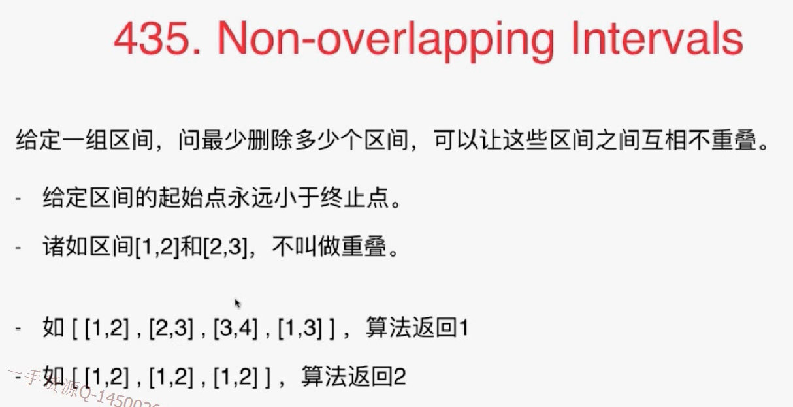
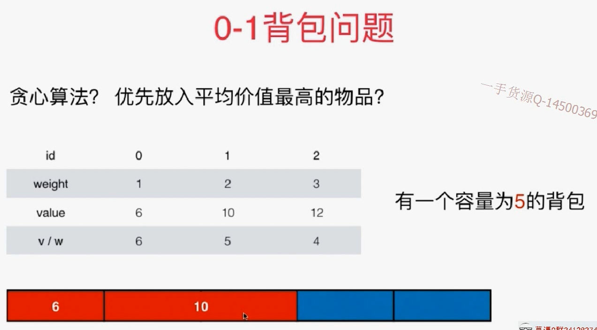
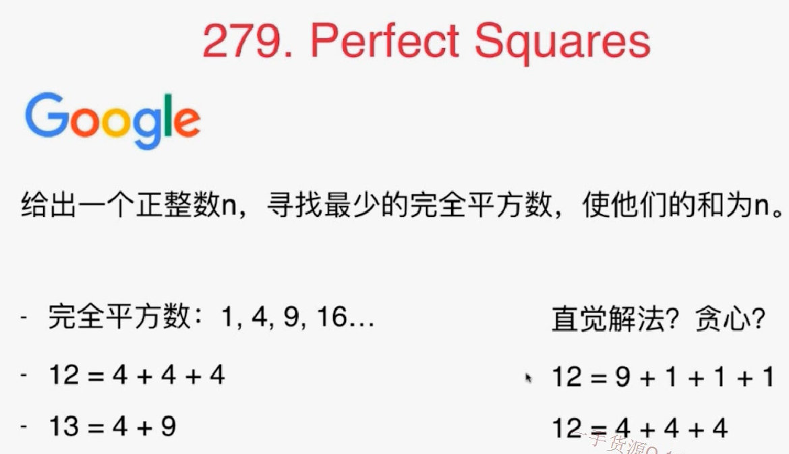
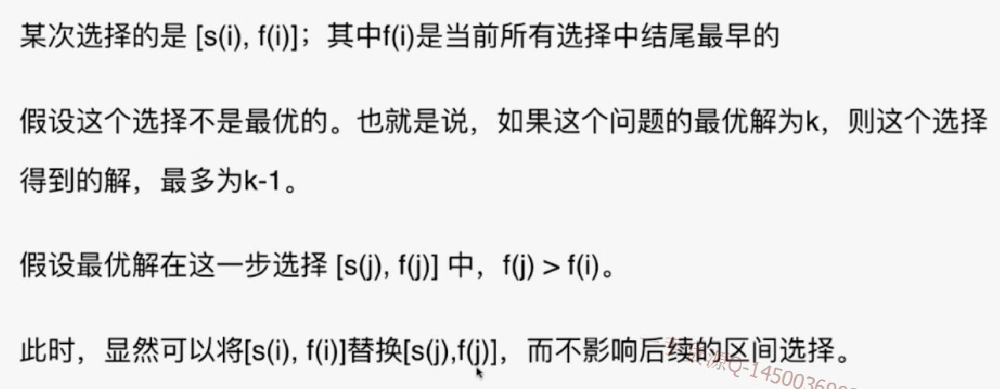

# 10.1 贪心基础 

贪心算法的编写并不难，难在如何确定这个问题能够用贪心算法解。

## 455.Assign Cookies


每次都把当前最大的饼干给最贪心的朋友，要先排序。


- 先尝试满足最贪心的小朋友.

  虽然对s, g 都进行了从小到大的排序，但是是从两个数组后面开始比较，即先满足最贪心的朋友。

```java
import java.util.Arrays;

/// 455. Assign Cookies
/// https://leetcode.com/problems/assign-cookies/description/
/// 先尝试满足最贪心的小朋友
/// 时间复杂度: O(nlogn)
/// 空间复杂度: O(1)
public class Solution {
    public int findContentChildren(int[] g, int[] s) {
        Arrays.sort(g);
        Arrays.sort(s);

        int gi = g.length - 1, si = s.length - 1;
        // 最终的答案
        int res = 0;
        while(gi >= 0 && si >= 0){
            if(s[si] >= g[gi]){
                res ++;
                si --;
            }
            gi --;
        }

        return res;
    }

    public static void main(String[] args) {
        int g1[] = {1, 2, 3};
        int s1[] = {1, 1};
        System.out.println((new Solution()).findContentChildren(g1, s1));

    }
}
```

## 练习

392 is subsequence

# 10.2 贪心算法与动态规划的关系 

## 435.Non-overlapping Intervals



转换题目思想：最多保留多少个区间。

**对于区间问题的常用排序方法：按照起始点排序**

### 动态规划

对于组合问题，都可以思考一下能不能用动态规划解决。很像最长上升子序列问题（可转换为动态规划）

```java
import java.util.Arrays;
import java.util.Comparator;

/// 435. Non-overlapping Intervals
/// https://leetcode.com/problems/non-overlapping-intervals/description/
/// 动态规划
/// 时间复杂度: O(n^2)
/// 空间复杂度: O(n)
public class Solution1 {
    // Definition for an interval.
    public static class Interval {
        int start;
        int end;
        Interval() { start = 0; end = 0; }
        Interval(int s, int e) { start = s; end = e; }
    }

    public int eraseOverlapIntervals(Interval[] intervals) {
        if(intervals.length == 0)
            return 0;

        Arrays.sort(intervals, new Comparator<Interval>() {
            @Override
            public int compare(Interval o1, Interval o2) {
                if(o1.start != o2.start)
                    return o1.start - o2.start;
                return o1.end - o2.end;
            }
        });

        // memo[i]表示以intervals[i]为结尾的区间能构成的最长不重叠区间序列
        int[] memo = new int[intervals.length];
        Arrays.fill(memo, 1);
        // i=0的情况就是只有一个子区间，这样就自己已经构成了一个序列，并且这个序列的结果已经银行在了memo中，答案就是1.
        for(int i = 1 ; i < intervals.length ; i ++)
            // memo[i]
            for(int j = 0 ; j < i ; j ++)
                if(intervals[i].start >= intervals[j].end)
                    memo[i] = Math.max(memo[i], 1 + memo[j]);

        int res = 0;
        for(int i = 0; i < memo.length ; i ++)
            res = Math.max(res, memo[i]);

        return intervals.length - res;
    }

    public static void main(String[] args) {
        Interval[] interval1 = {new Interval(1,2),
                                new Interval(2,3),
                                new Interval(3,4),
                                new Interval(1,3)};
        System.out.println((new Solution1()).eraseOverlapIntervals(interval1));
    }
}
```

### 贪心算法

按照区间结尾进行排序，每次选择结尾最早的，且和前一个区间不重叠的区间


```java
import java.util.Arrays;
import java.util.Comparator;

/// 435. Non-overlapping Intervals
/// https://leetcode.com/problems/non-overlapping-intervals/description/
/// 贪心算法
/// 时间复杂度: O(n)
/// 空间复杂度: O(n)
public class Solution2 {
    // Definition for an interval.
    public static class Interval {
        int start;
        int end;
        Interval() { start = 0; end = 0; }
        Interval(int s, int e) { start = s; end = e; }
    }

    public int eraseOverlapIntervals(Interval[] intervals) {
        if(intervals.length == 0)
            return 0;
		// 按结尾排序
        Arrays.sort(intervals, new Comparator<Interval>() {
            @Override
            public int compare(Interval o1, Interval o2) {
                if(o1.end != o2.end)
                    return o1.end - o2.end;
                return o1.start - o2.start;
            }
        });
		
        //取结尾最早的那个元素，也就是第0个，是一定要的
        int res = 1;
        // 记录前面的区间编号
        int pre = 0;
        // 从第一个开始比较
        for(int i = 1 ; i < intervals.length ; i ++)
            if(intervals[i].start >= intervals[pre].end){
                res ++;
                pre = i;
            }

        return intervals.length - res;
    }

    public static void main(String[] args) {
        Interval[] interval1 = {new Interval(1,2),
                new Interval(2,3),
                new Interval(3,4),
                new Interval(1,3)};
        System.out.println((new Solution2()).eraseOverlapIntervals(interval1));
    }
}
```

# 10.3 贪心选择性质的证明

**如果无法使用贪心算法，举出反例即可。所以测试自己的思想就举反例**

比如，以下反例：






## 如果无法举出反例，如何证明贪心算法的正确性？

数学归纳法 + 反证法。

比如：




总结：

贪心算法A，最有算法O，发现A完全能替代O，且不影响求出最优解。


贪心算法是算法设计中的一个部分（比如最小生成树，最短路径），一般不会有纯粹的贪心算法