# 图相关（无向图为主）

无向，有向；无权，有权；平行边，环。

# 图的表示：

## 邻接矩阵：适合稠密图

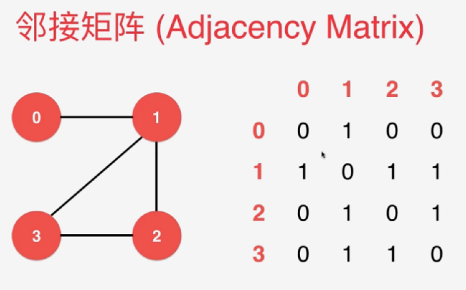

稠密图：

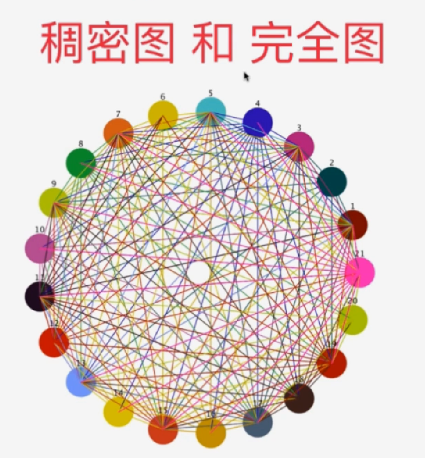

```java
package bobo.algo;

// 稠密图 - 邻接矩阵
public class DenseGraph {

    private int n;  // 节点数
    private int m;  // 边数
    private boolean directed;   // 是否为有向图
    private boolean[][] g;      // 图的具体数据

    // 构造函数
    public DenseGraph( int n , boolean directed ){
        assert n >= 0;
        this.n = n;
        this.m = 0;    // 初始化没有任何边
        this.directed = directed;
        // g初始化为n*n的布尔矩阵, 每一个g[i][j]均为false, 表示没有任和边
        // false为boolean型变量的默认值
        g = new boolean[n][n];
    }

    public int V(){ return n;} // 返回节点个数
    public int E(){ return m;} // 返回边的个数

    // 向图中添加一个边
    public void addEdge( int v , int w ){

        assert v >= 0 && v < n ;
        assert w >= 0 && w < n ;
		// 会不存储平行边
        if( hasEdge( v , w ) )
            return;

        g[v][w] = true;
        if( !directed )
            g[w][v] = true;

        m ++;
    }

    // 验证图中是否有从v到w的边
    boolean hasEdge( int v , int w ){
        assert v >= 0 && v < n ;
        assert w >= 0 && w < n ;
        return g[v][w];
    }
}
```

- 此时，会不存储平行边

## 邻接表：适合稀疏图

相当于许多链表。

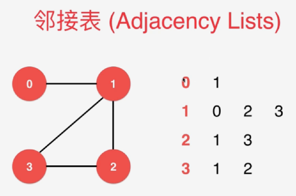

稀疏图：实际上一个点连出去的边远远小于能够连成的边

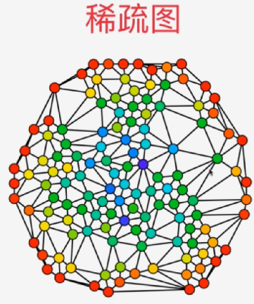

```java
public class SparseGraph {
    // 节点数
    private int n;
    // 边数
    private int m;
    // 是否为有向图
    private boolean directed;
    // 图的具体数据
    private Vector<Integer>[] g;

    // 构造函数
    public SparseGraph( int n , boolean directed ){
        assert n >= 0;
        this.n = n;
        // 初始化没有任何边
        this.m = 0;
        this.directed = directed;
        // g初始化为n个空的vector, 表示每一个g[i]都为空, 即没有任和边
        g = (Vector<Integer>[])new Vector[n];
        for(int i = 0 ; i < n ; i ++) {
            g[i] = new Vector<Integer>();
        }
    }

    public int V(){ return n;} // 返回节点个数
    public int E(){ return m;} // 返回边的个数

    // 向图中添加一个边
    public void addEdge( int v, int w ){
        assert v >= 0 && v < n ;
        assert w >= 0 && w < n ;

        g[v].add(w);
        // v!=w: 节点不相等且无向图，处理自环边
        if( v != w && !directed ) {
            g[w].add(v);
        }

        m ++;
    }

    // 验证图中是否有从v到w的边。复杂度是O(n)
    boolean hasEdge( int v , int w ){
        assert v >= 0 && v < n ;
        assert w >= 0 && w < n ;

        for( int i = 0 ; i < g[v].size() ; i ++ ) {
            if( g[v].elementAt(i) == w ) {
                return true;
            }
        }
        return false;
    }
}
```

- 如果要取消平行边，还要在每次addEdge的时候调用hasEdge方法去判断是否有v到w的边。所以为了保证效率，就在邻接表中允许有平行边。

# 遍历邻边：临边迭代器

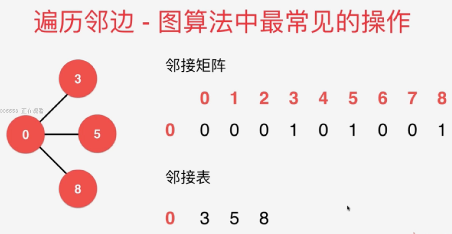

邻接矩阵中：O（v）

```java
// 返回图中一个顶点的所有邻边
// 由于java使用引用机制，返回一个Vector不会带来额外开销,
public Iterable<Integer> adj(int v) {
    assert v >= 0 && v < n;
    Vector<Integer> adjV = new Vector<Integer>();
    for(int i = 0 ; i < n ; i ++ )
        if( g[v][i] )
            adjV.add(i);
    return adjV;
}
```

邻接矩阵：O（E），通常都是稀疏图。

```java
// 返回图中一个顶点的所有邻边
// 由于java使用引用机制，返回一个Vector不会带来额外开销,
public Iterable<Integer> adj(int v) {
    assert v >= 0 && v < n;
    return g[v];
}
```

# 图的算法框架

把算法封装在类中，这样图的算法代码执行时，不管是稀疏图还是稠密图，就都能用了。

# 图的遍历

**深度优先：**树是一定会走到叶子节点，走完的。但是图中存在环，所以要记录一下哪些节点走过。

**应用：**求图中的连通分量。

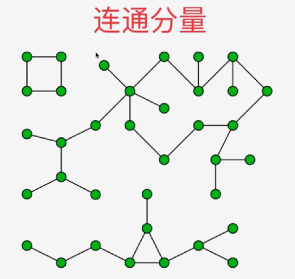

**广度优先**：求最短路径

# 带权图

邻接矩阵：将数组的值修改为权重，为了统一接口，存为类

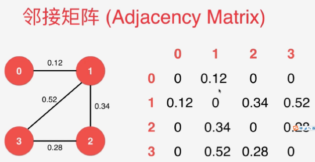

邻接表：封装一个edge类

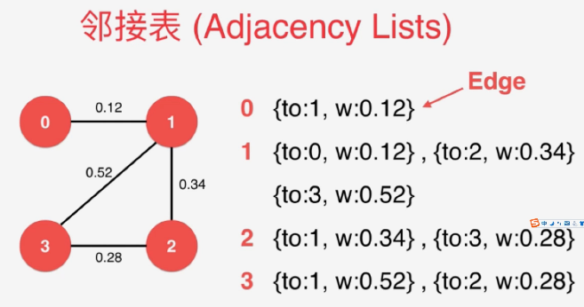

## 最小生成树：带权无向图，针对连通图

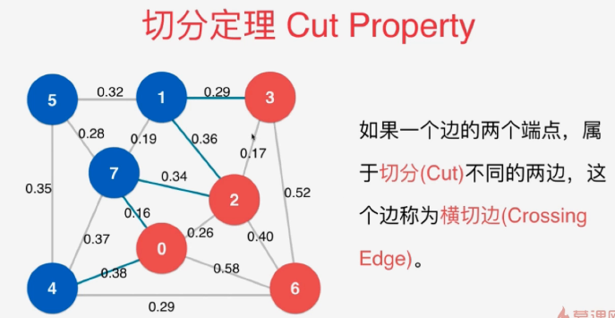

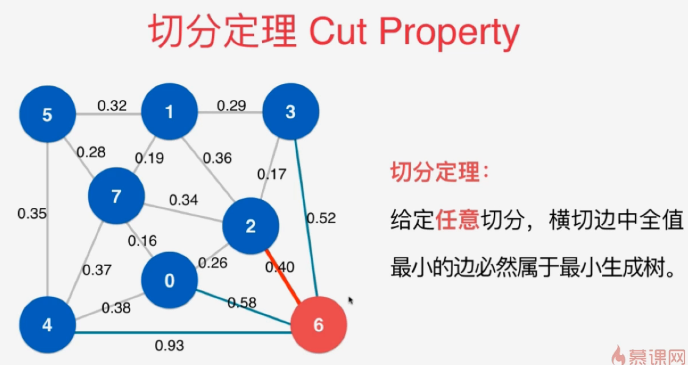

## Prim(Lazy-Prim)

- 用小根堆保存边。绿色为横切边。
- lazy的原因：如下图示，1,2已经相连。所以绿色边中的1-2,2-7已经不是横切边了，即不会是最小生成树的候选边，但是此处却没有把他剔除，是等到后面判断完才剔除。

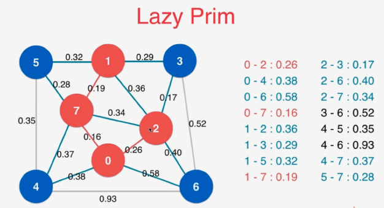

