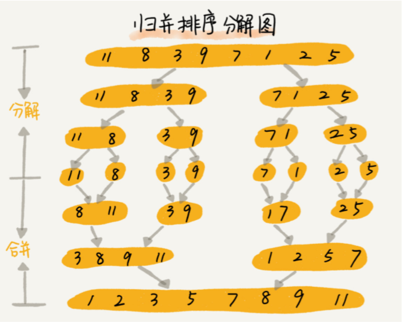
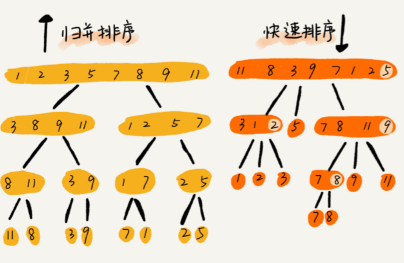
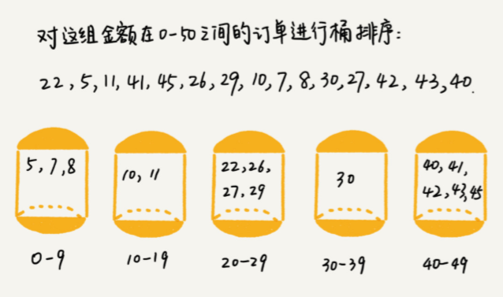
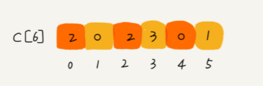
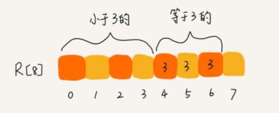
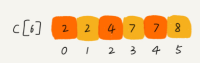
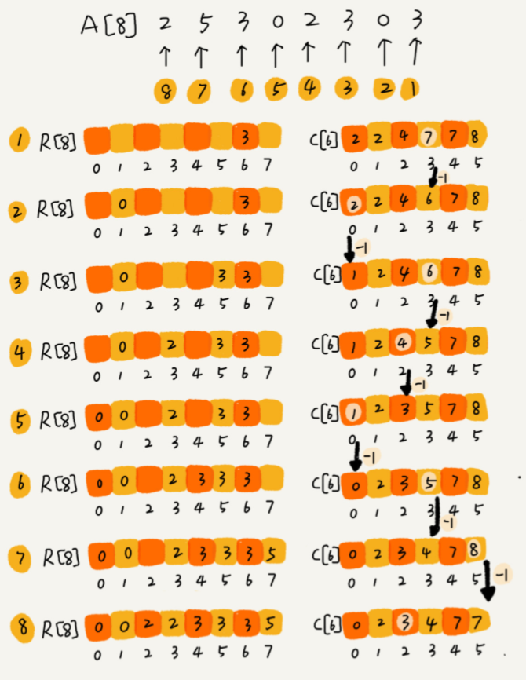

[TOC]

# 排序

## 排序算法分析指标

- 排序算法的执行效率

1. 最好情况、最坏情况、平均情况的原始数据---对应的时间复杂度
2. 时间复杂度的系数、常数 、低阶
3. 基于比较的排序算法：比较次数和交换（或移动）次数

- 排序算法的内存消耗 

  原地排序（Sorted in place）。原地排序 算法，就是特指空间复杂度是 O(1) 的排序算法。

- 排序算法的稳定性 

  如果待排序的序列中存在值相等的元素，经过排序之后， 相等元素之间原有的先后顺序不变。（因为真正开发时面向的是对象）

## 排序算法复杂度

可通过自定义比较函数，让排序算法不存在稳定性问题。

### Master Theorem

$$T(n) = aT(\frac{n}{b}) + O(n^d)$$

if $$log^a_b < d$$, $$T(n) = O(n^d)$$

if $$log^a_b = d$$, $$T(n) = O(n^{d}log^n)$$

if $$log^a_b > d$$, $$T(n) = O(n^{log_b^a})$$

More about [Master Theorem](http://www.gocalf.com/blog/algorithm-complexity-and-master-theorem.html)

| Name          | Time Complexity | Space Complexiy              | Stable      |
| ------------- | --------------- | ---------------------------- | ----------- |
| BubbleSort    | $$O(n^2)$$      | $$O(1)$$                     | can be true |
| InsertionSort | $$O(n^2)$$      | $$O(1)$$                     | can be true |
| SelectionSort | $$O(n^2)$$      | $$O(1)$$                     | false       |
| QuickSort     | $$O(nlogn)$$    | $$O(logn)，n层递归的栈空间$$ | false       |
| MergeSort     | $$O(nlogn)$$    | $$O(n)$$                     | true        |
| HeapSort      | $$O(nlogn)$$    | $$O(1)$$                     | false       |
| BucketSort    | $$O(n)$$        | $$O(n)$$+                    | false       |
| RadixSort     | $$O(n)$$        | $$O(n)$$+                    | false       |
| HillSort      | $$O(nlogn)$$    | $$O(1)$$                     | false       |

## 平均时间复杂度分析：“有序度”和“逆序度”

- 有序度是数组中具有有序关系的元素对的个数。有序元素对用数学表达式表示就是这样：

  `有序元素对：a[i] <= a[j], 如果 i < j`

- 对于一个完全有序的数组，比如 1,2,3,4,5,6，有序度就是$n*(n-1)/2$，也就是 15。我们把这种完全有序的数组的有序度叫作**满有序度**

- **逆序度 = 满有序度 - 有序度**。我们排序的过程就是一种增加有序度，减少逆序度的过程，最后达到满有序度，就说明排序完成了。

- 不管算法怎么改进，交换次数总是确定的，即为逆序度，也就是$n*(n-1)/2–初始有序度$

# 基于比较

## O(n^2)

### 1.冒泡：

- 每次冒泡操作都会对相邻的两个元素进行比较，看是否满足大小关系要求。
- 如果不满足就让它俩互换。一次冒泡会让至少一个元素移动到它应该在的位置， 重复 n 次，就完成了 n 个数据的排序工作。

```java
void bubbleSort(int[] arr) {
    if (arr == null) return;
    for (int e = arr.length - 1; e > 0; e--) {
        for (int i = 0; i < e; i++) {
            if (arr[i] > arr[i + 1]) swap(arr, i, i + 1);//stable
            // if (arr[i] >= arr[i + 1]) swap(arr, i, i + 1); //not stable
        }
    }
}
```

### 时间复杂度分析：

对于包含 n 个数据的数组进行冒泡排序。

1. 最坏情况下，初始状态的有序度是 0，所以要进行 n*(n-1)/2 次交换。*
2. 最好情况下，初始状态的有序度是 $n*(n-1)/2$，就不需要进行交换。我们可以取个中间值 n*(n-1)/4，来表示初始有序度既不是很高也不是很低的平均情况。*
3. 平均情况下，需要 n*(n-1)/4 次交换操作，比较操作肯定要比交换操作多，而复杂度的上限是 O(n )，所以平均情况下的时间复杂度就是 $O(n^2)$。

- 原地排序、稳定排序（有相邻的两个元素大小相等的时候，不做交换）、平均时间复杂度是 $O(n^2)$。

### 2.插入：从未排序区间中取一个元素，在已排序区间中找到合适的插入位置将其插入

- 在有序数组中插入新数据保持有序，借鉴了动态排序过程

- 首先将数组中的数据分为两个区间，已排序区间和未排序区间。
- 初始已排序区间只有一个元素，就是数组的第一个元素。
- 插入算法的核心思想是取未排序区间中的元素，在已排序区间中找到合适的插入位置将其插入，并保证已排序区间数据一直有序。
- 重复这个过程，直到未排序区间中元素为空，算法结束。

```java
void insertionSort(int[] arr) {
  	if (arr == null) return;
    for (int i = 1; i < arr.length; i++) {
        //从后往前找，挨个比较找出插入点
        for (int j = i - 1; j >= 0 && arr[j] > arr[j + 1]; j--) {//stable
        //for (int j = i - 1; j >= 0 && arr[j] >= arr[j + 1]; j--) {//not stable
            swap(arr, j, j + 1);
        }
    }
}
```

### 时间复杂度分析：

- 如果要排序的数据已经是有序的，我们并不需要搬移任何数据。
  1. 如果从尾到头在有序数据组里面查找插入位置，每次只需要比较一个数据就能确定插入的位置。所以最好是时间复杂度为 $O(n)$。
  2. 如果数组是倒序的，每次插入都相当于在数组的第一个位置插入新的数据，所以需要移动大量的数据，所以最坏情况时间复杂度为 $O(n^2)$。

- 对于不同的查找插入点方法（从头到尾、从尾到头），元素的比较次数是有区别的。但对于一个给定的初始序列，移动操作的次数总是固定的，就等于逆序度。
- 原地排序、稳定（对于值相同的元素，我们可以选择将后面出现的元素，插入到前面出现元素的后面，这样就可以保持原有的前后顺序不变，所以插入排序是稳定的排序算法）、平均时间复杂度是 $O(n^2)$。

### 3.选择：从未排序区间中找到最小的元素，将其放到已排序区间的末尾

- 分已排序区间和未排序区间。但是选择排序每次会从未排序区间中找到最小的元素，将其放到已排序区间的末尾。

```java
void selectionSort(int[] arr) {
  	if (arr == null) return;
    for (int i = 0; i < arr.length; i++) {
        int minIndex = i;
        for (int j = i + 1; j < arr.length; j++) {
            minIndex = arr[i] < arr[minIndex] ? i : minIndex;//not stable
        }
        swap(arr, i, minIndex);
    }
}
```

### 时间复杂度分析：

- 原地排序算法。选择排序的最好情况时间复杂度、 最坏情况和平均情况时间复杂度都为 $O(n^2)$。

- 选择排序是一种不稳定的排序算法。因为选择排序每次都要找剩余未排序元素中的最小值，并和前面的元素交换位置，这样破坏了稳定性。

  e.g. 比如 $5，8，5，2，9$ 这样一组数据，使用选择排序算法来排序的话，第一次找到最小元素2， 与第一个5交换位置，那第一个5和中间的5顺序就变了，所以就不稳定了。正是因此，相对于冒泡排序和插入排序，选择排序就稍微逊色了。

### 插入排序比冒泡更受欢迎

- 冒泡排序，插入排序不管怎么优化，元素交换的次数是一个固定值，是原始数据的逆序度。

- 但是，从代码实现上来看，冒泡排序的数据交换要比插入排序的数据移动要复杂，冒泡排序需要 3 个赋值操作，而插入排序只需要 1 个。

  ```
  冒泡排序中数据的交换操作： 
  if (a[j] > a[j+1]) { 
      // 交换   
      int tmp = a[j];   
      a[j] = a[j+1];   
      a[j+1] = tmp;   
      flag = true; 
  }
   
  插入排序中数据的移动操作： 
  if (a[j] > value) {  
      a[j+1] = a[j];  // 数据移动 
      } else {  
      break; 
  }
  
  ```

- 把执行一个赋值语句的时间粗略地计为单位时间（unit_time），然后分别用冒泡排序和插 入排序对同一个逆序度是 K 的数组进行排序。

  1. 用冒泡排序，需要 K 次交换操作，每次需要 3 个 赋值语句，所以交换操作总耗时就是 3*K 单位时间。
  2. 而插入排序中数据移动操作只需要 K 个单位时间。

### 总结：

上述三个算法的时间复杂度都是 O(n )， 比较高，适合小规模数据的排序

## O(nlogn)

### 1.归并：

- 先把数组从中间分成前后两部分

- 然后对前后两部分分别排序，再将排好序的两部分合并在一起，这样整个数组就都有序了。

  ```
  递推公式： merge_sort(p…r) = merge(merge_sort(p…q), merge_sort(q+1…r))
  终止条件： p >= r 不用再继续分解
  ```



```java
void mergeSort(int[] arr) {
  	if (arr == null) return;
  	mergeSort(arr, 0, arr.length - 1);
}

void mergetSort(int[] arr, int lo, int hi) {
    if (lo == hi) return;
  	int mid = lo + ((hi - lo) >> 1);
  	mergeSort(arr, lo, mid);
  	mergeSort(arr, mid + 1, hi);
  	merge(arr, lo, mid, hi);
}

void merge(int[] arr, int lo, int mid, int hi) {
    int[] help = new int[hi - lo + 1];
  	int i = 0;
  	int p1 = lo;
  	int p2 = mid + 1;
  	while (p1 <= mid && p2 <= hi) help[i++] = arr[p1] < arr[p2] ? arr[p1] : arr[p2];
  	while (p1 <= mid) help[i++] = arr[p1++];
	while (p2 <= hi) help[i++] = arr[p2++];
  	for (int i = 0; i < help.length; i++) arr[lo + i] = help[i];
}
```

### 时间复杂度分析：

- 我们假设对 n 个元素进行归并排序需要的时间是 T(n)，那分解成两个子数组排序的时间都是 T(n/2)。我们知道，merge() 函数合并两个有序子数组的时间复杂度是 O(n)。归并排序的时间复杂度的计算公式就是：

  ```
  T(1) = C；   n=1 时，只需要常量级的执行时间，所以表示为 C。 
  T(n) = 2*T(n/2) + n； n>1
  ```

- 通过这个公式，如何来求解 T(n) 

  ```
  T(n) = 2*T(n/2) + n     
       = 2*(2*T(n/4) + n/2) + n = 4*T(n/4) + 2*n
       = 4*(2*T(n/8) + n/4) + 2*n = 8*T(n/8) + 3*n 
       = 8*(2*T(n/16) + n/8) + 3*n = 16*T(n/16) + 4*n     
       ......     
       = 2^k * T(n/2^k) + k * n     
       ......
  
  ```

- 我们可以得到 $T(n) = 2^kT(n/2^k)+kn$。当 $T(n/2^k)=T(1) $时， 也就是$ n/2^k=1$,我们得到 $k=logn$ 。我们将 $k$ 值代入上面的公式，得到 $T(n)=Cn+nlogn$ 。如果我们用大 O 标记法来表示的话，T(n) 就等于 $O(nlogn)$。所以归并排序的时间复杂度是 $O(nlogn)$。

- 非原地（空间复杂度是$O(n)$）、归并排序的执行效率与要排序的原始数组的有序程度无关，所以其时间复杂度是非常稳定的、

### 2.快排：

- 从要排序的数组(下标从p到r之间的一组数据)，选择p到r之间的任意一个数据作为 pivot（分区点）。

- 遍历p到r之间的数据，将小于 pivot 的放到左边，将大于 pivot 的放到右边，将 pivot 放到中间。

- 经过这一步骤之后，数组p到r之间的数据就被分成了三个部分，前面 p 到 q-1 之 间都是小于 pivot 的，中间是 pivot，后面的 q+1 到 r 之间是大于 pivot 的。

- 用递归排序下标从 p 到 q-1 之间的数据和下标从 q+1 到 r 之间的数据，直到区间缩小为 1，就说明所有的数据都有序了。

  ```
  递推公式： quick_sort(p…r) = quick_sort(p…q-1) + quick_sort(q+1, r)
  终止条件： p >= r
  ```

  ```java
  void quickSort(int[] arr) {
      if (arr == null) return;
      quickSort(arr, 0, arr.length - 1);
  }
  
  void quickSort(int[] arr, int lo, int hi) {
      if (lo >= hi) return;
      int[] p = partition(arr, lo, hi);
      //a[lo...p[0] - 1] < a[p[0]] = a[p[0]...p[1]] < a[p[1] + 1 ... hi]
      quicksort(arr, lo, p[0] - 1);
      quicksort(arr, p[1] + 1, hi);
  }
  
  // 前后交换,返回pivot位置
  public int partition(int[] arr, int low, int high) {
      int pivot = arr[low];
      while (low < high) {
          while (low < high && arr[high] >= pivot) {
              --high;
          }
          arr[low] = arr[high];
          while (low < high && arr[low] <= pivot) {
              ++low;
          }
          arr[high] = arr[low];
      }
      arr[low] = pivot;
      return low;
  }
  // 优化枢纽的选取：随机选取，然后放在首位
  public int partition(int[] input, int start, int end) {
      int index = (int)(Math.random()*(end - start + 1));
      swap(input, start, index);
      int pivot = input[start];
      while (start < end) {
          while (start < end && input[end] >= pivot) {
              end--;
          }
          input[start] = input[end];
          while (start < end && input[start] <= pivot) {
              start++;
          }
          input[end] = input[start];
      }
      input[start] = pivot;
      return start;
  }
  
  private void swap(int[] input, int start, int index) {
      int tmp = input[start];
      input[start] = input[index];
      input[index] = tmp;
  }
  
  //三路快排，返回两个临界点
  int[] partition(int[] arr, int lo, int hi) {
      //not swap pivot, only for numbers
      int pivot = arr[lo + (int)(Math.random() * (hi - lo + 1))];
      int small = lo - 1;
      int cur = lo;
      int big = hi + 1;
      while (cur < big) {
          if (arr[cur] < pivot) swap(arr, ++small, cur++);
          else if (arr[cur] > pivot) swap(arr, cur, --big);
          else cur++;
      }
      return new int[]{small + 1, big - 1};
  }
  
  
  ```

- 通过游标 i 把 A[p…r-1] 分成两部分。A[p…i-1] 的元素都是小于 pivot 的，我们暂且叫它“已处理区间”，A[i…r-1] 是“未处理区间”。

- 每次都从未处理的区间 A[i…r-1] 中取一个元素 A[j]，与 pivot 对比，如果小于 pivot，则将其加入到已处理区间的尾部，也就是 A[i] 的位置。

- 在数组某个位置插入元素，需要搬移数据，非常耗时。当时我们也讲了一种处理技巧，就是交换，在 O(1) 的时间复杂度内完成插入操作。这里我们也借助这个思想，只需要将 A[i] 与 A[j] 交换，就可以在 O(1) 时间复杂度内将 A[j] 放到下标为 i 的位置。

### 时间复杂度分析：

- 原地、不稳定的排序算法（因为分区的过程涉及交换操作，如果数组中有两个 8，其中一个是 pivot，经过分区处理之后， 后面的 8 就有可能被放到了另一个 8 的前面，先后顺序就颠倒了）
- T(n) 在大部分情况下的时间复杂度都可以做到 O(nlogn)，只有在极端情况 下，才会退化到 O(n )。而且，我们也有很多方法将这个概率降到很低。

### 总结：

- 上述两个算法都是复杂度为 O(nlogn) 的排序算法，适合大规模的数据排序，比上面的三种排序算法要更常用。
- 上述两种排序算法都用到了分治思想
- 分治思想跟我们前面讲的递归思想很像。是的，分治算法一般都是用递归来实现的。**分治是一种解决问题的处理思想，递归是一种编程技巧**



- 归并排序的处理过程是由下到上的，先处理子问题，然后再合并。而快排正好相反， 它的处理过程是由上到下的，先分区，然后再处理子问题。
- 归并排序虽然是稳定的、时间复杂度为 O(nlogn) 的排序算法，但是它是非原地排序算法。快速排序通过设计巧妙的原地分区函数，可以实现原地排序，解决了归并排序占用太多内存的问题。

### 如何用快排思想在O(n)内查找第K大元素？

- 选择数组区间 A[0…n-1] 的最后一个元素 A[n-1] 作为 pivot，对数组 A[0…n-1] 原地分 区，这样数组就分成了三部分，A[0…p-1]、A[p]、A[p+1…n-1]。
- 如果 p+1=K，那 A[p] 就是要求解的元素；如果 K>p+1, 说明第 K 大元素出现在 A[p+1…n-1] 区间，我们再按照上面的思路递归地在 A[p+1…n-1] 这个区间内查找。同理，如果 K<p+1，那 我们就在 A[0…p-1] 区间查找。
- 为什么上述解决思路的时间复杂度是 O(n)？
  1. 第一次分区查找，我们需要对大小为 n 的数组执行分区操作，需要遍历 n 个元素。第二次分区 查找，我们只需要对大小为 n/2 的数组执行分区操作，需要遍历 n/2 个元素。依次类推，分区 遍历元素的个数分别为、n/2、n/4、n/8、n/16.……直到区间缩小为 1。
  2. 如果我们把每次分区遍历的元素个数加起来，就是：n+n/2+n/4+n/8+…+1。这是一个等比数 列求和，最后的和等于 2n-1。所以，上述解决思路的时间复杂度就为 O(n)。

# 不基于比较

时间复杂度是线性的 & 叫做线性排序

## 1.桶排序

- 核心思想是将要排序的数据分到几个有序的桶里，每个桶里的数据再单独进行排序。
- 桶内排完序之后，再把每个桶里的数据按照顺序依次取出，组成的序列就是有序的了。



- 如果要排序的数据有 n 个，我们把它们均匀地划分到 m 个桶内，每个桶里就有 k=n/m 个元 素。每个桶内部使用快速排序，时间复杂度为 $O(k * logk)$。m 个桶排序的时间复杂度就是 $O(m * k * logk)$，因为 k=n/m，所以整个桶排序的时间复杂度就是 $O(n*log(n/m))$。当桶的个数 m 接近数据个数 n 时，$log(n/m)$ 就是一个非常小的常量，这个时候桶排序的时间复杂度接近 O(n)。

```java
void buckertSort(int[] arr) {
    if (arr == null) return;
  	int max = Integer.MIN_VALUE;
  	for (int n: arr) max = Math.max(max, n);
  	int[] bucket = new int[max + 1];
  	for (int n: arr) bucket[n]++;
  	int i = 0;
  	for (int j = 0; j < bucket.length; j++) {
        while(bucket[j]-- > 0) arr[i++] = j;
    }
}
```

## 适用场景：

1. 要排序的数据需要很容易就能划分成 m 个桶，并且，桶与桶之间有着天然的大小顺序。 这样每个桶内的数据都排序完之后，桶与桶之间的数据不需要再进行排序。
2. 数据在各个桶之间的分布是比较均匀的。如果数据经过桶的划分之后，有些桶里的数据非常多，有些非常少，很不平均，那桶内数据排序的时间复杂度就不是常量级了。在极端情况下， 如果数据都被划分到一个桶里，那就退化为 O(nlogn) 的排序算法了。
3. 桶排序比较适合用在外部排序中。所谓的外部排序就是数据存储在外部磁盘中，数据量比较大， 内存有限，无法将数据全部加载到内存中。

## 2.计数排序

- 计数排序其实是桶排序的一种特殊情况。
- 当要排序的 n 个数据，所处的范围并不大的时候，比如最大值是 k，我们就可以把数据划分成 k 个桶。每个桶内的数据值都是相同的， 省掉了桶内排序的时间。

```java
// 计数排序，a 是数组，n 是数组大小。假设数组中存储的都是非负整数。 public void countingSort(int[] a, int n) {  
	if (n <= 1) return;
	// 查找数组中数据的范围  
	int max = a[0];  
	for (int i = 1; i < n; ++i) {
	    if (max < a[i]) {
	          max = a[i];    
	        }
	}
 
    int[] c = new int[max + 1]; // 申请一个计数数组 c，下标大小 [0,max]  
    for (int i = 0; i <= max; ++i) {
        c[i] = 0;  
    }
 
  	// 计算每个元素的个数，放入c中  
  	for (int i = 0; i < n; ++i) {
  	    c[a[i]]++;  
  	}
 
    // 依次累加  
    for (int i = 1; i <= max; ++i) {    
    	c[i] = c[i-1] + c[i];  
    }
 
    // 临时数组 r，存储排序之后的结果  
    int[] r = new int[n];  
    // 计算排序的关键步骤，有点难理解  
    for (int i = n - 1; i >= 0; --i) {    
    	int index = c[a[i]]-1;    
    	r[index] = a[i];    
    	c[a[i]]--;  
    }
 
    // 将结果拷贝给 a 数组  
    for (int i = 0; i < n; ++i) {
        a[i] = r[i];  
    } 
}
```

## 适用场景

- 计数排序只能用在数据范围不大的场景中，如果数据范围 k 比要排序的数据 n 大 很多，就不适合用计数排序了。
- 计数排序只能给非负整数排序，如果要排序的数据是其他 类型的，要将其在不改变相对大小的情况下，转化为非负整数。

比如：高考查分数系统。如果你所在的省有50万考生，如何通过成绩快速排序得出名次呢？

1. 考生的满分是 900 分，最小是 0 分，这个数据的范围很小，所以我们可以分成 901 个桶，对应分数从 0 分到 900 分。根据考生的成绩，我们将这 50 万考生划分到这 901 个桶里。桶内的数据都是分数相同的考生，所以并不需要再进行排序。我们只需要依次扫描每个桶，将桶内的考生依次输出到一个数组中，就实现了 50 万考生的排序。因为只涉及扫描遍历操作，所以时间复杂度是 O(n)。
2. 计数排序的算法思想跟桶排序非常类似，只是桶的大小粒度不一样。不过，为什么这个排序算法叫“计数”排序呢？“计数”的含义来自哪里呢？

- 想弄明白这个问题，我们就要来看计数排序算法的实现方法。我还拿考生那个例子来解释。为了方便说明，我对数据规模做了简化。假设只有 8 个考生，分数在 0 到 5 分之间。这 8 个考生的 成绩我们放在一个数组 A[8] 中，它们分别是：2，5，3，0，2，3，0，3。

- 考生的成绩从 0 到 5 分，我们使用大小为 6 的数组 C[6] 表示桶，其中下标对应分数。不过， C[6] 内存储的并不是考生，而是对应的考生个数。像我刚刚举的那个例子，我们只需要遍历一遍考生分数，就可以得到 C[6] 的值。

  

- 可以看出，分数为 3 分的考生有 3 个，小于 3 分的考生有 4 个，所以，成绩为 3 分的考 生在排序之后的有序数组 R[8] 中，会保存下标 4，5，6 的位置。

  

- 如何快速计算出，每个分数的考生在有序数组中对应的存储位置呢？

  1. 我们对 C[6] 数组顺序求和，C[6] 存储的数据就变成了下面这样子。C[k] 里存储 小于等于分数 k 的考生个数。

     

  2. **从后到前**依次扫描数组 A。比如，当扫描到 3 时，我们可以从数组 C 中取出下标为 3 的值 7，也就是说，到目前为止，包括自己在内，分数小于等于 3 的考生有 7 个，也就是说 3 是数组 R 中的第 7 个元素（也就是数组 R 中下标为 6 的位置）。当 3 放入到数组 R 中后，小于等 于 3 的元素就只剩下了 6 个了，所以相应的 C[3] 要减 1，变成 6。

  3. 以此类推，当我们扫描到第 2 个分数为 3 的考生的时候，就会把它放入数组 R 中的第 6 个元素 的位置（也就是下标为 5 的位置）。当我们扫描完整个数组 A 后，数组 R 内的数据就是按照分 数从小到大有序排列的了。

  

## 3.基数排序

假设我们有 10 万个手机号码，希望将这 10 万个手机号码从小到大排序.

- 我们之前讲的快排，时间复杂度可以做到 O(nlogn)

- 桶排序、计数排序：手机号码有 11 位，范围太大，显然不适合用这两种排序算法。

   

- 这里按照每位来排序的排序算法要是稳定的，否则这个实现思路就是不正确的。因为如果 是非稳定排序算法，那最后一次排序只会考虑最高位的大小顺序，完全不管其他位的大小关系， 那么低位的排序就完全没有意义了。

```java
// only for no-negative value
void radixSort(int[] arr) {
  	if (arr == null || arr.length < 2) {
      	return;
    }
  	radixSort(arr, 0, arr.length - 1, maxbits(arr));
}

int maxbits(int[] arr) {
    int max = Integer.MIN_VALUE;
  	//get the max of an array
    for (int i = 0; i < arr.length; i++) max = Math.max(max, arr[i]);
    int res = 0;
  	//count digits
    while (max > 0) {
      	res++;
      	max /= 10;
    }
    return res;
}

void radixSort(int[] arr, int begin, int end, int digit) {
    final int radix = 10;
    int i = 0, j = 0;
    int[] count = new int[radix];
    int[] bucket = new int[end - begin + 1];
    for (int d = 1; d <= digit; d++) {
        for (i = 0; i < radix; i++) {
          	count[i] = 0;
        }
        for (i = begin; i <= end; i++) {
          	j = getDigit(arr[i], d);
          	count[j]++;
        }
        for (i = 1; i < radix; i++) {
          	count[i] = count[i] + count[i - 1];
        }
        for (i = end; i >= begin; i--) {
         	j = getDigit(arr[i], d);
          	bucket[count[j] - 1] = arr[i];
          	count[j]--;
        }
        for (i = begin, j = 0; i <= end; i++, j++) {
          	arr[i] = bucket[j];
        }
    }
}

public static int getDigit(int x, int d) {
  	return ((x / ((int) Math.pow(10, d - 1))) % 10);
}
```

## 适用场景：

- 非负数，要排序的数据可以分割出独立的“位”来比较，而且位之间有递进的关系，如果 a 数据的高位比 b 数据大，那剩下的低位就不用比较了。
- 每一位的数据范围不能太大，要可以用线性排序算法来排序，否则，基数排序的时间复杂度就无法做到 O(n) 了

## 总结：

- 桶排序和计数排序的排序思想是非常相似的，都是针对范围不大的数据，将数据划分成不同的桶来实现排序。
- 基数排序要求数据可以划分成高低位，位之间有递进关系。比较两个数，我们只需要比较高位，高位相同的再比较低位。而且每一位的数据范围不能太大，因为基数排序算法需要借助桶排序或者计数排序来完成每一个位的排序工作。

## 4.堆排序

- 堆是具有以下性质的**完全二叉树**：每个结点的值都大于或等于其左右孩子结点的值，称为大顶堆；或者每个结点的值都小于或等于其左右孩子结点的值，称为小顶堆。 

- 堆排序是一种选择排序，它的最坏，最好，平均时间复杂度均为O(nlogn)，它也是不稳定排序 

- 用数组存储二叉树，从下标1开始

  - 左孩子: 2 * i 
  - 右孩子: 2 * i + 1
  - 父亲节点: i / 2

- 堆排序：

  1. 将待排序序列构造成一个大顶堆（升序采用大顶堆，降序采用小顶堆 ）
  2. 整个序列的最大值就是堆顶的根节点。将其与末尾元素进行交换，此时末尾就为最大值。
  3. 然后将剩余n-1个元素重新构造成一个堆，这样会得到n个元素的次小值。 

  

```java
class MaxHeap<T extends Comparable>{

    private T[] data;
    private int count;
    private int capacity;

    //两个初始化函数
    public MaxHeap(int capacity){
        // 接口类型变量
        data = (T[]) new Comparable[capacity+1];
        this.capacity = capacity;
        count = 0;
    }

    public MaxHeap(T arr[]){
        capacity = arr.length;
        data = (T[])new Comparable[capacity+1];

        for (int i = 0; i < capacity; i++)
            data[i+1] = arr[i];
        count = arr.length;

        for (int i = count/2 ; i >= 1; i--) {
            ShiftDown(i);
        }
    }

    // 交换堆中索引为i和j的两个元素
    private void swap(int i, int j){
        T t = data[i];
        data[i] = data[j];
        data[j] = t;
    }

    public int getCount(){
        return count;
    }

    public boolean isEmpty(){
        return count==0;
    }

    public void insert(T item){
        assert count+1 <= capacity;
        data[count+1] = item;
        count++;
        ShiftUp(count);
    }

    public T getMax(){
        assert count>0;
        T ret = data[1];
        swap(1,count);
        ShiftDown(1);
        return ret;
    }
    //辅助函数
    private void ShiftUp(int i){
        while (i > 1 && data[i/2].compareTo(data[i]) < 0){
            swap(i,i/2);
            i /= 2;
        }
    }

    private void ShiftDown(int i){
        while (i*2 <= count) {
            int j = i*2;
            if(j + 1 <= count && data[j+1].compareTo(data[j]) > 0)
                j++;
            if(data[i].compareTo(data[j]) >= 0)
                break;
            swap(i,j);
            i = j;
        }
    }
}
```

## 5.拓扑排序

- 拓扑排序通常用来“排序”具有依赖关系的任务。

**比如：**如果用一个DAG图来表示一个工程，其中每个顶点表示工程中的一个任务，用有向边<A,B><A,B>表示在做任务 B 之前必须先完成任务 A。故在这个工程中，任意两个任务要么具有确定的先后关系，要么是没有关系，绝对不存在互相矛盾的关系（即环路）。

**简介：** 在图论中，**拓扑排序（Topological Sorting）**是一个**有向无环图（DAG, Directed Acyclic Graph）**的所有顶点的线性序列。且该序列必须满足下面两个条件：

1、每个顶点出现且只出现一次。 

2、若存在一条从顶点 A 到顶点 B 的路径，那么在序列中顶点 A 出现在顶点 B 的前面。 有向无环图（DAG）才有拓扑排序，非DAG图没有拓扑排序一说。 

### 实现原理

 

1、从 DAG 图中选择一个没有前驱（即入度为0）的顶点并输出。 

2、从图中删除该顶点和所有以它为起点的有向边。 

3、重复 1 和 2 直到当前的 DAG 图为空或**当前图中不存在无前驱的顶点为止**。若还有边存在说明有向图中必然存在环。 

于是，得到拓扑排序后的结果是 { 1, 2, 4, 3, 5 }。 

### 举例：207. Course Schedule  

**DFS**

如果这个图中存在一个环的话，那么肯定无法完成任务。比如1->2，2->3，3->1，即形成了一个环时返回false。所以我们把原问题转化为检测图中是否有环。检测环的方法即：在一次dfs的遍历过程中，从某个节点出发，如果又回到该节点，那么此图有环！

　　我们依次从任意节点出发，遍历该节点可以到达的所有节点，我们用一个向量来记录从该节点出发经过的节点。为了防止重复，我们用变量记录所有遍历过的节点。全部访问完证明没有环，将此节点设为未访问，进行回溯。

```java
// DFS实现
    public boolean canFinish1(int numCourses, int[][] prerequisites) {
        ArrayList[] graph = new ArrayList[numCourses];
        boolean[] visited = new boolean[numCourses];

        for (int i = 0; i < numCourses; i++) {
            graph[i] = new ArrayList();
        }

        for (int i = 0; i < prerequisites.length; i++) {
            graph[prerequisites[i][0]].add(prerequisites[i][1]);
        }

        for (int i = 0; i < graph.length; i++) {
            if (!visited[i]) {
                if (!dfs(graph, visited, i)) {
                    return false;
                }
            }
        }
        return true;
    }

    private boolean dfs(ArrayList[] graph, boolean[] visited, int course) {
        if (visited[course] == true) {
            return false;
        }
        visited[course] = true;
        for (int i = 0; i < graph[course].size(); i++) {
            int courseSecond = (int)graph[course].get(i);
            if (!dfs(graph, visited, courseSecond)) {
                return false;
            }
        }
        visited[course] = false;
        return true;
    }
```

**BFS：**

```
// BFS入度法实现
    public boolean canFinish(int numCourses, int[][] prerequisites) {
        ArrayList[] graph = new ArrayList[numCourses];
        int[] degree = new int[numCourses];
        Queue<Integer> queue = new LinkedList<>();
        int count = numCourses;

        for (int i = 0; i < numCourses; i++) {
            graph[i] = new ArrayList();
        }

        for (int i = 0; i < prerequisites.length; i++) {
            degree[prerequisites[i][1]]++;
            graph[prerequisites[i][0]].add(prerequisites[i][1]);
        }

        for (int i = 0; i < degree.length; i++) {
            if (degree[i] == 0) {
                queue.offer(i);
                count--;
            }
        }

        while (!queue.isEmpty()) {
            int courseFirst = queue.poll();
            for (int i = 0; i < graph[courseFirst].size(); i++) {
                int courseSecond = (int) graph[courseFirst].get(i);
                degree[courseSecond]--;
                if (degree[courseSecond] == 0) {
                    queue.offer(courseSecond);
                    count--;
                }
            }
        }
        return count == 0;
    }
```


# 技巧

## 不适用额外空间交换两个数

通常：

```java
int swap(int[] arr, int a, int b) {
	int c = arr[a];
  	arr[a] = arr[b];
  	arr[b] = c;
}
```

异或：(a==b时不能用，a，b会为0)

```java
int swap(int[] arr, int a, int b) {
  	arr[a] = arr[a] ^ arr[b]; // a = a ^ b
  	arr[b] = arr[a] ^ arr[b]; // b = a ^ b ^ b = a
  	arr[a] = arr[a] ^ arr[b]; // a = a ^ b ^ a = b
}
```

## 获取mid

通常：可能会溢出

```java
int mid = (lo + hi) / 2;
```

不会溢出

```java
int mid = lo + ((hi - lo) >> 1);
```

## 获取随机数

```java
//Math.random(): return a double satisfing [0.0, 1.0)
int pivot = lo + (int)(hi - lo + 1) * Math.random()
```

## 如何实现一个通用的、高性能的排序函数？

通用：排除桶排序。 适合各种规模的数据，选择olog(n)算法。--快排、堆排序

-  Glibc 中的 qsort() 函数
  1. 所以对于小数据量的排序，qsort() 会优先使用归并排序来排序输入数据，因为归并排序的空间复杂度是 O(n)，
  2. 要排序的数据量比较大的时候，qsort() 会改为用快速排序算法来排序。qsort() 选择分区点的方法就是“三数取中法”
  3. 对于递归太深会导致堆栈溢出的问题，qsort() 是通过自己实现一个堆上的栈， 手动模拟递归来解决的。
  4. 在快速排序的过程中，当要排序的区间中，元素的个数小于等于4时，qsort() 就退化为插入排序
- JAVA中Arrays,sort()
  1. n < 60, 采用插入排序，避免栈溢出&时间常数比快排小
  2. 待排序类型是基本类型，使用快排；若是引用类型，使用归并因为稳定。

# 练习

## 使快排稳定

> 不采用任何额外空间，对奇数和偶数进行排序，并保持其相对顺序不变。

这个问题相当于让快排变稳定。有文章，但是很难。答案是不可能

## 数据流的中位数

1. 用没有排序的数组保存：partion找到中位数，插入复杂度O(1)，找中位数O(n)
2. 排序的数组：插入O(n)，找中位数O(1)
3. 排序的链表：用O(n)的时间找到合适的位置插入，定义两个指针指向链表中间的节点，O(1)得到中位数
4. 二叉搜索树：在每个节点上保持以该节点为root的子树上一共有多少节点，插入为O(logn)，查找O(logn)。但当二叉树退化成链表就需要O(n)
5. AVL树：插入O(logn)，中位数O(1)
6. 堆：数组长度是偶数，中位数有两个p1,p2，p1是左半边的最大值，p2是右半边的最小值，所以不需要左边和右边有序。只需要知道这两个数即可。用一个大根堆和一个小根堆保存，插入时间O(logn)，取中位数O(1)

堆的实现：

1. 保证数据平均分到两个堆，所以两个堆数据的数目之差不能超过1：因此可以通过当前数是第奇数个数的时候放到大根堆，偶数时放到小根堆。
2. 要保证大根堆里所有数据都要小于小根堆的数据：将要插入小根堆的数据先插入大根堆，然后把大根堆的顶部拿出给小根堆。

```java
import java.util.Comparator;
import java.util.PriorityQueue;

public class Solution {
    PriorityQueue<Integer> bigHeap = new PriorityQueue<>(new Comparator<Integer>() {
        @Override
        public int compare(Integer o1, Integer o2) {
            return o2.compareTo(o1);
        }
    });
    PriorityQueue<Integer> smallHeap = new PriorityQueue<>();
    int index = 0;
    int tmp;
    /**
     * @Author liu Ruiqing
     * @Description  奇数时向小根堆插入，偶数时向大根堆插入
     * @Date 2018/12/11
     * @Param [num]
     * @return void
     **/
    public void Insert(Integer num) {
        index++;
        if ((index&1) == 0) {
            smallHeap.offer(num);
            tmp = smallHeap.poll();
            bigHeap.offer(tmp);
        } else {
            bigHeap.offer(num);
            tmp = bigHeap.poll();
            smallHeap.offer(tmp);
        }
    }

    public Double GetMedian() {
        if((index&1)==1){
            return (double)smallHeap.peek();
        } else {
            // 注意这里除法，要先转换为double,不能用>>
            double res = ((double)smallHeap.peek() + (double)bigHeap.peek()) / 2;
            return res;
        }
    }

    public static void main(String[] args) {
        int[] a = {5,2,3,4,1,6,7,0,8};
        Solution s = new Solution();
        for (int num : a) {
            s.Insert(num);
            System.out.println(s.GetMedian());
        }
    }
}

```

