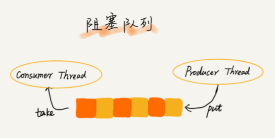

# 线性表结构

# 数组

数组 （Array）是一种**线性表(数据最多只有前和后两个方向)**数据结构。它用一组**连续的内存空间**，来存储一组具有**相同类型**的数据。

## 随机寻址

当计算机需要随机访问数组中的某个元素时，它会首先通过下面的寻址公式，计算出该元素存储的内存地址：

` a[i]_address = base_address + i * data_type_size`

**要特别纠正一个“错误”：数组和链表的区别**，

很多人都回答说，“链表适合插入、删除，时间复杂度 O(1)；数组适合查找，查找时间复杂度为 O(1)”。

实际上，这种表述是不准确的。数组是适合查找操作，但是查找的时间复杂度并不为 O(1)。即便是排好序的数组，你用二分查找，时间复杂度也是 O(logn)。所以，正确的表述应该是，数组支持随机访问，根据下标随机访问的时间复杂度为 O(1)。

## 低效的“插入”和“删除”

- 插入

> 原本要将a插入数组x位置上，需要将x-end的值后移一位。

现在需要将元素 a 插入到第 x 个位置。我们只需要将原本x位置的数放入到end+1位置上，将 x位置的值赋值为a即可

- 删除

> 原本要删除数组x位置上的数，需要将(x+1) - end的值前移一位。

在某些特殊场景下，不追求数组中数据的连续性：将多次删除操作集中在一起执行，删除的效率会提高。

- 先记录下已经删除的数据，每次的删除操作并不是真正地搬移数据，只是记录数据已经被删除。当数组没有更多空间存储数据时，再触发执行一次真正的删除操作，大大减少了删除操作导致的数据搬移。**即 JVM 标记清除垃圾回收算法的核心思想**

## 警惕数组的访问越界问题 

## 容器能否完全替代数组？ 

- 什么时候适合用数组，什么时候适合用容器呢？
  1. 容器可以将操作的细节封装起来
  2. 支持动态扩容

## 为什么大多数编程语言中，数组要从 0 开始编号，而不是从1开始呢？

从数组存储的内存模型上来看，“下标”最确切的定义应该是“偏移（offset）”。前面也讲到，如果用 a 来表示数组的首地址，a[0] 就是偏移为 0 的位置，也就是首地址，a[k] 就表示偏移 k 个 type_size 的位置，所以计算 a[k] 的内存地址只需要用这个公式：

` a[k]_address = base_address + k * type_size`

如果数组从 1 开始计数，那我们计算数组元素 a[k] 的内存地址就会变为

` a[k]_address = base_address + (k-1) * type_size`

对于 CPU 来说，就是多了一次减法指令。作为最基础的数据结构，不能浪费时间。

## 练习题：

- 输入一个整数数组，实现一个函数来调整该数组中数字的顺序，使得所有的奇数位于数组的前半部分，所有的偶数位于数组的后半部分，并保证奇数和奇数，偶数和偶数之间的相对位置不变。 
- 注意要保持相对顺序不变，只能用稳定的排序

```java
public void reOrderArray(int [] array) {
    if(array == null || array.length == 0 || array.length == 1) {
        return;
    }
    int oddIdx = 0;
    for (int i = 0; i < array.length; i++) {
        if ((array[i]&1)==1) {
            int j = i;
            while (j > oddIdx) {
                int tmp = array[j];
                array[j] = array[j-1];
                array[j-1] = tmp;
                j--;
            }
            oddIdx++;
        }
    }
}
```

### 找出数组中重复的数字

长度为 n的整数数组 `nums`，数字都在 0∼n−1 的范围内。某些数字是重复的，但不知道有几个数字重复了，也不知道每个数字重复了几次。找出数组中任意一个重复的数字。 

```

```

### 不修改数组

```

```


## 和为S的连续正整数序列

滑动窗口思想

```java
ArrayList<ArrayList<Integer>> ans;
    public ArrayList<ArrayList<Integer> > FindContinuousSequence(int sum) {
        ans = new ArrayList<>();
        if (sum <= 0) {
            return ans;
        }
        int begin = 1, end = 2, curSum = begin + end, mid = (sum - 1)/2;
        while(begin <= mid) {
            if (curSum == sum) {
                addRes(begin,end);
                end++;
                curSum += end;
            } else if (curSum > sum ) {
                curSum -= begin;
                begin++;
            } else {
                end++;
                curSum += end;
            }
        }
        return ans;
    }
    
    public void addRes(int begin, int end) {
        ArrayList<Integer> tmp = new ArrayList<>();
        for(int i = begin; i <= end; i++) {
            tmp.add(i);
        }
        ans.add(tmp);
    }
```


# 链表（LRU缓存淘汰）

单链表、双向链表和循环链表。

- 双向链表可以支持 O(1) 时间复杂度的情况下找到前驱结点，该特点使双向链表在某些情况下的插入、删除等操作都要比单链表简单、高效。

比如：

- 删除结点中“值等于某个给定值”的结点；
- 删除给定指针指向的结点。

1. 对于第一种情况，不管是单链表还是双向链表，为了查找到值等于给定值的结点，都需要从头结点开始依次遍历对比，直到找到值等于给定值的结点，然后删除。

   单纯的删除操作时间复杂度是 O(1)，遍历查找的时间是主要的耗时点，对应的时间复杂度为O(n)。根据时间复杂度分析中的加法法则，删除值等于给定值的结点对应的链表操作的总时间复杂度为 O(n)。

2. 对于第二种情况，已知要删除结点的指针，但是还需要其前驱结点。单链表要从头结点开始遍历找到前驱节点，直到 p->next=q，复杂度为 O(n)；

   但双向链表中的结点已经保存了前驱结点的指针，不需要遍历。复杂度为 O(1)

    **LinkedHashMap 的实现原理，就会发现其 中就用到了双向链表这种数据结构。**

## 单链表反转

```java
public ListNode ReverseList(ListNode head) {
    if (head == null || head.next == null) {
        return head;
    }

    ListNode next = null, cur = head, pre = null;
    //最后一个节点也要做翻转
    while (cur != null) {
        next = cur.next;
        cur.next = pre;
        pre = cur;
        cur = next;
    }
    //此时cur=null,要返回前面一个数
    return pre;
}
```

## 反转中间一部分

## 倒数第k个节点

- 思路：快慢指针，快指针走k-1步（正好到第k个节点），慢指针再开始走，这样快慢指针之间总是相差k。快指针到头，慢指针就是倒数第k个。
- **注意** 
  1. k=0, k-1会是负数，造成无限循环。因为k的计数从1开始，所以约定是0的话返回Null
  2. 给定的链表头部是空，应该返回空
  3. 链表长度小于k，应该返回空

```java
public ListNode FindKthToTail(ListNode head,int k) {
        if ( head == null || k == 0) {
            return null;
        }
        ListNode slow = head;
        ListNode fast = head;
        
        for(int i = 0; i < k - 1; i++) {
            if (fast.next != null) {
                fast = fast.next;
            } else { //链表节点数 < k的情况
                return null;
            }
        }
        
        while (fast.next != null) {
            fast = fast.next;
            slow = slow.next;
        }
        return slow;
    }
```

## 链表中环的检测&环的入口节点

- 思路：快慢指针。慢指针每次走1步，快指针一次走2步。相遇的点在A。设此时快指针走了2x，慢指针走了x。则x=环的长度。从链表开头到A的距离为慢指针走的长度 x=a+b, 环的长度为x. 所以A到环的入口的距离为x-a=b。所以要求链表入口到环的入口的距离，则此时让快指针回到链表头部，两个指针再次相遇则为环的入口。

```java
public ListNode EntryNodeOfLoop(ListNode pHead)
{
    if (pHead == null || pHead.next == null) {
        return null;
    }
    ListNode slow = pHead, fast = pHead;
    while (fast.next != null && fast.next.next != null) {
        fast = fast.next.next;
        slow = slow.next;
        // 注意调整完后再检查，不然一开始slow和fast都在head位置会返回相等。
        if (fast == slow) {
            break;
        }
    }
    //检测环
    if (fast.next == null || fast.next.next == null) {
        return null;
    }
    fast = pHead;
    while (fast != slow){
        fast = fast.next;
        slow = slow.next;
    }
    // 返回入口
    return fast;
}

// 另一种写法
public static Node getLoopNode(Node head) {
  	// return the circle entry if there is one
    if (head == null || head.next == null || head.next.next == null) {
      	return null;
    }
    Node n1 = head.next; // n1 -> slow
    Node n2 = head.next.next; // n2 -> fast
    while (n1 != n2) {
        if (n2.next == null || n2.next.next == null) {
          	return null;
        }
        n2 = n2.next.next;
        n1 = n1.next;
    }
    n2 = head; // n2 -> walk again from head
    while (n1 != n2) {
        n1 = n1.next;
        n2 = n2.next;
    }
    return n1;
}
```

## 两个链表的公共节点

给两个单链表（有可能有环），找出两个链表的第一个交点，否则返回null。

1. 判断两个链表是否有环，有环，找到入口节点
   - 用哈希表去记录节点判断是否有环以及入口
   - 快慢指针
2. 如果两个链表都没环：
   1. 两个链表相交：看上去像“Y”, 两个链表的从交点往后的节点都是一样的。
   2. 两个链表不相交：看上去“| |”.
3. 有一个有环，另一个没环，不会相交：看上去像 “6 |”。
4. 两个都有环：

```
 Y         \   /        |   |
 |    OR    \ /    OR   |   | 
 O           O          O   O
(1)         (2)          (3)
(1)：两个链表环的起点一样
(2)：从第一个链表的环起点开始找第二个链表的环的起点，能找到就是这种情况。
(3)：（2）的情况中没找到。
```

```java
    public ListNode getIntersectionNode3(ListNode head1, ListNode head2) {
        if (head1 == null || head2 == null) {
            return null;
        }
        
        ListNode loop1 = getLoopNode(head1);
        ListNode loop2 = getLoopNode(head2);
        if (loop1 == null && loop2 == null) {
            return noLoop(head1, head2, null);
        }
        if (loop1 != null && loop2 != null) {
            return bothLoop(head1, loop1, head2, loop2);
        }
        return null;
    }

    private ListNode bothLoop(ListNode head1, ListNode loop1, ListNode head2, ListNode loop2) {
        if (loop1 == loop2) {
            return noLoop(head1,head2,loop1);
        } else {
            ListNode cur1 = loop1.next;
            while (cur1 != loop1) {
                if (cur1 == loop2) {
                    return loop1;
                }
                cur1 = cur1.next;
            }
            return null;
        }
    }

    private ListNode noLoop(ListNode head1, ListNode head2, ListNode end) {
        if (head1 == null || head2 == null) {
            return null;
        }
        ListNode cur1 = head1, cur2 = head2;
        int n = 0;
        // 记录两个链表的长度
        while (cur1 != end) {
            n++;
            cur1 = cur1.next;
        }
        while (cur2 != end) {
            n--;
            cur2 = cur2.next;
        }
        if (cur1 != cur2) {
            return null;
        }
        // cur1是长的，cur2是短的
        cur1 = n > 0 ? head1 : head2;
        cur2 = (cur1 == head1 ? head2 : head1);
        n = Math.abs(n);
        while (n != 0) {
            cur1 = cur1.next;
            n--;
        }
        while (cur1 != cur2) {
            cur1 = cur1.next;
            cur2 = cur2.next;
        }
        return cur1;
    }

    private ListNode getLoopNode(ListNode head) {
        if (head == null || head.next == null || head.next.next == null) {
            return null;
        }
        ListNode slow = head, fast = head;
        while (fast.next != null && fast.next.next != null) {
            fast = fast.next.next;
            slow = slow.next;
            if (fast == slow) {
                break;
            }
        }
        if (fast.next == null || fast.next.next == null) {
            return null;
        }
        fast = head;
        while (fast != slow) {
            fast = fast.next;
            slow = slow.next;
        }
        return fast;
    }
```


## 复制复杂链表

1. 用哈希表，存储(node, node.clone())。再遍历一次，将map.get( node.rand ) 赋给 map.get (node).

   ```
   Node cur = head;
   while(cur != null) {
     	map.put(cur, new Node(cur.value));
     	cur = cur.next;
   }
   cur = head;
   while(cur != null) {
     	map.get(cur).next = map.get(cur.next);
     	map.get(cur).rand = map.get(cur.rand);
     	cur = cur.next;
   }
   return map.get(head);
   ```

2. 三步走：

   1. 将原链表复制为：1->2->3 ==> 1->1'->2->2'->3->3'

       

   2. 遍历链表，此时node.next.rand = node.rand.next

       

   3. 将两个链表拆开，把奇数位置的结点用Next链接起来就是原始链表，偶数数值的则是复制链表。 

       

```java
public class Solution {
    public RandomListNode Clone(RandomListNode pHead)
    {
        if (pHead == null) {
            return null;
        }
        if (pHead.next == null) {
            return new RandomListNode(pHead.label);
        }
        clone(pHead);
        connectSib(pHead);
        return reconnect(pHead);
    }
 
    public void clone(RandomListNode pHead) {
        RandomListNode node = pHead;
        while (node != null) {
            RandomListNode tmp = new RandomListNode(node.label);
            tmp.next = node.next;
            node.next = tmp;
            node = tmp.next;
        }
    }
 
    public void connectSib(RandomListNode pHead) {
        RandomListNode node = pHead;
        while (node != null) {
            if (node.random != null) {
                node.next.random = node.random.next;
            }
            node = node.next.next;
        }
    }
 
    public RandomListNode reconnect(RandomListNode pHead){
        RandomListNode cloneHead = pHead.next;
        RandomListNode cloneNode = pHead.next;
        RandomListNode node = pHead;
        node.next = cloneNode.next;
        node = node.next;
         
        while (node != null) {
            cloneNode.next = node.next;
            cloneNode = cloneNode.next;
            node.next = cloneNode.next;
            node = node.next;
        }
        return cloneHead;
    }
}
```

## 两个有序的链表合并

```java
public class Solution {
    public ListNode Merge(ListNode list1,ListNode list2) {
        if (list1 == null) {
            return list2;
        }
        if (list2 == null) {
            return list1;
        }

        ListNode head = new ListNode(0), ret = head;
        while (list1 != null && list2 != null) {
            if (list1.val <= list2.val) {
                head.next = list1;
                list1 = list1.next;
            } else {
                head.next = list2;
                list2 = list2.next;
            }
            head = head.next;
        }
        head.next = list1 == null ? list2 : list1;
        return ret.next;
    }
}
```

## 删除链表倒数第 n 个结点

思路：设置dummyhead, 快指针先走n步，慢指针再开始走，此时慢指针与快指针之间相差k，快指针走到末尾，慢指针所指节点之后的节点就是要删除的那个

1. 防止n大于链表长度，所以当tmp走k步之后先判断是否到末尾

```java
class Solution {
    public ListNode removeNthFromEnd(ListNode head, int n){
        if (head == null) {
            return null;
        }
        int i = 1;
        ListNode dummyHead = new ListNode(0), tmp = dummyHead;
        dummyHead.next = head;
        while (tmp != null && i <= n) {
            tmp = tmp.next;
            i++;
        }
        if (tmp == null) {
            return head;
        }

        ListNode slow = dummyHead;
        while (tmp.next != null) {
            tmp = tmp.next;
            slow = slow.next;
        }
        slow.next = slow.next.next;
        return dummyHead.next;
    }
}
```


## 求链表的中间结点

## 约瑟夫环问题

0,1，... n-1 这n个数字组成一个圆圈，从数字0开始每次删除第m个数字，求出最后剩下的数字。

1. 用环形链表模拟圆圈

   时间复杂度为O(mn) 

2. 分析被删除的数字规律

   - f(n,m)表示在n个数字0--(n-1)中删除第m个数字最后剩下的数字。
   - 第一个被删除的数为 (m - 1) % n，记为k。那么删除k后剩下的n-1个数字为0,1...k-1,k+1,...n-1
   - 第二个被删除的数从k+1开始记录，形成与f不一样的函数，记为f`(n-1,m)
   - 此时：f(n,m) = f`(n-1,m) 

   ```
   定义映射关系p：
         k+1    ------> 0 
         k+2    ------> 1
         ...
         n-1     ------> n - k - 2
         0         ------> n - k - 1
         1         ------> n - k 
         ...  
         k-2    ------>  n-2
   p(x) = (x - k - 1) % n . 逆映射为 ：p`(x) = (x + k + 1) % n
   ```

   - 映射后的序列也是从0开始，所以可以用 f 描述，记为f(n-1,m)

   - 综上：映射前最后剩下的数字 f\`(n-1,m) = p\`[f(n-1,m)] = [f(n-1,m) + k + 1] % n. 把 k = (m - 1) % n 带入得到： f(n,m) = f`(n-1,m) = [f(n-1,m) + m] % n.

   - 综上：

     ```
     f(n,m) = 0                 n=1 
     f(n,m) = [f[n-1,m]+m]%n;   n>1 
     ```

```java
public int LastRemaining_Solution(int n, int m) {
        if (n < 1 || m < 1) {
            return -1;
        }
        int last = 0;
        for (int i = 2; i <= n; i++) {
            last = (last + m)%i;
        }
        return last;
    }
```

## LRU缓存实现


# 队列（在线程池等有限资源池中的应用）

- 先进先出：循环队列、阻塞队列、并发队列
- 应用：高性能队列 Disruptor、 Linux 环形缓存，都用到了循环并发队列；Java concurrent 并发包利用 ArrayBlockingQueue 来实现公平锁等。

## 顺序队列和链式队列 

- 用数组实现的队列叫作顺序队列，用链表实现的队列叫作链式队列。

### 顺序队列

- 队满的判断条件是 tail == n，队空的判断条件是 head == tail。

> 队列需要一个head 指针，指向队头；一个tail 指针，指向队尾。随着不停地进行入队、出队操作，head 和 tail 都会持续往后移动。当 tail 移动到最右边，即使数组中还有空闲空间，也无法继续往队列中添加数据。


**解决：**在出队时可以不用搬移数据。如果没有空闲空间了，只需要在入队时，再集中触发一次数据的搬移操作

```
 // 入队操作，将 item 放入队尾  
 public boolean enqueue(String item) {
    // tail == n 表示队列末尾没有空间了    
    if (tail == n) {
    	// tail ==n && head==0，表示整个队列都占满了  
        if (head == 0) { 
        	return false;      
        }
        // 数据搬移
		for (int i = head; i < tail; ++i) {
    		items[i-head] = items[i];
     	}      
     	// 搬移完之后重新更新 head 和 tail
     	tail -= head;
     	head = 0;
        }
        
        items[tail] = item;
        ++tail;
        return true;  
}
```

## 循环队列

用数组来实现队列的时候，在 tail==n 时，会有数据搬移操作，这样入队操作性能就会受到影响。**使用循环队列避免数据搬移**

**确定好队空和队满的判定条件**

判空条件：head == tail；队满时，(tail+1)%n=head（当队满时，tail指向的位置没有存储数据的。所以，循环队列会浪费一个数组的存储空间。）


## 阻塞队列

- 队列为空，从队头取数据会被阻塞。因为此时无数据可取，直到队列有数据才能返回；
- 队列已满，插入数据就会被阻塞，直到队列中有空闲位置后再插入数据，然后再返回。



### 生产者消费者模型

- 可以使用阻塞队列，实现一个“生产者 - 消费者模型”

  1. 这种基于阻塞队列实现的“生产者 - 消费者模型”，可以**有效地协调生产和消费的速度。**当“生产者”生产数据的速度过快，“消费者”来不及消费时，存储数据的队列很快就会满了。这个时候，生产者就阻塞等待，直到“消费者”消费了数据，“生产者”才会被唤醒继续“生产”。

  

  2. 基于阻塞队列，我们**还可以通过协调“生产者”和“消费者”的个数**，提高数据的处理效率。比如前面的例子，我们可以多配置几个“消费者”，来应对一个“生产者”。

## 并发队列（线程安全的队列）

- 在多线程情况下，会有多个线程同时操作队列，这个时候就会存在线程安全问题，线程安全的队列我们叫作并发队列。
- 最简单直接的实现方式是直接在 enqueue()、dequeue() 方法上加锁，但是锁粒度大并发度会比较低，同一时刻仅允许一个存或者取操作。
- 基于数组的循环队列，利用 CAS 原子操作，可以实现非常高效的并发队列。**这也是循环队列比链式队列应用更加广泛的原因。**

## 应用

对于大部分资源有限的场景，当没有空闲资源时，基本上都可以通过“队列”这种数据结构来实现请求排队。

e.g. 线程池没有空闲线程时，新的任务请求线程资源时，线程池该如何处理？各种处理策略又是如何实现的呢？

| 处理策略                                                 | 实现方式 | 特点                                                         | 场景                       |
| -------------------------------------------------------- | -------- | ------------------------------------------------------------ | -------------------------- |
| 非阻塞：直接拒绝                                         |          |                                                              |                            |
|                                                          |          |                                                              |                            |
| 阻塞：请求排队，到有空闲线程时，取出排队的请求继续处理。 | 顺序队列 | 队列大小有限，但设置有难度（大-等待请求过多；小-无法充分利用资源） | 对响应时间敏感的系统       |
|                                                          | 链式队列 | 可实现无界队列；等待处理时间长。                             | 不适合对响应时间敏感的系统 |

## 滑动窗口中的最大值

用一个双端队列保存每个窗口的最大值，队列首部就是当前窗口的最大值。为了将窗口头部的位置弹出，在队列中记录每个值的下标，而不是数值

- 每次加入一个元素：将队尾比当前元素小的元素都弹出，然后加入当前元素
- 判断队首元素是否超过窗口，将超过窗口的都弹出
- 本窗口的最大值就是队首元素。

```
i  [4, 3, 5, 4, 3, 3, 6, 7], w = 3
0: [0(4)]
1: [0(4), 1(3)]
2: [2(5)], poll 0(4), 1(3), record 5(0-2)
3: [2(5), 3(4)], record 5(1-3)
4: [2(5), 3(4), 4(3)], record 5(2-4) 
5: [3(4), 5(3)], poll 2(5), 4(3), record 4(3-5)
6: [6(6)], poll 3(4), 5(3), record 6(4-6)
7: [7(7)], poll 6(6), record 7(5-7)
```

```java
public int[] maxSlidingWindow(int[] nums, int k) {
    if (nums == null || nums.length <= 0 || k < 1 || nums.length < k) {
        return null;
    }
    LinkedList<Integer> max = new LinkedList<>();
    int[] ans = new int[nums.length - k + 1];
    int index = 0;
    for (int i = 0; i < nums.length; i++) {
        while (!max.isEmpty() && nums[max.peekLast()] < nums[i]) {
            max.pollLast();
        }
        max.offerLast(nums[i]);
        if (max.peekLast() == i - k) {
            max.pollFirst();
        }
        if (i >= k -1) {
            ans[index] = nums[max.peekFirst()];
        }
    }
    return ans;
}
```

## 返回队列的最大值

- 两个队列，一个保存入队的数据，一个保存队列的当前最大值。数据队列出队时要判断是否和最大值队列首部的索引相同，相同则最大值队列头部出队

```java
public class MaxQueue {
    class InternalData{
        int key;
        int index;
        public InternalData(int key, int index){
            this.key = key;
            this.index = index;
        }
    }

    private Deque<InternalData> queue = new LinkedList<>();
    private Deque<InternalData> maxQueue = new LinkedList<>();
    private int currentIndex = 0;

    public void offer(int key) {
        while (!maxQueue.isEmpty() && maxQueue.peekLast().key <= key) {
            maxQueue.pollLast();
        }
        InternalData data = new InternalData(key,currentIndex);
        maxQueue.offerLast(data);
        queue.offerLast(data);
        currentIndex++;
    }

    // 保存队列最大值的这个队列一直保存的都是当前数字往后中的可能的最大值，所以第一个数字保存的就是截止目前的最大值
    // 当前面的元素要弹出时：如果包含在最大队列中，那最大队列也要弹出这个值
    public Integer poll() {
        if (maxQueue.isEmpty()) {
            return null;
        }
        if (maxQueue.peekFirst().index == queue.peekFirst().index) {
            maxQueue.pollFirst();
        }
        return queue.pollFirst().key;
    }

    public Integer max(){
        if (maxQueue.isEmpty()) {
            return -1;
        } else {
            return maxQueue.peekFirst().key;
        }
    }
}
```


# 栈（浏览器的前进和后退功能）

- 用数组实现的栈叫作顺序栈，用链表实现的栈叫作链式栈

## 表达式求值

## 函数调用

## 单调栈

[参考](单调栈.md)

## 括号匹配

## 有效的栈序列

给定输入序列，输出序列。判断输出是否合法。

`stack.push(a);` 要放在最开始保证所有元素都加进去后还能进行判断，如果放在后面那加完元素后就不能进行下一轮判断。

```java
public class Solution {
    public boolean IsPopOrder(int [] pushA,int [] popA) {
        if (pushA == null && popA == null) {
            return true;
        } else if (pushA == null || popA == null || pushA.length != popA.length) {
            return false;
        }
        Stack<Integer> stack = new Stack<>();
        int idx = 0;
        for (int a:pushA) {
            stack.push(a);
            while(!stack.isEmpty() && stack.peek() == popA[idx]){
                stack.pop();
                idx++;
            }
        }
        return stack.isEmpty();
    }
}
```

## 栈的最小值

- 栈是按顺序压入，新压入的元素受已压入元素最小值的影响，但已压入元素的最小值不受影响。所以使用另一个栈维护当前最小值，最小值只需要跟栈顶元素比较即可

```java
public class Solution {
    Stack<Integer> stack = new Stack<>();
    Stack<Integer> minStack = new Stack<>();
    public void push(int node) {
        stack.push(node);
        if (minStack.isEmpty()) {
            minStack.push(node);
        } else {
            int min = Math.min(node, minStack.peek());
            minStack.push(min);
        }
    }
     
    public void pop() {
        if (!stack.isEmpty()) {
            minStack.pop();
            stack.pop();
        }
    }
     
    public int top() {
        return stack.peek();
    }
     
    public int min() {
        return minStack.peek();
    }
}
```

