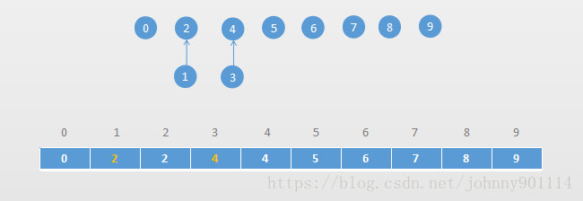
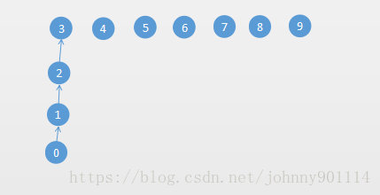
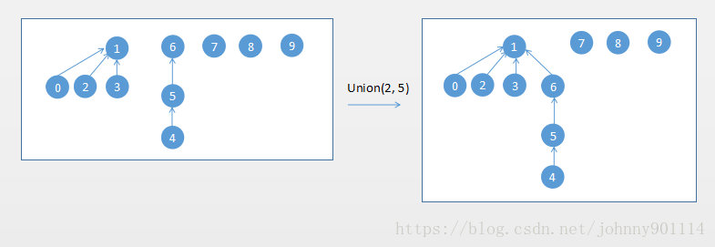

# 并查集

# 两种问题模型

1. 给出两个节点，判断它们是否连通，如果连通，不需要给出具体的路径

   通过Union-Find算法 实现

2. 给出两个节点，判断它们是否连通，如果连通，需要给出具体的路径

   使用基于DFS的算法。 

# 对于问题1建模

- 大题思路对于连通的所有节点，我们可以认为它们属于一个组，因此不连通的节点必然就属于不同的组。

  1. 将所有的节点以整数表示，即对N个节点使用0到N-1的整数表示，节点i的组号就是i。在处理输入的Pair之前，每个节点必然都是孤立的，即他们分属于不同的组，可以使用数组来表示这一层关系，数组的index是节点的整数表示，而相应的值就是该节点的组号了。

  2. 随着Pair的输入，我们需要首先判断输入的两个节点是否连通。按照上面的假设，我们可以通过判断它们属于的组，然后看看这两个组是否相同，如果相同，那么这两个节点连通，反之不连通。

  3. 初始化完毕之后，对该动态连通图有几种可能的操作：

     - `int find(int p)`: 查询节点属于的组

       数组对应位置的值即为组号

     - `boolean connected(int p, int q)`判断两个节点是否属于同一个组

       分别得到两个节点的组号，然后判断组号是否相等

     - `void union(int p, int q)`连接两个节点，使之属于同一个组

       分别得到两个节点的组号，组号相同时操作结束，不同时，将其中的一个节点的组号换成另一个节点的组号

     - `int count()`获取组的数目

       初始化为节点的数目，然后每次成功连接两个节点之后，递减1

## 演化过程

### 1. quick-find：find函数方便，但union是O（n^2）的，n是点的个数

id[p]表示p所在的连通分量的编号，当且仅当id[p] == id[q]的时候p和q是连通的。

find的实现：只有两个点的id[]是一样的，才能证明两个点在同一个连通分量中；

union的实现：得到两个点的连通分量编号，依次修改一个分量中所有点的编号。

### 举例：


从上面的图可以知道：

**一开始：0、1、2、3、4** 属于一个集合，**5、6、7、8、9**属于一个集合。

**后来：4** 和 **5** 两个元素就不属于同一个集合(或者不相连)，因为他们对应的编号不一样。**4** 对应的编号是 **2**，**5**对应的编号是 **4**

如果要合并两个集合(**union(1,5)**)，因为 **1** 和 **5** 是属于两个不同的集合 
**合并后**，以前分别和元素 **1** 连接的元素；和 **5** 连接的元素，也都连接起来了：

```
public int find(int p)
{
	return id[p];
}

public void union(int p, int q)
{
    int pID = find(p), qID = find(q);
    
    if(pID == qID)
    	return;
    	
    for(int i = 0; i < id.length; i++)
    {
    	// 遍历一遍数组，将id重新赋值
    	if(id[i] == pID)
    		id[i] = qID;
	}
	
	count--;
}
```

### 2. quick-union方法：最坏情况下是O（n^2）

此时，每个触点对应的id[]值都是同一个分量中的另一个触点的名称，也可能是自己，将这种联系称为链接。

- 通过子节点来指向父节点，根节点指向它自己。数组索引用来表示元素编号，存储的是元素编号对应的父节点编号。如下图所示：

  

- 每个节点的父节点编号都是它自己，说明每个节点都是一个根节点，那么这个数组就表示一个森林： 

- 合并 **1**、**2**， 合并**3** 和 **4**，就变成： 

  

- 合并 **1**、**3** ，找到 **1** 和 **3** 的对应的根节点，然后让 **1** 的根节点指向 **3** 的根节点，即2指向4 


find的实现：从给定触点开始，由它的链接得到另一个触点，再由这个触点链接到第三个触点，如此继续跟随着链接直到到达一个根触点，即链接指向自己的触点。当且仅当由两个触点开始的这个过程到达了同一个根触点时，它们存在于同一个连通分量之中。

union的实现：由p和q的链接分别找到他们的根触点，只需将一个根触点链接到另一个即可将一个分量重命名为另一个分量

```
 /**
     * 查询某个节点的根节点
     * 时间复杂度为O(h)
     *
     * @param p
     * @return
     */
    private int find(int p) {
        while (p != parents[p]) {
            p = parents[p];
        }
        return p;
    }

    /**
     * 合并操作
     * @param p
     * @param q
     */
    public void unionElements(int p, int q) {
        int pRoot = find(p);
        int qRoot = find(q);
        if (pRoot == qRoot)  {
            return;
        }
        parents[pRoot] = qRoot;
    }

```

### 存在问题：

在最坏情况下：假设输入的整数对是有序的，树的高度会一直增加，find()操作访问数组的次数是n^2：

union(0,1) — union(0,2) — union(0,3)



### 3. 加权quick-union：记录每个连通分量上节点的个数，将小的树连接到大的上

- **union(0,2)时，2上面的节点只有1个，于是将2连到0上**

```
private int[] parents;
private int[] sz;//记录每棵树的节点个数

 /**
     * 查询某个节点的根节点
     * 时间复杂度为O(h)
     */
    private int find(int p) {
        while (p != parents[p]) {
            p = parents[p];
        }
        return p;
    }

    public void unionElements(int p, int q) {
        int pRoot = find(p);
        int qRoot = find(q);
        if (pRoot == qRoot) {
            return;
        }
        //根据根节点的子节点个数来判断合并方向
        if (sz[pRoot] < sz[qRoot]) {
            parents[pRoot] = qRoot;
            sz[qRoot] += sz[pRoot];
        } else {
            parents[qRoot] = pRoot;
            sz[pRoot] += sz[qRoot];
        }

    }
```

### 存在问题：

上面基于size的优化方案，是节点数少的树往节点数多的树合并。但是节点数多不代表树的高度高，比如按照size的优化方案，执行 Union(2, 5)，元素 **2** 所在的树总节点数有4个，但只有2层；元素 **5** 所在的树有3个节点，有3层。



### 4. 基于rank优化

针对上面的问题，采用rank来优化，rank代表数的高度或深度。高度低的树向高度高的树合并。使用rank的优化方案，执行 Union(2, 5)，如下的合并过程：


```java
public class UnionFind4 implements UF {

    private int[] parents;
    //rank[i]表示i为根的集合所表示的树的层数
    private int[] rank;

    public UnionFind4(int size) {
        parents = new int[size];
        rank = new int[size];
        for (int i = 0; i < parents.length; i++) {
            parents[i] = i;
            //每个根节点所在的树一开始都只有一个层
            rank[i] = 1;
        }
    }

    @Override
    public int size() {
        return parents.length;
    }

    @Override
    public boolean isConnected(int p, int q) {
        return find(p) == find(q);
    }

    /**
     * 查询某个节点的根节点
     * 时间复杂度为O(h)
     *
     * @param p
     * @return
     */
    private int find(int p) {
        while (p != parents[p]) {
            p = parents[p];
        }
        return p;
    }

    public void unionElements(int p, int q) {
        int pRoot = find(p);
        int qRoot = find(q);
        if (pRoot == qRoot) {
            return;
        }
        //根据根节点所在树的层级来判断合并方向
        //层级矮的树往层级高的树合并不需要维护rank
        if (rank[pRoot] < rank[qRoot]) {
            parents[pRoot] = qRoot;
        } else if (rank[pRoot] > rank[qRoot]) {
            parents[qRoot] = pRoot;
        } else {//只有rank相等的情况才需要维护rank
            parents[pRoot] = qRoot;
            rank[qRoot] += 1;
        }
    }

}
```

### 5. 路径压缩（path-compression）

想要每个节点都直接链接到他的根节点上，所以就在检查节点（find）的同时将他们直接链接在根节点上。就能得到一个近乎扁平化的树。

```java


public class QuickFindUF {
    private int [] id;
    public QuickFindUF(int N){
        id = new int[N];
        for (int i = 0; i < N; i++) {
            id[i] = i;  //初始化
        }
    }

    /**
     * 判断p和q是否是连接的
     * @param p
     * @param q
     * @return
     */
   public boolean connected(int p,int q){
        return root(p) == root(q);
    }
  
     /**
     * 找到i的根节点
     * @param i
     * @return
     */
  public int find(int[] parent, int i) {
        while (i != parent[i]) {
            parent[i] = parent[parent[i]];
            i = parent[i];
        }
        return i;
    }

    /**
     * 合并p的子集和q的子集
     * 将所有值等于id[p]的对象的值改为id[q]
     * @param p
     * @param q
     */
   public void Union(int a, int b){
        int fa = Find(a);
        int fb = Find(b);
        father[fb] = fa;
    }
}
```

# 时间复杂度分析

| Algorithm                                  | Constructor | Union                      | Find                       |
| ------------------------------------------ | ----------- | -------------------------- | -------------------------- |
| Quick-Find                                 | N           | N                          | 1                          |
| Quick-Union                                | N           | Tree height                | Tree height                |
| Weighted Quick-Union                       | N           | lgN                        | lgN                        |
| Weighted Quick-Union With Path Compression | N           | Very near to 1 (amortized) | Very near to 1 (amortized) |

