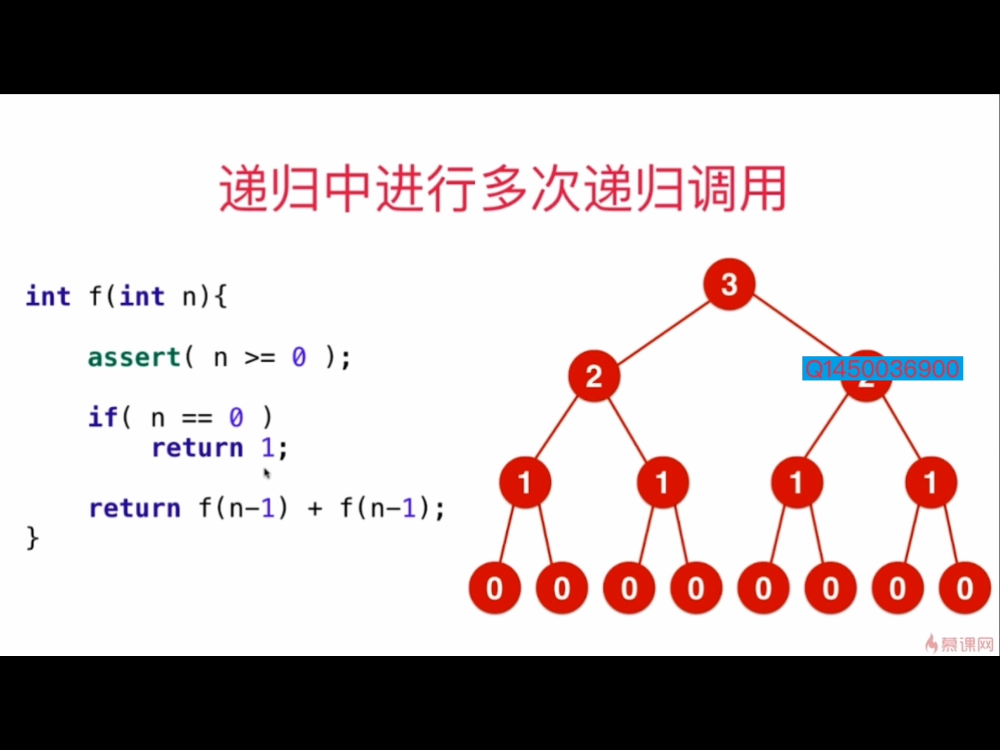
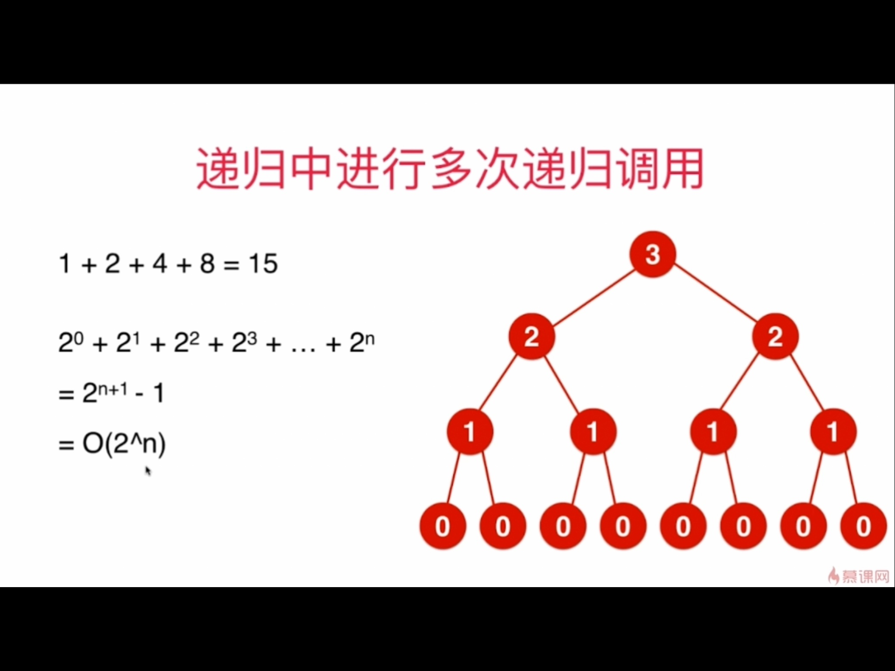

### 递归算法的复杂度分析
- 递归中进行一次递归调用的复杂度分析，递归深度为depth，每个递归函数中时间复杂度是T，总时间就是O(T*depth).重点在于认清递归深度。
e.g. 二分查找法，每一次中要不往左边，要不往右边。就是只进行一次调用。深度是logn.  

e.g. 一个logn的算法：计算x^n,通过先求得x^(n/2),x^n = x^(n/2) * x^(n/2). 平时算法是n个数连乘，即o(n)

```
double pow(double x, double n)
{
    //只能对大于0的数计算
    assert(n>0)
    
    if(n == 0)
        return 1.0
    
    double t = pow(x,n/2);
    // 因为n是奇数的话，n/2会舍位，所以如果n是奇数，要再乘一个
    if(n%2)
        return x*t*t;
    
    return t*t
}
```

- 递归中进行多次递归调用的复杂度分析，要知道递归的深度&每次递归调用多少次这个函数，画一个递归树。数一下树上所有的节点个数之和即可。


如上所示，这是一个O(2^n)的算法