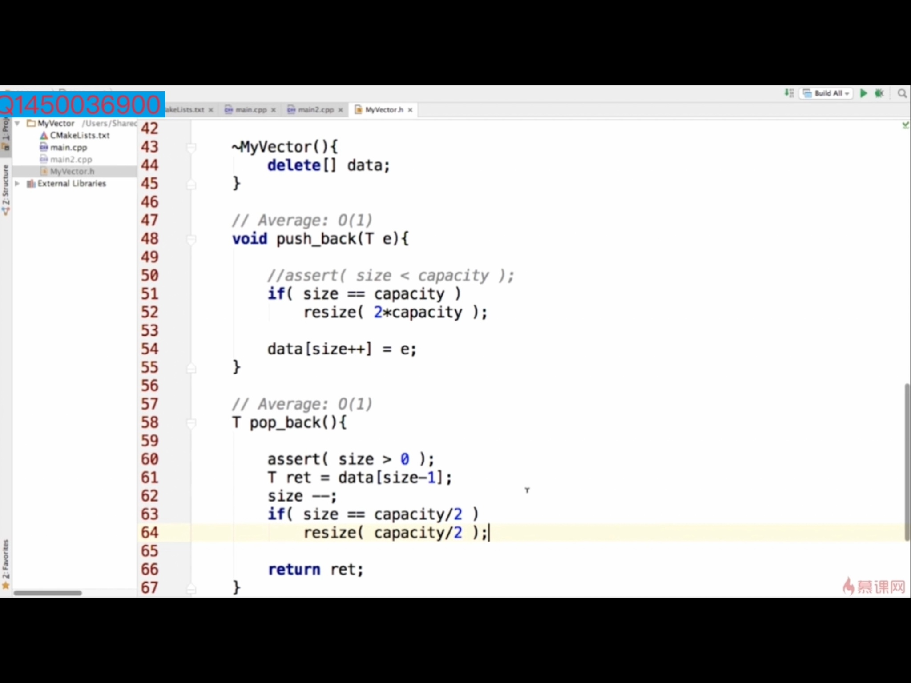
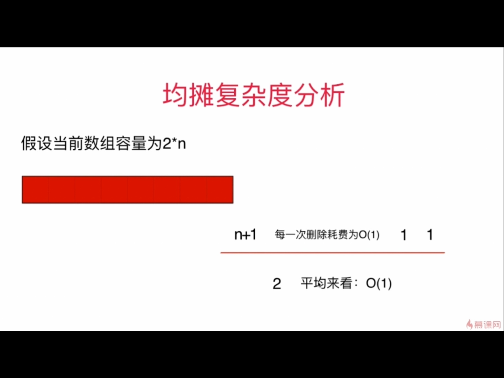
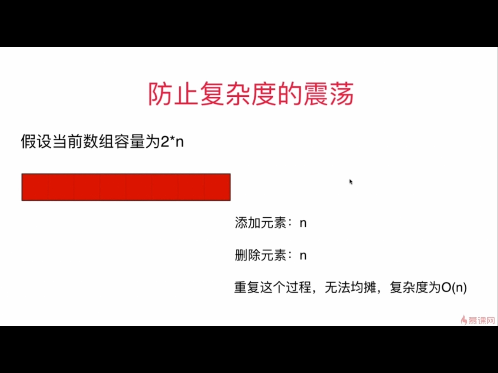
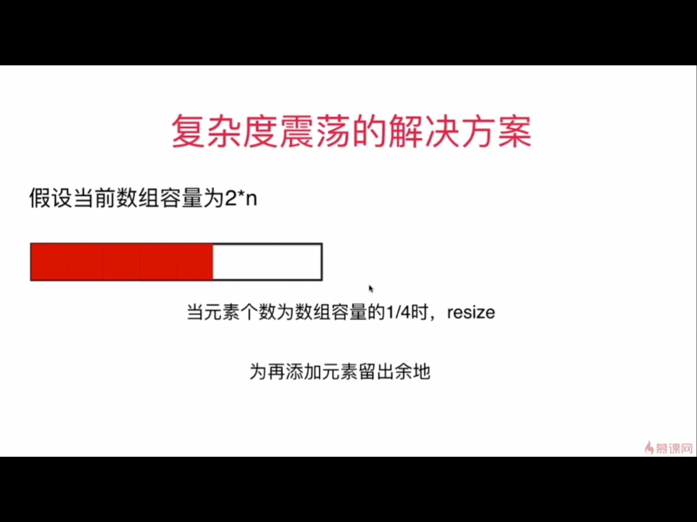
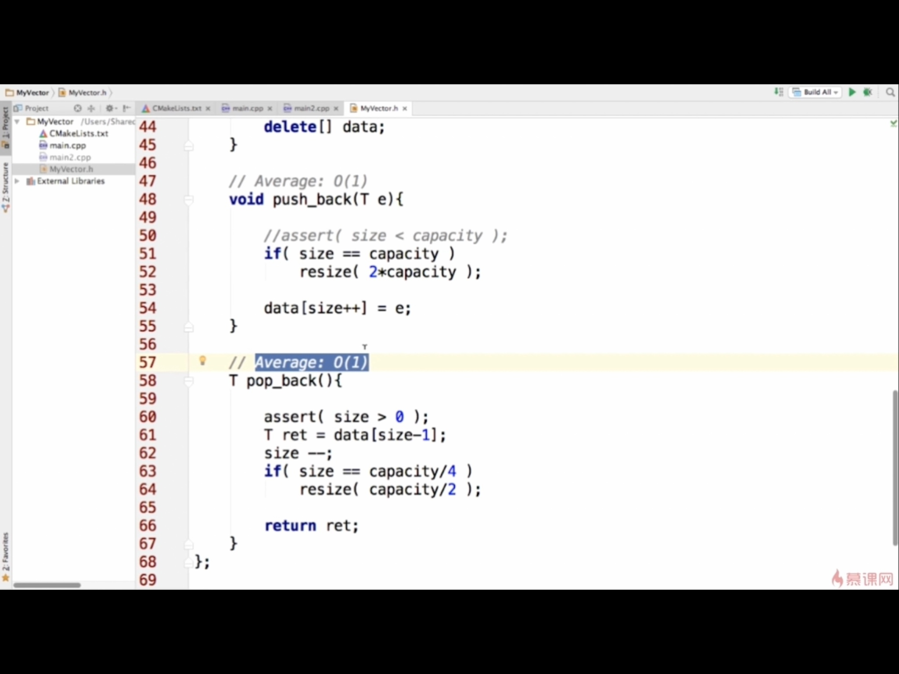

### 均摊复杂度分析（amortized time）
有的时候一个算法复杂度较高，但这个算法是为了其他算法进行操作，所以需要将这些算法的复杂度一起分析，就要使用均摊分析。适用于某些函数不是一直每次都全部执行下来。

e.g. 动态数组vector，
- resize是对数组扩容的操作，复杂度是O(N). 
- pushback是先判断容量是否超，没有就直接赋值。  
前面n次插入，是没有满，当没有超的时候是O(1),第n+1次的时候就满了，超过了是O（n），所以加起来是n+1次pushback共进行了n+n次，平均复杂度是2n/(n+1)=2,几乎就是O（n）的。  

- popback删除元素，当当前数组大小为容量的1/2时，要减少数组大小。
分析同上：

- 复杂度的震荡：当前数组大小 = 当前容量， 刚添加完，又删除，又添加。这种情况下，复杂度就是O（n）

- 复杂度震荡的解决方案
在当前大小是容量的1/4时，再改变

