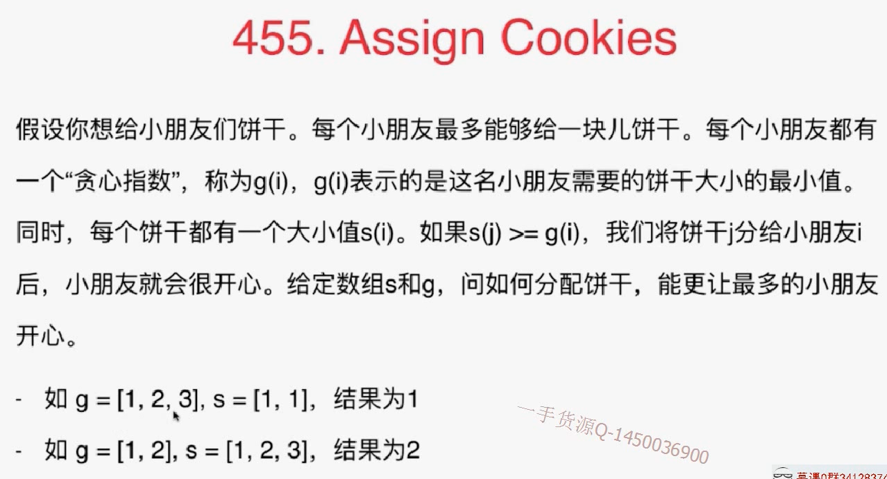
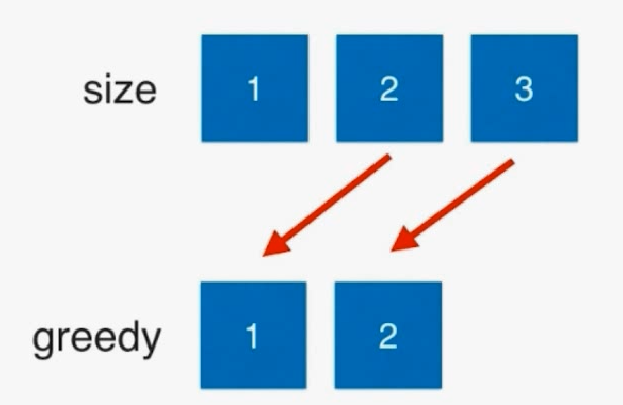

# 10-1 贪心基础 Assign Cookies

贪心算法的编写并不难，难在如何确定这个问题能够用贪心算法解。

# 455



每次都把当前最大的饼干给最贪心的朋友，要先排序。



- 先尝试满足最贪心的小朋友.

  虽然对s, g 都进行了从小到大的排序，但是是从两个数组后面开始比较，即先满足最贪心的朋友。

```java
import java.util.Arrays;

/// 455. Assign Cookies
/// https://leetcode.com/problems/assign-cookies/description/
/// 先尝试满足最贪心的小朋友
/// 时间复杂度: O(nlogn)
/// 空间复杂度: O(1)
public class Solution {
    public int findContentChildren(int[] g, int[] s) {
        Arrays.sort(g);
        Arrays.sort(s);

        int gi = g.length - 1, si = s.length - 1;
        // 最终的答案
        int res = 0;
        while(gi >= 0 && si >= 0){
            if(s[si] >= g[gi]){
                res ++;
                si --;
            }
            gi --;
        }

        return res;
    }

    public static void main(String[] args) {
        int g1[] = {1, 2, 3};
        int s1[] = {1, 1};
        System.out.println((new Solution()).findContentChildren(g1, s1));

    }
}
```

## 练习

392 is subsequence

