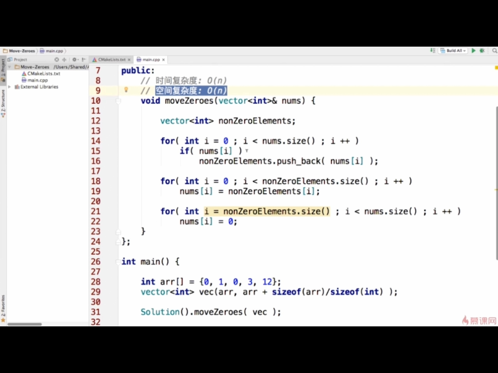
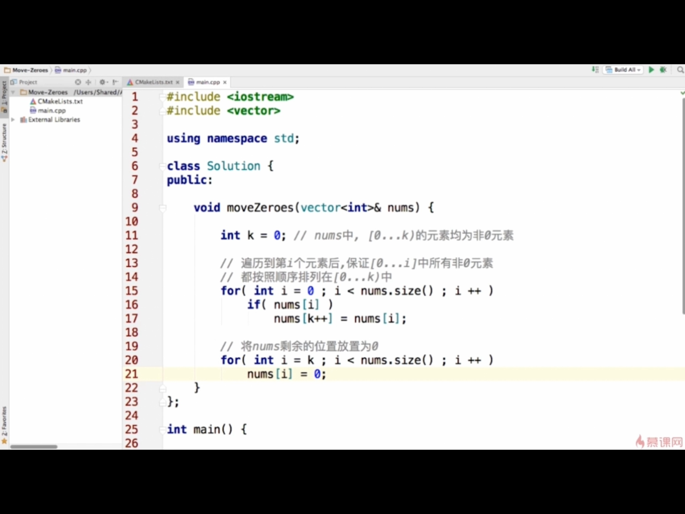
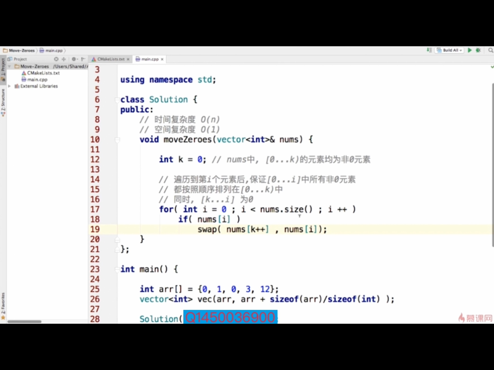
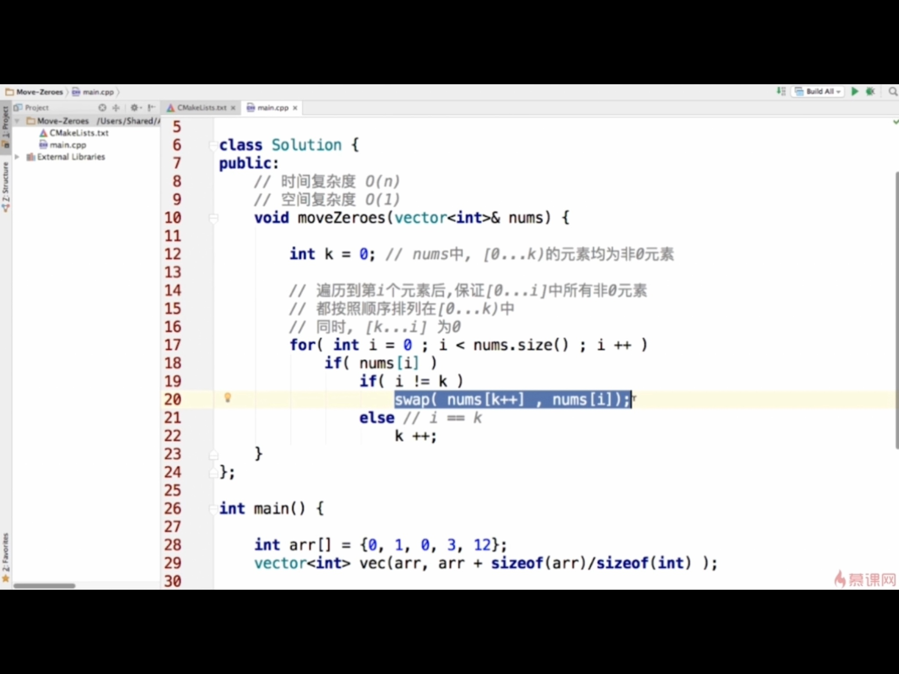

## 面试问题实战
#### 举例：Move zeros
##### 思路1：
取出数组中所有非0元素，放到vector中，再遍历vector，放入Num中，剩下的元素都是0即可。

##### 思路2：
遍历中看到非0的就==填在K位置==，遍历结束后剩余位置填充0

##### 思路3：
不用辅助空间，遍历数组将所有0和非0元素==交换==。可以省去一次遍历过程，保留两个位置k,s。k是0的坐标，s是遍历的角标。
- k = 0, 表示[0...k]均为非0元素
- 遍历到第i个元素后，保证[0...i]中所有非0元素都按照顺序排列在[0...k]中

##### 思路4：针对特殊测试用例而言
考虑上面情况如果都是非0元素的话，那每个非0元素都要自己和自己交换一下，所以判断一下：当索引i != k的时候才交换，否则k直接++即可。

