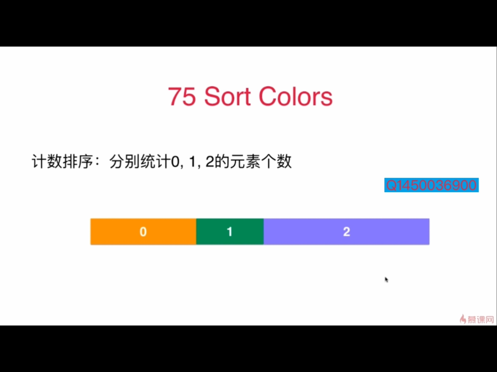
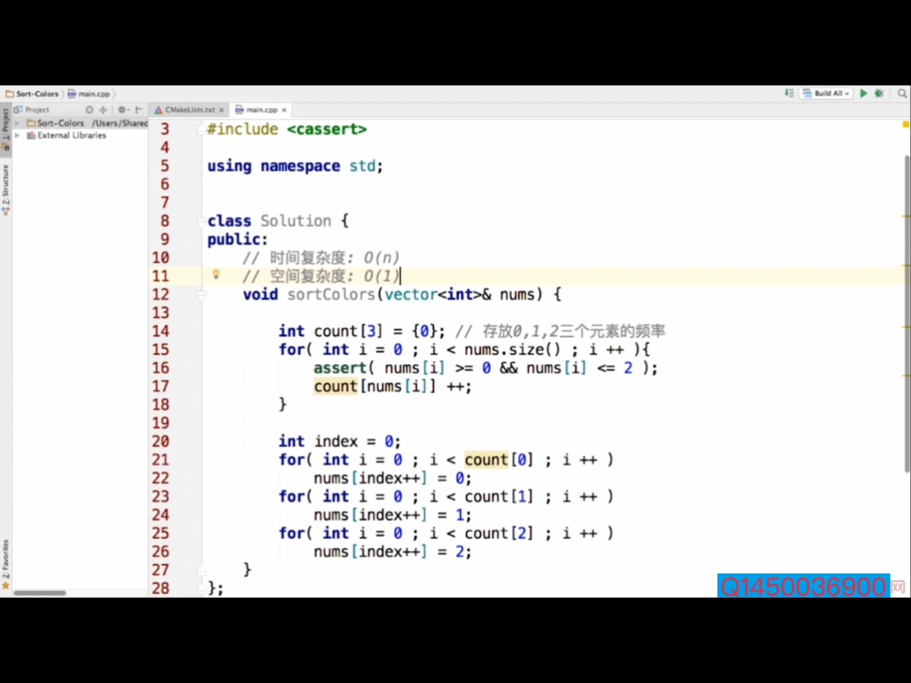
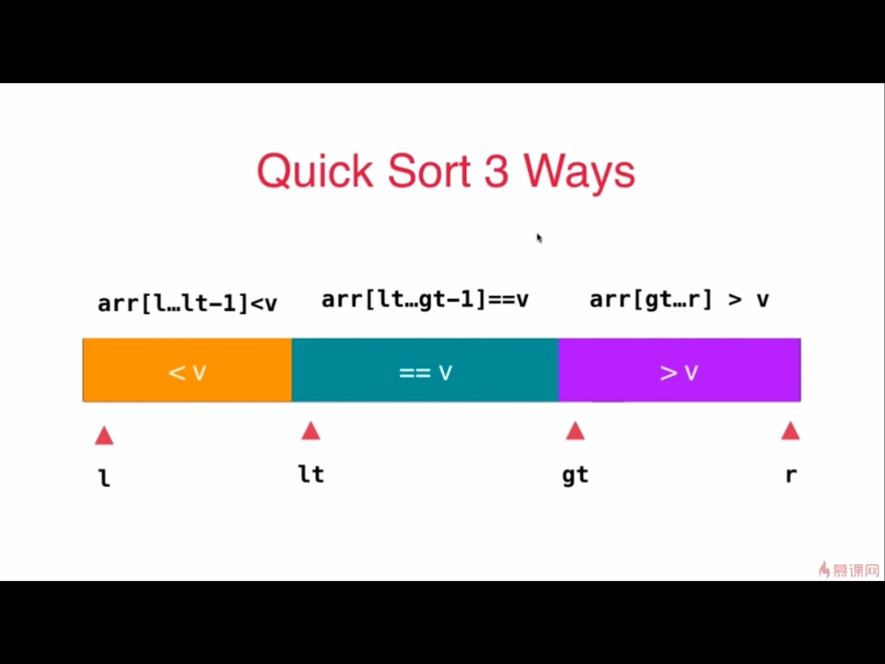
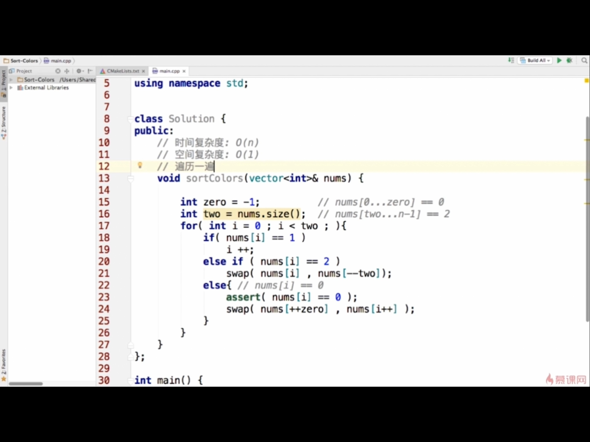

### sort colors（三路快排思路的延伸）

#### 思路1
直接调用系统排序函数

#### 思路2
因为数组中元素类型有限，只有0,1,2所以遍历一遍找到0,1,2的个数，然后依次填充即可。  
计数排序：统计元素个数

涉及到数组就要考虑是否越界，所以加一个断言

#### 思路3

选择类似三路快排的方式，定义  
- nums[0...zero]:   前闭后闭区间，从0到zero全是0,所以一开始的时候zero不能=0，否则就假定了num[0]这个元素是0，应该设置zero = -1,即这是无效的索引
- nums[two...n-1]:  
前闭后闭区间，从two到n-1全是2，所以一开始的时候two不能=n-1，否则就假定了num[n-1]这个元素是n，应该设置zero = n,即这是无效的索引
- 在i从0开始遍历的过程中，
1. 当前数是1就i++
2. 是2，就和two--后的位置交换，因为nums[two--]是一个没处理过的操作，所以i不增加
3. 当前数是0，要加一个断言，确保用户输入正确，是0就和zero++后的位置交换，zero++后的位置原本存着1，交换完存着0，i位置存1，i再++。
