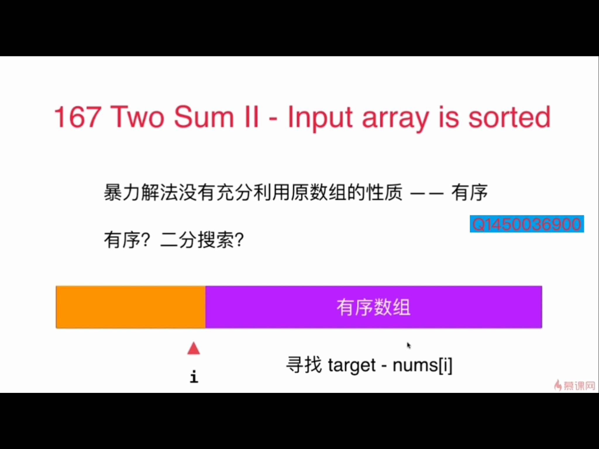
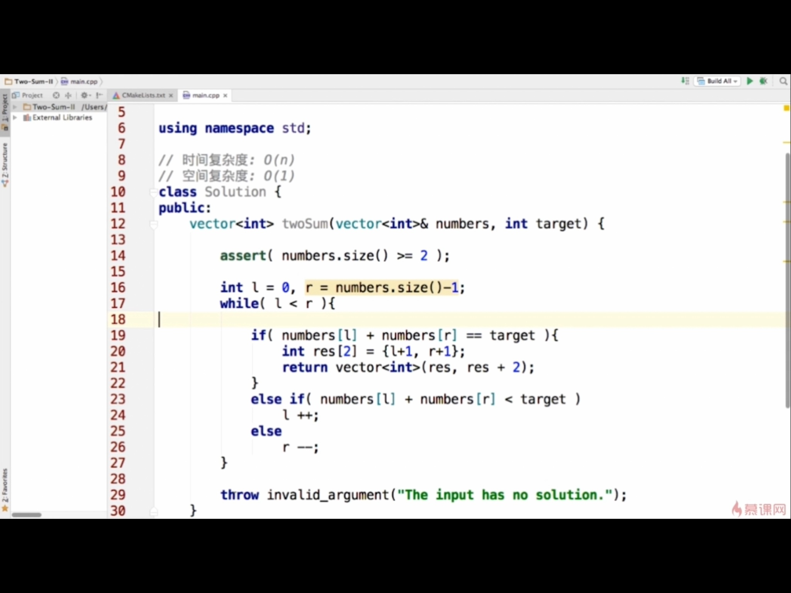

### 167.Two SumII-Input array is sorted
#### 思路1：暴力解，双层遍历，O（n^2）

#### 思路2：没有充分利用有序的性质

利用二分，对每个nums[i],找target-nums[i]。
- 定义从[0. num.size-1]双闭区间开始找
- i,j指向数组首尾，
- nums[i] + nums[j] > target: j--
- nums[i] + nums[j] < target: i++
- nums[i] + nums[j] == target: 返回

### 双指针题目
- 125：valid palindrome
- 344:reverse string
- 345:reverse vowels of a string
- 11：container with most water
- 3:longest substring without repeating characters(字符集？只有字幕？ASCII？大小写)