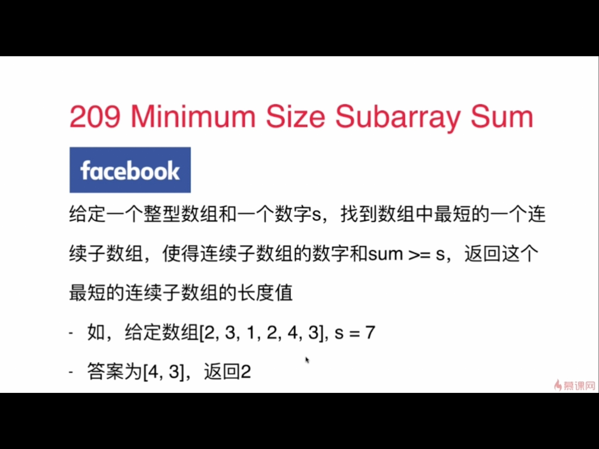

### 209，minimum size subarray sum

1：大多数时候子数组不是连续的，要问清楚
2：无解
3：一个解
4：多个解，返回顺序

#### 思路1：暴力，n^3
#### 思路2：优化1，n^2

#### 思路3：o(n)
- 因为在循环内部有数组的取值[++r],所以在while循环条件要写r+1 < num.size。
- nums[l...r]为滑动窗口，因为都是闭区间，所以一开始r!=0, 否则窗口内是有东西的
- while(l < num.size):证明l还能取值，所以写在最外面

### 3. longest substring without repeating characters
- 字符的ascii码在256内
- 用char[256]
