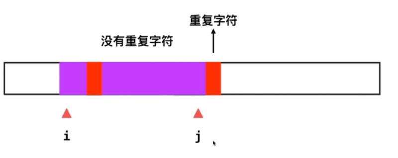
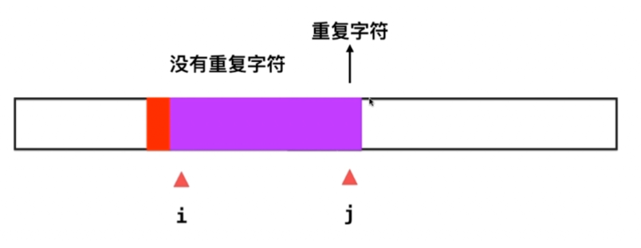

### 3. longest substring without repeating characters
- 字符的ascii码在256内
- 用char[256]

记录此时的[i,j]

- 当遇到重复的数字后，要i一直++，把他移到已有子段出现j的位置后，再把j包含进去


- 用freq[]数组记录[i...j]子串中每个字符出现的次数。

1. while循环：只要l<s.size，就证明还能扩展
2. 遇到数组取值，就要保证不越界，所以if中确保r+1<s.size

```
int freq[256] = {0};
int l = 0, r = -1; //滑动窗口为s[l...r]
int res = 0;

//只要l<s.size，就证明还能扩展
while(l < s.size()
{
    //遇到数组取值，就要保证不越界，所以if中确保r+1<s.size
    if( r + 1 < s.size() && freq[s[r+1]] == 0 )
        freq[s[++r]++;
    else //不能往右扩展,缩小左边界，同时将频率-1
        freq[s[l++]]--;
    res = max(resm r-l+1); 
}
```

### 滑动窗口  
- 438：find all anagrams in a string
对于字符串就要想字符集、返回顺序、
- 76：minimum window substring
字符范围？无解？多个解，怎么返回？什么叫包含