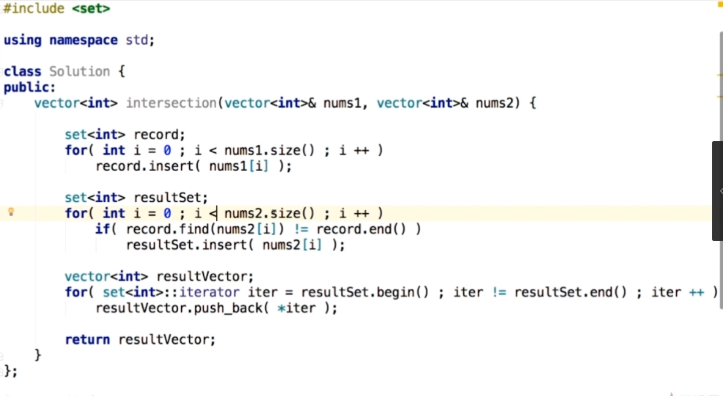
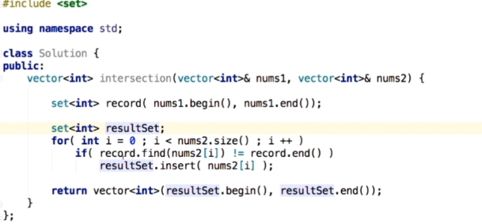
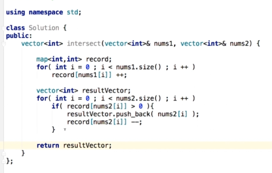

# 查找问题
- 查找有无： set
- 查找对应关系:  map, hash表
- set,map叫做 容器类

.png)

常见操作：
- insert
- find
- erase
- change(map)

## Set,Map的基础使用

### 349:intersection of two arrays
求两个数组共有元素，每个元素只能出现一次。  
e.g. nums1=[1,2,2,1],nums2=[2,2]. ans = [2]
#### 思路1: 把数组一的元素存入set中，对数组二的每个元素去查找是否在set中，在的话就存在另一个set中。

- 利用语言本身提供的接口，一次性插入

### 350:intersection of two arrays
求两个数组交集.此时数据出现次数就要考虑。
e.g. nums1=[1,2,2,1],nums2=[2,2]. ans = [2,2]

1. map默认值问题，c++实现map机制：
- map<int,int> record
- 执行语句 `if(record[a] > 0)`, 如果record中不存在a这个键，record会报错，但此时因为访问过，所以map中就会存在a这个键了，默认其值是0. 即存在<a,0>这个键值对。此时再访问就不会报错
- 只有执行erase操作才能删除掉。

2. 由于上面问题可看出：不同语言实现机制不一样，写code的时候可能会因为具体机制不同导致可读性变差，所以要把语义都明确的写出来：即，先判断是否存在 / 当值为0时删除元素。这样就可以少考虑语言背景。

.png)

**对上述问题，如果数组有序，可不借助这两个结构**

#### hash表的一个特点：失去了数据的顺序性

.png)

3. 本题目没有数据顺序要求，所以用hash表也可以
.png)

### 查找问题(set,map)题目
- 242：valid anagram
- 202：happy number
如果到后面又回到了68，就陷入循环，即不是Happy 
- 290：word pattern
考虑：字符集？空串符合什么模式？
- 205： isomorphic strings
考虑：字符集？空串？是否一个字母可以映射到自己？
- 451： sort characters by frequency

