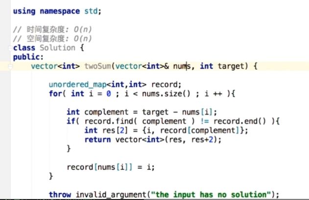

### 1.Two Sum(重点)
要返回数字的索引。此时，数组没有说明是有序的。所以跟上次的不一样
1. 索引从0开始还是1开始？
2. 没有解怎么办？
3. 多个解？

#### 思路1：暴力法o(n^2)
#### 思路2：排序后，双指针。o(nlogn + n) = o(nlogn)
注意，因为要返回索引，所以不能只是简单地对内容排序

#### 思路3：哈希表，双指针。o(n)
查找表：hash表，将所有元素放入后，对每个a，查找target-a及其对应索引。
- 数组元素有可能重复，所以对每个元素v，都在他前面查找target-v,有就成功；没有的话，如果之前元素中有跟v值一样的元素a，就替换值a的位置，因为v也是一个解。



#### 课后练习
15：3Sum  
什么是不同的三元组？（索引，还是内容）多个解的顺序？无解？  
- 固定每一个位置的值x，则题目转变为求两个元素的和 = -x. 用双指针
```
public List<List<Integer>> threeSum(int[] nums) {
        List<List<Integer>> ans = new ArrayList<>();
        if(nums.length < 3)
            return ans;
       
        Arrays.sort(nums);
        for(int i = 0; i < nums.length - 2; i++){
            if(i > 0 && nums[i] == nums[i-1])
                continue;
            int target = 0 - nums[i];
            int lo = i + 1;
            int hi = nums.length - 1;
            while(lo < hi){
                int sum = nums[lo] + nums[hi];
                if(sum == target){
                    ans.add(Arrays.asList(nums[i], nums[lo], nums[hi]));
                    while(lo < hi && nums[lo] == nums[lo + 1])
                        lo++;
                    while(lo < hi && nums[hi] == nums[hi - 1])
                        hi--;
                    lo++;
                    hi--;
                }
                else if(sum > target)
                    hi--;
                else if(sum < target)
                    lo++;
            }
        }
        return ans;
    }
```

18：4Sum  
- 用三个数和的思路，先固定一个数，再固定一个数，然后用二分
- 注意对边界的处理要多一些
```
public List<List<Integer>> fourSum1(int[] nums, int target) {
        List<List<Integer>> ans = new ArrayList<>();
        if(nums == null || nums.length < 4)
            return ans;

        Arrays.sort(nums);
        if(nums[0] * 4 > target || nums[nums.length-1] * 4 < target)
            return ans;
        int n = nums.length;
        for(int i = 0; i < nums.length - 3; i++){
            if(nums[i] + nums[i + 1] + nums[i + 2] + nums[i + 3] > target) {
                break;
            }
            if(nums[i] + nums[n - 3] + nums[n - 2] + nums[n - 1] < target) {
                continue;
            }
            if(i == 0 || nums[i] != nums[i-1]){
                for(int j = i + 1; j < nums.length - 2; j++){
                    if(nums[i] + nums[j] + nums[j + 1] + nums[j + 2] > target) {
                        break;
                    }
                    if(nums[i] + nums[j] + nums[n - 2] + nums[n - 1] < target) {
                        continue;
                    }
                    if(j == i+ 1 || nums[j] != nums[j-1]){
                        int left = target - nums[i] - nums[j];
                        int lo = j + 1, hi = nums.length - 1;
                        while(lo < hi){
                            int sum = nums[lo] + nums[hi];
                            if(sum == left){
                                ans.add(Arrays.asList(nums[i], nums[j], nums[lo], nums[hi]));
                                while(lo < hi && nums[lo] == nums[lo+1]) lo++;
                                while(lo < hi && nums[hi] == nums[hi-1]) hi--;
                                lo++;
                                hi--;
                            }
                            else if(sum > left)
                                hi--;
                            else
                                lo++;
                        }
                    }
                }
            }
        }
        return ans;
    }
```

- 16：3Sum Closest
多个解的接近程度一样？无解？（会不会无解？）

```
public int threeSumClosest(int[] nums, int target) {
        if(nums.length == 3)  return nums[0]+nums[1]+nums[2];
        int lo, hi, sum;  //三个辅助变量
        int ans = nums[0] + nums[1] + nums[nums.length-1];
        Arrays.sort(nums);
        for (int i = 0; i < nums.length - 2; i++)
        {
            lo = i + 1;
            hi = nums.length - 1;
            while (lo < hi)
            {
                sum = nums[i] + nums[lo] + nums[hi]; //直接求和算差的绝对值
                if (sum > target)
                    hi--;
                else if (sum < target)
                    lo++;
                else if (sum == target)
                    return target;
                if (Math.abs(sum - target) < Math.abs(ans - target)) //每一个都要比较
                    ans = sum;
            }
        }
        return ans;
    }
```

454 : 4Sum II   
- 加法的结合律。四个数组之和=0，则前两个的和 + 后两个的和 = 0. 先算A的元素 + B的元素的所有结果值和次数，再算C+D的，再匹配。
```
 public int fourSumCount(int[] A, int[] B, int[] C, int[] D) {
        Map<Integer, Integer> sum = new HashMap<>();
        int len = A.length;
        for(int i = 0; i < len; i++)
            for(int j = 0; j < len; j++)
                sum.put(A[i]+B[j],sum.getOrDefault(A[i]+B[j],0) + 1);
        
        int ans = 0;
        for(int i = 0; i < len; i++)
            for(int j = 0; j < len; j++)
                ans += sum.getOrDefault(-C[i]-D[j],0);
        
        return ans;
    }
```


