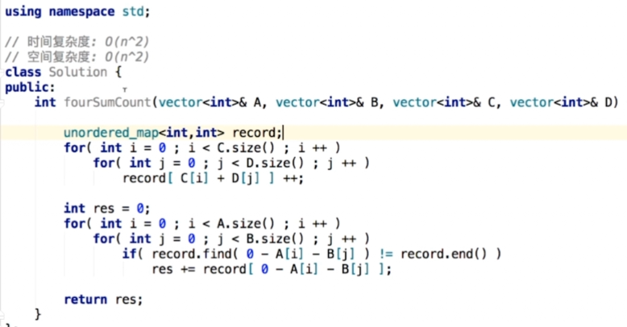
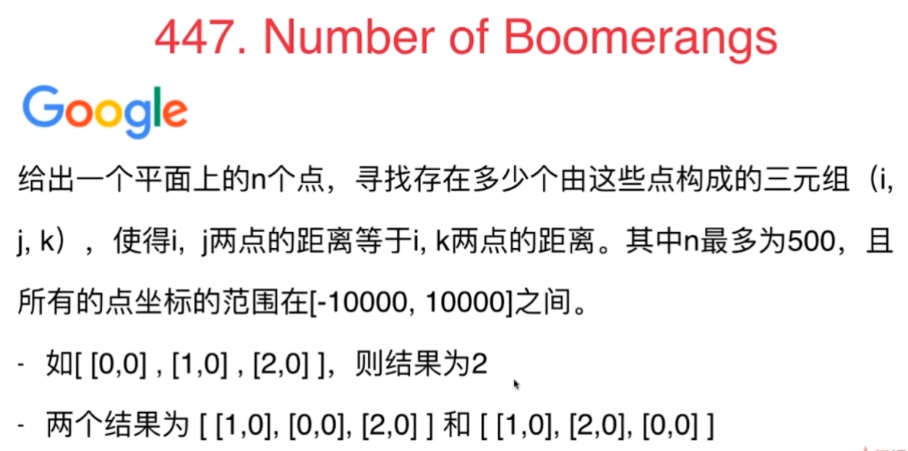
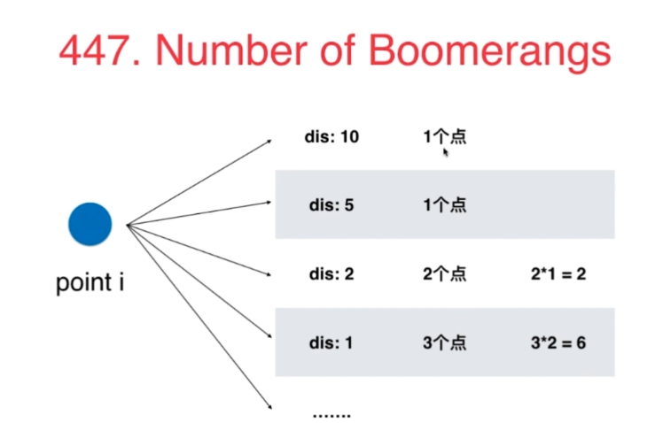
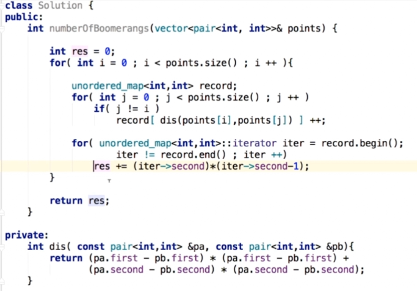

## 使用查找表时，到底要查找什么内容

### 454. 4SumII
因为给出了数据规模，所以能知道用什么算法。用1s的时间跨度去考虑
### 思路1：暴力法，n^4, 500^4 = 6亿多,计算机不行
### 思路2：存一个数在查找表中，n^3 = 1亿，也不是很能承受
### 思路3：n^2可以，25，0000
- 将C+D的每一种可能放入查找表，用Map记录每种和出现的次数。
- 对每个A+B,查找有没有C+D满足。
- 题目给了A,B,C,D大小相等，所以要先判断一下。

根据数据规模推测出，最差可以实现一个n^2的算法。
- 对于查找表问题，到底要查找什么要仔细思考。

#### 练习
- 49，Group Anagrams  
字符集，大小写敏感

### 447.Number of Boomerangs

- 因为n最多500，所以可以设计n^2的解法。n^3可能就不行了
- 暴力解：n^3
- n^2思路：

1. 观察到求的是i--j, i--k的距离。其中i是枢纽，所以可以对于每个点i，遍历其余点到i的距离。
2. 因为求的是距离，所以用距离作为key，到点i的距离为key的个数为val。
3. 注意到，距离可能会是浮点型，但是精度不好确定，所以不开根号，使用距离^2来做map的key。但有可能会越界Int,所以要确定key的数值类型，因为题目中给了坐标范围是[-10000,10000]. 距离最大是20000^2，不会越界。
4. 最后判断次数的时候是：map<key> * (map<key> - 1)。可以写条件if(map<key> > 2), 也可以不写，因为map<key> = 1的时候，乘下来就是0
5. 时间=n^2 ; 空间=n，因为对每个数开辟空间完了以后都会释放掉。

#### 练习
- 149 . Max Points on a Line
点坐标的范围，点坐标的表示（整数，浮点数的误差范围）