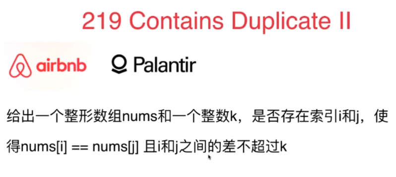
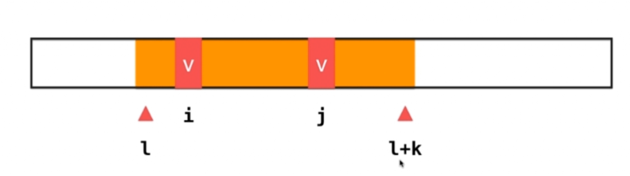
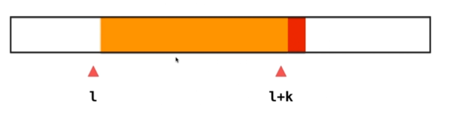
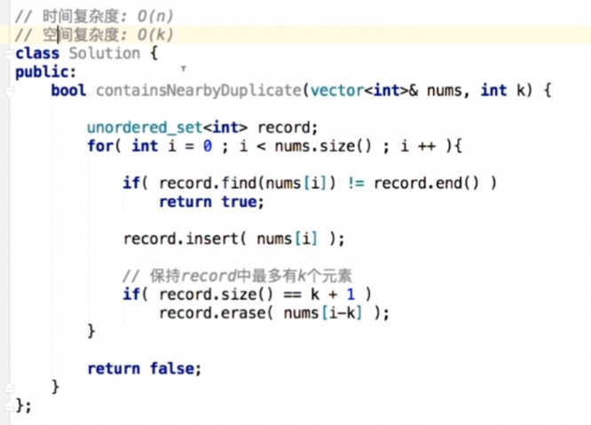

### 219 Contains DuplicateII

- 滑动窗口思路：因为要求下标相差小于k，i到i+k之间有k+1个数。如果在一个长度为k+1的区间内（l--l+k这个区间）能找到两个元素相等，就符合条件。如果没有就右边界右移一位，左边界左移一位，看l+k+1这个位置的元素是否跟l+1 ---- l+k+1 区间中某个元素相等，所以原题就转换为这个思路。

- 因为原窗口没有相等的元素，所以用set即可。
- 保证set中元素不超：在每次循环结束的时候判断set是否满了，如果满了就删除掉最左边的元素

- 时间：o(n) , 空间o(k)

滑动窗口长度固定

#### 练习
- 217 . Contains Duplicate