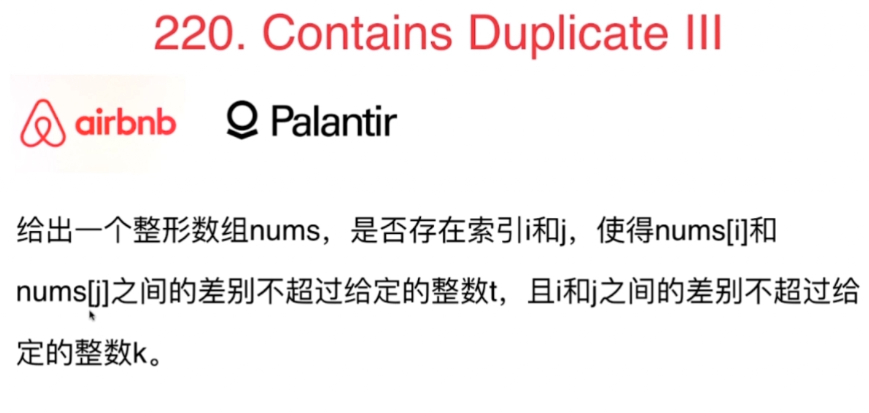
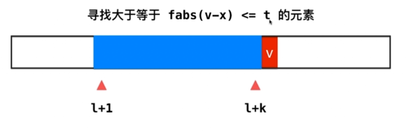
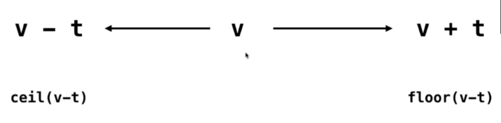
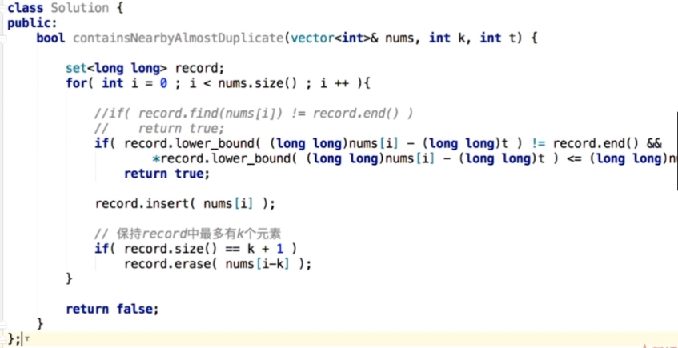

### 220. Contains DuplicateIII

- 滑动窗口限制角标范围
- 数值范围：在查找表中找v-t和v+t之间的元素。所以在这个区间查找表上
1. ceil: 查找大于v-t的最小元素，如果结果值<v+t
2. floor: 查找小于v+t的最大元素，如果结果值>v-t
- 满足上面两个条件之一即可，c++有个lower_bound函数
- 整形溢出：给定值是32位int的最大值，这个数 + t 会溢出。

