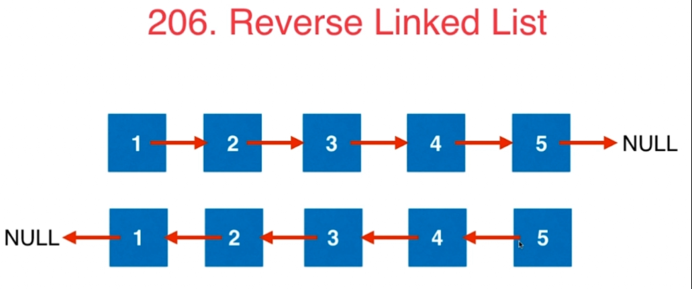
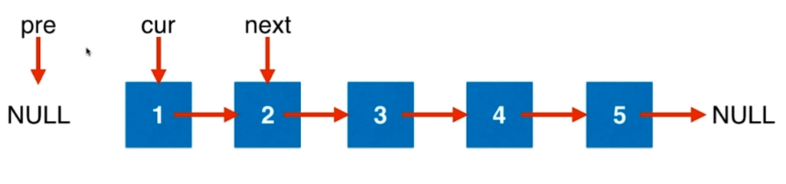
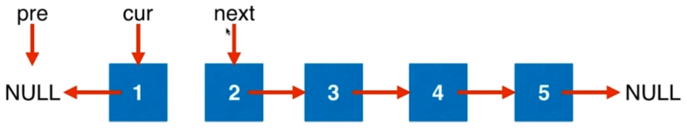
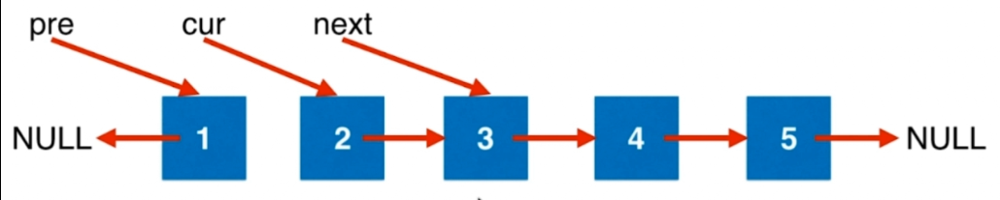

### 206 Reverse Linked List

- 不能改变节点值，要反转节点的指针

1.需要pre(初始为null),cur,next三个指针，分别指向：前一个元素，当前元素，下一个元素

2.修改cur，使其指向pre

3.三个指针都向后移动一位：修改pre，使其指向cur；修改cur，使其指向next；修改next,使其指向next的下一位


1.访问节点的val域和next域时， 一定要注意节点是否为空  
2.这里`next = head->next`
```
ListNode* reverseList(ListNode* head){
    ListNode* pre = NULL;
    ListNode* cur = head;
    ListNode* next = head->next;
}
```
- 因为访问了head.next,就要防止head为空的情况，可以在函数进来就加一个判断,head为空就直接返回。
```
ListNode* reverseList(ListNode* head){
    if(head == NULL)
        return;
    ListNode* pre = NULL;
    ListNode* cur = head;
    ListNode* next = head->next;
}
```
- 因为next是依赖于cur，所以只有cur存在的时候，才会求得next。所以将cur的声明放在while，这样while就判断了cur不是null
```
ListNode* reverseList(ListNode* head){
    ListNode* pre = NULL;
    ListNode* cur = head;
    while(cur!=NULL){
        // 在下一个循环中处理next
        ListNode* next = cur->next;    
        // 在当前循环中移动了两个指针。
        cur->next = pre;
        pre = cur;
        cur = next;
    }
}
```
练习：  
92：Reverse Linked ListII  
反转链表从m到n的元素
- m,n超过链表范围，是负值的时候怎么办？
- m>n怎么办

#### 思路1
- 先考虑中间部分的旋转：保存m-1,n+1两个位置的指针，翻转完m-n部分的节点后，m-1节点的next指向n，m的next指向n+1即可。
- 考虑到头结点：添加dummyHead
- 考虑到head不能为空，在前面加上head为空，m>=n的判断
```
 public ListNode reverseBetween(ListNode head, int m, int n) {
        if(head == null || m >= n)
            return head;
        ListNode dummyHead = new ListNode(0);
        dummyHead.next = head;
        
        ListNode lastEnd = dummyHead, nextHead = dummyHead, pre, cur, tmpHead;
        for(int i = 1; i < m; i++)
            lastEnd = lastEnd.next;
        pre = lastEnd.next;
        tmpHead = pre;
        cur = pre.next;
        int nodes = m+1;
        while(nodes <= n){
            nextHead = cur.next;
            
            cur.next = pre;
            pre = cur;
            cur = nextHead;
            nodes++;
        }
        lastEnd.next = pre;
        tmpHead.next = nextHead;
        return dummyHead.next;
    }
```

#### 思路2
- 使用头插法，记录第m-1,m，m+1个点为cur,start,second。每次将cur之后的节点插入pre之后。
- 先保留second后面的位置，所以先令start.next = second.next
- 修改cur和second的指针关系，要保存cur.next，所以先修改second.next = cur.next。再修改cur.next = second
- 下一步中second就应该是start的后一位。
```
public ListNode reverseBetween1(ListNode head, int m, int n) { //第m-1个数的位置不变，使用尾插法，每次把后面的数字放在第m-1个数后面
        if(head==null)
            return head;
        ListNode newhead = new ListNode(0);
        newhead.next = head;
        ListNode cur = newhead;

        for (int i=0;i<m-1;i++)   //这里注意一下，结点个数是从1开始算，但1位置是链表开头，每次交换的时候是需要 前 1 2 三个位置的指针
            cur = cur.next;
        ListNode start = cur.next,second = start.next;

        for (int i=m;i<n;i++)  //反转m-n之间的数，一共n-m次
        {
            start.next = second.next;
            second.next = cur.next;
            cur.next = second;
            second = start.next;
        }
        return newhead.next;
    }
```

83：Remove Duplicates from Sorted List    

#### 思路
```
public ListNode deleteDuplicates(ListNode head) {
        if(head == null || head.next == null)
            return head;
        
        ListNode dummyHead = new ListNode(0);
        dummyHead.next = head;
        ListNode pre = dummyHead.next, cur = pre.next;
        while(cur != null){
            if(cur.val == pre.val){
                pre.next = cur.next;
                cur = cur.next;
            }
            else{
                pre = cur;
                cur = cur.next;
            }
        }
        return dummyHead.next;
    }
```

86：Partition List   
328：Odd Even Linked List    
*2：Add Two Numbers
数字是否有前置0；负数  

```
public ListNode addTwoNumbers(ListNode l1, ListNode l2) {
        int carry = 0, sum = 0;   //进位、求和
        ListNode end = new ListNode(0), ans = end;
        while (l1!= null || l2!=null || carry!=0)
        {
            sum = ( l1==null?0:l1.val ) + ( l2==null?0:l2.val ) + carry;  //因为可能会有1+9999的情况，所以在这里每次都对两个链表进行判断
            carry = sum/10;
            sum = sum%10;
            ListNode tmp = new ListNode(sum);
            ans.next = tmp;
            ans = tmp;
            l1 = (l1==null?l1:l1.next);
            l2 = (l2==null?l2:l2.next);
        }
        return end.next;
    }
```

*445：Add Two NumbersII
使用辅助数据结构

#### 思路：使用两个栈进行数位的存储，注意循环条件是两个栈不全为空或者进位不为0
```
public ListNode addTwoNumbers(ListNode l1, ListNode l2) {
        Stack<Integer> s1 = new Stack<>();
        Stack<Integer> s2 = new Stack<>();
        
        while(l1 != null){
            s1.push(l1.val);
            l1 = l1.next;
        }
        while(l2 != null){
            s2.push(l2.val);
            l2 = l2.next;
        }
        
        ListNode end = new ListNode(0);
        int sum = 0, carry = 0;
        while(!s1.isEmpty() || !s2.isEmpty() || carry!=0){
            sum = (s1.isEmpty() ? 0 : s1.pop()) + (s2.isEmpty() ? 0 : s2.pop()) + carry;
            carry = sum/10;
            sum = sum%10;
            end.val = sum;

            ListNode head = new ListNode(0);
            head.next = end;
            end = head;
        }
        return end.val == 0 ? end.next : end;
    }
```
