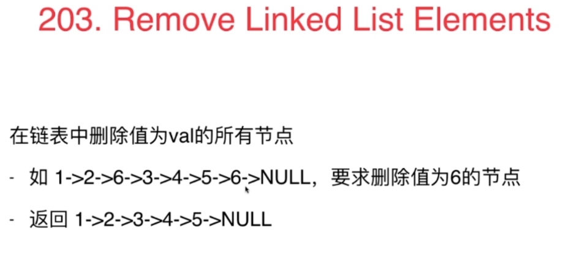
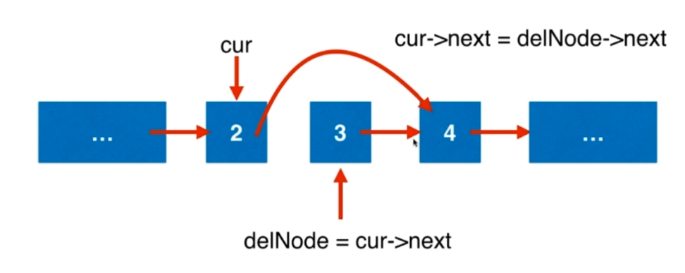
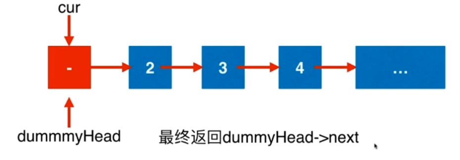

### 203 Remove Linked List Elements

#### 删除逻辑应该怎么做
- 对删除中间，最后一个元素都适用：

对于java：不需要释放内存的节点，令其next为null。
```
ListNode* removeElements(ListNode* head,int val){
    ListNode* cur = head;
    while(cur -> next != NUll){
        if(cur->next->val == val){
            //删除cur->next
            ListNode* delNode = cur->next;
            cur->next = delNode->next;
            // c++中要 delete delNode, java中让其没有引用即可。
            delNode->next = NULL;
        }
        else
            cur = cur->next;
    }
    return head;
}
```
1.直接访问了cur->next，要判断cur是不是空，所以要在前面加上head为空的判断
2.对删除第一个元素不适用，所以要特殊处理
```
ListNode* removeElements(ListNode* head,int val){
    if(head == NULL)
        return NULL;
    if(head->val == val{
        ListNode* delNode = head;
        head = delNode->next;
        delete delNode;
    )
    ListNode* cur = head;
    while(cur -> next != NUll){
        if(cur->next->val == val){
            //删除cur->next
            ListNode* delNode = cur->next;
            cur->next = delNode->next;
            delete delNode
            //java中让其没有引用即可。delNode->next = NULL;
        }
        else
            cur = cur->next;
    }
    return head;
}
```
- 以上代码问题：
1. 有可能头部连着好几个元素都等于val，改用while循环
2. 在判断条件中用到了head->val,就需要判断head不是空，第一次进入循环能保证head不是空，但是后面的循环就不一定，所以在while中要加上这个判断
```
ListNode* removeElements(ListNode* head,int val){
    if(head == NULL)
        return NULL;
    while(head != NULL && head->val == val{
        ListNode* delNode = head;
        head = delNode->next;
        delete delNode;
    )
    ListNode* cur = head;
    while(cur -> next != NUll){
        if(cur->next->val == val){
            //删除cur->next
            ListNode* delNode = cur->next;
            cur->next = delNode->next;
            delete delNode
            //java中让其没有引用即可。delNode->next = NULL;
        }
        else
            cur = cur->next;
    }
    return head;
}
```

- 以上代码问题：
1. 在删除完头部的节点后，head就改变了。下面的代码是想删除剩下节点中值相等的节点，但此时有可能已经不剩下节点了，或者head又为空。此时cur已经是空，又访问了cur->next，就会有异常
2. 可以发现，最开始的head!=null的判断此时就有点多余了，可以改为下面这样。
```
ListNode* removeElements(ListNode* head,int val){
    while(head != NULL && head->val == val{
        ListNode* delNode = head;
        head = delNode->next;
        delete delNode;
    )
    if(head == NULL)
        return NULL;
        
    ListNode* cur = head;
    while(cur -> next != NUll){
        if(cur->next->val == val){
            //删除cur->next
            ListNode* delNode = cur->next;
            cur->next = delNode->next;
            delete delNode
            //java中让其没有引用即可。delNode->next = NULL;
        }
        else
            cur = cur->next;
    }
    return head;
}
```

- 以上代码问题：
1. 删除头部的代码和删除中间元素的很像，造成大量冗余，代码不优美。所以应该使用虚拟指针，改善关于头结点的问题。

#### 虚拟指针技术

```
ListNode* removeElements(ListNode* head,int val){
    ListNode* dummyHead = new ListNode(0);
    dummyHead->next = head;
        
    ListNode* cur = dummyHead;
    while(cur -> next != NUll){
        if(cur->next->val == val){
            //删除cur->next
            ListNode* delNode = cur->next;
            cur->next = delNode->next;
            delete delNode
            //java中让其没有引用即可。delNode->next = NULL;
        }
        else
            cur = cur->next;
    }
    //真正要返回的节点是retHead
    ListNode* retHead = dummyHead-next;
    delete dummyHead;
    return retHead;
}
```

#### 练习：
82:Remove Duplicates from Sorted List II  

#### 思路
- 每一个数字区间即不重复的一块保存当前数字区间cur的前一个节点pre，cur作为当前区间的头，next是下一个区间的头。
- 根据cur,next的位置判断cur区间是否有重复的值。
```
public ListNode deleteDuplicates(ListNode head) {
        if(head == null || head.next == null)
            return head;
        
        ListNode dummyHead = new ListNode(0);
        dummyHead.next = head;
        ListNode pre = dummyHead, cur = pre.next, next = cur.next;
        while(next != null){
            while(next != null && next.val == cur.val){
                next = next.next;
            }
            if(next != cur.next){
                pre.next = next;
                cur = pre.next;
                if(cur != null)
                    next = cur.next;
            }
            else{
                pre = cur;
                cur = next;
                next = next.next;
            }
        }
        return dummyHead.next;
    }
```

- 这个思路简化了上面的next，用cur.next代替next直接比较。
1. 只设立pre节点和cur节点。pre表示当前区间的头，cur和cur.next比较，一直走到当前区间的尾部。
2. 因为内循环访问了cur.next，所以外循环是cur!=null,内循环是cur.next!=null
3. 通过cur的位置判断是否这个区间有重复值。
```
  public ListNode deleteDuplicates1(ListNode head) {
        if(head == null || head.next ==null)
            return head;
        ListNode newhead = new ListNode(0), pre=newhead,cur=head;
        newhead.next = head;
        while (cur!=null)
        {
            while (cur.next != null && cur.val == cur.next.val)  //重点在这里，当cur往前走的时候，pre并没有往前走，所以pre一直保留着上一个位置
                cur = cur.next;
            if (pre.next == cur)
                pre = pre.next;
            else
                pre.next = cur.next;
            cur = cur.next;
        }
        return newhead.next;
    }
```

21:Merge Two Sorted Lists  
#### 思路：还是需要跟归并一样做一次判断，谁小谁右移
```
public ListNode mergeTwoLists(ListNode l1, ListNode l2) {
        if(l1 == null || l2 == null)
            return l1 == null ? l2 : l1;
        
        ListNode newHead = new ListNode(0), tmp = newHead;
        while(l1 != null && l2 != null){
            if(l1.val <= l2.val){
                tmp.next = l1;
                l1 = l1.next;
            }
            else{
                tmp.next = l2;
                l2 = l2.next;
            }
            tmp = tmp.next;
        }
        if(l1 != null) tmp.next = l1;
        if(l2 != null) tmp.next = l2;
        return newHead.next;
    }
```
