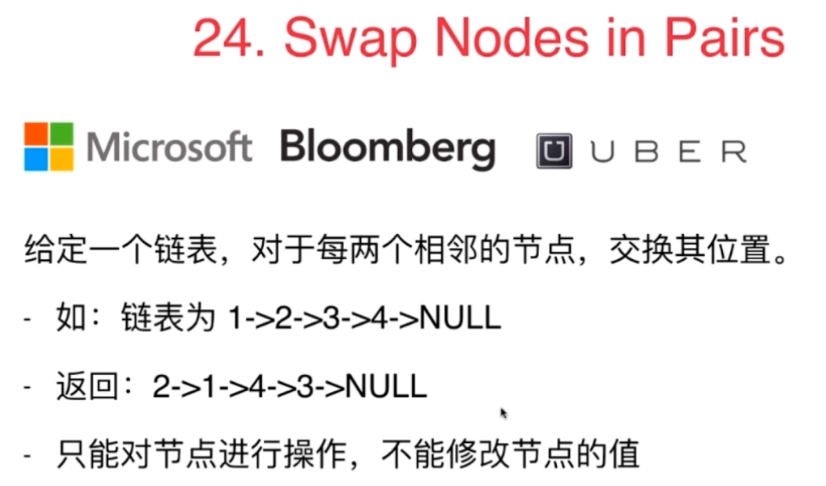
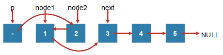

### 24. Swap Nodes in Pairs

1. 设立四个指针，分别是：pre,node1,node2,next。node1和node2是要进行交换的两个节点。需要让node1的前一个节点pre指向2,2指向1,1指向2的后一个节点
2. node2 指向node1, node1指向next，p指向node2. 给p重新赋值为node1

3. p移动到next，根据重新找到node1,node2,next，开始下一轮交换
**核心在于创建几个指针预先保留相应位置**

```
ListNode* swapPairs(ListNode* head) {         
    ListNode* dummyHead = new ListNode(0);         
    dummyHead->next = head;         
    ListNode* p = dummyHead;        
    while( p->next && p->next->next ){             
        ListNode* node1 = p->next;             
        ListNode* node2 = node1->next;             
        ListNode* next = node2->next;      
        
        node2->next = node1;             
        node1->next = next;             
        p->next = node2;             
        p = node1;         
    }         
    ListNode* retHead = dummyHead->next;         
    delete dummyHead;        
    return retHead;     
    }
}; 

```
#### 练习
25：Reverse Nodes in k-Group  
给定一个链表，每k个节点为一组，反转每一组的k个节点。k为正整数且小于等于链表长度。如果链表长度不是k的整数倍，剩余部分不需要进行反转。如： 1->2->3->4->5->NULL
若 k = 2，则结果为：2->1->4->3->5->NULL
若 k = 3，则结果为：3->2->1->4->5->NULL  

147：Insertion Sort List  
为一个链表进行插入排序  

148：Sort List  