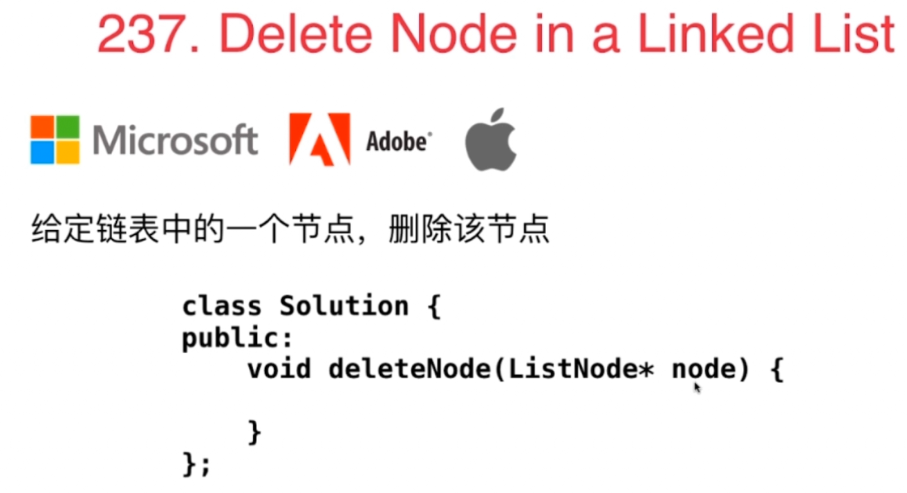
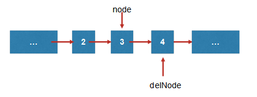

### 237. Delete Node in a Linked List

- 之前的题目都不能修改节点的值，那现在只能通过修改值实现：


```
void deleteNode(ListNode* node) {                  node->val = node->next->val;                ListNode* delNode = node->next;             node->next = delNode->next;  

        delete delNode;        
        return;     
    } 
```
- 注意代码中访问了node.val, node.next.val。所以node,node.next都不能是空。node.next是空就证明Node是最后一个节点，此时node的前一个节点就应该指向空，并删除node自己即可
```
void deleteNode(ListNode* node) {
    if(node == NULL)
        return;
    if(node.next == NULL){
        delete node;
        node = NULL;
        return;
    }
        
    node->val = node->next->val;            ListNode* delNode = node->next;         node->next = delNode->next;  

        delete delNode;        
        return;     
    } 
```


