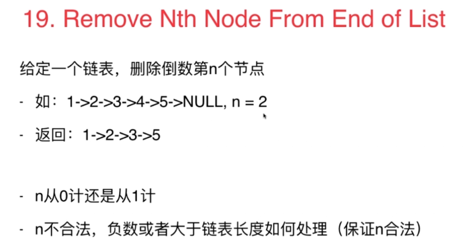
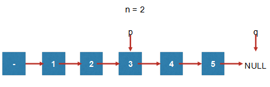

链表也是线性结构，可以套用数组的思路
### 19. Remove Nth Node From End of List

#### 解法1：先遍历一遍计算链表长度；再遍历一遍删除倒数第n个节点
遍历两遍链表。能否只遍历一遍链表？

#### 解法2：只遍历一次链表
- 要删除一个节点，必须知道该节点的前一个节点，对于头结点就应该创建一个虚拟节点
- 根据给定的n，声明两个索引，确定n节点的前面节点p。假设最后一个节点就是尾节点q，p和q的距离是确定的：n

- 防止用户输入的n不应该太小，也不应该大于链表长度

```
ListNode* removeNthFromEnd(ListNode* head, int n) {         
    assert(n>=0)
    ListNode* dummyHead = new ListNode(0);         
    dummyHead->next = head;         
    ListNode* p = dummyHead;         
    ListNode* q = dummyHead;        
    
    for( int i = 0 ; i < n + 1 ; i ++ ){             
        assert(q);             
        q = q->next;         
    }       
    
    while( q ){             
        p = p->next;             
        q = q->next;         
    }    
    
    ListNode* delNode = p->next;        
    p->next = delNode->next;        
    delete delNode;         
    ListNode* retNode = dummyHead->next;   
    
    delete dummyHead;        
    return retNode;     
}
```
#### 练习：
61. Rotate List  
给定一个链表，让这个链表向右旋转k位。其中k为非负数。  
如：1->2->3->4->5->NULL, k = 2  
第一次旋转：5->1->2->3->4->NULL  
第二次旋转：4->5->1->2->3->NULL  
143. Reorder List  
给定一个链表 L(0) -> L(1) -> L(2) -> … -> L(n-1) -> L(n)  
将其变为 L(0) -> L(n) -> L(1) -> L(n-1) -> L(2) -> L(n-2)…的形式
链表无法随机访问数据，如何获得中间的元素？  
两次遍历？一次遍历？  
234. Palindrome Linked List  
给一个链表，判断这个链表是否为回文（正看反看）链表。  
想想数组中怎么做，可以将链表存在数组中，然后判断。  
能否使用O(1)的空间复杂度解决问题？  
