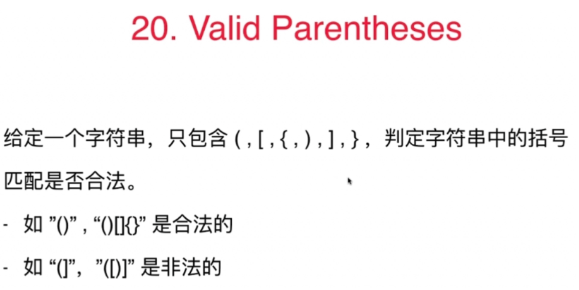

### Valid Parentheses


#### 思路
1. 只要遇到左方向的括号，就放进栈里
2. 只要遇到右方向的括号，就将栈顶元素拿出看是否跟他匹配。匹配就将栈顶元素弹出，否则即不匹配。
3. 直到遍历结束，返回匹配；或在遍历过程中就发现不匹配直接返回不匹配。

**使用栈的原因：在一种嵌套关系中，通过栈顶元素获得最近的需要处理的元素**  

#### 注意：
1. 在碰到右括号要去拿左括号，此时就要拿栈顶元素，就要先判断栈是否为空。为空就直接返回false
2. 在所有元素取完之后也不能直接返回true，当此时栈也为空的时候才能返回true
3. 在最后一个判断中assert，因为此时右括号只能是},若都不是证明输入有问题
```    
public boolean isValid(String s) {

        Stack<Character> stack = new Stack<Character>();
        for( int i = 0 ; i < s.length() ; i ++ )
            if( s.charAt(i) == '(' || s.charAt(i) == '{' || s.charAt(i) == '[')
                stack.push(s.charAt(i));
            else{

                if( stack.size() == 0 )
                    return false;

                Character c = stack.pop();

                Character match;
                if( s.charAt(i) == ')' )
                    match = '(';
                else if( s.charAt(i) == ']' )
                    match = '[';
                else{
                    assert s.charAt(i) == '}';
                    match = '{';
                }

                if(c != match)
                    return false;
            }

        if( stack.size() != 0 )
            return false;

        return true;
    }
```

#### 练习
150. Evaluate Reverse Polish Notation
71. simpllify path
路径是否一定合法？不能回退（/../）? 多余的/ ?(home// -- home/)