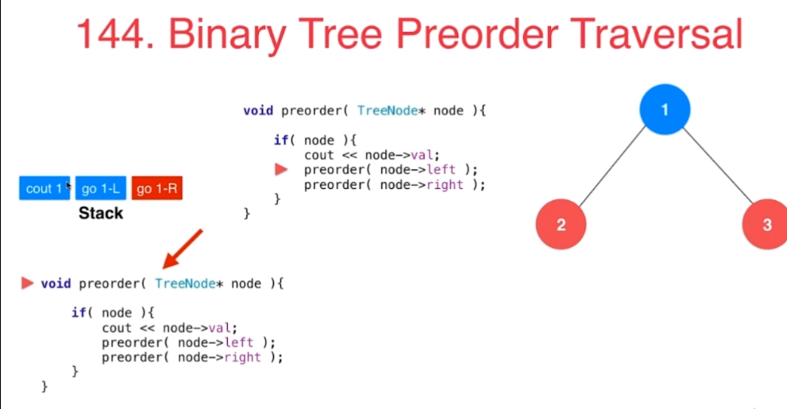
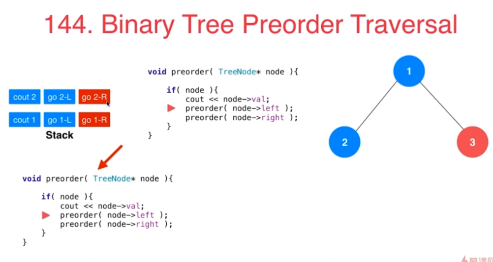
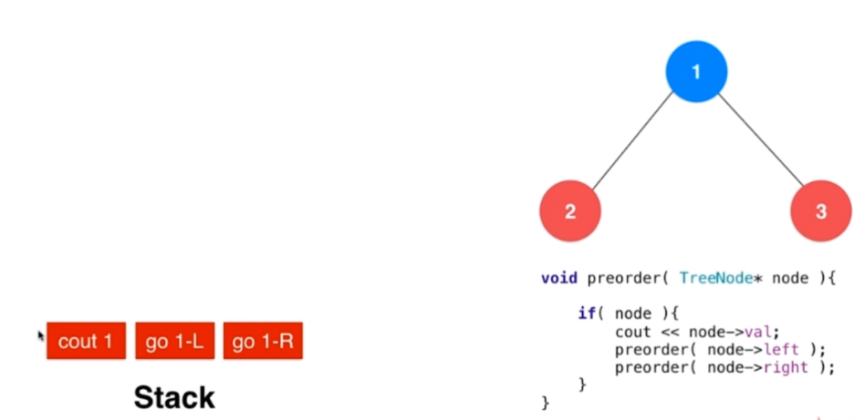
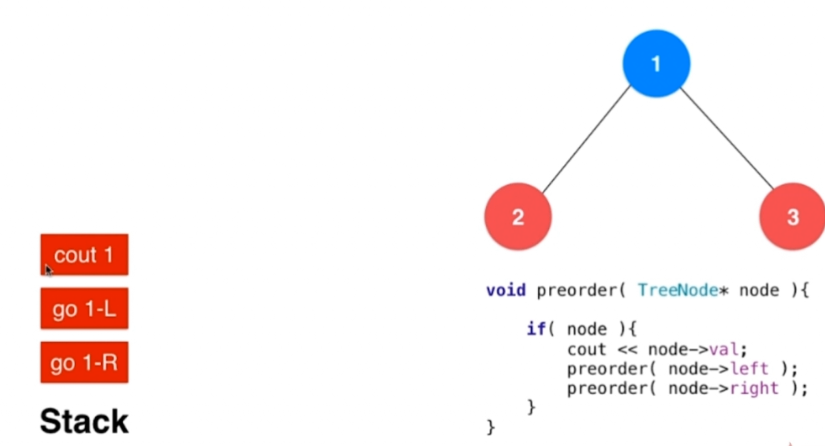
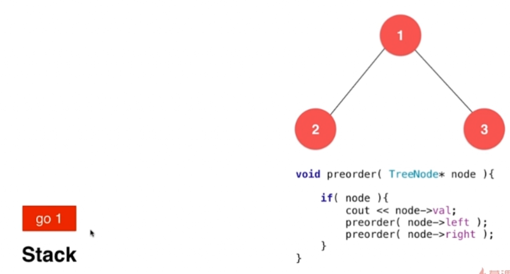
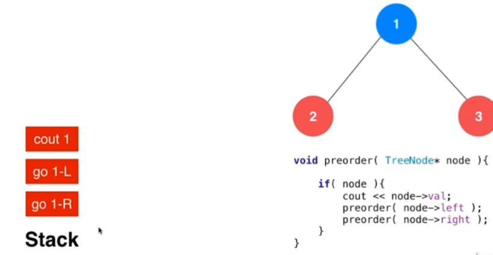
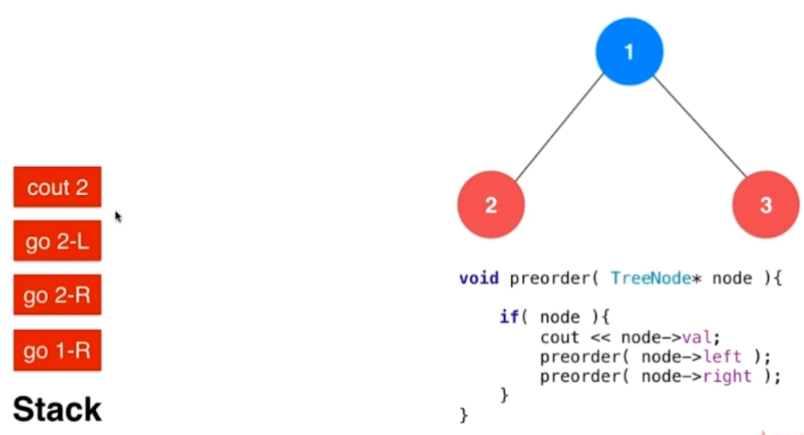

# 6.2 栈和递归的紧密关系 
## 栈的基本应用
二叉树中的算法，因为二叉树本来就是递归定义的，所以二叉树中有很多关于递归的算法。
144. Binary Tree Preorder Traversal
94. Binary Tree Inorder Traversal
145. Binary Tree Postorder Traversal

### 二叉树递归遍历时的系统栈情况

#### 如上图所示：
1. 在函数递归执行的时候，执行完对1节点的访问，就会去执行2节点的访问，相当于对1节点的访问就停在了那里
2. 此时系统中会有一个Stack记录下上一层函数执行到了哪里，看图中左边的Stack，其中有三个内容分别代表了在遍历1节点的时候需要做的事情：打印1，遍历1的左边，遍历1的右边。蓝色代表已经做了，红色代表还没做
3. 这样遍历1完了后，从栈顶取出相应保存的信息，就能知道下一步要干什么：访问1的右孩子。


1. 同理，在遍历2节点的时候，又进入了访问2节点的左孩子的递归
2. 所以此时需要在栈顶添加访问2节点的情况：打印2，遍历2的左边，遍历2的右边

# 6.3 使用栈模拟系统栈
- 系统栈要保存递归调用前，函数的执行情况：这三个就是按照执行顺序从左往右填好的。

- 模拟使用栈结构存储，就等价于向栈中推入下面这样的命令，先推入“访问右孩子”，然后是“访问左孩子”，最后是“打印”。因为先推入的最后做。这样就可以按照原本的顺序去执行


## 模拟

- 一开始系统栈中推入要执行访问1的命令

- 可以看到，在访问节点1的时候，需要执行三个命令，按逆序放进去，挨个执行。

- 在访问节点2的时候，要把2中要执行的命令也逆序放进栈中

### 模拟系统栈执行先序遍历，自己定义指令结构，存入stack中
```
/// 非递归二叉树的前序遍历
/// 时间复杂度: O(n), n为树的节点个数
/// 空间复杂度: O(h), h为树的高度
public class Solution144 {

    // Definition for a binary tree node.
    public class TreeNode {
        int val;
        TreeNode left;
        TreeNode right;
        TreeNode(int x) { val = x; }
    }
    // 自定义指令
    private class Command{
        String s;   // go, print
        TreeNode node;
        Command(String s, TreeNode node){
            this.s = s;
            this.node = node;
        }
    };

    public List<Integer> preorderTraversal(TreeNode root) {
        ArrayList<Integer> res = new ArrayList<Integer>();
        if(root == null)
            return res;

        Stack<Command> stack = new Stack<Command>();
        stack.push(new Command("go", root));
        while(!stack.empty()){
            Command command = stack.pop();

            if(command.s.equals("print"))
                res.add(command.node.val);
            else{
                //先序遍历，最后插入print
                assert command.s.equals("go");
                if(command.node.right != null)
                    stack.push(new Command("go",command.node.right));
                if(command.node.left != null)
                    stack.push(new Command("go",command.node.left));
                stack.push(new Command("print", command.node));
            }
        }
        return res;
    }
}
```
- 这个代码很容易修改成：中序和后序遍历。也很容易修改为其他递归函数。跟教科书上的非递归代码不一样。

#### 练习
341. Flatten Nested List Iterator