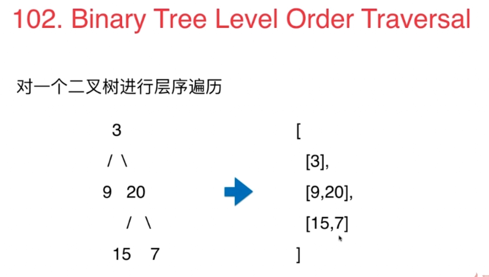

# 队列

## 队列的基本应用-广度优先遍历
- 树：层序遍历
- 图：无权图的最短路径
- 树是图的特殊形式

### 102. Binary Tree Level Order Traversal

- 用二维list表示这个数，则res中有多少个list就表示有几层
- 将节点包装成pair，将节点所在的层数也包含进去
- 每次从队列中拿出一个节点，根据其level和当前res中已有的层次判断他是不是已有的层中的节点
```
/// 二叉树的层序遍历
/// 时间复杂度: O(n), n为树的节点个数
/// 空间复杂度: O(n)
class Solution {

    // Definition for a binary tree node.
    public class TreeNode {
        int val;
        TreeNode left;
        TreeNode right;
        TreeNode(int x) { val = x; }
    }

    public List<List<Integer>> levelOrder(TreeNode root) {

        ArrayList<List<Integer>> res = new ArrayList<List<Integer>>();
        if(root == null)
            return res;

        // 我们使用LinkedList来做为我们的先入先出的队列
        LinkedList<Pair<TreeNode, Integer>> queue = new LinkedList<Pair<TreeNode, Integer>>();
        queue.addLast(new Pair<TreeNode, Integer>(root, 0));

        while(!queue.isEmpty()){

            Pair<TreeNode, Integer> front = queue.removeFirst();
            TreeNode node = front.getKey();
            int level = front.getValue();
            // 根据其level和当前res中已有的层次判断他是不是已有的层中的节点
            //level和res.size都是从0开始算，level=res.size表示level = res.size + 1。即要开始新的一层
            if(level == res.size())
                res.add(new ArrayList<Integer>());
            assert level < res.size();
            //否则在已有层，添加进去该节点
            res.get(level).add(node.val);
            if(node.left != null)
                queue.addLast(new Pair<TreeNode, Integer>(node.left, level + 1));
            if(node.right != null)
                queue.addLast(new Pair<TreeNode, Integer>(node.right, level + 1));
        }

        return res;
    }
}
```

#### 练习
107. Binary Tree Level Order TraversalII
103. Binary Tree ZigZag Level Order Traversal
199. Binary Tree Right Side View