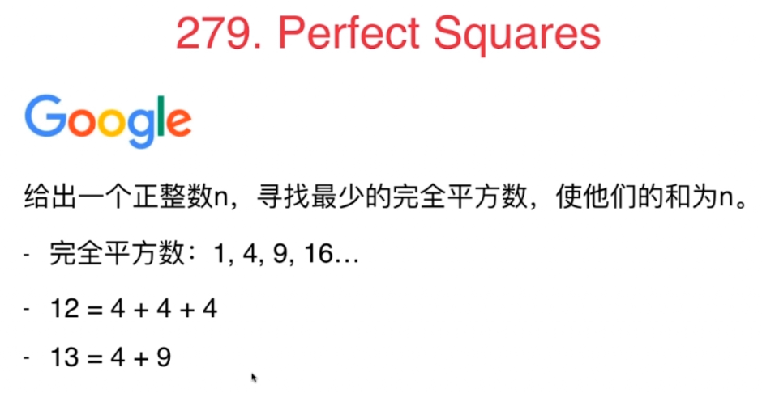
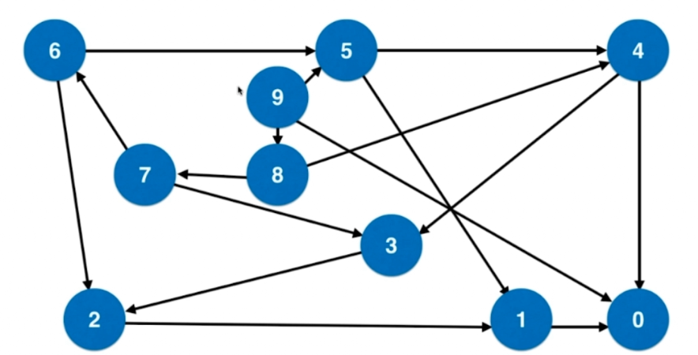

广度优先适用于无权图
### 279. Perfect Squares

很多题目都可以使用图的最短路径这一思路解决，但是题目一看上去却是跟图没关系的，就需要对问题进行深入分析后进行建模。

- 没有解怎么办？
- 是否可能没有解？不可能--因为1是一个完全平方数，最差都会有解。

#### 思路1：直觉解法--贪心？不对，看下面例子
12 = 9 + 1 + 1 + 1
12 = 4 + 4 + 4

#### 思路2：转换到图

有向图，大的数指向小的数


##### 思路1：超时
```
// 该方法会导致 Time Limit Exceeded 或者 Memory Limit Exceeded
//
// 时间复杂度: O(2^n)
// 空间复杂度: O(2^n)
public class Solution1 {

    public int numSquares(int n) {

        LinkedList<Pair<Integer, Integer>> queue = new LinkedList<Pair<Integer, Integer>>();
        queue.addLast(new Pair<Integer, Integer>(n, 0));

        while(!queue.isEmpty()){
            Pair<Integer, Integer> front = queue.removeFirst();
            int num = front.getKey();
            int step = front.getValue();

            if(num == 0)
                return step;
            //这里就是构建图的过程，所有Num-i*i的点到num的距离是1。所以直接new pair
            for(int i = 1 ; num - i*i >= 0 ; i ++)
                queue.addLast(new Pair(num - i * i, step + 1));
        }

        throw new IllegalStateException("No Solution.");
    }

```
- 在上面这个算法有性能问题，性能问题源于：每次都将num-一个完全平方数的可能结点推入队列中，就会重复推入很多节点，因为每个数字都能从多种渠道获得
- 之所以会有这个问题，是因为当前的结构是图，而不是树，对于图，每一个节点会有多个节点能到达他。而树就只有一个节点能到达。

##### 思路2：访问数组
- 设置一个visited数组，记录已经访问过的节点
- 这样才是一个标准的在图中进行广度优先遍历的程序

```
// 使用visited数组,记录每一个入队元素
//
// 时间复杂度: O(n)
// 空间复杂度: O(n)
public int numSquares(int n) {

    LinkedList<Pair<Integer, Integer>> queue = new LinkedList<Pair<Integer, Integer>>();
    queue.addLast(new Pair<Integer, Integer>(n, 0));

    boolean[] visited = new boolean[n+1];
    visited[n] = true;

    while(!queue.isEmpty()){
        Pair<Integer, Integer> front = queue.removeFirst();
        int num = front.getKey();
        int step = front.getValue();

        if(num == 0)
            return step;

        for(int i = 1 ; num - i*i >= 0 ; i ++)
            if(!visited[num - i * i]){
                queue.addLast(new Pair(num - i * i, step + 1));
                visited[num - i * i] = true;
            }
    }

    throw new IllegalStateException("No Solution.");
}
```

##### 思路3：对小的地方进一步优化
- 在for循环中也进行是否==0的判断
```

    public int numSquares(int n) {

        if(n == 0)
            return 0;

        LinkedList<Pair<Integer, Integer>> queue = new LinkedList<Pair<Integer, Integer>>();
        queue.addLast(new Pair<Integer, Integer>(n, 0));

        boolean[] visited = new boolean[n+1];
        visited[n] = true;

        while(!queue.isEmpty()){
            Pair<Integer, Integer> front = queue.removeFirst();
            int num = front.getKey();
            int step = front.getValue();

            if(num == 0)
                return step;

            for(int i = 1 ; num - i*i >= 0 ; i ++){
                int a = num - i*i;
                if(!visited[a]){
                    if(a == 0) 
                    return step + 1;
                    queue.addLast(new Pair(num - i * i, step + 1));
                    visited[num - i * i] = true;
                }
            }
        }

        throw new IllegalStateException("No Solution.");
    }
```

#### 练习
127. Word Ladder
126. Word Ladder II