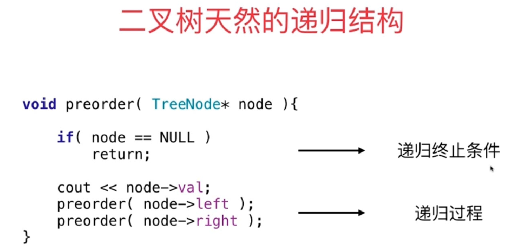

- 定义清楚函数的语义并一直遵循


### 104.Maximum Depth of Binary Tree
1.函数定义为计算以root为根节点的树的最大深度
2.所以left,right就是以左节点和右节点为根节点的子树的最大深度

```
// 时间复杂度: O(n), n是树中的节点个数
// 空间复杂度: O(h), h是树的高度
class Solution {
    public int maxDepth(TreeNode root) {

        if(root == null)
            return 0;

        return 1 + Math.max(maxDepth(root.left), maxDepth(root.right));
    }
```

#### 练习
1. 复习二叉树相关的所有操作，考虑清楚每个函数的语义
111. Minimum Depth of Binary Tree
在思考递归的终止条件时，会遇到的陷阱