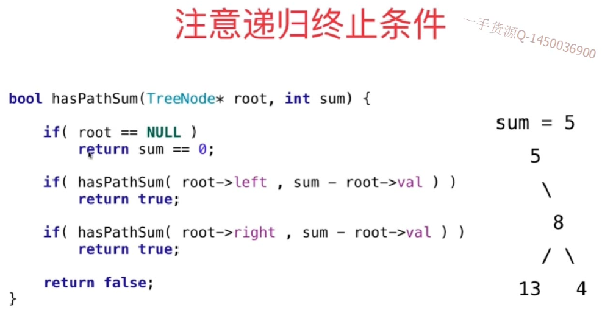
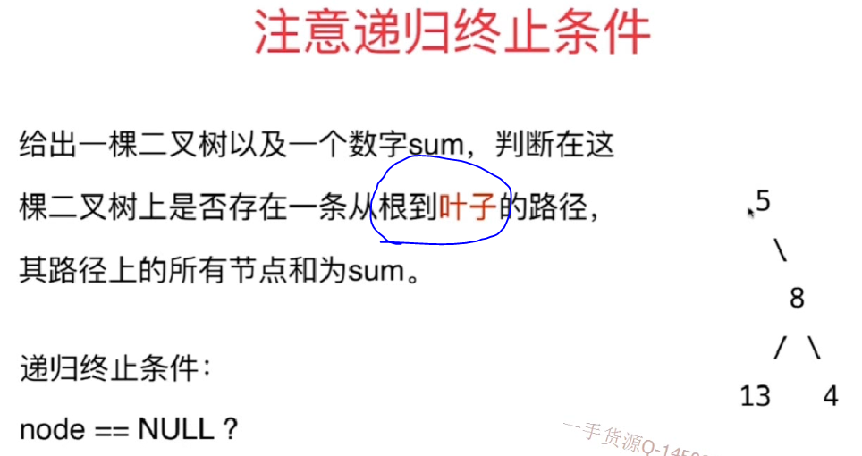

### 112.path sum

#### 思路一：如下

- 会报错，因为5的左边也是null，满足代码。
- 但是5的左孩子不满足题目条件


- 题目要求从跟到叶子，但是node==null 不一定代表 node的父亲就是叶子节点，有可能上一层节点是只有一个孩子节点的也有可能
- 正确的叶子节点是：左子树和右子树都是空的节点。
`if(root.left == null && root.right == null)`
- 又因为上面那句话直接访问了节点的左右指针，所以要确保root不为空，即如果题目给的就是一个空的树，就需要进行root是否为空的判断`if(root == null)`

```
/// 时间复杂度: O(n), n为树的节点个数
/// 空间复杂度: O(h), h为树的高度
class Solution {
    public boolean hasPathSum(TreeNode root, int sum) {

        if(root == null)
            return false;

        if(root.left == null && root.right == null)
            return sum == root.val;

        return hasPathSum(root.left, sum - root.val)
                || hasPathSum(root.right, sum - root.val);
    }
}
```

#### 练习：
111.对最低深度的定义:也是从根节点到叶子节点
404. sum of left leaves