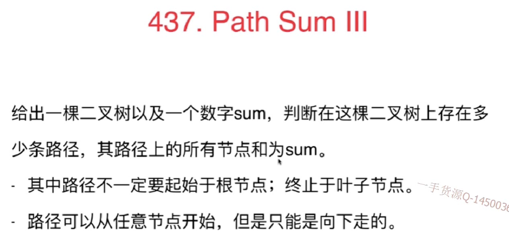
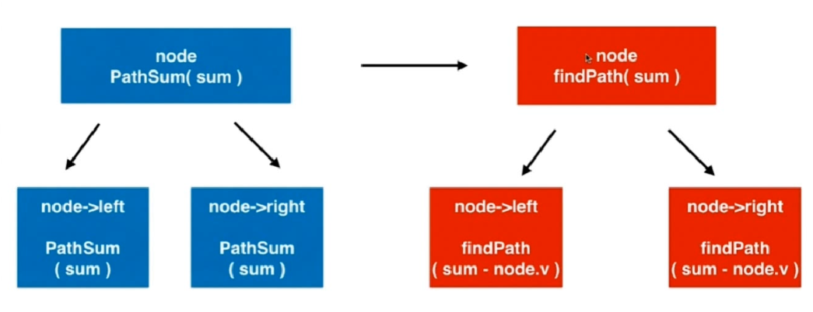

### 437.Path Sum III


#### 思路
- 原来使用findpath函数：就是默认包含头节点，再往后计算其他节点的和
1. 此时不要求根节点一定是叶子，所以用Node==null做判断
2. 因为有负数，所以当node.val=num的时候不能直接返回1.因为后面也有可能会有=num的情况
```
 // 在以node为根节点的二叉树中,寻找包含node的路径,和为sum
    // 返回这样的路径个数
    private int findPath(TreeNode node, int num){

        if(node == null)
            return 0;

        int res = 0;
        if(node.val == num)
            res += 1;

        res += findPath(node.left , num - node.val);
        res += findPath(node.right , num - node.val);

        return res;
    }
```

- 现在应该考虑两种情况:包含头节点,使用findpath函数；不包含头节点，使用pathsum函数，即对左右孩子使用pathsum递归`pathSum(root.left , sum)+ pathSum(root.right , sum);`
- pathsum的语义：在以root为根节点的二叉树中,寻找和为sum的路径,返回这样的路径个数
- 所以对头节点调用两个函数:



```
/// 时间复杂度: O(n), n为树的节点个数
/// 空间复杂度: O(h), h为树的高度
class Solution {

    // 在以root为根节点的二叉树中,寻找和为sum的路径,返回这样的路径个数
    public int pathSum(TreeNode root, int sum) {

        if(root == null)
            return 0;

        return findPath(root, sum)
                + pathSum(root.left , sum)
                + pathSum(root.right , sum);
    }

    // 在以node为根节点的二叉树中,寻找包含node的路径,和为sum
    // 返回这样的路径个数
    private int findPath(TreeNode node, int num){

        if(node == null)
            return 0;

        int res = 0;
        if(node.val == num)
            res += 1;

        res += findPath(node.left , num - node.val);
        res += findPath(node.right , num - node.val);

        return res;
    }
}
```
