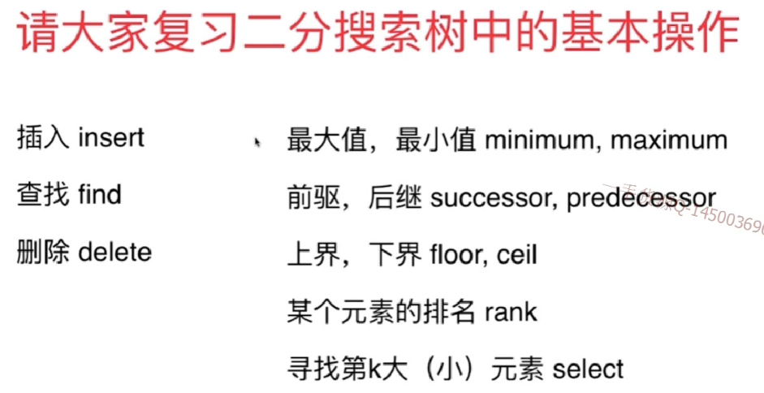

复习二分搜索树的所有基本操作：插入，查找，删除

###  235.Lowest Common Ancestor of a Binary Search Tree
一共分三种情况
- 如果p,q都在node左边：都小于node,公共祖先在node左边
- 如果p,q都在Node右边：都大于node,公共祖先在node右边
- 如果p,q不在Node的同一边：
1. 一个小于node,一个大于node，node就是公共祖先
2. p是node，p是公共祖先
3. q是node，q是公共祖先

#### 思路
- 首先要求p,q不能为空
- root也不能为空

```
public TreeNode lowestCommonAncestor(TreeNode root, TreeNode p, TreeNode q) {

    if(p == null || q == null)
        throw new IllegalArgumentException("p or q can not be null.");

    if(root == null)
        return null;

    if(p.val < root.val && q.val < root.val)
        return lowestCommonAncestor(root.left, p, q);
    if(p.val > root.val && q.val > root.val)
        return lowestCommonAncestor(root.right, p, q);

    assert p.val == root.val || q.val == root.val
            || (root.val - p.val) * (root.val - q.val) < 0;

    return root;
}
```

#### 练习
98. validate binary search tree
450. delete node in a bst
删除的节点不存在，多个相同的值都删除，删除的节点要返回吗？
108.convert sorted array to binart search tree
230.kth smallest element in a bst
236.lowest common ancestor of a binary tree