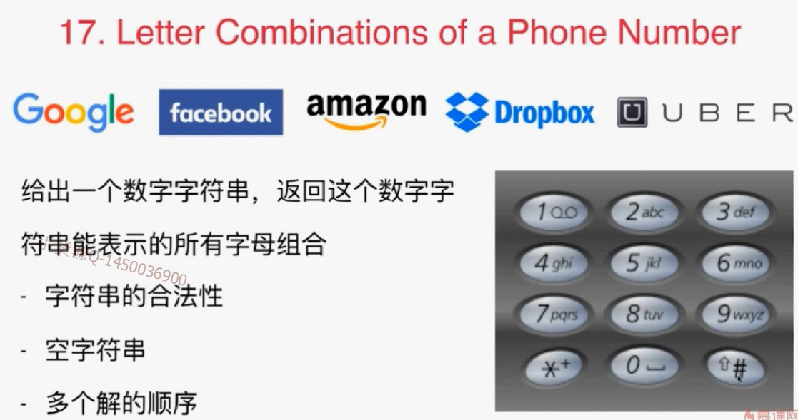
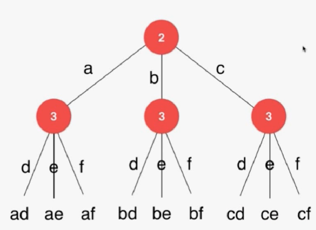
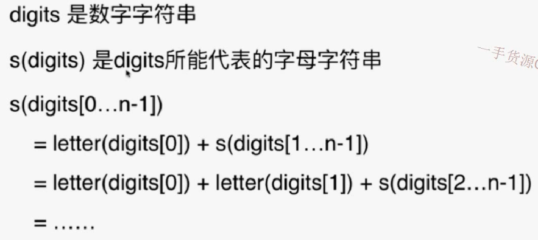
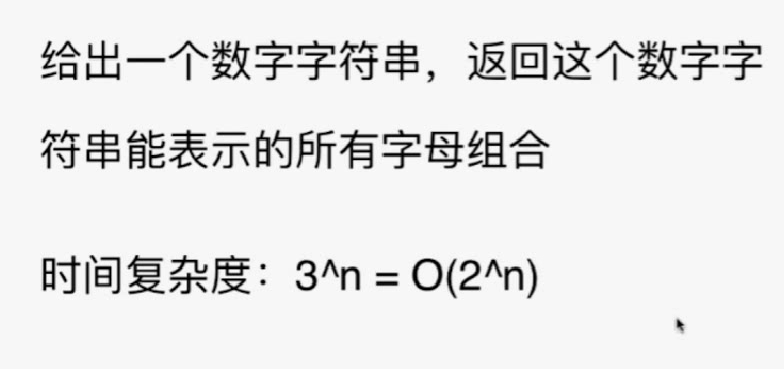

递归算法的经典思想：回溯法。

解决问题的思路本质是一棵树的形状，即**树形问题**



- 合法性

  是否包含*，#。可看出表中的数字应该没有1，因为1没有代表的字母

- 解决问题的思路隐藏在一颗树中，就可以用递归去解决

  

  

  

- 代码

// 用这样的方式进行调试，输出第几位和当前的字符串
        System.out.println(index + " : " + s);

```java
import java.util.List;
import java.util.ArrayList;

/// 17. Letter Combinations of a Phone Number
/// https://leetcode.com/problems/letter-combinations-of-a-phone-number/description/
/// 时间复杂度: O(2^len(s))
/// 空间复杂度: O(len(s))
class Solution {

    private String letterMap[] = {
                " ",    //0
                "",     //1
                "abc",  //2
                "def",  //3
                "ghi",  //4
                "jkl",  //5
                "mno",  //6
                "pqrs", //7
                "tuv",  //8
                "wxyz"  //9
    };

    private ArrayList<String> res;

    public List<String> letterCombinations(String digits) {

        res = new ArrayList<String>();
        if(digits.equals(""))
            return res;

        findCombination(digits, 0, "");
        return res;
    }

    // s中保存了此时从digits[0...index-1]翻译得到的一个字母字符串
    // 寻找和digits[index]匹配的字母, 获得digits[0...index]翻译得到的解
    private void findCombination(String digits, int index, String s){
	   // 用这样的方式进行调试，输出第几位和当前的字符串
        System.out.println(index + " : " + s);
        if(index == digits.length()){
            res.add(s);
            System.out.println("get " + s + " , return");
            return;
        }

        Character c = digits.charAt(index);
        assert  c.compareTo('0') >= 0 &&
                c.compareTo('9') <= 0 &&
                c.compareTo('1') != 0;
        String letters = letterMap[c - '0'];
        for(int i = 0 ; i < letters.length() ; i ++){
            System.out.println("digits[" + index + "] = " + c +
                    " , use " + letters.charAt(i));
            findCombination(digits, index+1, s + letters.charAt(i));
        }

        System.out.println("digits[" + index + "] = " + c + " complete, return");

        return;
    }

    private static void printList(List<String> list){
        for(String s: list)
            System.out.println(s);
    }

    public static void main(String[] args) {

        printList((new Solution()).letterCombinations("234"));
    }
}
```




多重循环、回溯法是暴力解法的一个主要实现手段。动态规划是基于回溯法的。

- 93.restore ip addresses
- 131.palindrome partitioning

# 回溯算法的应用

排列、组合问题