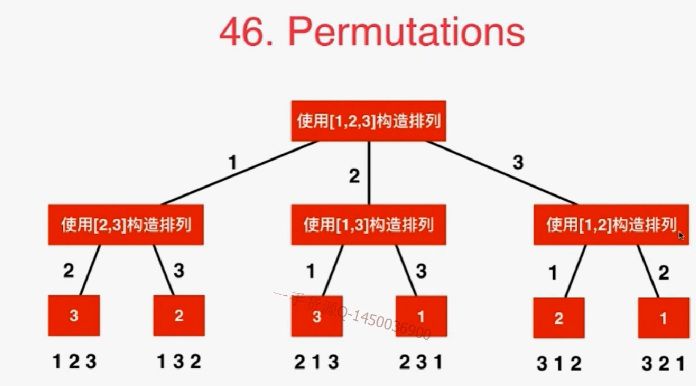

# 46


## 思路

元素有冲突，需要采用辅助数组used


这里在一开始取出一个数字后，后面的排列中就不能有这个取出的数字了。



```java
// p中保存了一个有index-1个元素的排列。
// 向这个排列的末尾添加第index+1个元素, 获得一个有index+1个元素的排列
// 需要nums数组来组成这个排列，index表示正在处理第几个元素，p是在递归的过程中找到的一个拥有index个元素的排列
    private void generatePermutation(int[] nums, int index, LinkedList<Integer> p){
```

```java
import java.util.List;
import java.util.ArrayList;
import java.util.LinkedList;

public class Solution {
    private ArrayList<List<Integer>> res;
    //辅助数组来判断nums[i]是否在p中
    private boolean[] used;

    public List<List<Integer>> permute(int[] nums) {
        res = new ArrayList<List<Integer>>();
        if(nums == null || nums.length == 0)
            return res;

        used = new boolean[nums.length];
        LinkedList<Integer> p = new LinkedList<Integer>();
        generatePermutation(nums, 0, p);

        return res;
    }

    // p中保存了一个有index-1个元素的排列。
    // 向这个排列的末尾添加第index个元素, 获得一个有index个元素的排列
    private void generatePermutation(int[] nums, int index, LinkedList<Integer> p){
        if(index == nums.length){
            res.add((LinkedList<Integer>)p.clone());
            return;
        }

        for(int i = 0 ; i < nums.length ; i ++)
            if(!used[i]){
                used[i] = true;
                p.addLast(nums[i]);
                generatePermutation(nums, index + 1, p );
                // 回溯：尝试其他元素，要把最后的这个i元素删除
                p.removeLast();
                used[i] = false;
            }

        return;
    }

    private static void printList(List<Integer> list){
        for(Integer e: list)
            System.out.print(e + " ");
        System.out.println();
    }

    public static void main(String[] args) {
        int[] nums = {1, 2, 3};
        List<List<Integer>> res = (new Solution()).permute(nums);
        for(List<Integer> list: res)
            printList(list);
    }
}
```

## 练习

1  permutationsII

有重复字母，重复的字符串不要。

```java
public class Solution {
    ArrayList<String> res;
    boolean[] used;
    public ArrayList<String> Permutation(String str) {
        res = new ArrayList<>();
        if (str == null || str.length() == 0) {
            return res;
        }
        char[] chr = str.toCharArray();
        Arrays.sort(chr);
        used = new boolean[chr.length];
        String tmp = "";
        perm(chr, tmp);
        return res;
    }
    
    public void perm(char[] chr, String tmp) {
        if (tmp.length() == chr.length) {
            res.add(new String(tmp));
            return;
        }
        for (int i = 0; i < chr.length; i++) {
            if(used[i] == true || i>0 && chr[i] == chr[i-1] && used[i-1] == true) {
                    continue;
            }    
            tmp += chr[i];
            used[i] = true;
            perm(chr, tmp);
            used[i] = false;
            tmp = tmp.substring(0,tmp.length() - 1);
        }
    }
}
```

