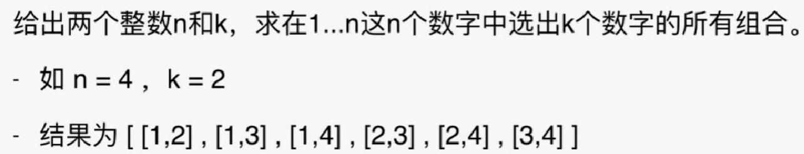
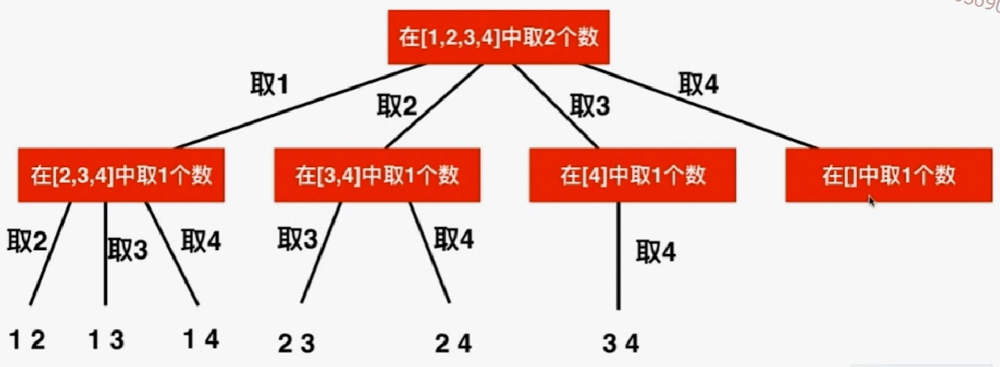

# 77. Combinations



取数就变为一个递归关系，因为都是在集合中取出数



- 可以看出这棵树有几个孩子是不确定的。
- 因为不能有重复，所以后面取数的时候子集合中就要排除掉前面取过的数

```java
import java.util.List;
import java.util.ArrayList;
import java.util.LinkedList;

/// 77. Combinations
/// https://leetcode.com/problems/combinations/description/
/// 时间复杂度: O(n^k)
/// 空间复杂度: O(k)
public class Solution {
    private ArrayList<List<Integer>> res;

    public List<List<Integer>> combine(int n, int k) {
		// 异常条件直接返回
        res = new ArrayList<List<Integer>>();
        if(n <= 0 || k <= 0 || k > n)
            return res;

        LinkedList<Integer> c = new LinkedList<Integer>();
        generateCombinations(n, k, 1, c);

        return res;
    }

    // 求解C(n,k), 当前已经找到的组合存储在c中, 需要从start开始搜索新的元素。前面的数已经考虑过了
    private void generateCombinations(int n, int k, int start, LinkedList<Integer> c){
		//终止条件，c的个数为要求的时候退出
        if(c.size() == k){
            res.add((List<Integer>)c.clone());
            return;
        }

        for(int i = start ; i <= n ; i ++){
            c.addLast(i);
            generateCombinations(n, k, i + 1, c);
            c.removeLast();
        }

        return;
    }

    private static void printList(List<Integer> list){
        for(Integer e: list)
            System.out.print(e + " ");
        System.out.println();
    }

    public static void main(String[] args) {

        List<List<Integer>> res = (new Solution()).combine(4, 2);
        for(List<Integer> list: res)
            printList(list);
    }
}
```

## 优化：剪枝

在这个问题中，最后的4这条分支是没必要走的。因为取不到别的数了。

```java
// 不应该遍历到n，修改循环界限
for(int i = start ; i <= n ; i ++){
    c.addLast(i);
    generateCombinations(n, k, i + 1, c);
    c.removeLast();
}
```

- 修改后

```java
import java.util.List;
import java.util.ArrayList;
import java.util.LinkedList;

/// 77. Combinations
/// https://leetcode.com/problems/combinations/description/
/// 时间复杂度: O(n^k)
/// 空间复杂度: O(k)
public class Solution {
    private ArrayList<List<Integer>> res;

    public List<List<Integer>> combine(int n, int k) {

        res = new ArrayList<List<Integer>>();
        if(n <= 0 || k <= 0 || k > n)
            return res;

        LinkedList<Integer> c = new LinkedList<Integer>();
        generateCombinations(n, k, 1, c);

        return res;
    }

    // 求解C(n,k), 当前已经找到的组合存储在c中, 需要从start开始搜索新的元素
    private void generateCombinations(int n, int k, int start, LinkedList<Integer> c){
        if(c.size() == k){
            res.add((List<Integer>)c.clone());
            return;
        }
	    // 剪枝
        // 还有k - c.size()个空位, 所以, [i...n] 中至少要有 k - c.size() 个元素
        // i最多为 n - (k - c.size()) + 1
        for(int i = start ; i <= n - (k - c.size()) + 1 ; i ++){
            c.addLast(i);
            generateCombinations(n, k, i + 1, c);
            c.removeLast();
        }

        return;
    }

    private static void printList(List<Integer> list){
        for(Integer e: list)
            System.out.print(e + " ");
        System.out.println();
    }

    public static void main(String[] args) {

        List<List<Integer>> res = (new Solution()).combine(4, 2);
        for(List<Integer> list: res)
            printList(list);
    }
}
```

## 练习：

1. combination sum （元素不同）
2. combination sumII (元素可能相同，只能取一次)

216 combination sumIII

78  subsets

90  subsets(元素可能相同)

401 binary  watch

