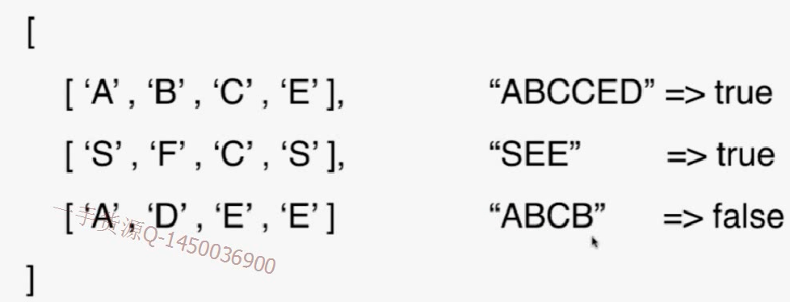
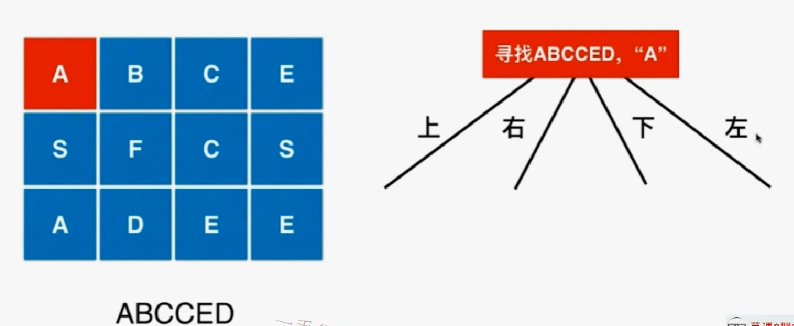
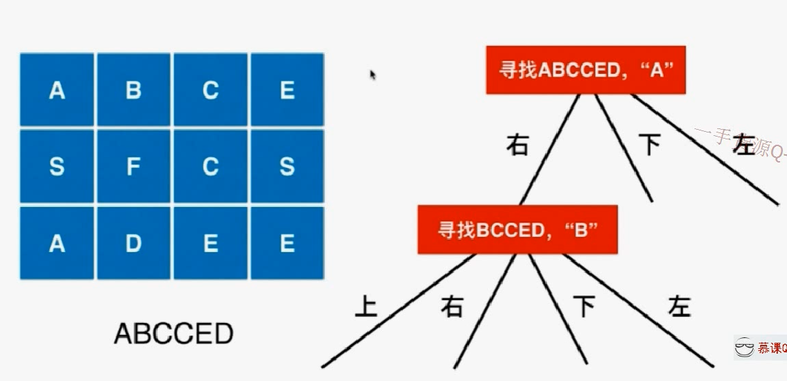

前面是在一维数组上使用回溯法

# 79 word search


举例：



按照顺时针顺序进行查找：上--右--下--左



- 上：越界
- 右：



- 技巧：向四个方向寻找。使用 数组+循环

```java
/// 79. Word Search
/// Source : https://leetcode.com/problems/word-search/description/
///
/// 回溯法
/// 时间复杂度: O(m*n*m*n)
/// 空间复杂度: O(m*n)
public class Solution {
	// 循环技巧，这个差值就是x,y坐标要变的差量。
    private int d[][] = {{-1, 0}, {0, 1}, {1, 0}, {0, -1}};
    private int m, n;
    private boolean[][] visited;

    public boolean exist(char[][] board, String word) {
        if(board == null || word == null)
            throw new IllegalArgumentException("board or word can not be null!");

        m = board.length;
        if(m == 0)
            throw new IllegalArgumentException("board can not be empty.");
        n = board[0].length;
        if(n == 0)
            throw new IllegalArgumentException("board can not be empty.");

        visited = new boolean[m][n];
        for(int i = 0 ; i < m ; i ++)
            for(int j = 0 ; j < n ; j ++)
                if(searchWord(board, word, 0, i, j))
                    return true;

        return false;
    }

    private boolean inArea( int x , int y ){
        return x >= 0 && x < m && y >= 0 && y < n;
    }

    // 从board[startx][starty]开始, 寻找word[index...word.size())
    private boolean searchWord(char[][] board, String word, int index,
                               int startx, int starty){

        //assert(inArea(startx,starty));
        // 要找的是最后一个字符
        if(index == word.length() - 1)
            return board[startx][starty] == word.charAt(index);
		
        //相等的话再向四周寻找 
        if(board[startx][starty] == word.charAt(index)){
            visited[startx][starty] = true;
            // 从startx, starty出发,向四个方向寻找
            for(int i = 0 ; i < 4 ; i ++){
                int newx = startx + d[i][0];
                int newy = starty + d[i][1];
                // 新的坐标不能越界 & 没访问过，才能进行是否符合条件的判断
                if(inArea(newx, newy) && !visited[newx][newy] &&
                        searchWord(board, word, index + 1, newx, newy))
                    //如果search(newx,newy)找到了就证明这一次的也成功了。
                    return true;
            }
            visited[startx][starty] = false;
        }
        return false;
    }

    public static void main(String args[]){
        char[][] b1 = { {'A','B','C','E'},
                        {'S','F','C','S'},
                        {'A','D','E','E'}};

        String words[] = {"ABCCED", "SEE", "ABCB" };
        for(int i = 0 ; i < words.length ; i ++)
            if((new Solution()).exist(b1, words[i]))
                System.out.println("found " + words[i]);
            else
                System.out.println("can not found " + words[i]);

        char[][] b2 = {{'A'}};
        if((new Solution()).exist(b2,"AB"))
            System.out.println("found AB");
        else
            System.out.println("can not found AB");
    }
}
```

