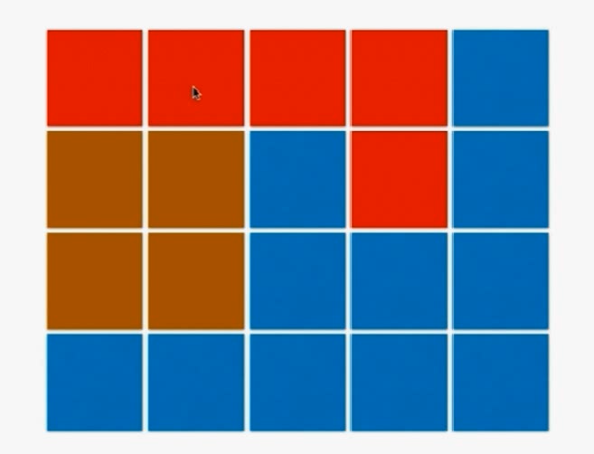
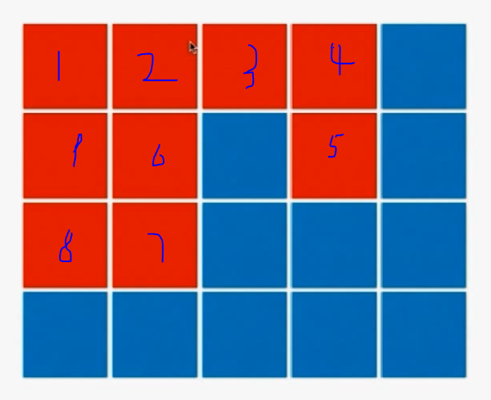

将一个岛屿内的所有位置都标识为岛屿，在后面的遍历过程中就不能再找标为岛屿的位置了。

- 从第一个点开始标记，一直向右。标记后结果为：

  

- 到最后一个点5没法标记，不断回溯到4,3。到了6,7,8,9

  

- 再不断回溯，发现所有都标记完了

- 再从(0,2)坐标开始找新的岛屿位置，不断遍历。

- 注意标记过的就不用设置visited为false了，表示用过。这是单次的，不需要穷举的回溯。

```java
/// 200. Number of Islands
/// https://leetcode.com/problems/number-of-islands/description/
/// 时间复杂度: O(n*m)
/// 空间复杂度: O(n*m)
class Solution {
    //位移数组，不是按照顺时针方向的（因为方向不重要，都考虑到了就行）。注意别的题可能有顺序要求
    private int d[][] = {{0, 1}, {1, 0}, {0, -1}, {-1, 0}};
    private int m, n;
    private boolean visited[][];

    public int numIslands(char[][] grid) {
        if(grid == null || grid.length == 0 || grid[0].length == 0)
            return 0;

        m = grid.length;
        n = grid[0].length;

        visited = new boolean[m][n];

        int res = 0;
        for(int i = 0 ; i < m ; i ++)
            for(int j = 0 ; j < n ; j ++)
                if(grid[i][j] == '1' && !visited[i][j]){
                    //找到岛屿后采用floodfill算法进行标记
                    dfs(grid, i, j);
                    res ++;
                }

        return res;
    }

    // 从grid[x][y]的位置开始,进行floodfill
    // 保证(x,y)合法,且grid[x][y]是没有被访问过的陆地
    private void dfs(char[][] grid, int x, int y){
        //assert(inArea(x,y));
        visited[x][y] = true;
        for(int i = 0; i < 4; i ++){
            int newx = x + d[i][0];
            int newy = y + d[i][1];
            //这个语句已经保证了下一次递归一定是合法的，所以这个循环没有终止条件
            //如果有不合理的条件，四个位置遍历完后就return了。
            if(inArea(newx, newy) && !visited[newx][newy] && grid[newx][newy] == '1')
                dfs(grid, newx, newy);
        }
        //这里不用没有将原标识设为flase
        return;
    }

    private boolean inArea(int x, int y){
        return x >= 0 && x < m && y >= 0 && y < n;
    }

    public static void main(String[] args) {
        char grid1[][] = {
            {'1','1','1','1','0'},
            {'1','1','0','1','0'},
            {'1','1','0','0','0'},
            {'0','0','0','0','0'}
        };
        System.out.println((new Solution()).numIslands(grid1));

        char grid2[][] = {
            {'1','1','0','0','0'},
            {'1','1','0','0','0'},
            {'0','0','1','0','0'},
            {'0','0','0','1','1'}
        };
        System.out.println((new Solution()).numIslands(grid2));
    }
}
```

# 练习：

130 surrounded regions

417  pacific atlantic water